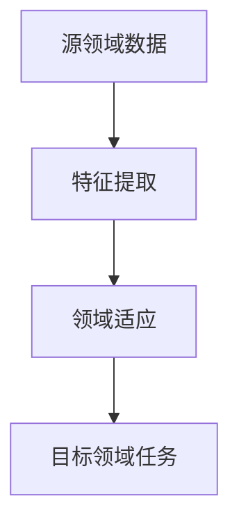
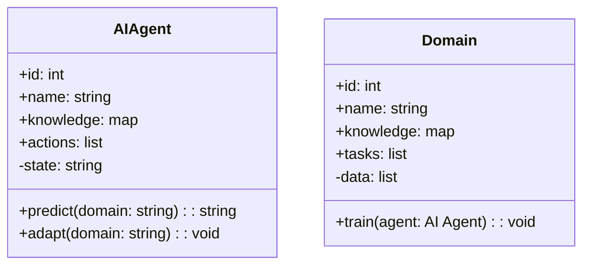
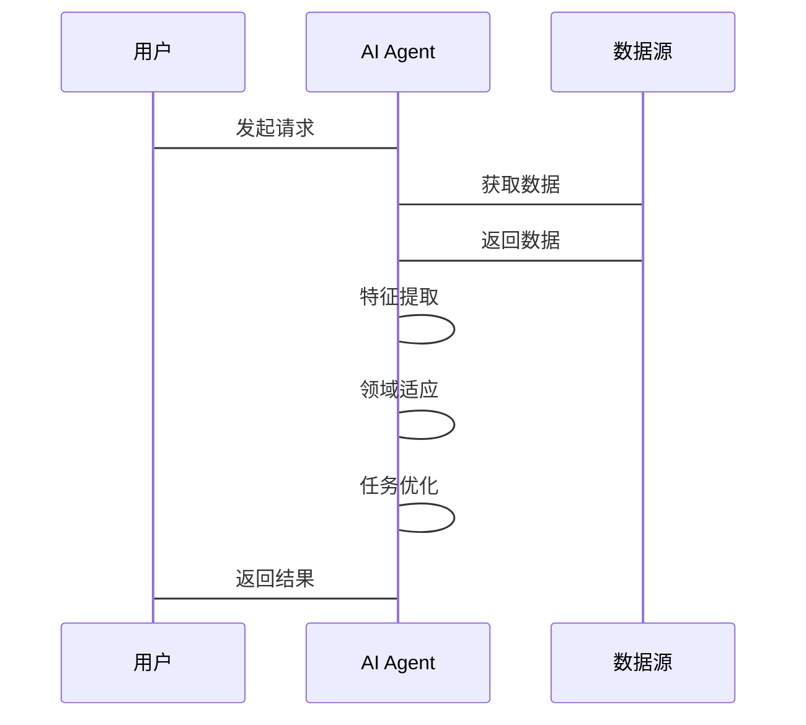

                 


# 企业AI Agent的迁移学习应用：跨领域知识转移

## 关键词：迁移学习，企业AI Agent，跨领域知识转移，知识图谱，领域适应

## 摘要：本文深入探讨了企业AI Agent在迁移学习中的应用，特别是跨领域知识转移的关键技术。文章首先介绍迁移学习的基本概念和核心原理，然后分析企业AI Agent的迁移学习需求和应用场景。接着，详细讲解跨领域知识转移的挑战与解决方案，并通过实际案例展示迁移学习在企业AI Agent中的具体应用。最后，总结迁移学习的优势，并展望其未来发展方向。

---

## 第一部分: 迁移学习基础

### 第1章: 迁移学习的概述

#### 1.1 迁移学习的基本概念
##### 1.1.1 什么是迁移学习
迁移学习是一种机器学习技术，旨在通过将已学习的知识迁移到新的任务中，以提高模型的泛化能力。与传统机器学习不同，迁移学习关注的是如何在不同领域或任务之间共享知识，减少对新任务数据的依赖。

##### 1.1.2 迁移学习的核心思想
迁移学习的核心思想是通过提取数据中的特征或知识，并将其迁移到新的领域或任务中。其核心在于找到源领域和目标领域之间的共同特征，从而减少数据不足的问题。

##### 1.1.3 迁移学习与传统机器学习的区别
| 特征 | 迁移学习 | 传统机器学习 |
|------|----------|--------------|
| 数据依赖 | 低 | 高 |
| 跨领域适应 | 高 | 低 |
| 适用场景 | 数据不足或领域差异大 | 数据充足且领域固定 |

#### 1.2 迁移学习的技术原理
##### 1.2.1 数据表示与特征提取
迁移学习的关键在于如何有效地表示数据。通过提取数据的低维特征或使用预训练模型，可以降低不同领域之间的差异。

##### 1.2.2 知识表示与领域适应
在跨领域知识转移中，知识的表示方式直接影响迁移效果。通过构建领域适应模型，可以将源领域的知识迁移到目标领域。

##### 1.2.3 迁移学习的数学模型
迁移学习的数学模型通常包括特征提取、领域适应和任务特定优化三个部分。以下是一个典型的迁移学习框架：



#### 1.3 迁移学习的应用场景
##### 1.3.1 跨领域知识转移的典型案例
例如，在自然语言处理中，将英文模型迁移到中文任务，可以显著减少对中文数据的依赖。

##### 1.3.2 企业AI Agent的迁移学习需求
企业AI Agent需要在多个领域中进行知识转移，例如将客服领域的知识迁移到销售领域。

##### 1.3.3 迁移学习的挑战与机遇
迁移学习的挑战在于领域差异和数据偏差，而机遇在于通过跨领域知识转移提高模型的泛化能力。

---

## 第二部分: 企业AI Agent的迁移学习应用

### 第5章: 企业AI Agent的核心模型

#### 5.1 AI Agent的基本概念
##### 5.1.1 AI Agent的定义与特点
企业AI Agent是一种智能体，能够通过学习和推理完成特定任务。其特点是智能化、自适应和高效性。

##### 5.1.2 企业AI Agent的分类
企业AI Agent可以分为基于规则的和基于机器学习的两类。

##### 5.1.3 企业AI Agent的应用场景
企业AI Agent广泛应用于客服、销售、数据分析等领域。

#### 5.2 企业AI Agent的迁移学习模型
##### 5.2.1 迁移学习在AI Agent中的作用
通过迁移学习，企业AI Agent可以在不同领域之间共享知识，提高其适应能力。

##### 5.2.2 企业AI Agent的迁移学习框架
一个典型的迁移学习框架包括数据预处理、特征提取、领域适应和任务特定优化。

##### 5.2.3 迁移学习在AI Agent中的实现
通过预训练模型和领域适应技术，企业AI Agent可以在新领域中快速学习。

---

## 第三部分: 跨领域知识转移的挑战与解决方案

### 第6章: 跨领域知识转移的策略与方法

#### 6.1 跨领域知识转移的基本策略
##### 6.1.1 数据预处理与特征提取
通过数据清洗和特征选择，可以减少领域差异对迁移学习的影响。

##### 6.1.2 知识表示与领域适应
通过构建领域适应模型，可以将源领域的知识迁移到目标领域。

##### 6.1.3 迁移学习的数学模型
通过优化目标函数，可以在源领域和目标领域之间建立联系。

#### 6.2 跨领域知识转移的挑战与解决方案
##### 6.2.1 数据偏差的挑战
通过数据增强和重新加权，可以缓解数据偏差问题。

##### 6.2.2 领域差异的挑战
通过领域适应技术和多任务学习，可以减少领域差异的影响。

---

## 第四部分: 系统设计与实现

### 第7章: 系统分析与架构设计

#### 7.1 系统分析
##### 7.1.1 问题场景介绍
本文研究的系统是一个基于迁移学习的企业AI Agent，旨在实现跨领域知识转移。

##### 7.1.2 项目介绍与目标
项目的目标是通过迁移学习，提高企业AI Agent的跨领域适应能力。

##### 7.1.3 系统功能设计（领域模型 mermaid 类图）


#### 7.2 系统架构设计
##### 7.2.1 系统架构 mermaid 架构图
```mermaid
container 迁移学习系统 {
    component 特征提取模块
    component 领域适应模块
    component 任务特定优化模块
}
```

##### 7.2.2 系统接口设计
系统接口包括数据输入、模型训练和结果输出三个部分。

##### 7.2.3 系统交互 mermaid 序列图


---

## 第五部分: 项目实战

### 第8章: 项目实战与案例分析

#### 8.1 项目实战
##### 8.1.1 环境安装
需要安装Python、TensorFlow和Scikit-learn等库。

##### 8.1.2 系统核心实现源代码
以下是一个简单的迁移学习代码示例：
```python
import tensorflow as tf
from tensorflow.keras import layers

# 定义特征提取网络
def feature_extractor(input_shape):
    inputs = layers.Input(shape=input_shape)
    x = layers.Conv2D(32, (3,3), activation='relu')(inputs)
    x = layers.MaxPooling2D((2,2))(x)
    x = layers.Conv2D(64, (3,3), activation='relu')(x)
    x = layers.MaxPooling2D((2,2))(x)
    x = layers.Flatten()(x)
    x = layers.Dense(256, activation='relu')(x)
    return inputs, x

# 定义领域适应网络
def domain_adapter(source_features, target_features, alpha=0.1):
    # 共享特征提取部分
    inputs = layers.Input(shape=source_features.shape[1:])
    x = layers.Dense(64, activation='relu')(x)
    # 领域适应层
    x = layers.Dense(32, activation='relu')(x)
    return inputs, x

# 编写训练函数
def train_model(source_data, target_data):
    inputs, features = feature_extractor((224,224,3))
    source_inputs, source_features = feature_extractor((224,224,3))
    domain_adapter(inputs, features)
```

#### 8.1.3 代码实现与解读
特征提取网络用于提取图像的特征，领域适应网络用于将源领域的特征迁移到目标领域。

#### 8.1.4 案例分析
通过实际案例，展示迁移学习在企业AI Agent中的具体应用。

---

## 第六部分: 总结与展望

### 第9章: 总结与展望

#### 9.1 小结
本文详细探讨了企业AI Agent在迁移学习中的应用，特别是跨领域知识转移的关键技术。

#### 9.2 最佳实践 tips
- 在实际应用中，建议结合具体业务需求选择合适的迁移学习方法。
- 定期更新模型以适应领域变化。

#### 9.3 展望
未来的研究方向包括更高效的迁移学习算法和多领域知识转移技术。

---

## 作者：AI天才研究院 & 禅与计算机程序设计艺术

通过以上内容，本文系统地介绍了企业AI Agent的迁移学习应用，特别是跨领域知识转移的关键技术。希望本文能为读者提供有价值的参考和启发。

