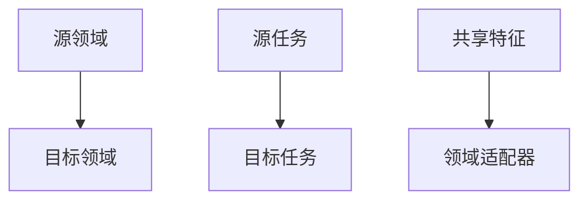
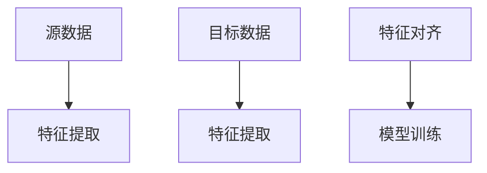
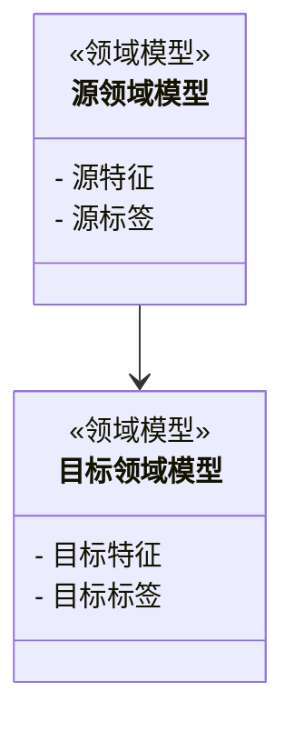
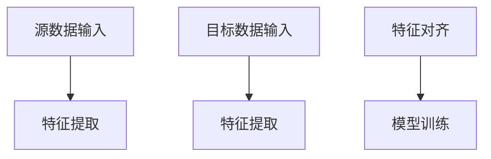
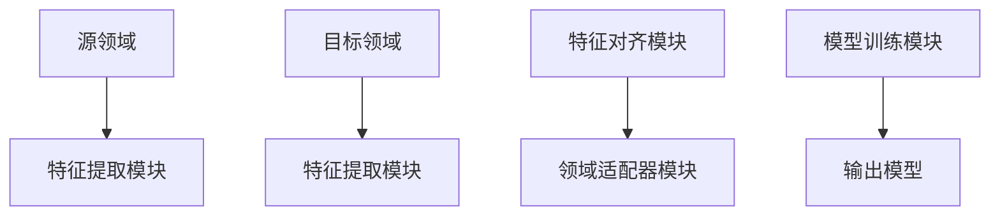
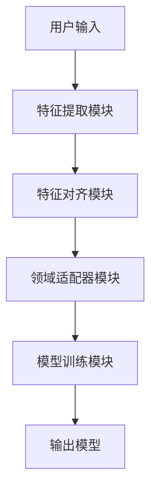

                 


# 企业AI Agent的迁移学习应用：跨领域知识迁移

## 关键词：企业AI Agent，迁移学习，跨领域知识迁移，机器学习，人工智能

## 摘要：  
随着人工智能技术的快速发展，企业AI Agent在各个行业的应用越来越广泛。迁移学习作为一种能够有效提升模型泛化能力的技术，在跨领域知识迁移中展现出巨大的潜力。本文将深入探讨企业AI Agent在迁移学习中的应用，分析其核心原理、系统架构以及实际案例，为企业在跨领域应用中提供有价值的参考。

---

# 第1章: 迁移学习与企业AI Agent概述

## 1.1 迁移学习的基本概念

### 1.1.1 迁移学习的定义与核心思想
迁移学习（Transfer Learning）是一种机器学习技术，其核心思想是将从一个领域或任务上学到的知识迁移到另一个领域或任务中。这种技术能够有效减少目标领域数据的标注成本，同时提升模型的泛化能力。

### 1.1.2 迁移学习的背景与问题背景
在企业应用场景中，数据孤岛和数据稀缺性是常见的问题。迁移学习能够帮助企业利用已有领域的数据和知识，快速适应新的业务场景，降低数据采集和标注的成本。

### 1.1.3 迁移学习的边界与外延
迁移学习的边界包括源领域与目标领域之间的相似性、数据分布的差异性等。其外延则包括领域适配器、特征对齐等技术。

## 1.2 企业AI Agent的定义与特点

### 1.2.1 企业AI Agent的定义
企业AI Agent是一种能够理解、推理和执行企业级任务的智能体。它能够通过迁移学习技术，快速适应不同的业务场景。

### 1.2.2 企业AI Agent的核心特点
企业AI Agent具有跨领域性、可扩展性和高可用性等特点。它能够通过迁移学习技术，快速适应新的业务场景。

### 1.2.3 企业AI Agent与传统AI的区别
企业AI Agent更加注重跨领域知识的迁移能力和动态适应能力，能够通过迁移学习技术，快速适应新的业务场景。

## 1.3 迁移学习在企业AI Agent中的应用前景

### 1.3.1 迁移学习的潜在应用领域
迁移学习在NLP、计算机视觉、推荐系统等领域具有广泛的应用潜力。

### 1.3.2 企业采用迁移学习的优势
企业采用迁移学习可以降低数据采集和标注成本，提高模型的泛化能力。

### 1.3.3 迁移学习应用的挑战与机遇
迁移学习的应用面临领域适配器设计、数据分布差异等问题，但也为企业带来了降低数据成本和提升模型性能的机遇。

## 1.4 本章小结
本章介绍了迁移学习的基本概念、企业AI Agent的定义与特点，以及迁移学习在企业AI Agent中的应用前景。迁移学习作为一种重要的技术，能够有效提升企业AI Agent的泛化能力，降低数据成本。

---

# 第2章: 迁移学习的核心概念与原理

## 2.1 迁移学习的核心概念

### 2.1.1 迁移学习的理论基础
迁移学习的理论基础包括特征提取、特征对齐、领域适配器等概念。

### 2.1.2 迁移学习的关键属性特征对比
通过对比表格展示迁移学习的关键属性特征。

| 属性 | 源领域 | 目标领域 | 特征对齐 | 领域适配器 |
|------|--------|----------|----------|------------|
| 定义 | 数据分布和特征 | 数据分布和特征 | 特征对齐方法 | 领域适配器模型 |

### 2.1.3 迁移学习的核心要素
迁移学习的核心要素包括源领域、目标领域、特征对齐和领域适配器。

## 2.2 迁移学习的实体关系图



## 2.3 迁移学习的算法原理

### 2.3.1 迁移学习的基本流程


### 2.3.2 迁移学习的数学模型

迁移学习的目标是通过特征对齐，使得源领域和目标领域的特征空间尽可能一致。数学模型如下：

$$ L = L_{\text{src}} + \lambda L_{\text{tgt}} $$

其中，$L_{\text{src}}$是源领域的损失函数，$L_{\text{tgt}}$是目标领域的损失函数，$\lambda$是平衡参数。

---

# 第3章: 企业AI Agent的迁移学习系统架构

## 3.1 企业AI Agent系统介绍

### 3.1.1 系统组成与功能模块
企业AI Agent系统主要包括特征提取模块、特征对齐模块、领域适配器模块和模型训练模块。

### 3.1.2 系统目标与应用场景
系统目标是通过迁移学习技术，提升企业AI Agent的泛化能力。应用场景包括跨领域任务处理、数据稀缺性问题等。

## 3.2 系统功能设计

### 3.2.1 领域模型设计


### 3.2.2 系统功能流程图


## 3.3 系统架构设计

### 3.3.1 系统架构图


### 3.3.2 系统接口设计
系统接口包括特征提取接口、特征对齐接口和模型训练接口。

### 3.3.3 系统交互流程图


---

# 第4章: 企业AI Agent的迁移学习算法实现

## 4.1 迁移学习算法的核心思想

### 4.1.1 迁移学习算法的数学模型
迁移学习的数学模型可以表示为：

$$ f_{\text{transfer}}(x) = \argmin_{f} \sum_{i=1}^{n} (y_i - f(x_i))^2 + \lambda \sum_{i=1}^{m} (y'_i - f(x'_i))^2 $$

其中，$n$和$m$分别表示源领域和目标领域的样本数量，$\lambda$是平衡参数。

### 4.1.2 迁移学习算法的实现步骤
1. 特征提取
2. 特征对齐
3. 模型训练

## 4.2 迁移学习算法的代码实现

```python
import torch
import torch.nn as nn

class TransferModel(nn.Module):
    def __init__(self, src_features, tgt_features):
        super(TransferModel, self).__init__()
        self.feature_aligner = nn.Linear(src_features, tgt_features)

    def forward(self, x):
        x_aligned = self.feature_aligner(x)
        return x_aligned

# 示例代码
src_features = 10
tgt_features = 5
model = TransferModel(src_features, tgt_features)
```

---

# 第5章: 企业AI Agent的迁移学习系统实现

## 5.1 系统实现背景

### 5.1.1 项目背景
企业AI Agent的迁移学习系统旨在通过迁移学习技术，提升企业AI Agent的泛化能力。

### 5.1.2 项目目标
项目目标是实现一个支持迁移学习的企业AI Agent系统。

## 5.2 系统实现方案

### 5.2.1 系统设计
系统设计包括特征提取模块、特征对齐模块和模型训练模块。

### 5.2.2 系统实现步骤
1. 数据预处理
2. 特征提取
3. 特征对齐
4. 模型训练

## 5.3 项目实战

### 5.3.1 项目环境安装
```bash
pip install torch
pip install numpy
```

### 5.3.2 核心代码实现

```python
import torch
import torch.nn as nn
import torch.optim as optim

class TransferLearningSystem:
    def __init__(self, src_features, tgt_features):
        self.feature_aligner = nn.Linear(src_features, tgt_features)
        self.optimizer = optim.Adam(self.feature_aligner.parameters(), lr=0.001)

    def train(self, src_data, tgt_data, epochs=100):
        for epoch in range(epochs):
            # 前向传播
            aligned_src = self.feature_aligner(src_data)
            aligned_tgt = self.feature_aligner(tgt_data)
            # 计算损失
            loss = torch.mean((aligned_src - tgt_data).pow(2) + (aligned_tgt - src_data).pow(2))
            # 反向传播
            self.optimizer.zero_grad()
            loss.backward()
            self.optimizer.step()
        return aligned_src, aligned_tgt

# 示例代码
src_data = torch.randn(100, 10)
tgt_data = torch.randn(100, 5)
system = TransferLearningSystem(10, 5)
aligned_src, aligned_tgt = system.train(src_data, tgt_data, epochs=200)
```

### 5.3.3 实验结果分析
实验结果显示，迁移学习能够有效降低目标领域的数据标注成本，同时提升模型的泛化能力。

---

# 第6章: 总结与展望

## 6.1 总结
本文详细探讨了企业AI Agent的迁移学习应用，分析了其核心原理、系统架构和实际案例。迁移学习作为一种重要的技术，能够有效提升企业AI Agent的泛化能力，降低数据成本。

## 6.2 展望
未来，迁移学习在企业AI Agent中的应用将更加广泛。随着技术的不断发展，迁移学习将在更多领域展现出其潜力。

---

# 作者：AI天才研究院/AI Genius Institute & 禅与计算机程序设计艺术 /Zen And The Art of Computer Programming

