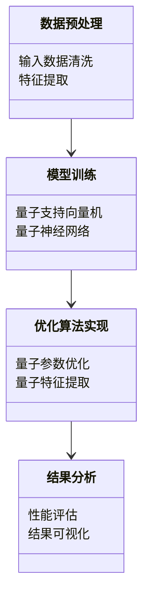
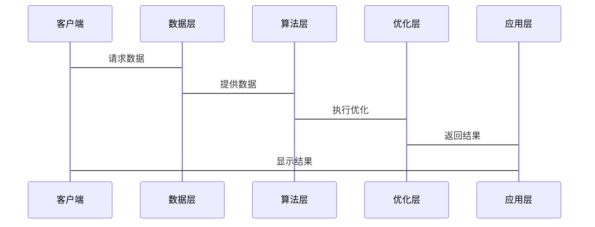

                 


# 企业AI Agent的量子机器学习算法优化

> **关键词**: 企业AI Agent, 量子机器学习, 算法优化, 量子计算, 机器学习算法

> **摘要**: 本文探讨了企业AI Agent在量子机器学习算法优化中的应用，结合量子计算的核心原理与机器学习算法的优化策略，详细分析了量子支持向量机、量子神经网络等算法的实现原理，并通过实际案例展示了如何在企业场景中优化量子机器学习算法，以提升AI Agent的性能与效率。

---

## 第一部分: 企业AI Agent的量子机器学习算法优化基础

### 第1章: AI Agent与量子机器学习概述

#### 1.1 AI Agent的基本概念
##### 1.1.1 AI Agent的定义与特点
AI Agent（人工智能代理）是指能够感知环境、自主决策并执行任务的智能实体。其特点包括自主性、反应性、目标导向性和社交能力。AI Agent在企业中的应用广泛，如智能客服、供应链优化和智能推荐系统等。

##### 1.1.2 量子计算的基本原理
量子计算利用量子叠加和量子纠缠的特性，通过量子位（qubit）进行信息处理。与经典计算机相比，量子计算机在某些特定问题上具有指数级的计算速度优势。

##### 1.1.3 企业AI Agent的应用场景
企业AI Agent可以用于客户关系管理、智能调度、风险预测等领域。通过结合量子计算，AI Agent能够处理复杂的非线性问题，提升决策的准确性和效率。

#### 1.2 量子机器学习的核心概念
##### 1.2.1 量子机器学习的定义
量子机器学习是指利用量子计算机的特性，设计和优化机器学习算法的过程。其核心在于利用量子叠加和量子纠缠的特性，提升算法的计算效率和模型的复杂度。

##### 1.2.2 量子机器学习与经典机器学习的对比
| 特性         | 量子机器学习                     | 经典机器学习                   |
|--------------|----------------------------------|-------------------------------|
| 计算效率     | 在某些问题上具有指数级优势       | 在大多数问题上接近线性增长     |
| 状态空间     | 高维量子态                      | 低维经典状态                  |
| 应用场景     | 量子化学、组合优化、密码学       | 分类、回归、聚类               |

##### 1.2.3 量子机器学习在企业中的潜力
量子机器学习能够解决企业中的复杂优化问题，如供应链优化、金融风险预测和智能调度等。通过量子算法的优化，企业AI Agent能够更高效地处理海量数据，提升决策能力。

#### 1.3 量子机器学习的数学基础
##### 1.3.1 量子态与量子计算
量子态可以表示为向量空间中的向量，通过量子门操作进行变换。例如，Hadamard门可以将基态$|0\rangle$变换为叠加态$\frac{|0\rangle + |1\rangle}{\sqrt{2}}$。

##### 1.3.2 量子叠加与量子纠缠
量子叠加允许系统同时处于多个状态，而量子纠缠则通过关联多个粒子的状态，实现信息的高效传递和处理。

##### 1.3.3 量子门与量子电路
量子门是量子计算的基本操作单元，常见的量子门包括Hadamard门、Pauli门和CNOT门。量子电路由多个量子门组成，用于实现特定的计算任务。

### 第2章: 量子机器学习算法的核心原理

#### 2.1 量子支持向量机
##### 2.1.1 支持向量机的基本原理
支持向量机（SVM）是一种监督学习算法，用于分类和回归问题。其核心思想是通过找到一个超平面，将数据集分成两类。

##### 2.1.2 量子支持向量机的实现
量子支持向量机利用量子叠加的特性，将数据映射到高维空间，并通过量子优化算法找到最优超平面。

##### 2.1.3 量子支持向量机的优缺点
优点：计算效率高，能够处理高维数据。缺点：实现复杂，目前主要停留在理论阶段。

#### 2.2 量子神经网络
##### 2.2.1 神经网络的基本原理
神经网络通过多层感知机模拟人脑的神经网络结构，用于模式识别和分类任务。

##### 2.2.2 量子神经网络的构建
量子神经网络利用量子叠加和纠缠的特性，构建高效的神经网络结构，提升模型的表达能力。

##### 2.2.3 量子神经网络的应用案例
在金融风险预测和图像识别等领域，量子神经网络表现出比经典神经网络更强的性能。

### 第3章: 量子机器学习算法的优化策略

#### 3.1 量子参数优化
##### 3.1.1 量子梯度下降法
量子梯度下降法通过量子叠加的特性，实现参数的高效优化。

##### 3.1.2 量子Adam优化器
量子Adam优化器结合了动量和自适应学习率的思想，进一步提升优化效率。

##### 3.1.3 量子优化算法的收敛性分析
量子优化算法在某些情况下具有更快的收敛速度，但其收敛性分析仍需进一步研究。

#### 3.2 量子特征提取
##### 3.2.1 量子特征提取的基本原理
量子特征提取通过量子叠加和纠缠的特性，提取数据的深层特征。

##### 3.2.2 量子特征提取的优化方法
通过量子门的操作优化特征提取过程，提升模型的表达能力。

##### 3.2.3 量子特征提取在企业AI Agent中的应用
在客户画像和行为分析等领域，量子特征提取能够提供更精准的特征表示。

### 第4章: 量子机器学习算法的数学模型与公式

#### 4.1 量子机器学习的基本公式
量子态的表示可以写成：
$$ |\psi\rangle = \alpha|0\rangle + \beta|1\rangle $$
其中，$\alpha$和$\beta$是复数系数，满足$|\alpha|^2 + |\beta|^2 = 1$。

#### 4.2 量子支持向量机的数学推导
量子支持向量机的目标函数可以表示为：
$$ \min_{w,b,\xi} \frac{1}{2}||w||^2 + C\sum_{i=1}^n \xi_i $$
约束条件为：
$$ y_i(w\cdot x_i + b) \geq 1 - \xi_i $$
$$ \xi_i \geq 0 $$

#### 4.3 量子神经网络的数学模型
量子神经网络的输出可以表示为：
$$ y = \sigma(\langle w|x\rangle + b) $$
其中，$\sigma$是激活函数，$w$是量子权重，$x$是输入。

---

## 第二部分: 企业AI Agent的量子机器学习算法优化实践

### 第5章: 系统分析与架构设计方案

#### 5.1 项目背景与需求分析
企业AI Agent需要处理海量数据，对算法的计算效率和准确性提出更高要求。通过量子机器学习算法优化，可以显著提升AI Agent的性能。

#### 5.2 系统功能设计
系统功能包括数据预处理、模型训练、优化算法实现和结果分析。通过Mermaid类图展示系统功能模块之间的关系。



#### 5.3 系统架构设计
通过Mermaid架构图展示系统的整体架构，包括数据层、算法层、优化层和应用层。


#### 5.4 系统接口设计
系统接口包括数据接口、算法接口和结果接口。通过Mermaid序列图展示接口之间的交互流程。



### 第6章: 项目实战

#### 6.1 环境安装与配置
安装必要的量子计算库和机器学习库，如Qiskit和Scikit-learn。

#### 6.2 核心代码实现
实现量子支持向量机和量子神经网络的核心算法，并通过Python代码展示。

##### 6.2.1 量子支持向量机的实现
```python
from qiskit import QuantumCircuit, Aer, execute
from qiskit.circuit import QuantumRegister, ClassicalRegister

def quantum_svm():
    q = QuantumRegister(2, 'q')
    c = ClassicalRegister(1, 'c')
    qc = QuantumCircuit(q, c)
    qc.h(q[0])
    qc.cx(q[0], q[1])
    qc.measure(q[1], c[0])
    backend = Aer.get_backend('qasm_simulator')
    job = execute(qc, backend)
    result = job.result()
    print(result.counts)
```

##### 6.2.2 量子神经网络的实现
```python
from qiskit.circuit import QuantumCircuit

def quantum_neural_network():
    qc = QuantumCircuit(2, 1)
    qc.h([0,1])
    qc.cnot(0,1)
    qc.measure(1,0)
    return qc

model = quantum_neural_network()
```

#### 6.3 案例分析与结果解读
通过具体案例展示量子机器学习算法在企业AI Agent中的应用效果，分析模型的准确性和计算效率。

#### 6.4 项目总结与优化建议
总结项目的实现过程，提出进一步优化的建议，如优化算法的选择和量子计算资源的配置。

### 第7章: 最佳实践与注意事项

#### 7.1 最佳实践
- 合理选择量子算法，根据具体问题选择合适的量子机器学习算法。
- 优化算法的参数设置，提升模型的性能。
- 结合经典算法，充分利用量子算法的优势。

#### 7.2 小结
通过本文的介绍，读者可以深入了解企业AI Agent的量子机器学习算法优化的核心原理和实现方法。

#### 7.3 注意事项
- 量子算法的实现需要高性能的量子计算机支持。
- 在实际应用中，需要考虑量子算法的计算成本和资源限制。
- 持续关注量子计算技术的发展，及时优化算法和模型。

#### 7.4 拓展阅读
推荐相关书籍和论文，供读者进一步学习和研究。

---

## 作者

**作者：AI天才研究院/AI Genius Institute & 禅与计算机程序设计艺术 /Zen And The Art of Computer Programming**

---

通过本文的详细讲解，读者可以系统地了解企业AI Agent的量子机器学习算法优化的核心原理和实现方法，并能够在实际项目中应用这些知识，提升AI Agent的性能和效率。

