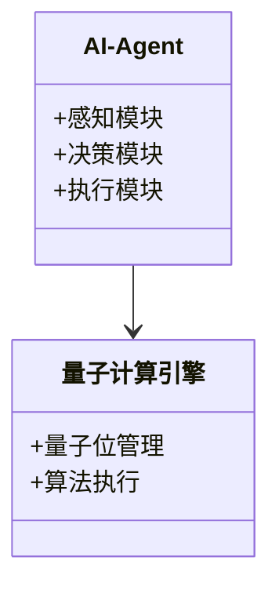
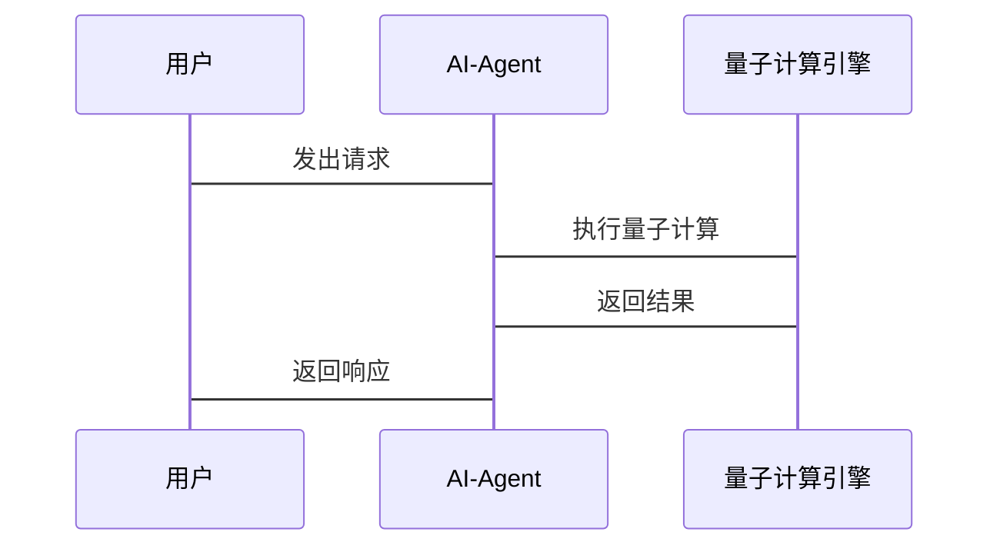

                 


# 企业AI Agent的量子计算应用

> 关键词：量子计算，AI Agent，企业应用，算法设计，系统架构

> 摘要：本文探讨了量子计算在企业AI Agent中的应用，详细分析了量子计算的核心原理、AI Agent的基本结构、量子计算在AI Agent中的算法设计与优化，以及系统的架构设计与实现。通过理论分析和实际案例，展示了量子计算如何提升企业AI Agent的性能和效率。

---

# 第一部分: 量子计算与AI Agent概述

# 第1章: 量子计算与AI Agent的背景与概念

## 1.1 量子计算的基本概念

### 1.1.1 量子位与量子叠加原理

量子计算的核心单元是量子位（qubit），与经典计算中的二进制位不同，量子位可以同时处于多个状态的叠加态。这种叠加态可以用数学公式表示：

$$|\psi\rangle = \alpha|0\rangle + \beta|1\rangle$$

其中，$\alpha$ 和 $\beta$ 是复数，且满足归一化条件：$|\alpha|^2 + |\beta|^2 = 1$。量子叠加允许计算机同时处理多种可能性，从而在某些情况下比经典计算机更高效。

### 1.1.2 量子纠缠与量子通信

量子纠缠是量子计算的另一个关键特性。当两个或多个量子位纠缠时，它们的状态会紧密关联，使得对一个量子位的操作会立即影响到另一个。这种特性在量子通信和量子计算中具有重要应用。

### 1.1.3 量子计算的优势与挑战

量子计算的优势在于其并行计算能力，可以在某些特定问题上远超经典计算机。然而，量子计算也面临稳定性差、纠错困难等挑战。

## 1.2 AI Agent的基本概念

### 1.2.1 AI Agent的定义与分类

AI Agent（智能代理）是指能够感知环境并采取行动以实现目标的实体。根据智能水平，AI Agent可以分为反应式、基于模型的、实用推理型和学习型等。

### 1.2.2 AI Agent的核心功能与应用场景

AI Agent的核心功能包括感知、决策、规划和执行。应用场景广泛，如自动驾驶、智能助手、机器人控制等。

### 1.2.3 企业级AI Agent的特殊需求

企业级AI Agent需要处理复杂任务，具备高可靠性和安全性，同时需要高效的数据处理能力。

## 1.3 量子计算在AI Agent中的应用

### 1.3.1 量子计算在AI Agent中的潜在应用

量子计算可以提升AI Agent的算法性能，特别是在优化、搜索和机器学习等领域。

### 1.3.2 量子AI Agent的优势与创新点

量子AI Agent通过量子计算的优势，可以实现更快的决策速度和更复杂的任务处理。

### 1.3.3 量子AI Agent的未来发展趋势

量子AI Agent将朝着更高效、更智能的方向发展，应用场景也将更加广泛。

## 1.4 本章小结

---

# 第二部分: 量子计算基础

# 第2章: 量子计算的核心原理

## 2.1 量子叠加原理

### 2.1.1 量子叠加的数学表示

量子叠加可以用以下公式表示：

$$|\psi\rangle = \alpha|0\rangle + \beta|1\rangle$$

### 2.1.2 量子叠加的应用实例

例如，在量子搜索算法中，量子叠加可以帮助减少搜索时间复杂度。

## 2.2 量子纠缠原理

### 2.2.1 量子纠缠的定义与数学表示

量子纠缠可以用Bell态表示：

$$|\Phi^+\rangle = \frac{1}{\sqrt{2}}(|00\rangle + |11\rangle)$$

### 2.2.2 量子纠缠在计算中的作用

量子纠缠可以提高计算的并行性，从而加速某些算法的执行。

## 2.3 量子算法的实现

### 2.3.1 Grover算法

Grover算法是一种用于无序数据库搜索的量子算法，时间复杂度为 $O(\sqrt{N})$。

### 2.3.2 Shor算法

Shor算法用于大整数分解，时间复杂度为 $O(\log^2 N)$。

---

# 第三部分: 量子计算在AI Agent中的应用

# 第3章: 量子计算在AI Agent中的算法设计

## 3.1 量子强化学习

### 3.1.1 量子强化学习的定义

量子强化学习结合了量子计算和强化学习，通过量子叠加加速状态空间的探索。

### 3.1.2 量子强化学习的算法流程

1. 初始化量子位。
2. 对状态进行量子叠加。
3. 执行操作并测量结果。
4. 更新策略。

---

# 第四部分: 系统架构设计

# 第4章: 系统架构与实现

## 4.1 系统功能设计

### 4.1.1 领域模型



### 4.1.2 系统架构



## 4.2 系统接口设计

### 4.2.1 接口定义

- 输入接口：接收用户请求。
- 输出接口：返回计算结果。

---

# 第五部分: 项目实战

# 第5章: 量子AI Agent的实现

## 5.1 环境搭建

### 5.1.1 安装量子计算框架

使用Qiskit或其他量子计算框架。

## 5.2 核心实现

### 5.2.1 量子叠加实现

```python
from qiskit import QuantumCircuit, execute, Aer

qc = QuantumCircuit(1,1)
qc.h(0)
qc.measure(0,0)

simulator = Aer.get_backend('qasm_simulator')
job = execute(qc, simulator)
result = job.result()
print(result.counts)
```

### 5.2.2 量子搜索算法实现

```python
qc = QuantumCircuit(n, n)
for i in range(n):
    qc.h(i)
qc.x(n-1)
qc.measure(range(n), range(n))
```

## 5.3 实际案例分析

### 5.3.1 案例介绍

通过实现一个简单的量子搜索算法，展示量子计算在AI Agent中的应用。

## 5.4 总结

量子AI Agent的实现需要结合量子计算和AI技术，通过实际项目可以加深理解。

---

# 第六部分: 高级主题

# 第6章: 量子AI Agent的高级应用

## 6.1 量子机器学习

### 6.1.1 量子支持向量机

量子支持向量机通过量子叠加加速数据处理。

## 6.2 量子优化

### 6.2.1 量子优化算法

量子优化算法可以用于解决复杂的优化问题。

## 6.3 量子安全

### 6.3.1 量子加密技术

量子加密技术可以提高AI Agent的安全性。

---

# 第七部分: 未来展望

# 第7章: 量子AI Agent的未来发展趋势

## 7.1 技术进步

### 7.1.1 量子计算的进一步发展

未来量子计算将更加稳定和高效。

## 7.2 应用场景

### 7.2.1 更广泛的应用领域

量子AI Agent将在更多领域发挥作用。

## 7.3 挑战与机遇

### 7.3.1 技术挑战

需要克服量子计算的稳定性问题。

### 7.3.2 机遇

量子计算将推动AI Agent技术的革新。

---

# 第八部分: 最佳实践与注意事项

## 8.1 注意事项

- 量子计算的环境搭建需要专业设备。
- 量子算法的选择需要根据具体问题。

## 8.2 最佳实践

- 结合经典算法和量子算法的优势。
- 定期更新和优化系统架构。

---

作者：AI天才研究院 & 禅与计算机程序设计艺术

