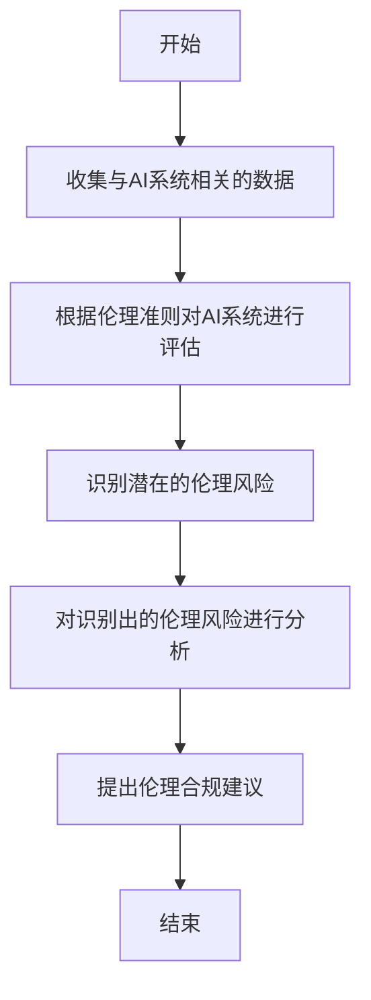
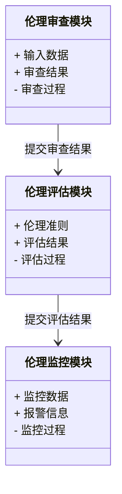
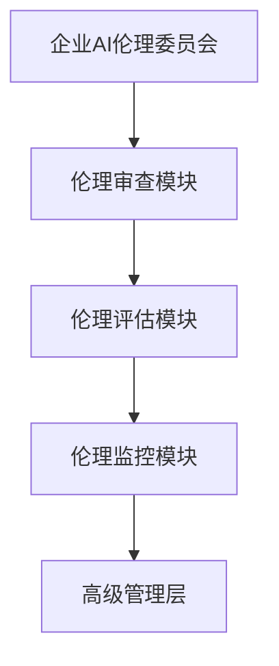

                 


# 企业AI伦理委员会：建立和运作指南

> 关键词：企业AI伦理委员会，伦理治理框架，AI算法伦理，数据隐私保护，企业治理，技术伦理

> 摘要：随着人工智能技术的快速发展，企业面临的伦理问题日益复杂。企业AI伦理委员会作为应对这些挑战的核心机构，需要建立和运作一套系统化的伦理治理体系。本文将从背景、核心概念、算法原理、系统架构、项目实战等多方面详细探讨企业AI伦理委员会的建立与运作，并通过实际案例和系统设计，提供可操作的指导方案。文章最后将总结最佳实践和未来展望。

---

## 第一部分：企业AI伦理委员会的背景与核心概念

### 第1章：企业AI伦理委员会的背景与问题背景

#### 1.1 AI技术对企业的影响
##### 1.1.1 AI技术的快速发展与应用
人工智能技术的快速发展正在改变企业的运作方式。从自动化决策到智能推荐系统，AI技术的应用已经渗透到企业运营的各个环节。然而，这种技术的广泛应用也带来了新的伦理挑战，例如数据隐私问题、算法偏见、责任归属等。

##### 1.1.2 AI技术对企业决策的潜在风险
AI算法的决策过程可能引入伦理风险。例如，算法偏见可能导致不公平的 hiring decisions 或者歧视性广告推荐。此外，AI系统的不可解释性（即黑箱问题）使得企业在面对错误决策时难以找到原因并进行纠正。

##### 1.1.3 企业AI伦理问题的现状与挑战
当前，企业AI伦理问题主要集中在数据隐私、算法公平性、透明性以及责任归属等方面。这些伦理问题不仅会影响企业的声誉，还可能导致法律风险和信任危机。如何建立一套有效的伦理治理体系，成为企业在AI时代面临的重大挑战。

#### 1.2 企业AI伦理委员会的定义与重要性
##### 1.2.1 企业AI伦理委员会的定义
企业AI伦理委员会（Corporate AI Ethics Committee）是一个由企业内部成员组成的独立机构，负责监督和指导企业在AI技术应用中的伦理合规性。其核心职责包括审查AI系统的伦理风险、制定伦理准则、评估AI技术的伦理影响等。

##### 1.2.2 企业AI伦理委员会的核心职责
- 审查AI技术的应用场景，确保符合伦理准则。
- 制定企业AI伦理政策和规范。
- 监督AI系统的开发和部署过程，识别和评估潜在的伦理风险。
- 提供伦理合规的建议，指导企业相关部门的决策。

##### 1.2.3 企业AI伦理委员会在企业治理中的作用
企业AI伦理委员会在企业治理中扮演着关键角色。它不仅能够帮助企业避免伦理风险，还能提升企业的社会形象和责任感。通过建立伦理委员会，企业可以更好地应对监管机构的要求，同时增强利益相关者的信任。

#### 1.3 企业AI伦理委员会的边界与外延
##### 1.3.1 伦理委员会与其他企业治理机构的关系
企业AI伦理委员会通常与其他治理机构（如法务部门、合规部门）紧密合作，共同确保企业的决策符合法律和伦理标准。然而，伦理委员会的独立性是其有效运作的关键，它需要在企业内部保持一定的独立性，以避免受到业务部门的影响。

##### 1.3.2 伦理委员会的职责边界
伦理委员会的职责主要集中在AI技术的伦理合规性方面，而不直接参与企业的日常运营决策。然而，在涉及AI技术的项目中，伦理委员会需要与项目团队保持密切沟通，确保伦理风险得到及时识别和处理。

##### 1.3.3 伦理委员会的外部影响与合作
企业AI伦理委员会的外部合作包括与行业组织、学术机构、监管机构等的合作。通过与外部机构的合作，伦理委员会可以获取更多的伦理治理经验和最佳实践，从而提升自身的专业能力。

---

### 第2章：企业AI伦理委员会的核心概念

#### 2.1 AI伦理的核心原理
##### 2.1.1 AI伦理的基本原则
企业AI伦理委员会的运作需要遵循一系列基本原则，包括：
- 尊重：尊重个人权利和隐私。
- 公平：确保AI系统在决策过程中不产生歧视或偏见。
- 责任：明确AI系统在出现问题时的责任归属。
- 透明性：确保AI系统的决策过程透明可解释。

##### 2.1.2 AI伦理的实现机制
AI伦理的实现机制包括伦理审查、伦理评估、伦理监控等。这些机制需要通过制度、流程和技术手段相结合的方式实现。

##### 2.1.3 AI伦理与企业治理的结合
企业治理需要将AI伦理纳入整体治理体系中，通过制度设计、组织架构和文化引导，确保企业在AI技术应用中遵循伦理准则。

#### 2.2 核心概念的属性特征对比
##### 2.2.1 伦理委员会与其他治理机构的对比
| 机构 | 职责 | 独立性 | 主要关注点 |
|------|------|--------|------------|
| 法务部门 | 确保法律合规 | 较高 | 法律风险 |
| 合规部门 | 制定和执行合规政策 | 中等 | 行为规范 |
| 伦理委员会 | 审查AI伦理风险 | 高 | 伦理合规 |

##### 2.2.2 不同AI伦理框架的对比
| 框架 | 核心原则 | 适用范围 | 主要特点 |
|------|----------|----------|----------|
| GDPR 原则 | 数据隐私、透明性 | 欧盟 | 强调数据保护 |
| IEEE AI 伦理准则 | 尊重、公正、隐私 | 全球 | 侧重技术伦理 |
| 美国NIST 框架 | 可用性、透明性、责任 | 美国 | 强调技术应用 |

##### 2.2.3 企业AI伦理委员会的组织架构
企业AI伦理委员会的组织架构通常包括以下几个角色：
- 主席：负责委员会的日常管理和决策。
- 成员：来自不同部门的代表，包括技术、法律、合规、人力资源等。
- 秘书：负责会议记录、文档管理等支持工作。

#### 2.3 ER实体关系图架构
以下是企业AI伦理委员会的组织架构 ER 图：

```mermaid
erDiagram
    actor 企业AI伦理委员会 : 企业AI伦理委员会
    actor 技术部门 : 技术部门
    actor 法务部门 : 法务部门
    actor 人力资源部门 : 人力资源部门
    actor 高级管理层 : 高级管理层

    企业AI伦理委员会 --> 技术部门 : 审查AI系统
    企业AI伦理委员会 --> 法务部门 : 确保法律合规
    企业AI伦理委员会 --> 人力资源部门 : 制定伦理培训计划
    企业AI伦理委员会 --> 高级管理层 : 提供伦理合规建议
```

---

## 第三部分：企业AI伦理委员会的算法原理与系统架构

### 第3章：企业AI伦理委员会的算法原理

#### 3.1 算法原理概述
企业AI伦理委员会的算法原理主要集中在伦理评估和决策过程中。以下是伦理评估的主要步骤：

1. **输入数据**：收集与AI系统相关的数据，包括算法设计、数据来源、应用场景等。
2. **伦理评估**：根据伦理准则对AI系统进行评估，识别潜在的伦理风险。
3. **风险分析**：对识别出的伦理风险进行分析，评估其严重性和影响范围。
4. **决策建议**：根据评估结果，提出相应的伦理合规建议。

#### 3.2 算法原理的数学模型
以下是一个简化的伦理评估模型：

$$
\text{伦理风险} = \sum_{i=1}^{n} (\text{伦理准则}_i \times \text{风险权重}_i)
$$

其中，$\text{伦理准则}_i$ 表示第 $i$ 个伦理准则的重要性，$\text{风险权重}_i$ 表示第 $i$ 个伦理准则对应的伦理风险权重。

#### 3.3 算法流程图
以下是伦理评估的算法流程图：



### 第4章：企业AI伦理委员会的系统架构

#### 4.1 问题场景介绍
企业AI伦理委员会需要建立一个系统化的伦理治理体系，涵盖伦理审查、伦理评估、伦理监控等功能。以下是系统的主要功能模块：

1. **伦理审查模块**：对AI系统的伦理风险进行审查。
2. **伦理评估模块**：根据伦理准则对AI系统进行评估。
3. **伦理监控模块**：实时监控AI系统的运行状态，识别潜在的伦理风险。

#### 4.2 系统功能设计
以下是系统功能设计的类图：



#### 4.3 系统架构设计
以下是系统架构设计的架构图：



---

## 第四部分：企业AI伦理委员会的项目实战

### 第5章：企业AI伦理委员会的项目实战

#### 5.1 环境安装
企业AI伦理委员会的系统需要以下环境：
- 操作系统：Linux/Windows
- 开发工具：Python、Jupyter Notebook
- 数据库：MySQL/PostgreSQL

#### 5.2 系统核心实现源代码
以下是伦理评估模块的Python代码示例：

```python
class EthicalReview:
    def __init__(self):
        self.criteria = []  # 伦理准则列表

    def add_criteria(self, criterion):
        self.criteria.append(criterion)

    def review(self, ai_system):
        # 根据伦理准则对AI系统进行评估
        risk_assessment = {}
        for criterion in self.criteria:
            risk = self.evaluate_criterion(ai_system, criterion)
            risk_assessment[criterion] = risk
        return risk_assessment

    def evaluate_criterion(self, ai_system, criterion):
        # 根据具体准则评估风险
        pass

# 示例用法
ethics_committee = EthicalReview()
ethics_committee.add_criteria("数据隐私")
ethics_committee.add_criteria("算法公平性")
result = ethics_committee.review(ai_system)
```

#### 5.3 代码应用解读与分析
上述代码示例展示了伦理审查模块的核心功能。通过定义 `EthicalReview` 类，可以实现对AI系统的伦理审查和评估。用户可以根据具体需求扩展 `evaluate_criterion` 方法，以实现对不同伦理准则的评估。

#### 5.4 案例分析与详细讲解剖析
假设某企业开发了一个基于AI的招聘系统，该系统可能存在算法偏见问题。伦理委员会可以通过审查模块识别这一问题，并提出相应的改进建议，例如引入更多样化的数据集或调整算法参数。

---

## 第五部分：总结与展望

### 第6章：总结与最佳实践

#### 6.1 最佳实践
1. **建立独立的伦理委员会**：确保伦理委员会的独立性，避免受到业务部门的影响。
2. **制定清晰的伦理准则**：结合企业的实际情况，制定具体的伦理准则和规范。
3. **加强与外部的合作**：积极参与行业组织和学术机构的交流，获取更多的伦理治理经验和最佳实践。
4. **注重员工培训**：通过伦理培训提升员工的伦理意识，营造良好的企业伦理文化。

#### 6.2 未来展望
随着AI技术的不断发展，企业AI伦理委员会的职责和作用将更加重要。未来，企业需要进一步加强伦理委员会的建设，探索新的伦理治理模式，以应对更加复杂的伦理挑战。

---

## 结语

企业AI伦理委员会的建立和运作是企业在AI时代必须面对的重要课题。通过本文的详细探讨，我们希望能够为企业的伦理治理提供有价值的指导和建议。未来，企业需要更加重视伦理委员会的作用，不断完善伦理治理体系，以应对AI技术带来的各种伦理挑战。

---

**作者：AI天才研究院/AI Genius Institute & 禅与计算机程序设计艺术 /Zen And The Art of Computer Programming**

