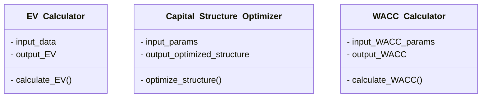
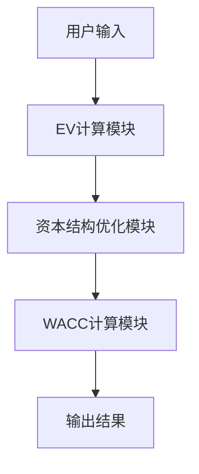

                 


# 企业价值倍数：全面考虑公司资本结构的估值

## 关键词：企业价值倍数（EV），资本结构，WACC，估值模型，财务分析

## 摘要：  
企业价值倍数（EV）是评估企业整体价值的重要指标，而资本结构在EV计算中起着关键作用。本文从EV的基本概念出发，深入探讨其与资本结构的关系，并通过数学模型和系统架构分析，结合实际案例，展示如何在考虑资本结构的情况下准确计算EV，优化企业价值。文章还提供了最佳实践和注意事项，帮助读者更好地理解和应用这些方法。

---

## 第一部分: 企业价值倍数与资本结构估值基础

### 第1章: 企业价值倍数（EV）概述

#### 1.1 企业价值倍数的定义与背景

##### 1.1.1 企业价值倍数的定义
企业价值倍数（EV，Enterprise Value）是衡量企业整体价值的重要指标，通常定义为股权价值加上债务价值，再减去现金和类现金资产。EV = Equity + Debt - Cash。

##### 1.1.2 EV在企业估值中的作用
EV能够全面反映企业的市场价值，帮助投资者评估企业的收购价格、资本结构优化和投资决策。

##### 1.1.3 EV与股东权益的关系
EV不仅包括股东权益，还包括债权人的权益，因此更能反映企业的整体价值。

#### 1.2 资本结构与企业价值的关系

##### 1.2.1 资本结构的定义
资本结构指企业债务和股权的比例，通常表示为D/E（债务与股权的比例）。

##### 1.2.2 资本结构对企业价值的影响
杠杆效应使企业在一定范围内增加债务可以提高ROE，但过高的债务会增加财务风险，降低企业价值。

##### 1.2.3 杠杆对EV的影响
杠杆通过影响企业的税后收益和资本成本，影响EV。合理的资本结构可以优化WACC，从而提高企业价值。

#### 1.3 EV与其他估值指标的对比

##### 1.3.1 EV与市盈率（P/E）的区别
P/E基于每股收益，EV基于整体企业价值，EV更全面。

##### 1.3.2 EV与市净率（P/B）的对比
P/B基于资产价值，EV基于整体价值，EV更能反映企业的真实价值。

##### 1.3.3 EV与股息率的差异
股息率反映股东的收益能力，EV反映企业的整体价值，两者互为补充。

### 第2章: EV的核心概念与计算公式

#### 2.1 EV的核心概念

##### 2.1.1 EV的计算公式
$$ EV = EBIT \times (1 - Tax\ Rate) \times (1 + g) $$

#### 2.2 EV与WACC的关系

##### 2.2.1 WACC的定义
加权平均资本成本，综合考虑债务和股权的成本。

#### 2.3 EV与资本结构优化

##### 2.3.1 资本结构优化的定义
通过调整债务和股权比例，使加权平均资本成本最小化，从而最大化企业价值。

---

## 第二部分: EV的数学模型与算法原理

### 第3章: EV的数学模型与算法原理

#### 3.1 EV的数学模型

##### 3.1.1 EV的基本公式
$$ EV = EBIT \times (1 - Tax\ Rate) \times (1 + g) $$

#### 3.2 WACC的计算流程

##### 3.2.1 确定企业债务与股权比例
$$ D/E = \frac{D}{E} $$

##### 3.2.2 计算债务成本与股权成本
$$ Cost\ of\ Debt = R_d \times (1 - Tax\ Rate) $$
$$ Cost\ of\ Equity = R_e $$

##### 3.2.3 综合加权平均成本
$$ WACC = \frac{D}{D+E} \times Cost\ of\ Debt + \frac{E}{D+E} \times Cost\ of\ Equity $$

#### 3.3 EV与资本结构优化的算法

##### 3.3.1 确定目标资本结构
$$ Target\ D/E = \frac{D}{E} $$

##### 3.3.2 计算最优资本结构
$$ Minimize\ WACC = \frac{D}{D+E} \times Cost\ of\ Debt + \frac{E}{D+E} \times Cost\ of\ Equity $$

##### 3.3.3 调整资本结构以最小化WACC

---

## 第三部分: EV系统分析与架构设计

### 第4章: EV系统分析与架构设计

#### 4.1 系统功能设计

##### 4.1.1 EV计算模块
- 输入企业财务数据
- 计算EV值

##### 4.1.2 资本结构优化模块
- 输入资本结构参数
- 输出优化后的资本结构

##### 4.1.3 WACC计算模块
- 输入WACC参数
- 输出WACC值

#### 4.2 系统架构设计

##### 4.2.1 系统类图


##### 4.2.2 系统架构图


---

## 第四部分: 项目实战与案例分析

### 第5章: 项目实战

#### 5.1 环境安装

##### 5.1.1 安装Python
```bash
pip install numpy pandas matplotlib
```

#### 5.2 核心实现

##### 5.2.1 EV计算代码
```python
import numpy as np

def calculate_ev(ebit, tax_rate, growth_rate):
    return ebit * (1 - tax_rate) * (1 + growth_rate)
```

##### 5.2.2 WACC计算代码
```python
def calculate_wacc(d, e, cost_debt, cost_equity, tax_rate):
    wacc = (d / (d + e)) * cost_debt * (1 - tax_rate) + (e / (d + e)) * cost_equity
    return wacc
```

#### 5.3 案例分析

##### 5.3.1 案例介绍
某公司EBIT为100万，税率20%，增长率为5%，债务100万，股权500万，债务成本5%，股权成本10%。

##### 5.3.2 EV计算
$$ EV = 100 \times (1 - 0.2) \times (1 + 0.05) = 84 \text{万} $$

##### 5.3.3 WACC计算
$$ WACC = (100 / 600) \times 0.05 \times 0.8 + (500 / 600) \times 0.10 = 0.0367 + 0.0833 = 0.12 $$

---

## 第五部分: 最佳实践与注意事项

### 第6章: 最佳实践

#### 6.1 小结
EV是评估企业价值的重要指标，资本结构优化是提高企业价值的关键。

#### 6.2 注意事项
- 数据准确性
- 模型适用性
- 风险管理

---

## 结论

企业价值倍数（EV）是衡量企业整体价值的核心指标，而资本结构在EV计算中起着关键作用。本文通过详细分析EV的核心概念、数学模型和系统架构，结合实际案例，展示了如何通过优化资本结构来提高企业价值。希望本文能为读者提供实用的指导和深入的见解。

---

## 作者：AI天才研究院/AI Genius Institute & 禅与计算机程序设计艺术 /Zen And The Art of Computer Programming

