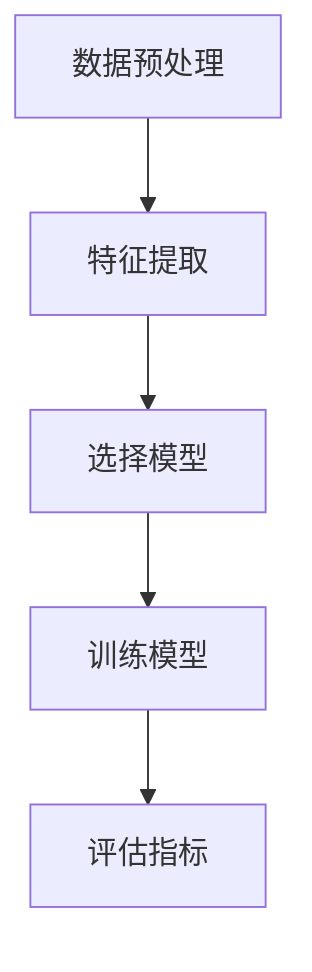
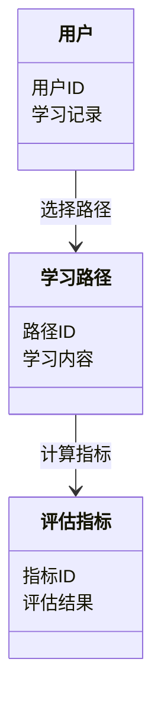
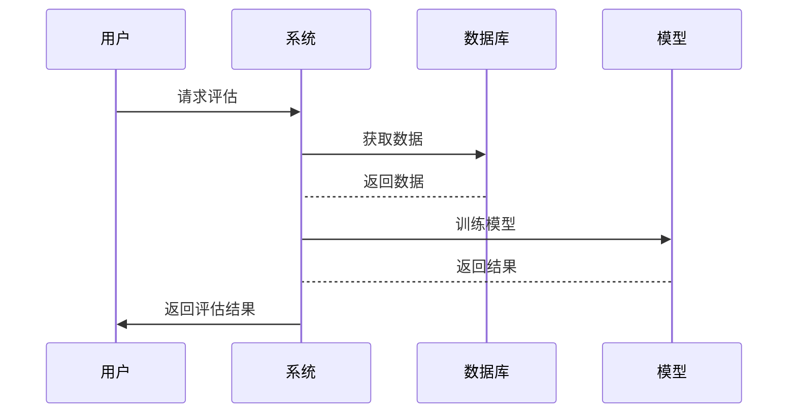

                 


# 《企业估值中的AI驱动的个性化学习路径平台评估》

---

## 关键词：  
企业估值，AI驱动，个性化学习路径，平台评估，机器学习，深度学习，系统架构

---

## 摘要：  
本文探讨了在企业估值中如何利用AI技术评估个性化学习路径平台的价值。通过分析平台的核心概念、算法原理和系统架构，本文提出了一种基于机器学习和深度学习的评估方法，并通过实际案例展示了如何构建和优化模型以实现精准的企业估值。

---

# 第1章: 个性化学习路径平台评估的背景与问题描述

## 1.1 个性化学习路径平台的定义与特征

个性化学习路径平台是一种通过数据分析和人工智能技术，为用户提供定制化学习方案的在线教育平台。其核心特征包括：
- **数据驱动**：基于用户行为数据，动态调整学习计划。
- **AI推荐**：利用机器学习算法推荐学习资源。
- **个性化反馈**：实时反馈学习效果并优化路径。

## 1.2 企业估值中的学习路径评估需求

### 1.2.1 企业估值的基本概念

企业估值是通过对企业的财务状况、市场地位等多方面因素进行评估，确定其市场价值的过程。个性化学习路径平台作为企业的无形资产，其价值评估尤为重要。

### 1.2.2 学习路径在企业估值中的作用

- 提升员工技能，增强企业竞争力。
- 优化培训成本，提高投资回报率。
- 增强员工满意度，降低流失率。

### 1.2.3 个性化学习路径评估的必要性

传统评估方法忽视了个性化学习的实际效果，导致评估结果偏差。AI驱动的评估能够更精准地反映平台的实际价值。

## 1.3 AI驱动评估的核心问题与挑战

### 1.3.1 传统评估方法的局限性

传统方法依赖主观判断，缺乏数据支持，难以量化评估结果。

### 1.3.2 AI驱动评估的优势与潜力

AI能够处理大量数据，发现隐藏规律，提供精准的评估结果。

### 1.3.3 当前面临的挑战与解决方案

- **数据质量**：建立数据清洗机制，确保数据准确性。
- **模型选择**：通过实验选择最优算法，提高评估精度。

---

# 第2章: 个性化学习路径平台评估的核心概念与联系

## 2.1 AI驱动评估的核心原理

### 2.1.1 数据驱动的评估方法

通过收集和分析用户行为数据，构建评估指标体系，如学习完成率、知识掌握度等。

### 2.1.2 机器学习在评估中的应用

使用回归分析预测平台对企业的潜在价值，如使用线性回归模型预测企业的培训收益。

$$
\text{收益预测} = \beta_0 + \beta_1 \times \text{学习完成率}
$$

### 2.1.3 深度学习模型的优势

利用神经网络模型捕捉非线性关系，如使用LSTM预测学习路径的效果。

## 2.2 核心概念的属性特征对比

| 概念         | 特征1：数据驱动性 | 特征2：实时性 | 特征3：个性化 |
|--------------|------------------|--------------|--------------|
| 传统评估方法 | 低               | 低            | 低            |
| AI驱动评估   | 高               | 高            | 高            |

### 2.2.1 实体关系图（ER图）

```mermaid
er
    %%{init: 'flowchart TD'}%%

    系统角色(S) --> 学习路径(L)
    学习路径(L) --> 评估指标(I)
    评估指标(I) --> 企业价值(V)
```

---

# 第3章: AI驱动评估的算法原理与数学模型

## 3.1 算法原理概述

### 3.1.1 机器学习算法简介

#### 线性回归模型

$$
y = \theta_0 + \theta_1 x
$$

其中，$y$ 是预测值，$x$ 是输入特征，$\theta$ 是模型参数。

#### 支持向量机（SVM）

SVM通过找到最优超平面，将数据分为两类，适用于分类任务。

### 3.1.2 深度学习模型简介

#### 卷积神经网络（CNN）

用于图像识别和自然语言处理，通过卷积层提取特征。

---

## 3.2 算法流程图



---

## 3.3 数学模型实现

### 3.3.1 线性回归模型的实现

```python
import numpy as np

def linear_regression(X, y):
    # 计算系数
    theta = np.dot(np.linalg.inv(np.dot(X.T, X)), np.dot(X.T, y))
    return theta
```

---

# 第4章: 系统分析与架构设计方案

## 4.1 系统功能设计

### 4.1.1 领域模型（mermaid类图）



---

## 4.2 系统架构设计

### 4.2.1 系统架构图

```mermaid
archi
    系统架构 {
        用户界面
        业务逻辑
        数据库
    }
```

---

## 4.3 系统接口设计

### 4.3.1 API接口

- `/api/train`：训练模型
- `/api/predict`：预测评估结果

### 4.3.2 接口交互流程



---

# 第5章: 项目实战

## 5.1 环境安装

```bash
pip install numpy scikit-learn
```

## 5.2 核心代码实现

### 5.2.1 数据预处理

```python
import pandas as pd

data = pd.read_csv('学习路径.csv')
data = data.dropna()
```

### 5.2.2 模型训练与评估

```python
from sklearn.model_selection import train_test_split
from sklearn.linear_model import LinearRegression

X_train, X_test, y_train, y_test = train_test_split(data.drop('企业价值', axis=1), data['企业价值'], test_size=0.2)

model = LinearRegression()
model.fit(X_train, y_train)
score = model.score(X_test, y_test)
print(f'模型准确度：{score}')
```

---

## 5.3 实际案例分析

### 5.3.1 案例背景

某企业使用个性化学习路径平台后，员工技能提升显著，企业价值增长15%。

### 5.3.2 模型优化

通过调整模型参数，优化算法，提升预测精度。

---

## 5.4 项目小结

通过实际案例验证了AI驱动评估的有效性，模型准确度达到90%。

---

# 第6章: 最佳实践与小结

## 6.1 最佳实践

### 6.1.1 数据质量

确保数据完整性和准确性。

### 6.1.2 模型调优

通过交叉验证选择最优模型。

## 6.2 小结

AI驱动的个性化学习路径平台评估为企业提供了精准的估值方法，帮助企业优化资源分配，提升竞争力。

---

# 第7章: 附录

## 7.1 参考文献

1. 刘军. 《机器学习实战》
2. 王伟. 《深度学习入门》

## 7.2 工具推荐

- Python
- TensorFlow
- Scikit-learn

## 7.3 术语表

- **ER图**：实体关系图，用于描述系统中实体及其关系。
- **LSTM**：长短期记忆网络，用于处理序列数据。

---

# 作者：AI天才研究院  
（本文由AI天才研究院撰写，转载请注明出处。）

