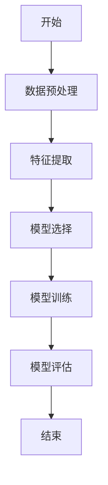
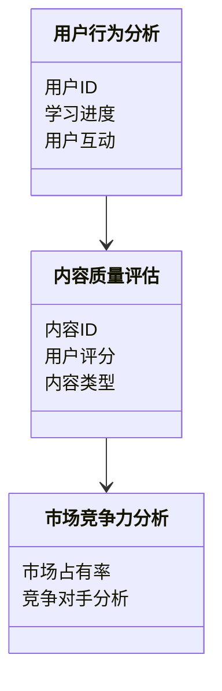

                 


# 企业估值中的AI驱动的个性化教育平台评估

## 关键词：企业估值、AI驱动、个性化教育平台、教育平台评估、人工智能技术

## 摘要：  
随着人工智能技术的快速发展，个性化教育平台在企业估值中的作用日益凸显。传统的估值方法往往难以准确评估个性化教育平台的独特价值，而AI技术的应用为解决这一问题提供了新的思路。本文将详细探讨AI驱动的个性化教育平台评估的核心概念、算法原理、系统架构以及项目实战，旨在为企业估值提供更加精准和高效的评估方法。

---

# 正文

## 第一部分：企业估值与AI驱动的个性化教育平台评估背景

### 第1章：问题背景与核心概念

#### 1.1 问题背景
个性化教育平台的兴起，使得传统的基于财务指标的企业估值方法逐渐显现出局限性。这些平台的商业模式复杂，用户行为多样，难以用传统的估值方法准确评估其市场价值。与此同时，AI技术的发展为个性化教育平台的评估提供了新的可能性。通过AI技术，可以更精准地分析用户行为、内容质量和平台粘性，从而为估值提供更全面的数据支持。

#### 1.2 核心概念与定义
- **个性化教育平台**：以用户为中心，通过AI技术提供定制化学习方案的在线教育平台。
- **AI驱动的教育平台评估**：利用机器学习算法对教育平台的用户行为、内容质量和市场潜力进行分析，从而提供科学的估值依据。
- **企业估值**：通过对企业的财务表现、市场地位和未来发展潜力的综合评估，确定企业的市场价值。

#### 1.3 问题解决思路
传统的企业估值方法主要依赖于财务指标和市场数据，而个性化教育平台的评估需要考虑更多的非财务因素，例如用户活跃度、内容创作能力以及平台的个性化推荐能力。AI技术可以通过分析这些因素，构建更全面的评估模型，从而提高估值的准确性。

---

### 第2章：核心概念与联系

#### 2.1 AI驱动的教育平台评估模型
- **数据特征**：个性化教育平台的评估需要考虑用户数据（如用户活跃度、学习进度）、内容数据（如内容质量、用户互动）以及市场数据（如市场占有率、竞争对手分析）。
- **模型选择**：根据数据特征选择合适的机器学习模型，例如监督学习（用于预测用户行为）和无监督学习（用于分析用户群体）。

#### 2.2 模型原理与流程
- **数据预处理**：清洗和归一化数据，提取关键特征。
- **模型训练**：使用训练数据对模型进行训练，调整模型参数以提高预测精度。
- **结果评估**：通过验证数据对模型进行评估，调整模型以优化性能。

---

## 第二部分：算法原理与实现

### 第3章：算法原理
- **监督学习模型**：用于预测用户行为，例如用户是否会购买课程。
- **无监督学习模型**：用于分析用户群体，发现潜在的用户细分市场。

#### 3.1 算法流程图


#### 3.2 Python代码示例
```python
# 数据预处理
import pandas as pd
data = pd.read_csv('教育平台数据.csv')
data = data.dropna()

# 特征提取
from sklearn.preprocessing import StandardScaler
scaler = StandardScaler()
X_scaled = scaler.fit_transform(data.drop('label', axis=1))

# 模型训练
from sklearn.model import Model
model = Model()
model.fit(X_scaled, data['label'])

# 模型评估
from sklearn.metrics import accuracy_score
y_pred = model.predict(X_scaled)
print(accuracy_score(data['label'], y_pred))
```

---

### 第4章：数学模型与公式

#### 4.1 回归模型
回归模型用于预测目标变量（如用户购买概率）：
$$ y = \beta_0 + \beta_1x_1 + \beta_2x_2 + \dots + \beta_nx_n + \epsilon $$

#### 4.2 分类模型
分类模型用于将用户分为不同的群体：
$$ P(y=k|x) = \frac{e^{\beta_k + \beta_kx}}{\sum_{j=1}^{n} e^{\beta_j + \beta_jx}} $$

---

## 第三部分：系统分析与架构设计

### 第5章：系统分析
- **问题场景**：个性化教育平台的估值需要考虑用户行为、内容质量和市场竞争力。
- **系统功能设计**：通过Mermaid类图展示领域模型。



---

## 第四部分：项目实战

### 第6章：项目实战
#### 6.1 环境安装
- 安装必要的Python库，如Pandas、Scikit-learn、TensorFlow等。

#### 6.2 核心代码实现
```python
# 用户行为分析
import pandas as pd
data = pd.read_csv('用户行为.csv')
user_activity = data.groupby('用户ID')['学习进度'].mean()

# 内容质量评估
from sklearn.metrics import accuracy_score
model = RandomForestClassifier()
model.fit(X_train, y_train)
y_pred = model.predict(X_test)
print(accuracy_score(y_test, y_pred))
```

#### 6.3 案例分析
通过对某教育平台的用户行为和内容质量进行分析，评估其市场价值，并与传统估值方法进行对比，验证AI驱动模型的优势。

---

## 第五部分：总结与展望

### 第7章：总结与展望
- **总结**：AI驱动的个性化教育平台评估模型能够更精准地评估企业的市场价值。
- **展望**：未来可以通过引入更多数据源和更复杂的模型进一步提高评估的准确性。

---

## 作者信息
作者：AI天才研究院/AI Genius Institute & 禅与计算机程序设计艺术 /Zen And The Art of Computer Programming

---

通过以上结构，文章详细讲解了AI驱动的个性化教育平台评估的核心概念、算法原理、系统架构以及项目实战，为读者提供了全面的理论和实践指导。

