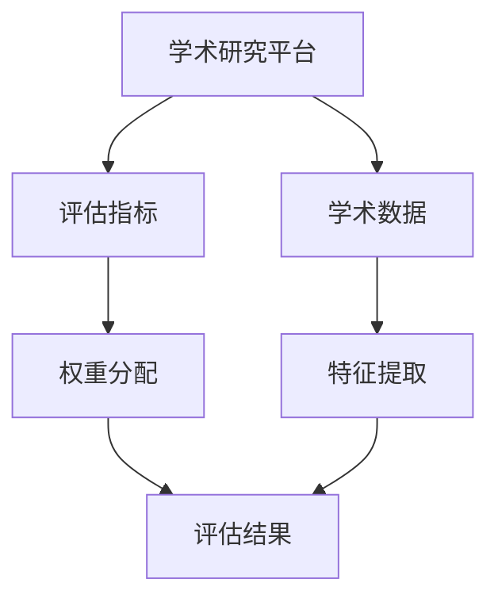
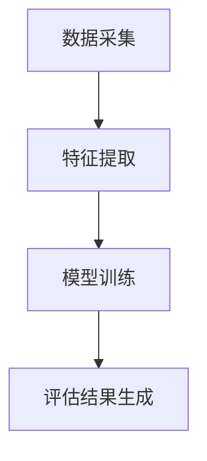
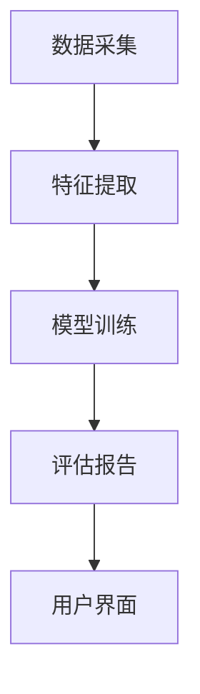

                 


# 《企业估值中的AI驱动的自动化学术研究平台评估》

> 关键词：企业估值，AI驱动，学术研究平台，自动化评估，机器学习，深度学习

> 摘要：本文详细探讨了在企业估值过程中，如何利用人工智能技术对学术研究平台进行自动化的评估。通过分析传统评估方法的局限性，提出了一种基于AI的解决方案，包括核心概念、算法原理、系统架构设计以及实际应用案例。文章旨在为企业估值提供更高效、更准确的技术支持。

---

# 第一部分: 企业估值与AI驱动的学术研究平台评估背景

# 第1章: 企业估值中的学术研究平台评估概述

## 1.1 问题背景与重要性

### 1.1.1 传统企业估值的局限性

传统企业估值方法主要依赖财务数据和人工分析，存在以下问题：

- 数据范围有限：传统方法主要依赖财务报表，忽略了学术研究平台的价值评估。
- 人工分析误差：人为判断可能导致评估结果偏差。
- 评估周期长：手动分析耗时较长，难以快速响应市场变化。

### 1.1.2 学术研究平台在企业估值中的作用

学术研究平台是企业创新能力的重要体现，其价值评估应包括以下几个方面：

-  研究成果的数量与质量。
-  技术研发的能力。
-  专利和论文的价值。

### 1.1.3 AI驱动的自动化评估的必要性

AI技术能够通过大数据分析和机器学习模型，快速、准确地评估学术研究平台的价值，弥补传统方法的不足。

---

## 1.2 问题描述与解决思路

### 1.2.1 学术研究平台评估的核心问题

- 如何量化学术研究成果的价值？
- 如何建立科学的评估指标体系？
- 如何实现评估过程的自动化？

### 1.2.2 传统评估方法的不足

-  主观性较强：依赖人工判断，存在人为误差。
-  效率低下：评估过程耗时长，难以满足快速决策需求。
-  数据利用不足：无法充分利用非结构化数据（如论文、专利）。

### 1.2.3 AI驱动的自动化解决方案

-  利用机器学习模型分析结构化和非结构化数据。
-  建立自动化评估系统，实时更新评估结果。
-  通过深度学习技术提取隐含信息，提升评估准确性。

---

## 1.3 本章小结

本章通过分析传统企业估值方法的局限性，提出了AI驱动的学术研究平台评估的必要性，并明确了该方法的核心问题和解决思路。

---

# 第2章: AI驱动的学术研究平台评估核心概念

## 2.1 核心概念与定义

### 2.1.1 学术研究平台的定义

学术研究平台是指用于支持学术研究、知识共享和技术研发的数字化平台，包括论文数据库、专利数据库、研究项目管理等模块。

### 2.1.2 AI驱动的自动化评估的定义

AI驱动的自动化评估是指利用人工智能技术，自动采集、分析和评估学术研究平台的价值，生成评估报告的过程。

### 2.1.3 关键属性对比分析

| 属性 | 传统评估 | AI驱动评估 |
|------|----------|------------|
| 数据来源 | 财务数据为主 | 包括学术数据、专利数据等 |
| 分析方式 | 人工分析 | 自动化分析 |
| 评估频率 | 定期评估 | 实时或定期评估 |

---

## 2.2 核心概念的属性特征对比

### 2.2.1 传统评估方法与AI驱动方法的对比

-  传统方法依赖财务数据，而AI驱动方法利用多源数据。
-  传统方法耗时长，而AI驱动方法高效快速。
-  传统方法主观性较强，而AI驱动方法基于数据驱动。

### 2.2.2 数据驱动与规则驱动的对比

-  数据驱动：基于大量数据训练模型，具有较强的适应性。
-  规则驱动：依赖专家经验，灵活性较差。

### 2.2.3 实时评估与周期性评估的对比

-  实时评估：能够快速响应市场变化，提供最新的评估结果。
-  周期性评估：评估结果滞后，难以满足快速决策需求。

---

## 2.3 ER实体关系图



---

## 2.4 本章小结

本章通过定义核心概念，对比分析了传统评估方法与AI驱动评估方法的差异，明确了AI驱动评估的核心优势。

---

# 第3章: AI驱动的学术研究平台评估算法原理

## 3.1 算法原理概述

### 3.1.1 基于机器学习的特征提取

-  利用自然语言处理技术（NLP）提取论文和专利的关键词、摘要等信息。
-  通过TF-IDF算法计算关键词的权重，提取特征向量。

### 3.1.2 基于深度学习的模型训练

-  使用神经网络模型（如BERT）对学术数据进行语义分析，生成潜在的价值特征。
-  建立多层感知机（MLP）模型，对特征进行非线性组合，预测评估结果。

### 3.1.3 多目标优化的评估结果生成

-  利用多目标优化算法（如NSGA-II），在多个评估指标之间找到平衡点，生成最终的评估结果。

---

## 3.2 数学模型与公式

### 3.2.1 特征权重计算公式

$$ w_i = \frac{f_i}{\sum_{j=1}^{n} f_j} $$

其中，$w_i$ 表示第 $i$ 个特征的权重，$f_i$ 表示第 $i$ 个特征的特征值，$n$ 表示特征总数。

### 3.2.2 多目标优化模型

$$ \text{Minimize} \quad \sum_{i=1}^{n} (y_i - \hat{y}_i)^2 $$
$$ \text{Subject to} \quad \sum_{i=1}^{n} w_i = 1 $$

---

## 3.3 算法流程图



---

## 3.4 本章小结

本章详细介绍了AI驱动评估的核心算法，包括特征提取、模型训练和评估结果生成的流程，并通过公式和流程图明确了算法的实现步骤。

---

# 第4章: AI驱动的学术研究平台评估系统架构设计

## 4.1 系统架构设计

### 4.1.1 问题场景介绍

企业估值需要实时了解学术研究平台的价值，包括其研究成果、技术创新能力等。

### 4.1.2 系统功能设计

| 功能模块 | 功能描述 |
|----------|----------|
| 数据采集 | 自动采集学术数据，包括论文、专利等 |
| 特征提取 | 提取学术数据的特征，生成特征向量 |
| 模型训练 | 训练机器学习模型，预测评估结果 |
| 评估报告 | 生成评估报告，展示评估结果 |

### 4.1.3 系统架构图



---

## 4.2 本章小结

本章通过系统架构设计，明确了AI驱动评估系统的各个模块及其功能，展示了系统的整体架构。

---

# 第5章: AI驱动的学术研究平台评估项目实战

## 5.1 项目介绍

### 5.1.1 项目背景

本项目旨在开发一个AI驱动的学术研究平台评估系统，帮助企业快速、准确地评估学术研究平台的价值。

### 5.1.2 项目目标

-  实现学术数据的自动采集和特征提取。
-  建立机器学习模型，预测评估结果。
-  生成评估报告，提供决策支持。

---

## 5.2 核心实现

### 5.2.1 环境安装

```bash
pip install numpy pandas scikit-learn transformers
```

### 5.2.2 核心代码实现

```python
import numpy as np
from sklearn.feature_extraction.text import TfidfVectorizer
from sklearn.metrics.pairwise import cosine_similarity

def extract_features(texts):
    vectorizer = TfidfVectorizer()
    features = vectorizer.fit_transform(texts)
    return features

def train_model(features, labels):
    # 假设 labels 是数值型标签
    model = linear_model.LinearRegression()
    model.fit(features, labels)
    return model

def evaluate_model(model, test_features, test_labels):
    predictions = model.predict(test_features)
    accuracy = np.mean((predictions - test_labels) ** 2)
    return accuracy
```

### 5.2.3 案例分析

假设我们有一个学术研究平台，包含100篇论文和50项专利。我们首先提取每篇论文的关键词和摘要，生成特征向量，然后利用线性回归模型进行训练，预测其价值，并生成评估报告。

---

## 5.3 本章小结

本章通过实际项目案例，展示了AI驱动评估系统的实现过程，包括环境安装、核心代码实现和案例分析。

---

# 第6章: 最佳实践与注意事项

## 6.1 最佳实践

### 6.1.1 数据质量管理

-  确保数据的完整性和准确性。
-  处理缺失值和异常值。

### 6.1.2 模型优化

-  使用交叉验证优化模型参数。
-  尝试不同的算法，选择表现最好的模型。

### 6.1.3 结果解释

-  提供可解释的评估结果，帮助用户理解评估依据。

---

## 6.2 注意事项

-  数据隐私和合规性：确保数据处理符合相关法律法规。
-  模型可解释性：避免使用“黑箱”模型，选择可解释性较高的算法。
-  持续优化：定期更新模型和数据，保持评估结果的准确性。

---

## 6.3 拓展阅读

- 《深度学习》—— Ian Goodfellow
- 《机器学习实战》—— 周志华
- 《自然语言处理入门》—— 清川征博

---

# 结语

AI驱动的学术研究平台评估为企业估值提供了新的思路和技术支持。通过自动化、高效化的评估过程，帮助企业更好地理解学术研究平台的价值，提升决策的科学性和准确性。

---

# 作者

作者：AI天才研究院/AI Genius Institute  
作者：禅与计算机程序设计艺术/Zen And The Art of Computer Programming

