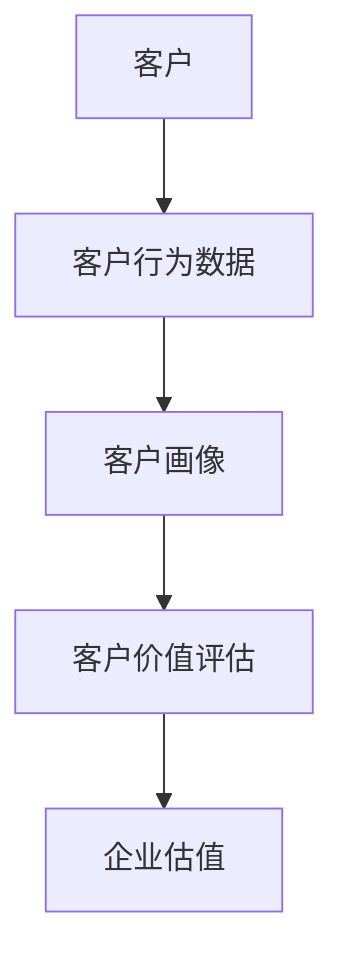
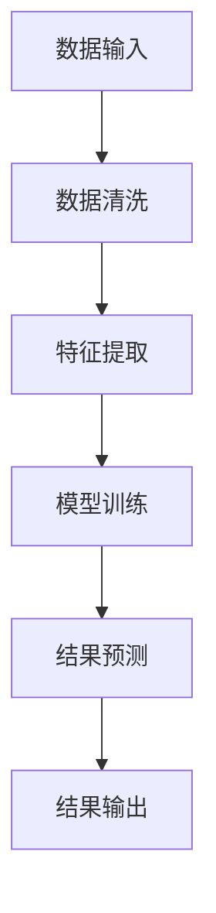
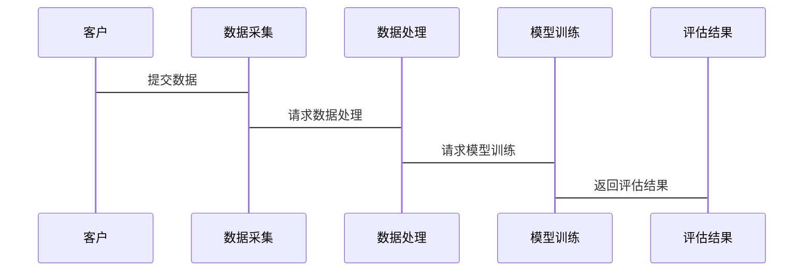

                 


# 企业估值中的AI驱动的自动化客户服务平台评估

> 关键词：企业估值，AI驱动，自动化客户服务平台，评估模型，数据驱动决策，客户价值评估

> 摘要：本文探讨了如何利用人工智能技术驱动自动化客户服务平台评估在企业估值中的应用。通过分析客户行为数据，构建客户画像，并利用机器学习模型进行客户价值评估，从而优化企业估值过程。文章详细介绍了核心概念、算法原理、系统架构设计和项目实战，并提供了最佳实践和小结。

---

## 第一部分：企业估值中的AI驱动的自动化客户服务平台评估背景介绍

### 第1章：企业估值与客户服务平台评估概述

#### 1.1 企业估值的基本概念

企业估值是评估企业价值的过程，旨在确定企业在市场上的价值。传统方法依赖于财务数据和历史表现，但忽略了客户行为和体验的重要性。客户服务平台评估是企业估值的关键部分，因为它直接影响客户满意度和企业形象。

#### 1.2 AI驱动的自动化客户服务平台评估的背景

随着AI技术的发展，企业开始利用自动化客户服务平台评估客户价值。AI技术能够快速处理大量数据，提供实时反馈，优化企业估值过程。自动化客户服务平台评估的优势在于高效性和精准性。

#### 1.3 问题背景与问题描述

传统企业估值方法存在以下问题：
- 数据采集耗时且成本高
- 评估结果不够精准
- 缺乏实时反馈

AI驱动的自动化客户服务平台评估能够解决这些问题，通过实时数据处理和模型优化，提高评估效率和准确性。

---

## 第二部分：AI驱动的自动化客户服务平台评估的核心概念与联系

### 第2章：核心概念原理

#### 2.1 AI驱动的客户服务平台评估原理

AI驱动的客户服务平台评估通过以下步骤实现：
1. 数据采集：收集客户行为数据，如点击率、购买频率等。
2. 数据处理：清洗和转换数据，提取特征。
3. 模型训练：利用机器学习算法训练模型。
4. 结果分析：生成客户画像和价值评估。

#### 2.2 核心概念属性特征对比表格

| 方法 | 优势 | 劣势 |
|------|------|------|
| 传统评估 | 简单易懂 | 精准度低 |
| AI驱动评估 | 精准度高 | 技术复杂 |

#### 2.3 ER实体关系图架构的 Mermaid 流程图



---

## 第三部分：AI驱动的自动化客户服务平台评估的算法原理

### 第3章：算法原理讲解

#### 3.1 算法流程图



#### 3.2 算法实现代码示例

```python
import pandas as pd
from sklearn.model import LinearRegression

# 数据预处理
data = pd.read_csv('customer_data.csv')
X = data[['feature1', 'feature2']]
y = data['target']

# 模型训练
model = LinearRegression()
model.fit(X, y)

# 预测结果
predictions = model.predict(X)
```

#### 3.3 数学模型和公式

线性回归模型：

$$ y = \beta_0 + \beta_1 x_1 + \beta_2 x_2 + \cdots + \beta_n x_n $$

其中，$y$ 是目标变量，$x_i$ 是自变量，$\beta_i$ 是系数。

---

## 第四部分：系统分析与架构设计方案

### 第4章：系统分析与架构设计

#### 4.1 问题场景介绍

以电商平台为例，客户在购买过程中产生的数据需要被收集和分析，以评估客户价值。

#### 4.2 系统功能设计（领域模型Mermaid类图）


#### 4.3 系统架构设计（Mermaid架构图）


#### 4.4 系统接口设计和交互流程图



---

## 第五部分：项目实战

### 第5章：项目实战

#### 5.1 环境安装

安装必要的Python库：

```bash
pip install pandas scikit-learn
```

#### 5.2 核心代码实现

客户价值评估模型代码：

```python
import pandas as pd
from sklearn.model import LinearRegression

data = pd.read_csv('customer_data.csv')
X = data[['feature1', 'feature2']]
y = data['target']

model = LinearRegression()
model.fit(X, y)
print(model.score(X, y))
```

#### 5.3 案例分析

使用具体数据集训练模型，计算评估结果并分析模型性能。

#### 5.4 项目小结

总结项目成果，分析模型优缺点，提出优化方向。

---

## 第六部分：最佳实践、小结、注意事项和拓展阅读

### 第6章：最佳实践

- 数据清洗是关键，确保数据质量。
- 选择合适的算法，避免过拟合。
- 定期更新模型，适应市场变化。

### 第7章：小结

AI驱动的自动化客户服务平台评估显著提高了企业估值的效率和准确性。通过实时数据分析和模型优化，企业能够更好地理解客户行为，提升客户价值。

### 第8章：注意事项和拓展阅读

- 注意数据隐私和安全问题。
- 拓展阅读相关技术书籍和论文，深入学习AI驱动的企业估值技术。

---

## 作者：AI天才研究院 & 禅与计算机程序设计艺术

---

这篇文章详细介绍了AI驱动的自动化客户服务平台评估在企业估值中的应用，通过理论与实践相结合，为读者提供了全面的指导。

