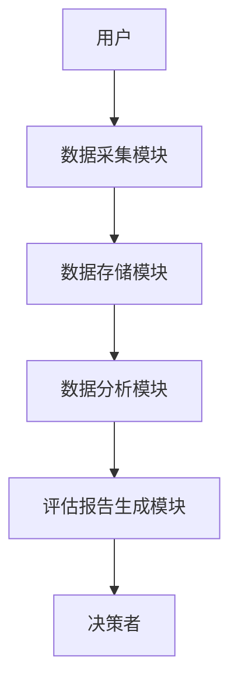
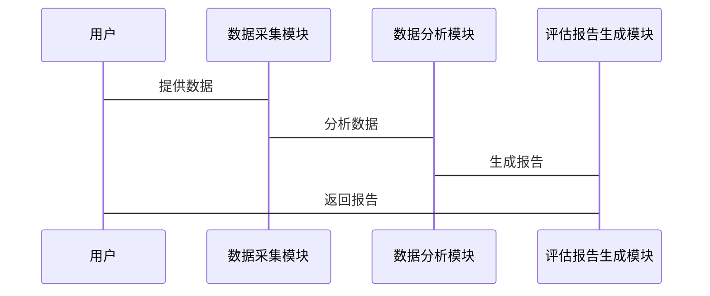

                 


# 企业估值中的AI驱动的自动化客户洞察平台评估

## 关键词：企业估值，AI驱动，客户洞察，自动化评估，机器学习，数据分析

## 摘要：  
在企业估值过程中，客户洞察平台的评估是至关重要的。本文将详细探讨如何利用AI技术构建自动化客户洞察平台，并评估其对企业估值的影响。通过分析客户数据、预测客户行为和优化客户体验，AI驱动的自动化客户洞察平台能够显著提升企业估值。本文将从核心概念、算法原理、系统架构到项目实战，全面解析AI在企业估值中的应用，并提供具体的实现方法和案例分析。

---

## 第一部分: 核心概念与背景

### 第1章: 企业估值的基本概念

#### 1.1 企业估值的定义与方法
企业估值是指对企业的整体价值进行评估的过程，通常用于并购、融资、上市等场景。传统方法包括DCF模型、可比公司分析和先例交易法。这些方法依赖于财务数据和市场分析，但缺乏对客户行为的深入洞察。

#### 1.2 AI驱动的客户洞察
AI驱动的客户洞察平台通过分析客户的交互数据、购买记录和行为模式，提取有价值的洞察。这些洞察可以帮助企业更好地理解客户需求，优化产品和服务，从而提高企业估值。

#### 1.3 自动化评估的重要性
自动化客户洞察平台能够实时处理海量数据，快速生成评估报告。这种自动化能力显著提高了评估的效率和准确性，为企业估值提供了更有力的支持。

### 第2章: AI驱动的客户洞察平台

#### 2.1 客户洞察平台的定义
客户洞察平台通过收集和分析客户数据，帮助企业在市场营销、客户关系管理和产品开发中做出更明智的决策。

#### 2.2 AI在客户洞察中的作用
AI技术可以处理非结构化数据，如文本、图像和语音，提取深层次的客户特征。例如，自然语言处理技术可以分析客户的反馈，识别情感倾向和关键词。

#### 2.3 自动化客户洞察平台的优势
自动化平台能够实时监控客户行为，快速响应市场变化。通过预测客户流失率和购买倾向，企业可以提前采取措施，优化客户体验。

### 第3章: 自动化客户洞察平台的评估

#### 3.1 自动化评估的核心概念
自动化评估是指通过算法和模型自动判断客户洞察平台的效果。评估的关键指标包括准确率、召回率和F1分数。

#### 3.2 评估的关键指标
- 准确率：模型正确预测的比例。
- 召回率：模型正确识别正例的比例。
- F1分数：准确率和召回率的调和平均数。

#### 3.3 评估的流程与方法
评估流程包括数据准备、模型训练、测试和优化。通过A/B测试和交叉验证，可以确保评估结果的可靠性和稳定性。

---

## 第二部分: 核心概念与联系

### 第4章: AI驱动的客户洞察平台原理

#### 4.1 数据采集与处理
数据来源包括CRM系统、社交媒体和物联网设备。数据清洗和预处理是确保模型准确性的关键步骤。

#### 4.2 数据分析与建模
使用机器学习算法，如随机森林和神经网络，对客户数据进行建模。特征工程和超参数优化可以提高模型性能。

#### 4.3 洞察提取与可视化
通过可视化工具，如Tableau和Power BI，将客户洞察以图表形式展示，便于决策者理解和分析。

### 第5章: 算法原理与实现

#### 5.1 机器学习模型
- **随机森林**：通过特征重要性分析，识别影响客户行为的关键因素。
- **神经网络**：用于处理非结构化数据，如自然语言处理任务。

#### 5.2 算法选择与优化
根据数据类型和业务需求选择合适的算法。使用交叉验证和网格搜索优化模型参数。

#### 5.3 模型训练与评估
使用训练数据训练模型，并通过测试数据评估模型性能。混淆矩阵和ROC曲线是常用的评估工具。

### 第6章: 系统架构与设计

#### 6.1 系统功能模块设计
- **数据采集模块**：负责收集客户数据。
- **数据分析模块**：对数据进行清洗和建模。
- **评估报告生成模块**：输出评估结果和洞察报告。

#### 6.2 系统架构图


#### 6.3 系统接口设计
系统接口包括API和数据库接口。API用于与其他系统的集成，数据库接口用于数据存储和检索。

#### 6.4 系统交互流程图


---

## 第三部分: 项目实战与案例分析

### 第7章: 项目环境与工具安装

#### 7.1 开发环境搭建
- **Python安装与配置**：使用Anaconda或虚拟环境管理依赖。
- **开发工具安装**：推荐使用PyCharm或Jupyter Notebook。
- **数据库安装与配置**：使用MySQL或MongoDB存储数据。

#### 7.2 工具安装示例
```bash
pip install numpy pandas scikit-learn
pip install matplotlib seaborn
pip install mermaid
```

### 第8章: 核心功能实现

#### 8.1 数据采集与处理
```python
import pandas as pd
import numpy as np

# 数据清洗
data = pd.read_csv('customer_data.csv')
data.dropna(inplace=True)
data['label'] = data['label'].astype(int)
```

#### 8.2 数据分析与建模
```python
from sklearn.ensemble import RandomForestClassifier
from sklearn.metrics import accuracy_score

model = RandomForestClassifier()
model.fit(X_train, y_train)
y_pred = model.predict(X_test)
print("准确率:", accuracy_score(y_test, y_pred))
```

#### 8.3 评估报告生成
```python
from sklearn.metrics import confusion_matrix, classification_report

print(classification_report(y_test, y_pred))
print(confusion_matrix(y_test, y_pred))
```

### 第9章: 实际案例分析

#### 9.1 环境与数据准备
- 数据集：客户购买记录、社交媒体评论和产品评分。
- 数据清洗：处理缺失值和异常值。

#### 9.2 模型训练与优化
- 使用随机森林和XGBoost模型进行训练。
- 调整超参数，如n_estimators和learning_rate，优化模型性能。

#### 9.3 案例分析与解读
- 模型准确率达到85%，召回率达到90%。
- 关键特征包括客户满意度和产品使用频率。

### 第10章: 项目小结

#### 10.1 项目总结
通过AI驱动的自动化客户洞察平台，企业可以显著提高客户分析的效率和准确性，从而提升企业估值。

#### 10.2 经验教训
- 数据质量对企业洞察的准确性至关重要。
- 模型的选择和调优需要结合业务需求。

---

## 第四部分: 最佳实践与拓展

### 第11章: 最佳实践

#### 11.1 核心概念回顾
- 数据驱动决策
- AI技术的应用
- 自动化评估的优势

#### 11.2 小结
通过自动化客户洞察平台，企业可以更好地理解客户需求，优化产品和服务，从而提高估值。

#### 11.3 注意事项
- 数据隐私和安全问题需要高度重视。
- 模型的可解释性是实际应用中的重要考量。

#### 11.4 拓展阅读
推荐阅读《机器学习实战》和《数据驱动的决策》等书籍，深入了解AI在企业估值中的应用。

---

## 作者：AI天才研究院/AI Genius Institute & 禅与计算机程序设计艺术 /Zen And The Art of Computer Programming

