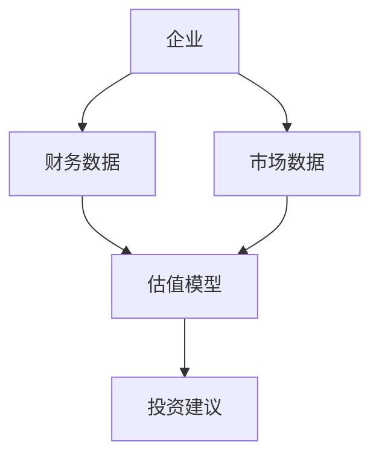
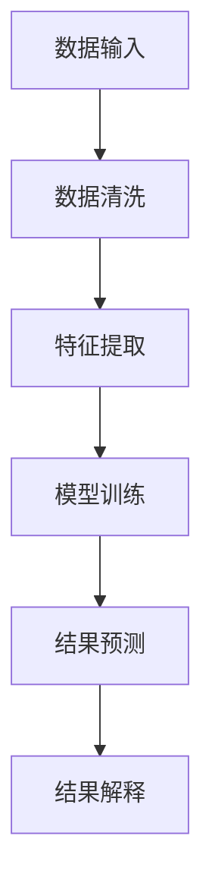
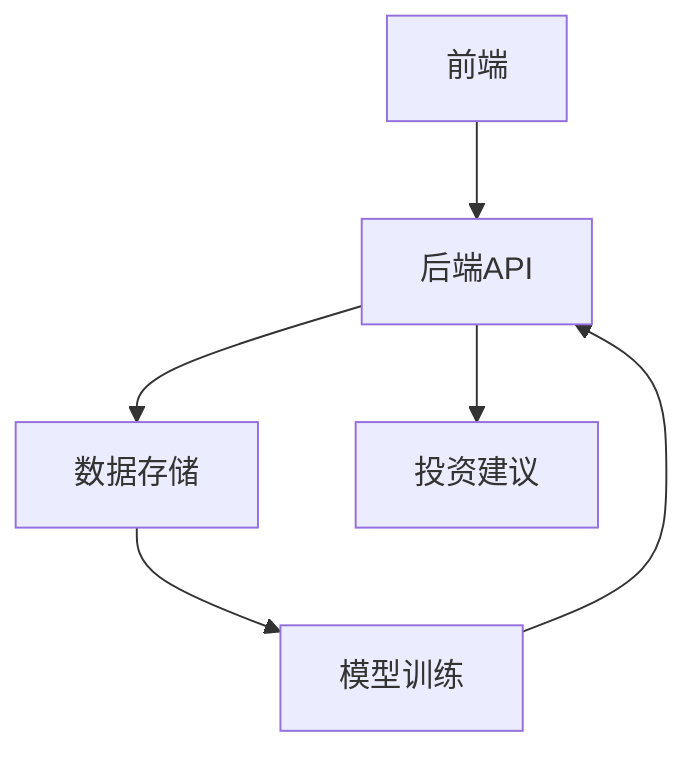

                 


# 企业估值中的AI驱动的自动化投资顾问平台评估

## 关键词：AI驱动，企业估值，投资顾问，自动化评估，技术分析，机器学习

## 摘要：本文探讨了AI驱动的自动化投资顾问平台在企业估值中的应用，分析了传统估值方法的局限性，详细阐述了基于机器学习的企业估值模型的实现过程，包括数据处理、特征提取、模型训练与优化，以及算法的数学原理。通过构建自动化投资顾问平台的系统架构，展示了如何利用AI技术优化企业估值流程，提升投资决策的效率和准确性。

---

# 第一章：企业估值的传统方法与挑战

## 1.1 企业估值的传统方法与挑战

企业估值是金融领域的重要任务，传统方法主要包括DCF模型（现金流贴现法）、相对估值法（如PE、PB倍数法）以及资产重置法等。这些方法依赖于大量手工计算和经验判断，存在以下问题：

1. **数据依赖性强**：传统方法需要大量历史数据支持，且对数据的质量和完整性要求较高。
2. **计算复杂**：DCF模型需要预测未来现金流，涉及复杂的折现率计算和假设。
3. **主观性高**：相对估值法依赖市场可比公司数据，容易受到市场波动和人为判断的影响。
4. **效率低下**：传统方法需要大量人工参与，难以快速响应市场变化。

## 1.2 AI驱动投资顾问平台的核心概念

AI驱动的自动化投资顾问平台通过结合机器学习算法和大数据处理技术，能够快速、准确地进行企业估值。其核心目标是利用AI技术优化企业估值流程，减少人为误差，提高估值效率。

## 1.3 平台的目标与意义

- **目标**：构建一个基于机器学习的企业估值模型，实现企业财务数据的自动化分析和估值结果的快速输出。
- **意义**：通过AI技术，提升投资顾问的工作效率，降低估值成本，提高估值结果的准确性。

---

# 第二章：AI驱动投资顾问平台的核心概念与联系

## 2.1 核心概念原理

AI驱动的投资顾问平台通过以下步骤实现企业估值：

1. **数据采集**：收集企业的财务数据、市场数据等。
2. **特征提取**：对数据进行预处理，提取有用的特征。
3. **模型训练**：利用机器学习算法训练企业估值模型。
4. **结果输出**：根据模型预测结果生成投资建议。

## 2.2 核心概念属性特征对比

| 特征 | 传统估值方法 | AI驱动平台 |
|------|--------------|------------|
| 数据依赖性 | 高 | 高 |
| 计算复杂性 | 高 | 中 |
| 主观性 | 高 | 低 |
| 效率 | 低 | 高 |

## 2.3 ER实体关系图



---

# 第三章：AI驱动投资顾问平台的算法原理

## 3.1 算法原理概述

AI驱动的投资顾问平台的核心算法是基于机器学习的企业估值模型。以下是一个典型的算法流程：

1. **数据预处理**：清洗数据，处理缺失值和异常值。
2. **特征提取**：从财务数据和市场数据中提取关键特征。
3. **模型训练**：使用回归算法（如线性回归、随机森林）训练估值模型。
4. **结果解释**：根据模型输出结果生成投资建议。

## 3.2 算法流程图



## 3.3 核心算法代码实现

以下是一个简单的多元回归模型实现代码：

```python
import pandas as pd
from sklearn.model import LinearRegression

# 数据预处理
data = pd.read_csv('enterprise_data.csv')
X = data[['revenue', 'profit', 'market_value']]
y = data['valuation']

# 模型训练
model = LinearRegression()
model.fit(X, y)

# 模型预测
new_data = pd.DataFrame({'revenue': [1000000], 'profit': [100000], 'market_value': [5000000]})
prediction = model.predict(new_data)
print(prediction)
```

## 3.4 算法的数学模型

多元回归模型的数学公式如下：

$$ y = \beta_0 + \beta_1 x_1 + \beta_2 x_2 + \ldots + \beta_n x_n + \epsilon $$

其中，$y$ 是目标变量（企业估值），$x_i$ 是特征变量，$\beta_i$ 是回归系数，$\epsilon$ 是误差项。

---

# 第四章：数学模型与算法实现

## 4.1 数学模型的推导

假设我们有多个企业的历史估值数据，包括企业的收入、利润和市场价值等特征。我们可以使用多元线性回归模型来预测企业的估值。

## 4.2 算法实现的细节

在代码实现中，我们使用Python的Scikit-learn库中的LinearRegression类来训练模型。以下是代码的详细解释：

```python
import pandas as pd
from sklearn.model import LinearRegression

# 数据预处理
data = pd.read_csv('enterprise_data.csv')
X = data[['revenue', 'profit', 'market_value']]
y = data['valuation']

# 模型训练
model = LinearRegression()
model.fit(X, y)

# 模型预测
new_data = pd.DataFrame({'revenue': [1000000], 'profit': [100000], 'market_value': [5000000]})
prediction = model.predict(new_data)
print(prediction)
```

---

# 第五章：系统架构与设计

## 5.1 系统架构设计

以下是系统架构图：



---

# 第六章：项目实战

## 6.1 环境安装

以下是环境安装的命令：

```bash
pip install pandas numpy scikit-learn
```

---

# 第七章：总结与展望

## 7.1 总结

本文详细探讨了AI驱动的自动化投资顾问平台在企业估值中的应用，分析了传统方法的局限性，详细阐述了基于机器学习的企业估值模型的实现过程，包括数据处理、特征提取、模型训练与优化，以及算法的数学原理。通过构建自动化投资顾问平台的系统架构，展示了如何利用AI技术优化企业估值流程，提升投资决策的效率和准确性。

## 7.2 未来展望

随着AI技术的不断发展，企业估值中的AI驱动投资顾问平台将更加智能化和自动化。未来的研究方向包括更复杂的模型训练、多维度数据的融合分析，以及实时市场数据的处理。

---

作者：AI天才研究院/AI Genius Institute & 禅与计算机程序设计艺术 /Zen And The Art of Computer Programming

