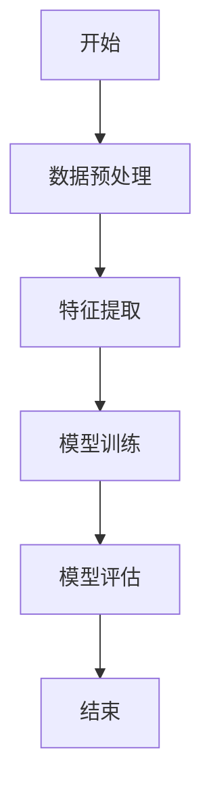
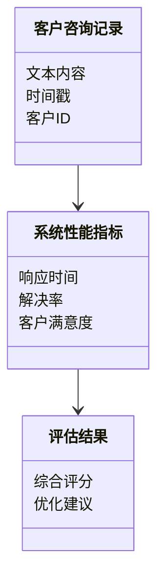

                 


# 企业估值中的AI驱动的虚拟客服系统评估

> 关键词：企业估值，AI驱动，虚拟客服系统，系统评估，人工智能，自然语言处理，机器学习

> 摘要：本文探讨了AI技术在企业虚拟客服系统评估中的应用，分析了AI如何优化企业估值过程，详细介绍了从算法原理到系统架构的设计，结合实际案例展示如何利用AI提升客服效率，为企业估值提供支持。

---

## 第一部分：引言

### 1.1 企业估值的重要性
#### 1.1.1 企业估值的基本概念
企业估值是确定企业市场价值的过程，涉及财务指标、市场表现和行业分析等多方面因素。

#### 1.1.2 虚拟客服系统在企业估值中的作用
虚拟客服系统通过提升客户互动效率和满意度，间接影响企业估值。

#### 1.1.3 AI技术对企业估值的影响
AI技术的应用使得客服系统更加智能化，能够实时分析客户反馈，优化服务策略，从而提升企业价值。

---

## 第二部分：AI驱动的虚拟客服系统评估的核心概念

### 2.1 虚拟客服系统评估的背景
#### 2.1.1 传统客服系统的局限性
传统客服系统依赖人工处理，效率低，难以大规模处理客户需求。

#### 2.1.2 AI技术如何提升客服效率
AI技术通过自动化处理客户咨询，减少响应时间，提升客户满意度。

#### 2.1.3 虚拟客服系统评估的必要性
评估虚拟客服系统性能是优化服务、提升企业估值的关键步骤。

### 2.2 虚拟客服系统评估的问题描述
#### 2.2.1 评估指标的选择
选择合适的指标，如响应时间、客户满意度、问题解决率等。

#### 2.2.2 数据收集的挑战
数据来源多样性，清洗和预处理的复杂性。

#### 2.2.3 系统性能的评估标准
建立统一的评估标准，确保评估结果的客观性。

### 2.3 AI驱动的解决方案
#### 2.3.1 自然语言处理在客服评估中的应用
NLP技术用于分析客户反馈，识别情感倾向，优化服务质量。

#### 2.3.2 机器学习模型的构建
利用机器学习算法预测系统性能，优化资源配置。

#### 2.3.3 数据分析与预测
通过数据分析挖掘潜在问题，提前采取措施，提升系统效率。

---

## 第三部分：AI驱动的虚拟客服系统评估模型

### 3.1 模型的系统架构
#### 3.1.1 数据流分析
从客户咨询到系统处理，数据流的分析与优化。

#### 3.1.2 模块划分与功能分配
功能模块包括数据采集、特征提取、模型训练和评估反馈。

#### 3.1.3 系统的可扩展性设计
确保系统能够适应未来业务扩展需求。

### 3.2 数据采集与预处理
#### 3.2.1 数据源的多样性
包括文本记录、语音数据、客户评分等多源数据。

#### 3.2.2 数据清洗与标准化
去除噪声数据，标准化处理，确保数据质量。

#### 3.2.3 数据特征的提取
提取关键特征，如关键词频率、情感分析结果等。

### 3.3 模型训练与优化
#### 3.3.1 选择合适的算法
根据问题类型选择监督学习、无监督学习或强化学习算法。

#### 3.3.2 模型调参与优化
通过交叉验证和超参数调整，提升模型性能。

#### 3.3.3 性能评估与优化
利用准确率、召回率、F1分数等指标评估模型，并持续优化。

---

## 第四部分：AI驱动的虚拟客服系统评估的算法实现

### 4.1 算法原理
#### 4.1.1 自然语言处理算法
- **分词**：使用jieba对中文文本进行分词。
- **情感分析**：利用预训练模型（如BERT）进行情感分类。

#### 4.1.2 机器学习模型
- **训练数据准备**：构建训练集，包含客户咨询记录和标签。
- **模型训练**：使用支持向量机（SVM）或随机森林（Random Forest）进行分类。

#### 4.1.3 流程图


#### 4.1.4 Python代码示例
```python
from sklearn.feature_extraction.text import TfidfVectorizer
from sklearn.svm import SVC

# 数据预处理
texts = [...]  # 客户咨询文本
labels = [...]  # 标签

# 特征提取
vectorizer = TfidfVectorizer()
X = vectorizer.fit_transform(texts)

# 模型训练
model = SVC()
model.fit(X, labels)

# 模型评估
print(model.score(X, labels))
```

---

## 第五部分：AI驱动的虚拟客服系统评估的系统架构设计

### 5.1 问题场景介绍
企业希望通过AI优化虚拟客服系统，提升客户满意度，优化资源配置，进而提升企业估值。

### 5.2 项目介绍
构建一个基于AI的虚拟客服评估系统，实现自动化评估和优化建议。

### 5.3 系统功能设计
#### 5.3.1 领域模型设计


### 5.4 系统架构设计


### 5.5 系统接口设计
- **API接口**：提供RESTful API，供其他系统调用评估结果。
- **数据接口**：支持多种数据格式的导入和导出。

### 5.6 系统交互设计
```mermaid
sequenceDiagram
    客户咨询 --> 系统：提交咨询
    系统 --> AI模型：分析咨询内容
    AI模型 --> 系统：生成回复
    系统 --> 客户：发送回复
    系统 --> 评估模块：记录评估数据
```

---

## 第六部分：AI驱动的虚拟客服系统评估的项目实战

### 6.1 环境安装
- 安装Python、机器学习库（如scikit-learn、TensorFlow）、NLP处理库（如jieba、spaCy）。

### 6.2 系统核心实现
```python
from sklearn.model_selection import train_test_split
from sklearn.metrics import classification_report

# 数据分割
X_train, X_test, y_train, y_test = train_test_split(X, labels, test_size=0.2)

# 模型训练与评估
model = SVC()
model.fit(X_train, y_train)
print(classification_report(y_test, model.predict(X_test)))
```

### 6.3 实际案例分析
通过具体案例，展示如何利用AI技术优化虚拟客服系统，提升企业估值。

---

## 第七部分：总结与展望

### 7.1 总结
AI技术在虚拟客服系统评估中的应用，显著提升了评估效率和准确性，为企业估值提供了有力支持。

### 7.2 小结
从理论到实践，详细介绍了AI驱动的虚拟客服系统评估的全过程，包括系统设计、算法实现和项目实战。

### 7.3 注意事项
- 数据隐私保护
- 模型的可解释性
- 系统的实时性和稳定性

### 7.4 拓展阅读
推荐相关书籍和资源，供读者深入学习。

---

## 作者信息
作者：AI天才研究院 & 禅与计算机程序设计艺术

---

通过以上详细的内容安排，我们可以系统地构建一个完整的企业估值中的AI驱动的虚拟客服系统评估框架，从理论到实践，帮助读者全面掌握相关知识。

