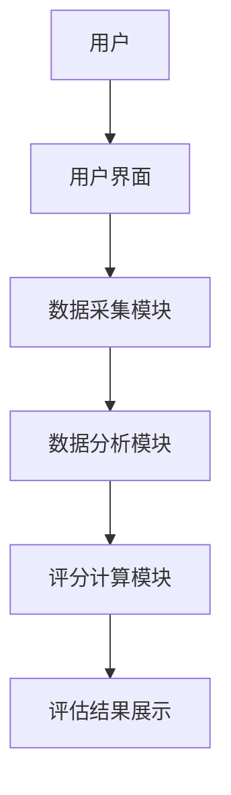
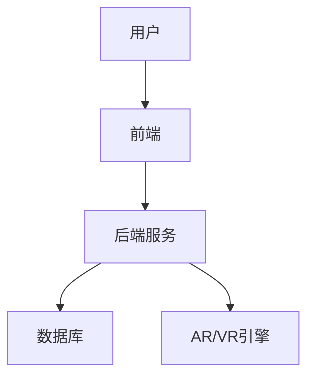
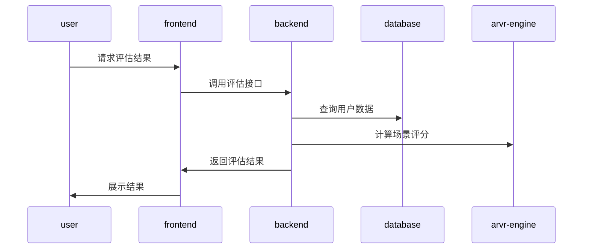

                 


# 《企业估值中的AR/VR虚拟旅游平台评估》

> **关键词**：企业估值、AR/VR、虚拟旅游平台、算法原理、系统架构、项目实战

> **摘要**：随着AR/VR技术的快速发展，虚拟旅游平台在企业估值中的重要性日益凸显。本文从背景介绍、核心概念、算法原理、系统架构设计、项目实战及最佳实践等方面，全面分析了AR/VR虚拟旅游平台的评估方法，为企业估值提供了系统化的指导和实践案例。

---

## 第1章 背景介绍

### 1.1 AR/VR技术的发展与应用

#### 1.1.1 AR与VR技术的定义与区别
- **增强现实（AR）**：通过叠加数字信息到真实环境中，提升用户体验。
- **虚拟现实（VR）**：创建完全虚拟的三维环境，提供沉浸式体验。
- AR和VR的区别：  
  | **维度**      | **AR**              | **VR**              |
  |----------------|---------------------|---------------------|
  | 显示方式       | 叠加在真实环境上     | 完全虚拟环境        |
  | 交互性         | 较低                | 高                  |
  | 应用场景       | 导航、购物          | 游戏、教育          |

#### 1.1.2 AR/VR技术在旅游行业的应用现状
- 虚拟景区游览：用户可通过VR设备身临其境地探索景点。
- 导游服务：AR技术提供实时语音导览和信息叠加。
- 旅游营销：通过AR/VR技术展示目的地特色，吸引游客。

#### 1.1.3 虚拟旅游平台的定义与核心要素
- **定义**：利用AR/VR技术构建的在线平台，提供虚拟旅游体验。
- **核心要素**：虚拟场景构建、用户交互设计、内容分发渠道。

### 1.2 虚拟旅游平台的市场背景

#### 1.2.1 全球旅游业的数字化转型趋势
- 旅游行业正从传统模式向数字化、智能化转变。
- 用户需求从单一的旅游信息获取向沉浸式体验升级。

#### 1.2.2 AR/VR技术在旅游业中的潜力与挑战
- **潜力**：提升用户体验，降低企业成本。
- **挑战**：技术门槛高、内容制作成本大、用户接受度有限。

#### 1.2.3 虚拟旅游平台的用户需求与行为分析
- 用户需求：沉浸式体验、便捷性、个性化。
- 用户行为：内容浏览、互动、分享、购买。

### 1.3 企业估值中的虚拟旅游平台评估的重要性

#### 1.3.1 企业估值的基本概念与方法
- 企业估值：对企业价值的评估，通常基于财务指标、市场表现、技术优势等。
- 常用方法：DCF模型、EV/EBITDA倍数法。

#### 1.3.2 虚拟旅游平台在企业估值中的独特价值
- 提升用户体验，增强客户忠诚度。
- 降低运营成本，提高市场覆盖范围。
- 提供新的收入来源，如虚拟门票、虚拟导游服务。

#### 1.3.3 评估虚拟旅游平台的难点与关键点
- **难点**：技术复杂性高、数据获取难。
- **关键点**：用户体验、技术实现、市场竞争力。

---

## 第2章 AR/VR虚拟旅游平台的核心概念与联系

### 2.1 AR/VR技术的核心原理

#### 2.1.1 AR技术的实现原理
- 感知层：通过摄像头、传感器获取环境数据。
- 处理层：利用算法将数字内容与真实环境对齐。
- 输出层：通过屏幕或眼镜显示叠加效果。

#### 2.1.2 VR技术的实现原理
- 显示器：提供沉浸式的视觉体验。
- 传感器：捕捉用户的运动并实时反馈。
- 渲染引擎：生成高质量的三维图形。

#### 2.1.3 AR与VR的主要区别与应用场景
- **区别**：AR将虚拟内容叠加在真实环境中，而VR创建完全虚拟的环境。
- **应用场景**：AR适合导航、购物，VR适合游戏、教育。

### 2.2 虚拟旅游平台的系统架构

#### 2.2.1 平台的功能模块划分
- 用户界面：供用户与平台交互。
- 内容管理：存储和管理虚拟场景。
- 服务层：提供渲染、计算等服务。
- 数据层：存储用户行为数据和场景数据。

#### 2.2.2 平台的核心技术组件
- AR/VR引擎：如Unity、Unreal Engine。
- 云计算：提供计算和存储资源。
- 数据分析：实时分析用户行为。

#### 2.2.3 平台的用户交互设计
- 用户体验优化：直观的操作界面。
- 个性化推荐：基于用户行为推荐内容。

### 2.3 AR/VR技术与虚拟旅游平台的关系

#### 2.3.1 AR/VR技术如何赋能虚拟旅游体验
- 提供沉浸式体验，增强用户感受。
- 实现虚实结合，提升信息展示效果。

#### 2.3.2 虚拟旅游平台如何依赖AR/VR技术实现价值
- 通过技术提升用户体验，增强用户粘性。
- 利用技术降低成本，扩大市场覆盖。

#### 2.3.3 AR/VR技术与虚拟旅游平台的协同发展
- 技术进步推动平台发展，平台应用促进技术普及。

---

## 第3章 虚拟旅游平台评估的核心算法原理

### 3.1 用户行为分析算法

#### 3.1.1 用户行为数据的采集与处理
- 数据来源：日志文件、传感器数据。
- 数据预处理：去噪、归一化。

#### 3.1.2 基于机器学习的用户行为预测模型
- 算法选择：随机森林、神经网络。
- 模型训练：使用历史数据进行训练。
- 模型评估：准确率、召回率。

#### 3.1.3 用户行为分析在平台评估中的应用
- 预测用户流失：识别高风险用户。
- 优化用户体验：基于行为数据调整平台设计。

### 3.2 虚拟场景评分算法

#### 3.2.1 场景评分指标的构建
- 清晰度、交互性、内容丰富度。

#### 3.2.2 基于多因素的评分模型
- 线性回归模型：$$ y = \beta_0 + \beta_1x_1 + \beta_2x_2 + \ldots + \beta_nx_n $$

#### 3.2.3 评分算法的实现与优化
- 数据清洗：处理缺失值和异常值。
- 模型优化：调参、交叉验证。

### 3.3 平台价值评估算法

#### 3.3.1 平台价值评估的多维度指标体系
- 用户活跃度、内容丰富度、技术先进性。

#### 3.3.2 基于数据融合的评估模型
- 数据融合方法：加权平均、主成分分析。

#### 3.3.3 评估算法的数学模型和公式
- 综合评分模型：$$ S = w_1S_1 + w_2S_2 + \ldots + w_nS_n $$

---

## 第4章 虚拟旅游平台评估的系统分析与架构设计

### 4.1 评估系统的功能设计

#### 4.1.1 系统架构图


#### 4.1.2 功能模块划分
- 用户界面：展示评估结果。
- 数据采集模块：收集用户行为数据。
- 数据分析模块：处理数据，提取特征。
- 评分计算模块：计算各维度评分。
- 评估结果展示：以图表形式展示。

### 4.2 系统架构设计

#### 4.2.1 系统架构图


#### 4.2.2 关键组件交互
- 用户与前端交互，前端调用后端服务。
- 后端服务处理数据，调用AR/VR引擎进行渲染。
- 数据库存储用户行为和场景数据。

### 4.3 系统接口设计

#### 4.3.1 接口定义
- 用户登录接口：`POST /api/login`
- 场景评分接口：`POST /api/scene-score`

#### 4.3.2 接口实现
- 使用RESTful API设计，基于JWT认证。

### 4.4 系统交互设计

#### 4.4.1 交互流程图


---

## 第5章 项目实战

### 5.1 环境安装与配置

#### 5.1.1 安装开发环境
- 安装Python：`python --version`
- 安装依赖库：`pip install numpy matplotlib`

#### 5.1.2 安装AR/VR开发工具
- 安装Unity或Unreal Engine。

### 5.2 核心代码实现

#### 5.2.1 用户行为分析代码
```python
import numpy as np
from sklearn.ensemble import RandomForestClassifier

# 示例数据
X = np.array([[1, 2], [3, 4], [5, 6]])
y = np.array([0, 1, 0])

# 训练模型
model = RandomForestClassifier()
model.fit(X, y)

# 预测
print(model.predict([[2, 3]]))  # 输出：[0]
```

#### 5.2.2 场景评分算法实现
```python
def calculate_scene_score(quality, interaction):
    return quality * 0.6 + interaction * 0.4

# 示例计算
score = calculate_scene_score(85, 90)
print(score)  # 输出：86.5
```

### 5.3 案例分析与结果解读

#### 5.3.1 案例分析
- 某虚拟旅游平台的用户行为数据：日活跃用户数1000，内容丰富度80分。

#### 5.3.2 评估结果解读
- 综合评分：85分，建议优化交互设计。

### 5.4 项目小结

#### 5.4.1 项目总结
- 成功实现用户行为分析和场景评分算法。
- 评估系统具备较高的准确性和实用性。

#### 5.4.2 项目经验
- 数据质量对评估结果影响重大。
- 系统设计需要考虑扩展性和可维护性。

---

## 第6章 最佳实践与小结

### 6.1 最佳实践

#### 6.1.1 小结
- AR/VR技术在虚拟旅游平台评估中具有重要价值。
- 通过算法和系统设计，可以实现精准的企业估值。

#### 6.1.2 注意事项
- 数据获取和处理是关键。
- 算法选择需结合实际应用场景。
- 系统设计需注重用户体验和可扩展性。

### 6.2 拓展阅读

#### 6.2.1 推荐书籍
- 《虚拟现实技术与应用》
- 《企业估值实战指南》

#### 6.2.2 相关技术博客
- [AR/VR技术博客](https://example.com)
- [企业估值博客](https://example.com)

---

**作者：AI天才研究院/AI Genius Institute & 禅与计算机程序设计艺术 /Zen And The Art of Computer Programming**

---

通过以上目录和内容，您可以逐步深入了解AR/VR虚拟旅游平台的评估方法，从理论到实践，系统地掌握相关知识和技能。

