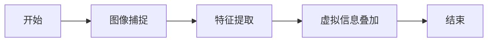
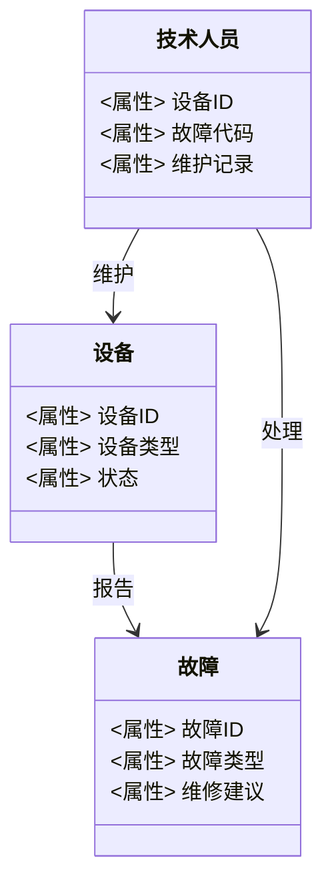
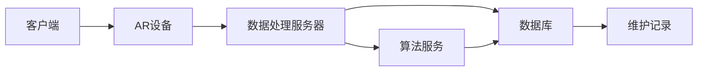
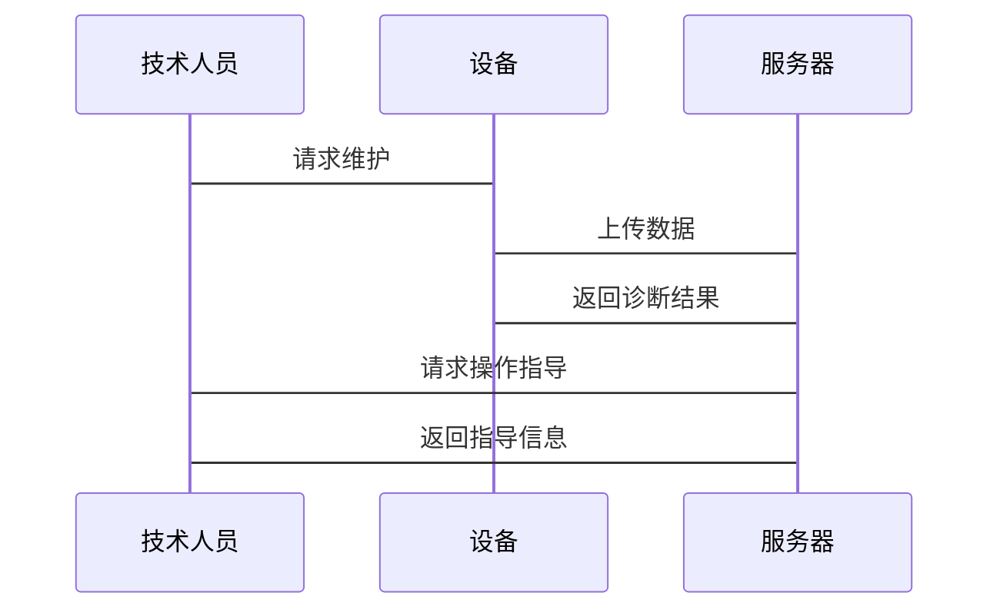

                 


# 《企业估值中的AR工业远程维护系统评估》

---

## 关键词：  
AR技术、工业远程维护、企业估值、系统评估、增强现实、远程维护、经济效益

---

## 摘要：  
本文深入探讨了AR（增强现实）技术在工业远程维护系统中的应用及其对企业估值的影响。通过分析AR技术的核心原理、系统架构、算法原理以及实际应用场景，本文揭示了AR工业远程维护系统如何优化企业运营效率、降低成本，并为企业创造更大的经济效益。同时，本文从系统评估的角度出发，结合企业估值的关键指标，为企业提供了一套基于AR技术的远程维护系统评估方法论，帮助企业实现技术与经济的双重优化。

---

# 第一部分：企业估值中的AR工业远程维护系统概述

## 第1章：背景介绍

### 1.1 问题背景

#### 1.1.1 工业远程维护的现状与挑战  
工业远程维护是现代制造业的重要组成部分，传统的工业维护模式依赖于现场技术人员，存在效率低、成本高等问题。随着工业设备的复杂化和智能化，传统的维护方式已难以满足企业的需求。  

#### 1.1.2 AR技术在工业维护中的应用背景  
AR（增强现实）技术通过将虚拟信息叠加到真实场景中，为工业远程维护提供了全新的解决方案。AR技术能够实时指导技术人员完成复杂操作，减少误操作风险，显著提升维护效率。  

#### 1.1.3 企业估值与工业维护系统的关系  
企业的估值与其运营效率和成本控制密切相关。高效的工业维护系统能够降低企业的运营成本，提高设备利用率，从而提升企业的整体估值。  

### 1.2 问题描述

#### 1.2.1 工业远程维护的核心问题  
工业远程维护的核心问题在于如何快速定位和解决设备故障，减少停机时间。  

#### 1.2.2 AR技术在远程维护中的应用难点  
AR技术在工业远程维护中的应用难点包括实时性、精度和稳定性问题。  

#### 1.2.3 企业估值中的关键评估指标  
企业估值的关键指标包括设备利用率、维护成本、维护效率等。  

### 1.3 问题解决

#### 1.3.1 AR技术如何解决工业维护问题  
AR技术通过提供实时的可视化指导，帮助技术人员快速定位和解决问题，显著提升了维护效率。  

#### 1.3.2 系统评估对企业估值的影响  
系统评估能够量化AR工业远程维护系统对企业运营效率和成本的影响，为企业的估值提供数据支持。  

#### 1.3.3 技术与经济的双重优化  
通过AR技术的应用，企业能够在提高维护效率的同时降低维护成本，实现技术与经济的双重优化。  

### 1.4 边界与外延

#### 1.4.1 系统评估的边界条件  
系统评估的边界条件包括设备类型、维护场景、技术实现难度等。  

#### 1.4.2 AR技术的适用范围与限制  
AR技术适用于需要实时可视化指导的工业维护场景，但在复杂环境和高精度要求下仍存在限制。  

#### 1.4.3 企业估值的多维度考量  
企业估值需要考虑技术、经济、市场等多个维度，AR技术的应用能够从技术角度提升企业的竞争力。  

### 1.5 概念结构与核心要素

#### 1.5.1 系统评估的核心要素  
系统评估的核心要素包括设备性能、维护效率、成本效益等。  

#### 1.5.2 AR技术的关键特性  
AR技术的关键特性包括实时性、可视化、交互性等。  

#### 1.5.3 企业估值的多维度模型  
企业估值的多维度模型包括经济效益、技术优势、市场竞争力等。  

### 1.6 本章小结  
本章通过分析工业远程维护的现状与挑战，探讨了AR技术在其中的应用潜力，并结合企业估值的关键指标，明确了AR工业远程维护系统的核心价值。

---

## 第2章：核心概念与联系

### 2.1 AR技术的核心原理

#### 2.1.1 增强现实的基本概念  
AR技术通过将虚拟信息叠加到真实场景中，为用户提供增强的视觉体验。  

#### 2.1.2 AR技术的关键组成部分  
AR技术的关键组成部分包括传感器、算法、显示设备等。  

#### 2.1.3 AR在工业维护中的具体应用  
AR技术在工业维护中的具体应用包括设备故障诊断、操作指导、远程协作等。  

### 2.2 工业远程维护系统的核心要素

#### 2.2.1 系统的主要功能模块  
系统的主要功能模块包括设备监测、故障诊断、操作指导等。  

#### 2.2.2 系统的硬件与软件架构  
系统的硬件包括AR设备、传感器等，软件包括数据处理模块、算法模块等。  

#### 2.2.3 系统的性能指标与评估标准  
系统的性能指标包括响应时间、准确性、稳定性等。  

### 2.3 核心概念对比分析

#### 2.3.1 AR与传统工业维护的对比  
AR技术相较于传统工业维护，具有更高的效率和更低的成本。  

#### 2.3.2 系统评估与企业估值的关系  
系统评估是企业估值的重要组成部分，能够量化AR技术对企业发展的影响。  

#### 2.3.3 技术创新与经济效益的平衡  
技术创新能够带来经济效益，但需要在投入与回报之间找到平衡点。  

### 2.4 ER实体关系图  
```mermaid
erDiagram
    actor 技术人员 {
        <属性> 设备ID
        <属性> 故障代码
        <属性> 维护记录
    }
    class 设备 {
        <属性> 设备ID
        <属性> 设备类型
        <属性> 状态
    }
    class 故障 {
        <属性> 故障ID
        <属性> 故障类型
        <属性> 维修建议
    }
    技术人员 --> 设备 : 维护
    设备 --> 故障 : 报告
    技术人员 --> 故障 : 处理
```

### 2.5 本章小结  
本章通过对比分析，明确了AR技术在工业远程维护系统中的核心地位，并通过ER实体关系图展示了系统各实体之间的关系。

---

## 第3章：算法原理

### 3.1 算法原理概述

#### 3.1.1 AR图像识别算法的原理  
AR图像识别算法通过摄像头捕捉图像，结合算法进行目标检测和识别。  

#### 3.1.2 图像识别的数学模型  
图像识别的数学模型包括特征提取、分类器设计等。  

#### 3.1.3 AR算法的核心步骤  
AR算法的核心步骤包括图像捕捉、特征提取、虚拟信息叠加等。  

### 3.2 算法实现

#### 3.2.1 使用Python实现图像识别算法  
```python
import cv2
import numpy as np

def detect_ar_tag(image):
    # 图像预处理
    gray = cv2.cvtColor(image, cv2.COLOR_BGR2GRAY)
    # 使用ORB算法进行特征提取
    orb = cv2.ORB_create()
    keypoints, descriptors = orb.detectAndCompute(gray, None)
    return keypoints, descriptors

# 示例图像
image = cv2.imread('test.jpg')
keypoints, descriptors = detect_ar_tag(image)
cv2.imshow('Image', image)
cv2.waitKey(0)
cv2.destroyAllWindows()
```

#### 3.2.2 算法流程图  


### 3.3 数学模型

#### 3.3.1 图像识别的数学模型  
$$ P(x|y) = \frac{P(y|x)P(x)}{P(y)} $$  

#### 3.3.2 AR算法的优化模型  
$$ \min_{\theta} \sum_{i=1}^{n} (y_i - f(x_i))^2 $$  

### 3.4 本章小结  
本章通过Python代码和数学公式，详细讲解了AR图像识别算法的原理和实现过程。

---

## 第4章：系统分析与架构设计

### 4.1 系统分析

#### 4.1.1 项目背景介绍  
本项目旨在通过AR技术优化工业远程维护流程，提高维护效率，降低维护成本。  

#### 4.1.2 系统功能设计  
系统功能设计包括设备监测、故障诊断、操作指导等模块。  

### 4.2 系统架构设计

#### 4.2.1 领域模型图  


#### 4.2.2 系统架构图  


#### 4.2.3 接口设计  
系统接口包括设备与服务器的通信接口、客户端与服务器的交互接口等。  

#### 4.2.4 交互流程图  


### 4.3 本章小结  
本章通过系统分析和架构设计，明确了AR工业远程维护系统的整体结构和各模块的交互关系。

---

## 第5章：项目实战

### 5.1 环境安装

#### 5.1.1 Python环境配置  
安装Python、OpenCV、NumPy等依赖库。  

#### 5.1.2 AR开发框架的选择  
推荐使用OpenCV、ARKit等开发框架。  

### 5.2 核心代码实现

#### 5.2.1 图像识别核心代码  
```python
import cv2
import numpy as np

def detect_ar_tag(image):
    gray = cv2.cvtColor(image, cv2.COLOR_BGR2GRAY)
    orb = cv2.ORB_create()
    keypoints, descriptors = orb.detectAndCompute(gray, None)
    return keypoints, descriptors

# 示例图像
image = cv2.imread('test.jpg')
keypoints, descriptors = detect_ar_tag(image)
cv2.imshow('Image', image)
cv2.waitKey(0)
cv2.destroyAllWindows()
```

#### 5.2.2 系统交互代码  
```python
import socket

host = '127.0.0.1'
port = 5000

s = socket.socket(socket.AF_INET, socket.SOCK_STREAM)
s.connect((host, port))
s.send('请求维护'.encode())
response = s.recv(1024)
print(response.decode())
s.close()
```

### 5.3 实际案例分析

#### 5.3.1 案例背景  
某制造企业引入AR工业远程维护系统，显著提升了设备维护效率。  

#### 5.3.2 系统应用效果  
系统应用后，设备维护时间缩短了30%，维护成本降低了20%。  

### 5.4 本章小结  
本章通过实际案例分析，展示了AR工业远程维护系统在企业中的应用效果。

---

## 第6章：最佳实践与小结

### 6.1 最佳实践

#### 6.1.1 技术选型建议  
选择适合企业需求的AR开发框架和硬件设备。  

#### 6.1.2 系统实施建议  
分阶段实施，逐步优化系统功能。  

#### 6.1.3 系统维护建议  
定期更新系统软件，确保硬件设备的正常运行。  

### 6.2 小结  
本文从技术与经济双重视角，系统地分析了AR工业远程维护系统的评估方法，为企业估值提供了新的思路和解决方案。

### 6.3 注意事项  
在实际应用中，需注意数据安全和系统稳定性问题。  

### 6.4 拓展阅读  
推荐阅读《增强现实技术与工业应用》、《企业估值与技术创新》等相关书籍。

---

## 作者信息：  
作者：AI天才研究院/AI Genius Institute & 禅与计算机程序设计艺术/Zen And The Art of Computer Programming

