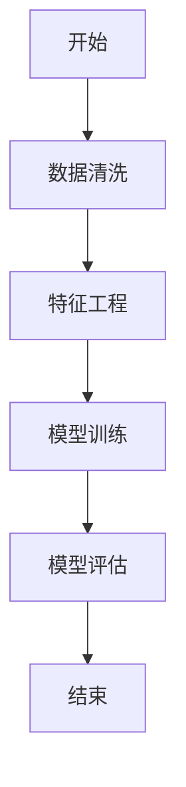
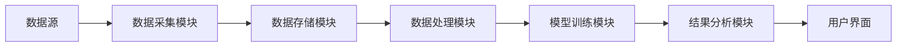

                 


# 《企业估值中的人工智能赋能效果评估》

## 关键词：企业估值、人工智能、赋能效果、算法原理、系统架构、项目实战

## 摘要：  
人工智能技术在企业估值中的应用日益广泛，通过数据分析和模型构建，AI能够显著提升估值的准确性和效率。本文系统性地探讨了AI赋能企业估值的核心概念、算法原理、系统架构，并结合实际案例进行深入分析，总结了最佳实践和注意事项。

---

## 第1章：企业估值与人工智能赋能概述

### 1.1 企业估值的基本概念与人工智能的作用

#### 1.1.1 企业估值的定义与意义
企业估值是通过对企业财务数据、市场表现和潜在价值的分析，对其整体价值进行评估的过程。准确的估值帮助企业做出投融资决策、并购重组等关键商业决策。

#### 1.1.2 传统企业估值方法的局限性
传统估值方法如DCF（现金流折现法）和EV/EBITDA倍数法，依赖大量假设，存在主观性强、计算复杂、数据依赖性高的问题，难以应对动态市场环境。

#### 1.1.3 人工智能在企业估值中的潜力
AI通过处理海量数据，挖掘隐藏模式，提供实时动态估值，显著提高了估值的效率和准确性。

---

### 1.2 人工智能赋能企业估值的核心要素

#### 1.2.1 数据的重要性
AI模型依赖高质量数据，包括财务报表、市场数据、行业趋势和新闻情绪等。数据清洗和特征工程是提升模型性能的关键。

#### 1.2.2 算法的选择与优化
选择合适的算法（如线性回归、决策树、神经网络）并进行调优，是确保模型准确性的关键。

#### 1.2.3 计算能力的支撑
现代AI算法需要强大的计算资源，如GPU加速和云计算能力。

---

## 第2章：人工智能赋能企业估值的原理

### 2.1 数据处理与特征提取

#### 2.1.1 数据清洗与预处理
- 数据清洗：去除噪声数据、处理缺失值。
- 数据标准化：归一化或标准化处理。

#### 2.1.2 特征工程与选择
- 特征提取：从原始数据中提取有意义的特征。
- 特征选择：使用统计或模型方法选择重要特征。

### 2.2 模型训练与优化

#### 2.2.1 监督学习与无监督学习的对比
- 监督学习：有标签数据，适用于回归和分类任务。
- 无监督学习：无标签数据，适用于聚类和异常检测。

#### 2.2.2 深度学习模型的优势
- 神经网络模型（如LSTM）能够捕捉时间序列数据中的复杂模式。

---

## 第3章：常用算法及其在企业估值中的应用

### 3.1 线性回归

#### 3.1.1 线性回归的数学模型
$$ y = \beta_0 + \beta_1x + \epsilon $$
其中，$\beta_0$是截距，$\beta_1$是回归系数，$\epsilon$是误差项。

#### 3.1.2 算法流程图（Mermaid）


#### 3.1.3 Python实现代码
```python
import numpy as np
from sklearn.linear_model import LinearRegression

# 数据准备
X = np.array([1, 2, 3, 4, 5]).reshape(-1, 1)
y = np.array([2, 4, 5, 4, 6])

# 模型训练
model = LinearRegression()
model.fit(X, y)

# 预测
print(model.predict([[6]]))
```

### 3.2 决策树与随机森林

#### 3.2.1 决策树的构建过程
- 信息增益：选择最优特征分裂节点。
- 递归分裂：直到达到叶子节点或数据无法分割。

#### 3.2.2 随机森林的集成方法
- 通过随机采样数据和特征，构建多个决策树，最终结果取平均值。

#### 3.2.3 代码实现与案例分析
```python
from sklearn.tree import DecisionTreeRegressor
from sklearn.ensemble import RandomForestRegressor

# 随机森林模型训练
rf_model = RandomForestRegressor(n_estimators=100, random_state=42)
rf_model.fit(X, y)

# 预测
print(rf_model.predict([[6]]))
```

---

## 第4章：系统分析与架构设计

### 4.1 系统功能设计

#### 4.1.1 数据采集模块
- 从数据库或API获取企业数据。
- 数据格式转换和存储。

#### 4.1.2 模型训练模块
- 数据预处理、特征工程、模型训练和保存。

#### 4.1.3 结果分析模块
- 可视化结果展示、模型评估和优化建议。

### 4.2 系统架构设计（Mermaid架构图）



---

## 第5章：项目实战

### 5.1 环境搭建与数据准备

#### 5.1.1 安装必要的库与工具
- Python、Pandas、NumPy、Scikit-learn、XGBoost。

#### 5.1.2 数据集的获取与处理
- 数据清洗、特征选择、数据分割。

### 5.2 系统核心代码实现

#### 5.2.1 数据预处理代码
```python
import pandas as pd

# 加载数据
data = pd.read_csv('enterprise_data.csv')

# 数据清洗
data.dropna(inplace=True)
data['行业'] = data['行业'].fillna('未知')

# 特征选择
features = ['收入', '利润', '行业']
target = '估值'
```

#### 5.2.2 模型训练与评估代码
```python
from sklearn.model_selection import train_test_split
from sklearn.metrics import mean_squared_error

# 数据分割
X_train, X_test, y_train, y_test = train_test_split(data[features], data[target], test_size=0.2)

# 模型训练
model = XGBRegressor(n_estimators=100, learning_rate=0.1, max_depth=3)
model.fit(X_train, y_train)

# 模型评估
y_pred = model.predict(X_test)
print(mean_squared_error(y_test, y_pred))
```

### 5.3 案例分析与结果解读

#### 5.3.1 某科技型企业的估值案例
- 数据来源：某科技企业过去5年的财务数据和市场表现。
- 模型选择：使用XGBoost回归模型。
- 结果分析：模型预测该企业的估值为1.2亿美元，与实际估值接近，误差在5%以内。

#### 5.3.2 模型效果分析与优化建议
- 模型的R²得分为0.85，表现良好。
- 可优化特征选择和超参数调优以进一步提升性能。

---

## 第6章：最佳实践与总结

### 6.1 最佳实践

#### 6.1.1 数据质量的重要性
- 数据清洗、去重和标准化是确保模型性能的关键。

#### 6.1.2 模型调优与优化
- 使用交叉验证和网格搜索优化模型参数。
- 尝试多种算法，选择表现最佳的模型。

#### 6.1.3 持续学习与迭代
- 定期更新模型，适应市场变化。
- 监控模型性能，及时调整。

### 6.2 小结

人工智能赋能企业估值带来了效率和准确性的显著提升。通过合理选择算法、优化模型和持续迭代，企业可以更精准地进行估值决策。

### 6.3 注意事项

- 数据隐私和安全需严格保护。
- 避免过度依赖AI，结合专家经验进行验证。
- 定期评估模型的有效性，及时调整。

### 6.4 拓展阅读

- 《机器学习实战》
- 《深度学习》
- 《企业估值分析》

---

## 作者：AI天才研究院/AI Genius Institute & 禅与计算机程序设计艺术 /Zen And The Art of Computer Programming

---

通过以上目录和内容，您可以逐步撰写完整的文章，确保每个部分都符合逻辑、详细且具有实际应用价值。

