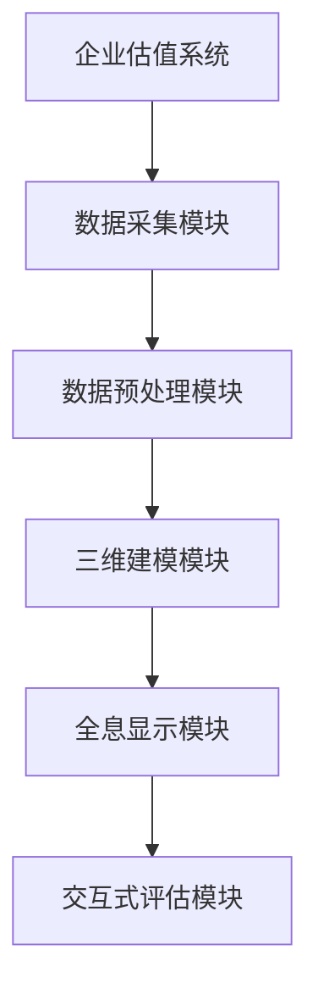
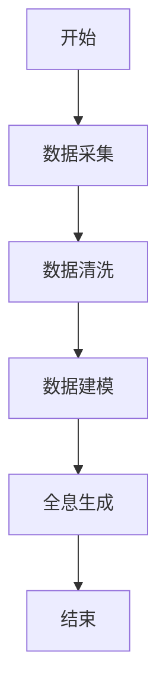

                 


# 企业估值中的全息显示技术应用评估

---

## 关键词

全息显示技术, 企业估值, 数据可视化, 三维重建, 深度学习, 技术应用, 估值模型

---

## 摘要

随着科技的飞速发展，全息显示技术逐渐从科幻小说走向现实，并在企业估值领域展现出巨大的潜力。本文深入探讨了全息显示技术在企业估值中的应用，分析了其核心概念、算法原理、系统架构，并通过实际案例展示了其在提升估值效率和准确性的优势。文章还讨论了全息显示技术在企业估值中的优势与挑战，并展望了其未来的发展方向。

---

# 第一部分：企业估值中的全息显示技术应用背景

## 第1章：全息显示技术的起源与发展

### 1.1 全息显示技术的定义与特点

全息显示技术是一种利用光干涉原理，将物体的三维信息记录并投影出来，以形成立体视觉效果的技术。其核心特点包括：

- **空间感**：能够呈现物体的深度信息，使观察者产生身临其境的感觉。
- **交互性**：用户可以通过手势或视线与全息影像进行互动。
- **实时性**：能够快速响应用户操作，实现动态显示。

### 1.2 企业估值中的全息显示技术应用背景

企业估值是通过对企业的财务、市场、管理等多方面因素进行综合评估，以确定其市场价值的过程。传统的估值方法依赖于大量的数据和复杂的计算，而全息显示技术的引入，为数据的可视化和交互提供了新的可能性。

#### 1.2.1 企业估值的传统方法与挑战

- **传统方法**：包括DCF模型、相对估值法等，主要依赖财务数据和市场分析。
- **挑战**：数据量大、维度多，难以直观展示，且缺乏互动性。

#### 1.2.2 全息显示技术在企业估值中的应用潜力

- **提升数据直观性**：通过全息显示，复杂的财务数据和市场信息可以更直观地呈现。
- **增强用户交互性**：用户可以通过互动操作，深入探索数据背后的细节。
- **提高评估效率**：通过实时的三维数据重建和分析，缩短估值时间。

---

## 第2章：全息显示技术在企业估值中的应用现状

### 2.1 全息显示技术在企业估值中的应用领域

#### 2.1.1 企业资产评估中的应用

- **资产三维重建**：通过全息技术，可以实现对企业资产的三维重建，便于评估其价值。
- **资产分布可视化**：通过全息地图，可以直观展示企业资产的分布情况。

#### 2.1.2 企业财务数据分析中的应用

- **财务数据可视化**：将复杂的财务报表转化为全息图表，便于分析。
- **多维度数据对比**：通过全息技术，可以实现财务数据的多维度对比，帮助发现潜在问题。

#### 2.1.3 企业市场价值评估中的应用

- **市场数据实时显示**：通过全息技术，可以实时显示市场波动对企业价值的影响。
- **情景模拟分析**：通过全息技术，可以进行情景模拟分析，帮助企业做出更明智的决策。

### 2.2 全息显示技术在企业估值中的优势

#### 2.2.1 提高数据可视化效果

- **直观呈现**：全息显示技术能够将复杂的财务和市场数据以三维形式呈现，使数据更具可读性。
- **空间感知**：通过三维空间的展示，用户可以更好地理解数据之间的关系。

#### 2.2.2 增强数据交互性

- **互动操作**：用户可以通过手势或视线与全息影像进行互动，实现数据的动态查询和分析。
- **个性化视角**：用户可以根据需要调整视角，从不同角度观察数据。

#### 2.2.3 提升评估效率与准确性

- **自动化分析**：通过全息技术，可以实现数据的自动分析和建模，减少人为错误。
- **实时更新**：全息显示技术能够实时更新数据，确保评估结果的及时性和准确性。

---

## 第3章：全息显示技术在企业估值中的核心概念

### 3.1 全息显示技术的核心原理

#### 3.1.1 全息投影的基本原理

全息投影是通过记录物体反射的光线，利用干涉和衍射原理，将物体的三维信息记录在介质上。当光线照射到记录介质时，会重新构造出物体的立体图像。

#### 3.1.2 全息显示技术的数据处理流程

1. **数据采集**：通过传感器或数据库获取企业的财务、市场等数据。
2. **数据预处理**：对数据进行清洗、标准化等处理，确保数据质量。
3. **数据建模**：将数据转化为三维模型，以便全息投影的实现。
4. **全息生成**：通过算法生成全息影像，并进行实时渲染。

#### 3.1.3 全息显示技术的数学模型

全息显示技术的数学模型主要包括三维重建、数据处理和图像生成三个部分。其中，三维重建是通过一系列二维图像恢复物体的三维结构，常用的方法包括基于深度的重建和基于特征的重建。

### 3.2 全息显示技术在企业估值中的应用模型

#### 3.2.1 三维数据重建模型

三维数据重建模型通过将企业的财务和市场数据转化为三维模型，帮助用户更好地理解数据的分布和关系。

#### 3.2.2 数据可视化模型

数据可视化模型将复杂的企业数据以全息图像的形式呈现，使用户能够直观地观察和分析数据。

#### 3.2.3 交互式评估模型

交互式评估模型允许用户与全息影像进行互动，通过调整参数或视角，实现对企业的多维度评估。

---

## 第4章：全息显示技术在企业估值中的应用流程

### 4.1 数据收集与处理

#### 4.1.1 数据来源与采集方法

- **内部数据**：企业的财务报表、销售数据等。
- **外部数据**：市场数据、行业趋势等。
- **数据采集方法**：通过API接口、数据库查询等方式获取数据。

#### 4.1.2 数据清洗与预处理

- **数据清洗**：去除重复数据、填补缺失值等。
- **数据标准化**：将数据转换为统一的格式，便于后续处理。

#### 4.1.3 数据结构化与建模

- **数据结构化**：将非结构化数据转化为结构化数据，便于建模。
- **数据建模**：通过机器学习算法，建立企业估值的数学模型。

### 4.2 全息显示技术的实现步骤

#### 4.2.1 数据建模

- **三维建模**：将企业数据转化为三维模型，用于全息投影。
- **模型优化**：对模型进行优化，确保其在全息显示中的效果。

#### 4.2.2 全息投影生成

- **全息生成**：通过算法生成全息影像。
- **实时渲染**：对全息影像进行实时渲染，确保显示效果。

#### 4.2.3 交互式评估界面设计

- **界面设计**：设计用户友好的交互界面，方便用户操作。
- **互动功能**：实现用户与全息影像的互动，如缩放、旋转等。

---

## 第5章：全息显示技术在企业估值中的优势与挑战

### 5.1 全息显示技术的优势

#### 5.1.1 提高数据直观性

全息显示技术能够将复杂的财务和市场数据以三维形式呈现，使数据更具可读性。

#### 5.1.2 增强用户交互性

用户可以通过手势或视线与全息影像进行互动，实现数据的动态查询和分析。

#### 5.1.3 提升评估效率与准确性

通过全息技术，可以实现数据的自动分析和建模，减少人为错误，提高评估效率和准确性。

### 5.2 全息显示技术的挑战

#### 5.2.1 技术实现难度

全息显示技术的实现需要高精度的硬件和复杂的算法，技术门槛较高。

#### 5.2.2 数据处理复杂性

企业估值涉及大量的多维数据，数据处理的复杂性较高。

#### 5.2.3 成本与设备限制

全息显示设备的成本较高，且需要特定的硬件支持，可能限制其广泛应用。

---

## 第6章：全息显示技术在企业估值中的未来展望

### 6.1 技术发展趋势

#### 6.1.1 全息显示技术的创新

随着技术的进步，全息显示技术将更加成熟，应用场景也将更加广泛。

#### 6.1.2 技术与企业估值的深度融合

全息显示技术将与企业估值的各个环节深度融合，提升估值的效率和准确性。

---

## 附录：相关图表和代码

### 附录A：全息显示技术与传统显示技术对比表

| 特性                | 全息显示技术       | 传统显示技术       |
|---------------------|-------------------|-------------------|
| 显示效果            | 三维立体           | 二维平面           |
| 交互性              | 高                | 低                |
| 数据处理能力        | 强                | 弱                |
| 应用领域            | 企业估值、医疗等    | 广泛               |

### 附录B：企业估值系统架构图



### 附录C：全息显示技术算法流程图



### 附录D：三维重建算法实现代码

```python
import numpy as np
from sklearn.decomposition import PCA

# 数据采集
data = np.random.rand(100, 3)

# 数据预处理
data_normalized = (data - np.mean(data, axis=0)) / np.std(data, axis=0)

# 三维建模
pca = PCA(n_components=3)
principal_components = pca.fit_transform(data_normalized)

# 全息生成
def generate_hologram(data):
    # 简化的全息生成算法
    pass

generate_hologram(principal_components)
```

---

## 结语

全息显示技术在企业估值中的应用前景广阔，其强大的数据可视化和交互能力将为企业估值带来革命性的变化。尽管面临一定的技术挑战，但随着技术的不断进步，全息显示技术将在企业估值领域发挥越来越重要的作用。

---

## 作者

作者：AI天才研究院/AI Genius Institute & 禅与计算机程序设计艺术 /Zen And The Art of Computer Programming

