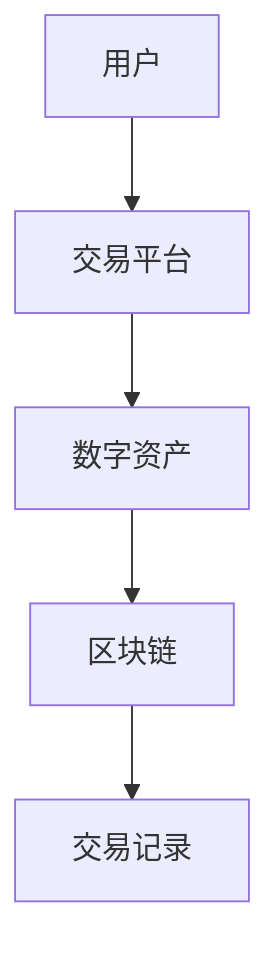
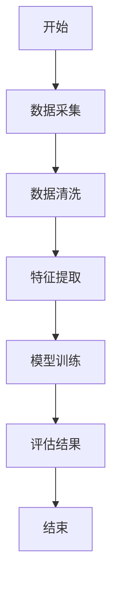
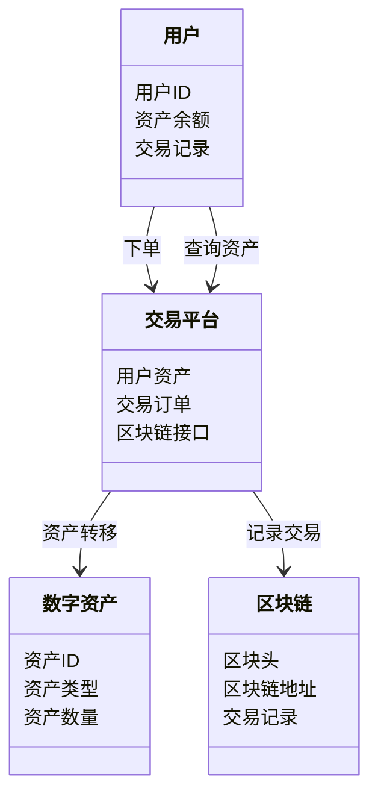
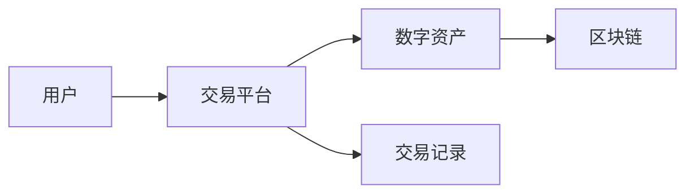

                 


# 企业估值中的区块链数字资产交易平台评估

## 关键词：区块链、数字资产、交易平台、企业估值、评估模型

## 摘要：  
在当前数字经济快速发展的背景下，区块链技术与数字资产的结合为企业估值带来了新的挑战和机遇。本文系统地探讨了如何在企业估值中对区块链数字资产交易平台进行评估。通过分析区块链数字资产交易平台的核心概念、系统架构及评估算法，本文提供了从理论到实践的全面指导，帮助读者理解如何将区块链技术应用于企业估值，提升资产评估的准确性和效率。

---

## 第1章 区块链与数字资产的背景介绍

### 1.1 区块链技术的基本概念  
区块链是一种分布式账本技术，通过去中心化的节点网络记录和验证交易信息。其核心特点包括去中心化、不可篡改、透明性和可追溯性。区块链技术广泛应用于金融、供应链管理、数字身份等领域。

#### 1.1.1 区块链的定义与特点  
- **定义**：区块链是通过加密算法和分布式共识机制构建的数据库，用于记录交易或事件的分布式账本。  
- **特点**：  
  - **去中心化**：无须依赖单一中心机构，数据由多个节点共同维护。  
  - **不可篡改**：通过加密算法确保数据的安全性和完整性。  
  - **透明性**：所有交易记录对参与方公开，且可追溯。  
  - **可扩展性**：支持多种应用场景，如支付、智能合约等。  

#### 1.1.2 区块链的核心技术原理  
区块链的核心技术包括：  
1. **分布式共识机制**：如比特币的POW（工作量证明）和以太坊的POS（权益证明）。  
2. **区块与链式结构**：交易数据以区块形式按时间顺序连接，形成链式结构。  
3. **智能合约**：基于区块链的自动化执行程序，用于实现复杂的业务逻辑。  

#### 1.1.3 区块链的分类与应用场景  
区块链主要分为公链、私链和联盟链。  
- **公链**：如比特币、以太坊，面向公众开放，去中心化程度高。  
- **私链**：适用于企业内部，权限可控，效率更高。  
- **联盟链**：由多个机构共同维护，适合行业级应用，如供应链金融。  

应用场景包括：数字支付、智能合约、资产确权、供应链管理等。

---

### 1.2 数字资产的概念与分类  
数字资产是指以数字形式存在的资产，具有可分割性、可编程性和全球流动性。  

#### 1.2.1 数字资产的定义  
数字资产是基于区块链技术的虚拟资产，包括加密货币（如比特币）、代币（如ERC-20代币）、NFT（非同质化代币）等。

#### 1.2.2 数字资产的分类  
数字资产主要分为以下几类：  
1. **加密货币**：如比特币（BTC）、以太坊（ETH），用于价值存储和交易媒介。  
2. **代币**：基于智能合约发行的数字资产，用于特定场景下的价值转移。  
3. **NFT**：非同质化代币，用于表示唯一的数字资产，如数字艺术品、虚拟土地等。  

#### 1.2.3 数字资产的特性与优势  
- **特性**：去中心化、可编程、透明性、不可篡改。  
- **优势**：提升交易效率、降低信任成本、增强资产流动性。  

---

### 1.3 区块链数字资产交易平台的背景  
随着数字资产的兴起，区块链数字资产交易平台应运而生，成为连接数字资产与用户的桥梁。  

#### 1.3.1 区块链技术在金融领域的应用  
区块链技术在金融领域的应用包括：跨境支付、智能合约、供应链金融等。  

#### 1.3.2 数字资产交易的兴起  
数字资产交易的兴起源于其去中心化特性，降低了传统金融体系的交易成本和信任障碍。  

#### 1.3.3 区块链数字资产交易平台的现状与发展趋势  
目前，区块链数字资产交易平台已广泛应用于加密货币交易、代币发行、NFT交易等领域。未来，随着技术的进步和应用场景的扩展，交易平台将更加智能化和多元化。

---

### 1.4 企业估值中的区块链数字资产交易平台评估  
企业估值是企业价值的评估过程，区块链数字资产交易平台的评估是其中的重要环节。

#### 1.4.1 企业估值的基本概念  
企业估值是指通过对企业的财务状况、市场表现、管理能力等多方面因素的分析，确定企业的市场价值。  

#### 1.4.2 区块链数字资产交易平台对企业估值的影响  
区块链数字资产交易平台的引入，提升了交易的透明性和效率，为企业估值提供了新的数据来源和方法。  

#### 1.4.3 评估区块链数字资产交易平台的必要性与挑战  
- **必要性**：区块链数字资产交易平台的评估有助于企业发现潜在价值和风险。  
- **挑战**：评估模型复杂、数据获取难度大、技术门槛高等。  

---

## 第2章 区块链数字资产交易平台的核心概念与联系  

### 2.1 区块链数字资产交易平台的实体关系图  
区块链数字资产交易平台涉及多个实体，包括用户、交易平台、数字资产和区块链。



### 2.2 区块链数字资产交易平台的属性对比  
| 属性 | 区块链 | 数字资产 | 交易平台 |
|------|--------|----------|----------|
| 核心技术 | 分布式账本 | 加密货币 | 匹配引擎 |
| 参与方 | 节点 | 持有者 | 用户 |
| 交易流程 | 区块确认 | 资产转移 | 交易撮合 |

### 2.3 区块链数字资产交易平台的系统架构  


---

## 第3章 区块链数字资产交易平台的评估算法原理  

### 3.1 评估算法的流程图  



### 3.2 评估模型的数学公式  

#### 3.2.1 交易量预测公式  
$$交易量 = \alpha \times 市场需求 + \beta \times 历史交易数据 + \gamma \times 平台流动性$$  

#### 3.2.2 平台价值评估公式  
$$平台价值 = \delta \times 用户数量 + \epsilon \times 交易活跃度 + \zeta \times 平台技术能力$$  

---

## 第4章 区块链数字资产交易平台的系统架构设计  

### 4.1 系统功能设计  

#### 4.1.1 领域模型  



#### 4.1.2 系统架构  



---

## 第5章 项目实战  

### 5.1 环境搭建  
需要安装Python、区块链开发框架（如Web3.py）、数据处理库（如Pandas）等。

### 5.2 核心实现  

#### 5.2.1 数据采集  
```python
import requests

url = "https://api交易平台.com/trades"
response = requests.get(url)
trades = response.json()
```

#### 5.2.2 数据分析  
```python
import pandas as pd

df = pd.DataFrame(trades)
print(df.head())
```

#### 5.2.3 模型训练  
```python
from sklearn import linear_model

model = linear_model.LinearRegression()
model.fit(X, y)
```

### 5.3 实际案例分析  
以某区块链数字资产交易平台为例，分析其用户增长、交易量变化等指标，评估其平台价值。

---

## 第6章 最佳实践与小结  

### 6.1 最佳实践  
- 数据采集要全面，确保模型的准确性。  
- 模型选择要结合实际场景，避免过度复杂。  
- 定期更新模型参数，适应市场变化。  

### 6.2 小结  
区块链数字资产交易平台的评估是企业估值的重要组成部分。通过本文的系统分析与实践，读者可以掌握从理论到实践的完整流程。

---

## 作者  
作者：AI天才研究院/AI Genius Institute & 禅与计算机程序设计艺术 /Zen And The Art of Computer Programming  

---

以上是文章的完整目录大纲和部分内容展示，如果您需要完整的文章内容，请告诉我！

