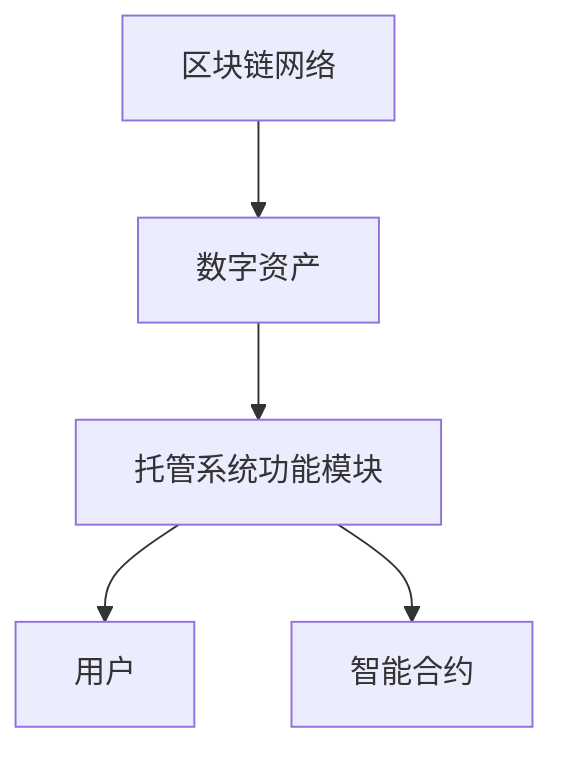
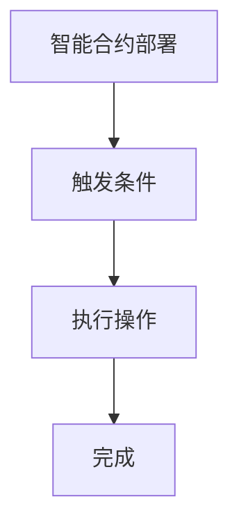
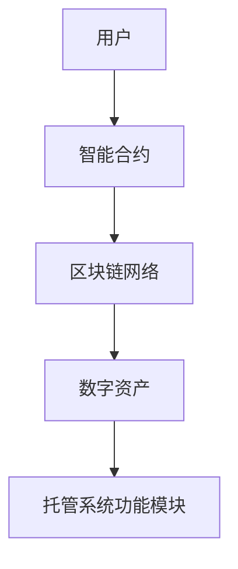
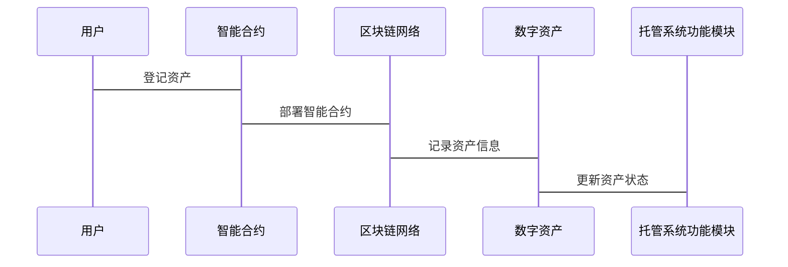

                 


# 企业估值中的区块链数字资产托管系统评估

---

## 关键词：
区块链，数字资产，企业估值，托管系统，智能合约

---

## 摘要：
区块链技术的兴起为企业估值中的数字资产托管提供了新的解决方案。本文深入探讨了区块链数字资产托管系统的核心概念、算法原理、系统架构以及实际应用案例。通过分析共识机制、智能合约等关键技术，结合系统设计与项目实战，为读者提供了全面的企业估值中的区块链数字资产托管系统评估。

---

# 第一部分: 企业估值中的区块链数字资产托管系统概述

## 第1章: 区块链数字资产托管系统背景与概念

### 1.1 企业估值中的数字资产托管需求
在当前数字经济时代，数字资产的价值日益凸显，企业对数字资产的估值需求也不断增加。传统的资产托管系统难以满足数字资产的安全性、透明性和可追溯性要求，而区块链技术的去中心化和不可篡改性为解决这一问题提供了新的思路。

#### 1.1.1 数字资产在企业估值中的重要性
数字资产包括加密货币、代币、NFT等，其价值不仅体现在货币属性上，还具有投资、收藏和商业应用等多种维度。企业通过持有和管理数字资产，可以提升自身的资产配置效率和抗风险能力。

#### 1.1.2 区块链技术如何满足数字资产托管需求
区块链技术通过去中心化、分布式账本和智能合约等特性，确保了数字资产的安全性和交易的透明性。企业可以利用区块链技术实现数字资产的托管、交易和结算，从而提高估值的准确性和可信度。

#### 1.1.3 企业估值中的数字资产托管现状与挑战
目前，许多企业已经开始尝试将区块链技术应用于数字资产托管，但在实际操作中仍面临技术复杂性、合规性、安全性等多方面的挑战。

### 1.2 区块链数字资产托管系统的定义与特点
区块链数字资产托管系统是一种基于区块链技术的数字资产托管解决方案，其核心功能包括资产登记、存储、交易和结算等。与传统托管系统相比，区块链托管系统具有去中心化、透明性、不可篡改性和高效性等特点。

### 1.3 区块链技术在数字资产托管中的作用
区块链技术通过去中心化和不可篡改的特性，确保了数字资产的安全性和交易的透明性。此外，区块链的智能合约功能可以自动执行托管协议，降低人工干预和信任成本。

### 1.4 本章小结
本章介绍了区块链数字资产托管系统的重要性和基本概念，分析了其在企业估值中的作用和挑战。

---

# 第二部分: 区块链数字资产托管系统的核心概念与原理

## 第2章: 区块链数字资产托管系统的核心概念

### 2.1 区块链数字资产托管系统的组成要素
区块链数字资产托管系统主要包括以下几个关键组成部分：

- **区块链网络**：分布式账本和共识机制，确保数据的安全性和一致性。
- **数字资产**：包括加密货币、代币等，是托管的核心对象。
- **托管系统功能模块**：包括资产登记、存储、交易和结算等功能。

### 2.2 区块链数字资产托管系统的实体关系图
以下是一个简单的实体关系图，展示了区块链数字资产托管系统中的主要实体及其关系：



### 2.3 区块链数字资产托管系统的属性特征对比
以下表格对比了传统托管系统和区块链托管系统在安全性、透明性等方面的差异：

| 特性         | 托管系统属性       | 区块链托管系统属性     |
|--------------|--------------------|-----------------------|
| 去中心化     | 低                | 高                    |
| 安全性       | 中                | 高                    |
| 可追溯性     | 低                | 高                    |
| 透明性       | 低                | 高                    |

### 2.4 区块链数字资产托管系统的价值主张
区块链数字资产托管系统通过去中心化和不可篡改的特性，解决了传统托管系统中存在的信任问题和效率瓶颈，为企业提供了更加安全、透明和高效的数字资产托管服务。

---

# 第三部分: 区块链数字资产托管系统的算法原理

## 第3章: 区块链数字资产托管系统的算法原理

### 3.1 区块链共识机制
共识机制是区块链技术的核心之一，它确保了分布式账本的准确性和一致性。

#### 3.1.1 共识机制的定义
共识机制是一种通过分布式网络中多个节点达成一致的算法。

#### 3.1.2 常见共识机制
- **PoW（工作量证明）**：通过计算哈希值来验证交易，比特币采用的机制。
- **PoS（权益证明）**：通过持有代币的数量来决定记账权，以太坊2.0采用的机制。
- **DPoS（ delegated proof of stake）**：通过选举代表来进行记账，常见于一些项目。

#### 3.1.3 共识机制对数字资产托管的影响
共识机制的效率和安全性直接影响到数字资产托管的可靠性和成本。高效的共识机制可以提高交易速度，而安全的共识机制可以降低被攻击的风险。

### 3.2 智能合约原理
智能合约是区块链技术的重要组成部分，它通过自动执行合同条款，减少了人工干预和信任成本。

#### 3.2.1 智能合约的定义
智能合约是运行在区块链上的自动执行程序，可以根据预设条件自动触发相应的操作。

#### 3.2.2 智能合约的工作流程
1. **部署**：智能合约被部署到区块链网络上。
2. **触发**：当满足特定条件时，智能合约自动执行。
3. **执行**：智能合约根据预设逻辑执行相应的操作。

#### 3.2.3 智能合约的执行逻辑
以下是一个简单的智能合约执行逻辑示例：



### 3.3 区块链哈希函数
哈希函数是区块链技术中用于数据验证的重要工具。

#### 3.3.1 哈希函数的定义
哈希函数是一种将任意长度的输入映射为固定长度输出的函数。

#### 3.3.2 常见哈希函数
- **SHA-256**：广泛应用于比特币等区块链项目。
- **RIPEMD-160**：用于门罗币等加密货币。

#### 3.3.3 哈希函数在数字资产托管中的应用
哈希函数用于验证数据的完整性和真实性，确保数字资产在托管过程中的安全性。

### 3.4 区块链数字签名算法
数字签名算法用于验证交易的合法性和真实性。

#### 3.4.1 数字签名的定义
数字签名是通过公钥加密技术生成的电子签名。

#### 3.4.2 数字签名的工作流程
1. **生成密钥对**：包括公钥和私钥。
2. **签名交易**：用私钥对交易数据进行签名。
3. **验证签名**：用公钥验证签名的合法性。

#### 3.4.3 数字签名在数字资产托管中的应用
数字签名用于验证交易的合法性和真实性，确保数字资产在托管过程中的安全性。

### 3.5 本章小结
本章详细介绍了区块链数字资产托管系统中常用的共识机制、智能合约、哈希函数和数字签名算法，分析了它们在数字资产托管中的作用和实现原理。

---

# 第四部分: 区块链数字资产托管系统的系统设计与实现

## 第4章: 区块链数字资产托管系统的系统设计

### 4.1 系统功能设计
区块链数字资产托管系统的功能模块包括资产登记、存储、交易和结算等。

#### 4.1.1 资产登记
资产登记模块负责将数字资产的信息记录到区块链上，确保资产的唯一性和合法性。

#### 4.1.2 资产存储
资产存储模块负责将数字资产安全地存储在区块链上，确保资产的安全性和可追溯性。

#### 4.1.3 资产交易
资产交易模块负责处理数字资产的交易，确保交易的透明性和不可篡改性。

#### 4.1.4 资产结算
资产结算模块负责处理交易的结算，确保资金的及时到账和分配。

### 4.2 系统架构设计
以下是区块链数字资产托管系统的架构设计图：



### 4.3 系统接口设计
系统接口设计包括用户接口、智能合约接口和区块链网络接口。

#### 4.3.1 用户接口
用户通过用户接口进行资产登记、交易等操作。

#### 4.3.2 智能合约接口
智能合约通过接口与区块链网络进行交互。

#### 4.3.3 区块链网络接口
区块链网络通过接口与数字资产和托管系统功能模块进行交互。

### 4.4 系统交互设计
以下是系统交互设计的序列图：



### 4.5 本章小结
本章详细介绍了区块链数字资产托管系统的功能设计、架构设计和交互设计，为实际应用提供了理论基础。

---

# 第五部分: 区块链数字资产托管系统的项目实战

## 第5章: 区块链数字资产托管系统的项目实战

### 5.1 项目环境搭建
项目环境搭建包括安装区块链框架、开发工具和测试环境。

#### 5.1.1 安装区块链框架
以太坊是一个常用的区块链开发框架，可以通过以下命令安装：

```bash
npm install -g ethereumjs-testrpc
```

#### 5.1.2 安装开发工具
安装Solidity编译器和以太坊钱包等开发工具。

#### 5.1.3 创建测试环境
搭建一个本地测试区块链网络，用于开发和测试。

### 5.2 系统核心实现
以下是区块链数字资产托管系统的智能合约实现代码：

```solidity
// SPDX-License-Identifier: MIT
pragma solidity ^0.8.0;

contract AssetManagement {
    mapping(address => uint256) public balances;

    function deposit(uint256 amount) public {
        balances[msg.sender] += amount;
    }

    function withdraw(uint256 amount) public {
        require(balances[msg.sender] >= amount, "Insufficient balance");
        balances[msg.sender] -= amount;
    }
}
```

### 5.3 代码应用解读与分析
上述代码实现了一个简单的资产托管功能，包括存款和取款操作。通过智能合约自动执行交易，确保资产的安全性和透明性。

### 5.4 实际案例分析
以下是一个实际案例分析：

假设某企业希望通过区块链技术托管其数字资产，可以选择以太坊作为开发平台，部署上述智能合约，并通过以太坊钱包进行资产管理和交易。

### 5.5 项目小结
本章通过实际项目案例，展示了区块链数字资产托管系统的实现过程，包括环境搭建、智能合约开发和系统测试等。

---

# 第六部分: 总结与展望

## 第6章: 总结与展望

### 6.1 总结
本文详细介绍了区块链数字资产托管系统的核心概念、算法原理、系统设计和项目实战，分析了其在企业估值中的重要作用和应用价值。

### 6.2 展望
未来，随着区块链技术的不断发展，数字资产托管系统将在企业估值中发挥更大的作用。通过技术创新和应用推广，区块链数字资产托管系统将为企业提供更加安全、高效和智能的资产托管服务。

---

# 作者信息

作者：AI天才研究院/AI Genius Institute & 禅与计算机程序设计艺术/Zen And The Art of Computer Programming

---

以上是《企业估值中的区块链数字资产托管系统评估》的技术博客文章的完整目录和内容框架。

