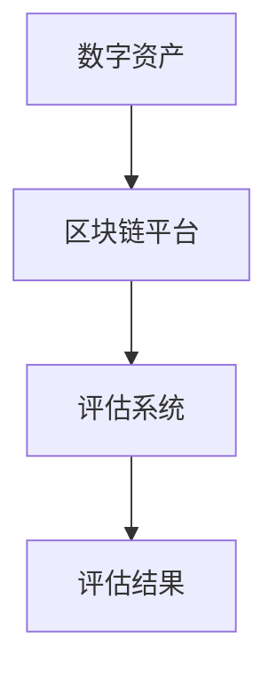
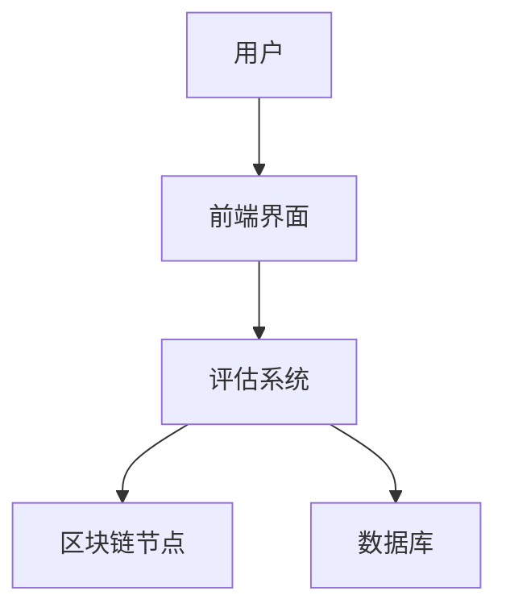

                 


# 《企业估值中的区块链数字资产抵押贷款平台评估》

**关键词**：企业估值、区块链、数字资产、抵押贷款、平台评估、技术实现、金融创新

**摘要**：  
在数字化转型的浪潮中，区块链技术正在改变金融行业的运作方式。数字资产作为一类新型的金融资产，其价值评估和抵押贷款应用场景逐渐成为企业估值的重要组成部分。本文将深入探讨区块链数字资产抵押贷款平台的评估方法，分析其技术实现、系统架构、数学模型以及实际案例，为企业在数字化转型中提供参考。文章从区块链技术与数字资产的基本概念入手，逐步展开对数字资产评估的核心概念、算法原理、系统设计以及实战案例的详细分析，最终为读者提供一套完整的评估框架。

---

## 第一部分: 区块链与数字资产基础

### 第1章: 区块链技术与数字资产概述

#### 1.1 区块链技术的基本概念
区块链是一种去中心化的分布式账本技术，通过密码学和共识机制确保数据的安全性和不可篡改性。其核心特点包括：
- **去中心化**：数据由网络中的多个节点共同存储，无单一点控制权。
- **不可篡改性**：每一条记录都通过哈希算法加密，并与前一条记录链接，形成链式结构。
- **透明性**：所有交易记录对所有参与者公开或部分公开，具体取决于区块链的隐私机制。

数字资产是指基于区块链技术发行的数字货币或代币，包括比特币（BTC）、以太坊（ETH）等加密货币，以及代表特定资产的代币（如供应链金融中的货物代币）。

#### 1.2 区块链在金融领域的应用
区块链技术在金融领域的应用主要体现在以下几个方面：
1. **支付与结算**：通过区块链技术实现快速、低成本的跨境支付。
2. **借贷与融资**：区块链可以简化借贷流程，降低信任成本。
3. **数字资产交易**：区块链为数字资产的发行、交易和转移提供了安全的基础设施。

#### 1.3 数字资产抵押贷款平台的背景
数字资产抵押贷款平台是将数字资产作为抵押品，用于企业或个人贷款的金融创新工具。其优势在于：
- **高效性**：通过智能合约自动执行抵押品的质押和解押。
- **透明性**：所有交易记录在区块链上，可实时追踪。
- **去信任化**：通过区块链技术降低对中间机构的信任依赖。

---

## 第二部分: 数字资产评估的核心概念与联系

### 第2章: 数字资产评估的核心概念

#### 2.1 数字资产评估的原理
数字资产评估的核心在于对数字资产的流动性、波动性、安全性进行综合分析。其价值评估主要考虑以下几个因素：
- **市场流动性**：数字资产的交易活跃程度直接影响其价值。
- **技术特性**：区块链的技术成熟度和去中心化程度。
- **法律与合规性**：数字资产的法律地位和监管环境。

#### 2.2 数字资产与传统资产的对比分析
| 特性               | 数字资产                 | 传统资产               |
|--------------------|--------------------------|------------------------|
| 所有权             | 基于区块链，去中心化     | 基于法律文件，中心化   |
| 流动性             | 高，可实时交易           | 较低，需通过交易所或市场 |
| 透明性             | 高，区块链记录可查       | 低，需依赖中介机构       |
| 风险性             | 高，市场波动大           | 较低，受经济周期影响     |

#### 2.3 实体关系图与数字资产评估架构


---

## 第三部分: 数字资产评估的算法原理与数学模型

### 第3章: 数字资产评估的算法原理

#### 3.1 评估算法概述
数字资产评估的算法主要基于以下两种方法：
1. **市场法**：通过市场供需关系和交易数据计算数字资产的公允价值。
2. **技术法**：基于区块链的技术特性（如网络节点数、交易频率等）评估数字资产的价值。

#### 3.2 数学模型与公式
数字资产的价值评估模型可以表示为：
$$ V = \sum_{i=1}^{n} w_i \cdot x_i $$
其中：
- $V$ 是数字资产的评估价值
- $w_i$ 是各个评估因素的权重
- $x_i$ 是各个评估因素的具体数值（如市场流动性、技术特性等）

---

## 第四部分: 数字资产评估的系统分析与架构设计

### 第4章: 数字资产评估系统的架构设计

#### 4.1 系统功能设计
数字资产评估系统需要实现以下功能：
1. **资产录入**：支持多种数字资产的录入与管理。
2. **资产评估**：基于算法模型计算数字资产的实时价值。
3. **风险预警**：根据市场波动和资产特性提供风险预警。

#### 4.2 系统架构设计


---

## 第五部分: 数字资产评估的项目实战

### 第5章: 数字资产评估的实战案例

#### 5.1 案例分析
以比特币为例，假设当前比特币价格为 $40,000，波动率为 2%，则其评估价值可以表示为：
$$ V = 40,000 \times (1 - 0.02) = 39,200 $$

#### 5.2 代码实现
以下是数字资产评估系统的核心代码：
```python
def assess_asset(asset_price, volatility):
    assessed_value = asset_price * (1 - volatility)
    return assessed_value

# 示例
bitcoin_price = 40000
volatility = 0.02
result = assess_asset(bitcoin_price, volatility)
print(f"比特币的评估价值为：{result}")
```

---

## 第六部分: 总结与展望

### 6.1 本章小结
本文系统地介绍了区块链数字资产抵押贷款平台的评估方法，从技术原理到实际应用，为企业估值提供了新的思路。

### 6.2 注意事项
- 数字资产评估需结合市场环境和监管政策。
- 区块链技术的安全性和稳定性是平台的核心。

### 6.3 拓展阅读
- 推荐阅读《区块链技术及应用》和《数字金融的创新与监管》。

---

**作者：AI天才研究院/AI Genius Institute & 禅与计算机程序设计艺术 /Zen And The Art of Computer Programming**

---

通过以上分析，我们详细探讨了区块链数字资产抵押贷款平台的评估方法，从技术实现到实际应用，为企业估值提供了新的视角和解决方案。

