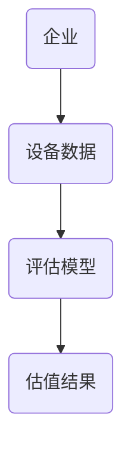
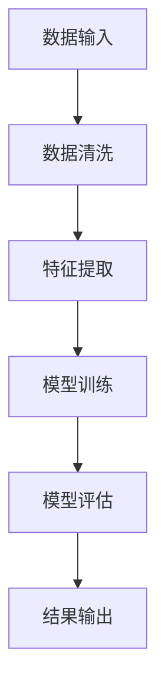
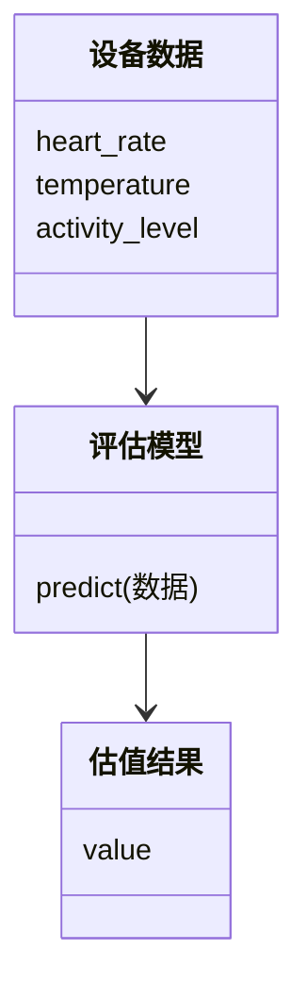
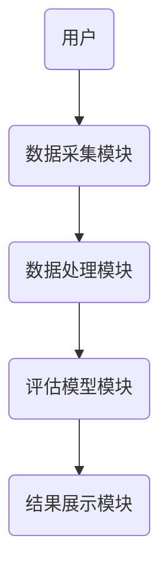
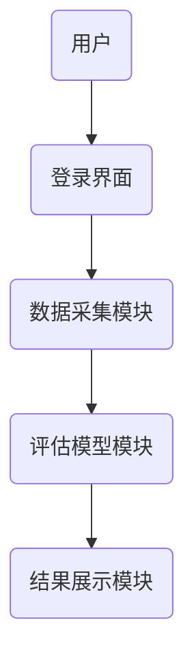

                 


# 企业估值中的可穿戴医疗设备评估

> 关键词：企业估值，可穿戴医疗设备，评估模型，算法原理，系统架构

> 摘要：本文深入探讨了在企业估值过程中，如何对可穿戴医疗设备进行有效评估。文章首先介绍了可穿戴医疗设备的基本概念和技术发展背景，然后详细分析了评估的核心指标和方法。接着，从算法原理、系统架构、项目实战等多个维度，全面解析了可穿戴医疗设备评估的实现过程。最后，结合实际案例，总结了评估中的最佳实践和未来研究方向。

---

# 第一部分: 背景介绍

## 第1章: 可穿戴医疗设备与企业估值概述

### 1.1 可穿戴医疗设备的定义与技术发展
可穿戴医疗设备是指能够 worn on the body，用于监测、诊断或治疗医疗状况的设备。这类设备通过传感器、通信技术和数据分析，帮助用户实时监测健康状况。

- **定义**：可穿戴医疗设备是指佩戴在身体上的医疗设备，用于监测、诊断或治疗医疗状况。
- **技术发展**：近年来，随着物联网和人工智能技术的发展，可穿戴医疗设备的精度和功能不断提升。

### 1.2 企业估值中的可穿戴医疗设备评估背景
在企业估值过程中，可穿戴医疗设备的价值评估显得尤为重要。企业需要了解这些设备的市场潜力、技术优势和财务回报。

- **企业估值**：企业估值是通过分析企业的财务状况、市场地位和未来发展潜力，确定其价值的过程。
- **可穿戴医疗设备的市场现状**：当前，可穿戴医疗设备市场增长迅速，应用范围广泛。

### 1.3 问题描述与解决
在企业估值中，如何准确评估可穿戴医疗设备的价值是一个关键问题。传统的方法难以捕捉设备的实时数据和动态变化。

- **问题背景**：传统估值方法难以捕捉可穿戴设备的动态数据。
- **问题解决**：通过引入数据分析和机器学习技术，提升估值的准确性。

### 1.4 边界与外延
可穿戴医疗设备的评估需要考虑多个因素，包括技术性能、用户需求、市场环境等。

- **边界**：仅限于医疗设备的评估，不包括其他类型设备。
- **外延**：未来可能扩展到其他医疗领域。

### 1.5 核心要素组成
评估模型的核心要素包括设备性能、用户数据、市场反馈等。

- **设备性能**：设备的准确性和稳定性。
- **用户数据**：用户的健康数据和使用反馈。
- **市场反馈**：市场对设备的接受度和需求量。

---

# 第二部分: 核心概念与联系

## 第2章: 核心概念与联系

### 2.1 核心概念原理
可穿戴医疗设备评估的核心原理是基于数据采集、分析和建模。

- **数据采集**：通过传感器获取用户健康数据。
- **数据分析**：对数据进行清洗和特征提取。
- **模型建模**：利用机器学习算法构建评估模型。

### 2.2 核心概念属性特征对比表
以下是可穿戴医疗设备与传统医疗设备的对比：

| 属性       | 可穿戴医疗设备 | 传统医疗设备 |
|------------|----------------|--------------|
| 使用场景   | 日常监测       | 医院使用     |
| 便携性     | 高             | 低           |
| 实时性     | 高             | 低           |

### 2.3 ER实体关系图
以下是可穿戴医疗设备评估的ER实体关系图：



---

# 第三部分: 算法原理

## 第3章: 算法原理与实现

### 3.1 数据预处理
数据预处理是评估过程中的关键步骤，包括数据清洗和特征提取。

- **数据清洗**：去除异常值和缺失值。
- **特征提取**：从原始数据中提取有用特征。

### 3.2 模型训练与优化
使用机器学习算法对模型进行训练和优化。

- **模型训练**：使用监督学习算法，如线性回归和神经网络。
- **模型优化**：通过交叉验证和超参数调优提升模型性能。

### 3.3 算法流程图
以下是算法流程图：



### 3.4 代码实现
以下是Python代码实现：

```python
# 数据预处理
import pandas as pd
data = pd.read_csv('medical_data.csv')
data_clean = data.dropna()

# 特征提取
features = data_clean[['heart_rate', 'temperature', 'activity_level']]
labels = data_clean['health_score']

# 模型训练
from sklearn.model import LinearRegression
model = LinearRegression()
model.fit(features, labels)

# 模型评估
from sklearn.metrics import r2_score
predictions = model.predict(features)
print(r2_score(labels, predictions))
```

---

# 第四部分: 系统架构

## 第4章: 系统架构设计

### 4.1 领域模型类图
以下是领域模型类图：



### 4.2 系统架构图
以下是系统架构图：



### 4.3 接口设计
以下是系统接口设计：

```json
{
    "接口名称": "获取设备数据",
    "输入参数": {
        "设备ID": "string"
    },
    "输出参数": {
        "heart_rate": "number",
        "temperature": "number",
        "activity_level": "number"
    }
}
```

### 4.4 交互流程
以下是交互流程图：



---

# 第五部分: 项目实战

## 第5章: 项目实战与案例分析

### 5.1 环境配置
以下是项目环境配置：

```bash
# 安装依赖
pip install pandas scikit-learn
```

### 5.2 核心代码实现
以下是核心代码实现：

```python
import pandas as pd
from sklearn.model import LinearRegression

def evaluate_device(data):
    features = data[['heart_rate', 'temperature', 'activity_level']]
    labels = data['health_score']
    model = LinearRegression()
    model.fit(features, labels)
    return model.predict(features)

# 示例数据
data = pd.DataFrame({
    'heart_rate': [70, 75, 80],
    'temperature': [36, 36.5, 37],
    'activity_level': [low, medium, high],
    'health_score': [0.8, 0.85, 0.9]
})

result = evaluate_device(data)
print(result)
```

### 5.3 案例分析
以下是案例分析：

假设某企业有三款可穿戴医疗设备，分别为设备A、设备B和设备C。通过对这三款设备的市场表现和用户反馈进行分析，评估它们的市场价值。

---

# 第六部分: 最佳实践

## 第6章: 评估中的最佳实践

### 6.1 小结
可穿戴医疗设备的评估需要综合考虑技术、市场和用户需求。

### 6.2 注意事项
在评估过程中，需要注意数据的准确性和模型的可解释性。

### 6.3 拓展阅读
建议读者阅读相关领域的最新研究论文和技术报告。

---

# 结语

企业估值中的可穿戴医疗设备评估是一个复杂但重要的过程。通过本文的分析，读者可以全面了解评估的核心概念、算法原理和系统架构，从而在实际应用中做出更明智的决策。

---

作者：AI天才研究院/AI Genius Institute & 禅与计算机程序设计艺术 /Zen And The Art of Computer Programming

