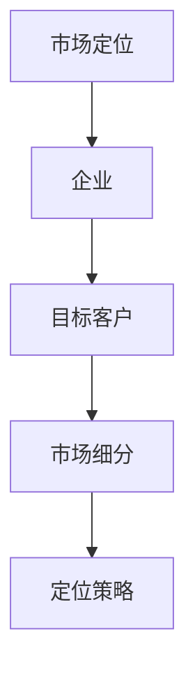
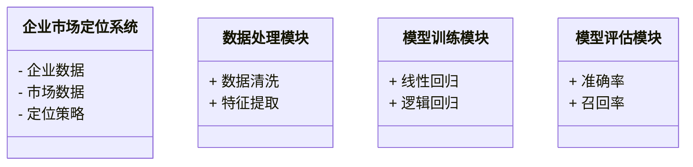
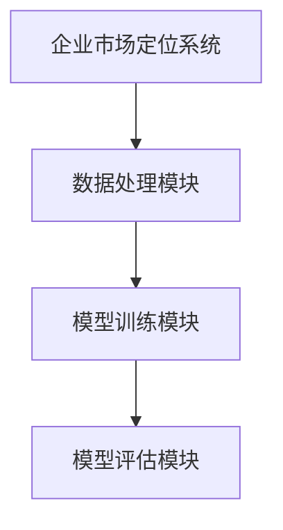
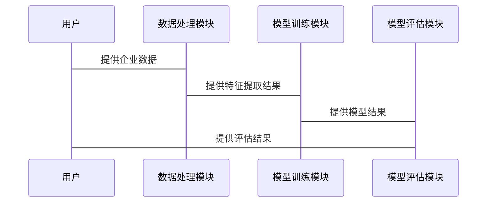

                 


# 企业估值中的市场定位精准度分析

**关键词**：企业估值、市场定位、精准度分析、商业分析、投资决策

**摘要**：  
在企业估值过程中，市场定位的精准度直接影响着企业价值的评估结果。本文从市场定位的定义、核心要素、与企业估值的关系入手，深入分析市场定位精准度的影响因素、衡量标准及优化方法。通过结合实际案例，探讨如何利用市场定位精准度分析提升企业估值的准确性。本文还从算法原理、系统架构、项目实战等多维度展开，为企业提供一套完整的市场定位精准度分析方法论，助力投资决策和企业战略规划。

---

# 第1章: 市场定位与企业估值概述

## 1.1 市场定位的基本概念

### 1.1.1 市场定位的定义  
市场定位是指企业在目标市场中确定自身产品或服务的位置，使其在消费者心智中占据独特位置的过程。它是企业战略的核心组成部分，直接影响企业的市场表现和竞争力。

### 1.1.2 市场定位的核心要素  
市场定位的核心要素包括目标客户、市场细分、定位策略和价值主张。目标客户是企业定位的核心，市场细分帮助企业找到特定的客户群体，定位策略决定了企业的差异化竞争优势，而价值主张则是企业向客户传递的核心价值。

### 1.1.3 市场定位与企业估值的关系  
市场定位的精准度直接影响企业的市场地位和盈利能力，进而影响企业估值。精准的市场定位能够帮助企业更好地满足客户需求，提升市场份额，从而在估值时获得更高的溢价。

---

## 1.2 企业估值的基本原理

### 1.2.1 企业估值的定义  
企业估值是指对企业整体价值的评估，通常包括资产、收入、利润、市场份额等因素。常见的估值方法包括DCF模型、市盈率法、市净率法等。

### 1.2.2 企业估值的主要方法  
- **绝对估值法**：如现金流折现法（DCF）。
- **相对估值法**：如市盈率（P/E）、市净率（P/B）。
- **资产基础法**：基于企业资产负债表的评估。

### 1.2.3 市场定位在企业估值中的作用  
精准的市场定位能够提升企业的市场地位和品牌价值，从而在相对估值法中获得更高的倍数。同时，良好的市场定位也能够提高企业未来现金流的预测准确性，从而在绝对估值法中获得更合理的评估结果。

---

## 1.3 市场定位精准度的定义与影响

### 1.3.1 精准度的定义  
市场定位精准度是指企业在目标市场中的定位与实际市场需求的匹配程度。精准度越高，企业的产品或服务越能够满足客户需求，市场表现越好。

### 1.3.2 精准度对企业估值的影响  
- 精准度高的市场定位能够提升企业的市场份额和利润率，从而在估值时获得更高的价值。
- 精准度低的市场定位可能导致企业市场份额流失，影响估值的准确性。

### 1.3.3 精准度的衡量标准  
市场定位精准度的衡量标准包括市场份额、客户满意度、市场反馈等。通过这些指标可以评估市场定位的精准程度。

---

## 1.4 本章小结  
本章从市场定位的基本概念出发，分析了市场定位与企业估值的关系，并探讨了市场定位精准度的定义与影响。市场定位的精准度是企业估值的关键因素之一，需要企业在战略制定和实施过程中予以高度重视。

---

# 第2章: 市场定位精准度分析的核心概念

## 2.1 市场定位精准度的背景介绍

### 2.1.1 问题背景  
随着市场竞争的加剧，企业需要更加精准地定位市场，以在激烈的竞争中占据优势地位。市场定位精准度的提升能够帮助企业更好地满足客户需求，从而提升企业价值。

### 2.1.2 问题描述  
企业在市场定位过程中常常面临定位不精准的问题，导致市场份额流失或资源浪费。如何通过科学的方法提升市场定位的精准度，成为企业估值中的重要课题。

### 2.1.3 问题解决方法  
通过数据分析、客户调研和市场反馈，结合企业自身的优势和劣势，制定精准的市场定位策略。

---

## 2.2 核心概念与联系

### 2.2.1 市场定位精准度的属性特征对比表  
| 属性 | 特征 |
|------|------|
| 精准度 | 高/低 |
| 定位目标 | 细分市场/整体市场 |
| 数据来源 | 客观/主观 |

### 2.2.2 市场定位精准度的ER实体关系图  


---

## 2.3 市场定位精准度分析的数学模型

### 2.3.1 市场定位精准度的公式  
$$ 精准度 = \frac{正确预测数}{总预测数} $$  

### 2.3.2 市场定位的数学模型  
$$ P = \frac{N_{correct}}{N_{total}} $$  

---

## 2.4 本章小结  
本章通过对比分析和数学模型，探讨了市场定位精准度的核心概念与联系。市场定位精准度的提升需要结合企业实际情况，通过数据分析和市场反馈不断优化定位策略。

---

# 第3章: 市场定位精准度分析的算法原理

## 3.1 算法原理概述

### 3.1.1 市场定位精准度分析的算法选择  
常用的算法包括线性回归、逻辑回归和决策树等。这些算法可以帮助企业基于市场数据，预测市场定位的精准度。

### 3.1.2 算法的基本原理  
以逻辑回归为例，算法通过建立目标函数和优化函数，预测市场定位的精准度。

### 3.1.3 算法的优缺点对比  
| 算法 | 优点 | 缺点 |
|------|------|------|
| 线性回归 | 简单易懂 | 无法处理非线性关系 |
| 逻辑回归 | 适合二分类问题 | 对特征工程要求高 |
| 决策树 | 易于解释 | 易受噪声数据影响 |

---

## 3.2 算法实现的步骤

### 3.2.1 数据预处理  
- 数据清洗：处理缺失值、异常值。
- 特征选择：选择与市场定位相关的特征。

### 3.2.2 模型训练  
- 划分训练集和测试集。
- 选择算法，训练模型。

### 3.2.3 模型评估  
- 使用准确率、召回率等指标评估模型性能。

### 3.2.4 模型优化  
- 调参优化，提升模型性能。

---

## 3.3 算法的数学模型与公式

### 3.3.1 线性回归模型  
$$ y = \beta_0 + \beta_1x + \epsilon $$  

### 3.3.2 逻辑回归模型  
$$ P(y=1|x) = \frac{e^{\beta_0 + \beta_1x}}{1 + e^{\beta_0 + \beta_1x}} $$  

---

## 3.4 本章小结  
本章通过算法原理的分析，探讨了如何利用数学模型提升市场定位的精准度。通过数据预处理、模型训练和优化，企业可以更科学地进行市场定位。

---

# 第4章: 市场定位精准度分析的系统架构

## 4.1 系统功能设计

### 4.1.1 领域模型  


### 4.1.2 系统架构设计  


---

## 4.2 系统接口设计

### 4.2.1 接口描述  
- 输入接口：企业数据、市场数据。
- 输出接口：定位策略、模型评估结果。

---

## 4.3 系统交互设计

### 4.3.1 序列图  


---

## 4.4 本章小结  
本章从系统架构的角度，探讨了市场定位精准度分析的实现方法。通过模块化设计和系统交互，企业可以更高效地进行市场定位分析。

---

# 第5章: 市场定位精准度分析的项目实战

## 5.1 项目背景与目标

### 5.1.1 项目背景  
以某互联网企业为例，企业在市场定位过程中面临精准度不足的问题，导致市场份额较低。

### 5.1.2 项目目标  
通过市场定位精准度分析，帮助企业优化市场定位策略，提升企业估值。

---

## 5.2 环境配置

### 5.2.1 系统环境  
- 操作系统：Linux
- 开发工具：Python、Jupyter Notebook
- 数据库：MySQL

---

## 5.3 核心实现

### 5.3.1 数据预处理  
```python
import pandas as pd
data = pd.read_csv('market.csv')
data = data.dropna()
```

### 5.3.2 模型训练  
```python
from sklearn.linear_model import LogisticRegression
model = LogisticRegression()
model.fit(X_train, y_train)
```

### 5.3.3 模型评估  
```python
from sklearn.metrics import accuracy_score
print(accuracy_score(y_test, model.predict(X_test)))
```

---

## 5.4 案例分析

### 5.4.1 环境配置与数据导入  
```python
import pandas as pd
data = pd.read_csv('market.csv')
```

### 5.4.2 模型实现  
```python
from sklearn.linear_model import LogisticRegression
model = LogisticRegression()
model.fit(X_train, y_train)
```

### 5.4.3 结果解读  
```python
print(model.coef_)
print(model.intercept_)
```

---

## 5.5 本章小结  
本章通过项目实战，展示了市场定位精准度分析的实现过程。通过数据预处理、模型训练和结果解读，帮助企业优化市场定位策略。

---

# 第6章: 市场定位精准度分析的优化与展望

## 6.1 优化建议

### 6.1.1 数据优化  
增加数据来源，提升数据质量。

### 6.1.2 模型优化  
尝试其他算法，如随机森林、神经网络等。

---

## 6.2 未来展望

### 6.2.1 技术发展  
人工智能和大数据技术的进一步发展，将为企业市场定位精准度分析提供更多可能性。

### 6.2.2 应用场景  
市场定位精准度分析将扩展到更多行业，如医疗、教育、金融等。

---

## 6.3 本章小结  
本章对未来市场定位精准度分析的发展提出了优化建议和展望。随着技术的进步，市场定位精准度分析将为企业估值提供更强大的支持。

---

# 作者：AI天才研究院/AI Genius Institute & 禅与计算机程序设计艺术 /Zen And The Art of Computer Programming

---

**摘要**：  
本文从市场定位与企业估值的关系出发，深入分析了市场定位精准度的影响因素、衡量标准及优化方法。通过结合实际案例，探讨了如何利用市场定位精准度分析提升企业估值的准确性。本文还从算法原理、系统架构、项目实战等多维度展开，为企业提供了一套完整的市场定位精准度分析方法论，助力投资决策和企业战略规划。

