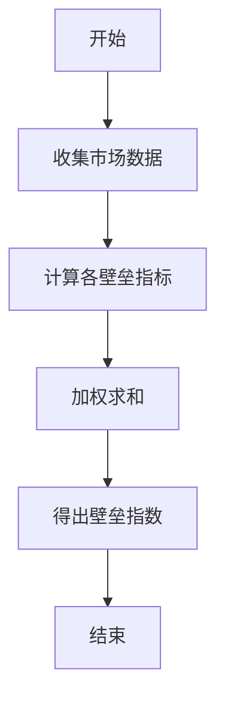
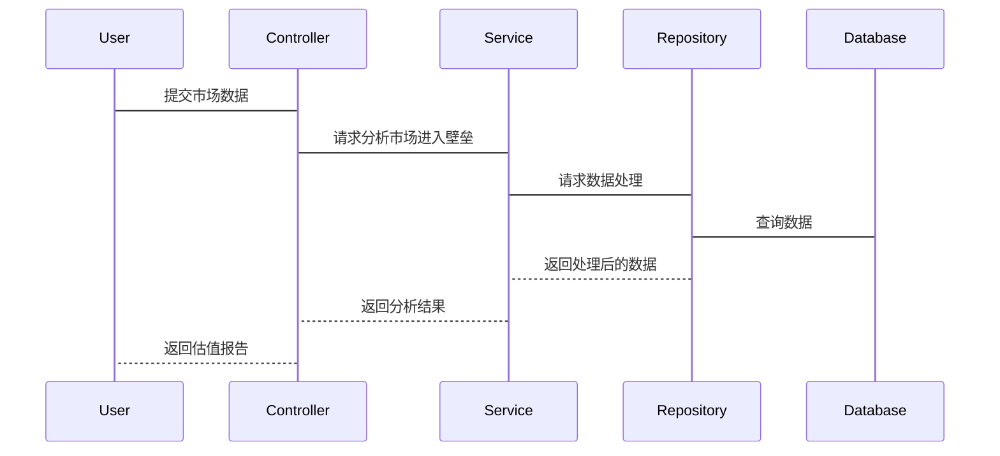

                 


# 企业估值中的市场进入壁垒分析

> 关键词：企业估值，市场进入壁垒，竞争分析，战略分析，投资决策

> 摘要：本文从市场进入壁垒的背景与概念出发，详细探讨了市场进入壁垒的核心概念与联系，分析了其算法原理与数学模型，并通过系统分析与架构设计方案，结合项目实战，总结了企业估值中的市场进入壁垒分析的关键点及最佳实践。

---

## 第一部分: 企业估值中的市场进入壁垒分析基础

### 第1章: 市场进入壁垒的背景与概念

#### 1.1 市场进入壁垒的基本概念

市场进入壁垒是指企业在进入某一市场时所面临的一系列障碍，这些障碍可能来自市场结构、竞争环境、行业特性或企业自身的资源限制。市场进入壁垒的存在使得新进入者难以轻松进入市场，从而保护现有企业的竞争优势。

- **定义**：市场进入壁垒是指阻止或限制新企业进入某个市场的障碍。
- **分类**：
  - **结构性壁垒**：由市场结构决定，如规模经济、网络效应等。
  - **行为性壁垒**：由企业行为导致，如专利、品牌忠诚度等。
  - **资源性壁垒**：由资源稀缺性决定，如原材料供应、技术门槛等。
- **企业估值中的影响**：市场进入壁垒高的企业通常具有更强的竞争优势，其估值可能更高。

#### 1.2 市场进入壁垒的形成机制

市场进入壁垒的形成机制复杂，涉及多个因素：

- **市场结构的影响**：市场集中度高、规模经济显著的行业更容易形成结构性壁垒。
- **企业竞争策略的作用**：现有企业通过专利、品牌建设等方式主动设置壁垒。
- **行业特性与市场进入壁垒的关系**：某些行业由于技术门槛高或监管严格，天然具有较高的市场进入壁垒。

#### 1.3 企业估值中的市场进入壁垒分析的重要性

市场进入壁垒分析在企业估值中具有重要意义：

- **对企业价值的影响**：高壁垒企业具有更强的盈利能力，估值通常较高。
- **在投资决策中的作用**：投资者可以通过分析市场进入壁垒，评估投资风险和回报。
- **边界与外延**：市场进入壁垒分析需要结合行业特性、竞争环境和企业资源进行综合判断。

### 第2章: 市场进入壁垒的核心概念与联系

#### 2.1 市场进入壁垒的核心要素

市场进入壁垒的核心要素包括：

- **市场结构特征**：如市场集中度、规模经济等。
- **企业竞争策略**：如专利、品牌忠诚度等。
- **行业特性**：如技术门槛、监管政策等。

#### 2.2 市场进入壁垒的分类与对比

市场进入壁垒可以分为以下几类：

- **结构性壁垒**：由市场结构决定，如规模经济、网络效应。
- **行为性壁垒**：由企业行为导致，如专利、品牌忠诚度。
- **资源性壁垒**：由资源稀缺性决定，如原材料供应、技术门槛。

#### 2.3 市场进入壁垒的ER实体关系图

```mermaid
er
  actor(企业, id, name)
  barrier(市场进入壁垒, id, type, description)
  belongs_to(企业 -> 市场进入壁垒, id)
```

### 第3章: 市场进入壁垒的算法原理与数学模型

#### 3.1 市场进入壁垒的评估方法

市场进入壁垒的评估方法多种多样：

- **加权评分法**：根据各壁垒的重要性和影响程度，进行加权评分。
- **回归分析法**：通过统计方法，分析市场进入壁垒与企业估值的关系。
- **聚类分析法**：将企业分为不同类别，分析各类别间的市场进入壁垒差异。

#### 3.2 市场进入壁垒评估的数学模型

##### 3.2.1 市场进入壁垒指数模型

$$壁垒指数 = \sum_{i=1}^{n} w_i \cdot x_i$$

其中，\(w_i\) 是第\(i\)个壁垒的权重，\(x_i\) 是第\(i\)个壁垒的具体指标。

##### 3.2.2 市场进入壁垒的回归模型

$$y = \beta_0 + \beta_1x_1 + \beta_2x_2 + \epsilon$$

其中，\(y\) 是企业估值，\(x_1\) 和 \(x_2\) 是市场进入壁垒的相关指标，\(\beta_0\) 是截距，\(\beta_1\) 和 \(\beta_2\) 是回归系数，\(\epsilon\) 是误差项。

#### 3.3 算法流程图



---

## 第二部分: 企业估值中的市场进入壁垒分析系统设计

### 第4章: 系统分析与架构设计方案

#### 4.1 系统功能设计

市场进入壁垒分析系统需要具备以下功能：

- **数据收集**：收集市场数据，包括市场规模、竞争对手信息等。
- **数据分析**：对数据进行处理和分析，计算市场进入壁垒指数。
- **报告生成**：生成分析报告，提供估值建议。

#### 4.2 系统架构设计


#### 4.3 系统接口设计

系统接口设计包括：

- **输入接口**：接收市场数据。
- **输出接口**：输出市场进入壁垒指数和估值报告。

#### 4.4 系统交互设计



---

## 第三部分: 项目实战

### 第5章: 项目实战

#### 5.1 环境安装

- **工具安装**：安装Python、Pandas、Scikit-learn等工具。
- **数据准备**：收集目标行业的市场数据。

#### 5.2 核心代码实现

```python
import pandas as pd
from sklearn.linear_model import LinearRegression

# 数据收集
data = pd.read_csv('market_data.csv')

# 模型训练
model = LinearRegression()
model.fit(data[['barrier1', 'barrier2']], data['valuation'])

# 模型预测
new_entry = [[2, 3]]
prediction = model.predict(new_entry)
print(prediction)
```

#### 5.3 代码解读与分析

- **数据收集**：使用Pandas读取CSV文件，获取市场数据。
- **模型训练**：使用Scikit-learn中的线性回归模型，训练市场进入壁垒与估值的关系。
- **模型预测**：输入新的市场进入壁垒指标，预测企业估值。

#### 5.4 实际案例分析

以某行业为例，分析市场进入壁垒对企业估值的影响：

- **案例描述**：假设某行业存在较高的专利壁垒，分析其对企业估值的影响。
- **分析结果**：专利壁垒较高的企业估值显著高于壁垒较低的企业。

#### 5.5 项目小结

通过项目实战，验证了市场进入壁垒分析方法的有效性，为企业估值提供了有力支持。

---

## 第四部分: 最佳实践与总结

### 第6章: 最佳实践

#### 6.1 小结

市场进入壁垒分析是企业估值的重要部分，通过合理的方法和工具，可以有效评估市场进入壁垒对企业价值的影响。

#### 6.2 注意事项

- **数据准确性**：确保数据来源可靠，避免偏差。
- **模型选择**：根据具体情况选择合适的模型。
- **持续更新**：市场环境变化快，需持续更新分析结果。

#### 6.3 拓展阅读

- **相关书籍**：《企业估值与市场分析》
- **专业期刊**：《管理科学学报》

---

## 作者：AI天才研究院/AI Genius Institute & 禅与计算机程序设计艺术 /Zen And The Art of Computer Programming

