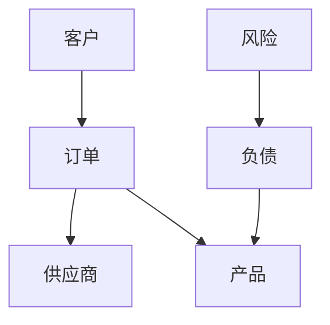
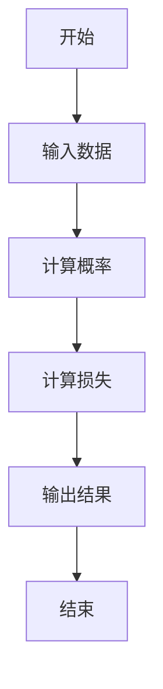
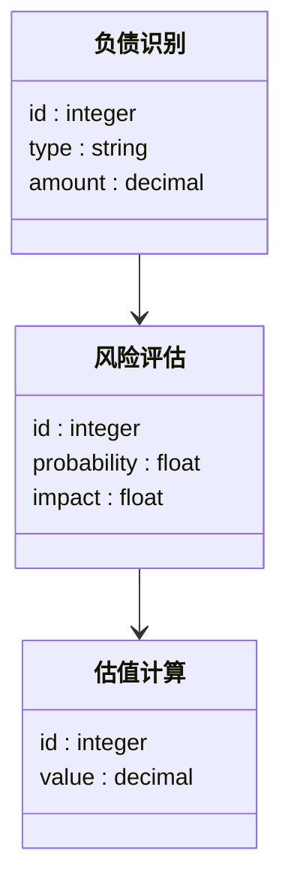
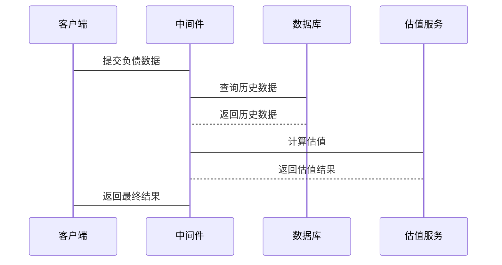

                 


```markdown
# 企业估值中的或有负债处理方法

> 关键词：企业估值，或有负债，财务风险管理，企业财务健康度，潜在负债处理

> 摘要：本文系统地探讨了企业在估值过程中处理或有负债的方法，从概念、算法原理到系统设计和项目实战，全面分析了或有负债对企业发展的影响，并提供了实际操作的指导。通过详细的数学模型和案例分析，帮助读者准确理解和处理或有负债，提升企业估值的准确性和抗风险能力。

## 第1章: 或有负债的背景与概念

### 1.1 或有负债的定义与分类
#### 1.1.1 或有负债的定义
或有负债是指企业在未来可能发生的负债，这些负债通常源于企业的经营活动中可能存在的法律纠纷、担保责任、未决诉讼等。或有负债具有不确定性，但其潜在影响可能对企业估值产生重大影响。

#### 1.1.2 或有负债的主要分类
1. **直接或有负债**：与企业直接相关的负债，例如因产品质量问题引发的诉讼。
2. **间接或有负债**：与企业间接相关的负债，例如为企业提供担保的第三方可能产生的债务。
3. **潜在或有负债**：尚未明确的负债，例如可能发生的环保罚款。

#### 1.1.3 或有负债与企业估值的关系
或有负债可能影响企业的财务健康度，进而影响其估值。例如，未决诉讼的潜在赔偿可能降低企业的市场价值。

### 1.2 或有负债的产生背景
#### 1.2.1 现代企业面临的财务风险
现代企业面临多种财务风险，包括市场风险、信用风险和法律风险。或有负债是这些风险的一种表现形式。

#### 1.2.2 或有负债在企业经营中的表现形式
1. 担保责任
2. 未决诉讼
3. 环保责任

#### 1.2.3 或有负债对企业估值的影响
或有负债可能增加企业的财务负担，降低其偿债能力，从而影响投资者对企业价值的评估。

---

## 第2章: 或有负债的核心概念与联系

### 2.1 或有负债的核心原理
#### 2.1.1 或有负债的识别方法
1. 审查企业的财务报表，识别潜在的或有负债。
2. 分析企业的合同和协议，识别可能的担保责任。

#### 2.1.2 或有负债的评估模型
1. 概率模型：基于历史数据估计或有负债发生的概率。
2. 损失模型：评估或有负债可能造成的损失范围。

#### 2.1.3 或有负债与企业财务健康度的关系
或有负债过多可能表明企业财务健康度较差，影响其估值。

### 2.2 或有负债的ER实体关系图
#### 2.2.1 实体关系图的构建
```mermaid
erDiagram
    customer[客户] {
        customer_id : integer
        name : string
        }
    supplier[供应商] {
        supplier_id : integer
        name : string
        }
    product[产品] {
        product_id : integer
        name : string
        }
    order[订单] {
        order_id : integer
        order_date : date
        customer_id : integer
        supplier_id : integer
        }
    risk[风险] {
        risk_id : integer
        type : string
        }
    liability[负债] {
        liability_id : integer
        amount : decimal
        risk_id : integer
        }
    relation1: customer --> order
    relation2: supplier --> order
    relation3: risk --> liability
```

#### 2.2.2 关键实体及属性分析
| 实体 | 属性 |
|------|------|
| 客户 | 客户ID，姓名 |
| 供应商 | 供应商ID，姓名 |
| 产品 | 产品ID，名称 |
| 订单 | 订单ID，订单日期，客户ID，供应商ID |
| 风险 | 风险ID，类型 |
| 负债 | 负债ID，金额，风险ID |

#### 2.2.3 实体关系图的 Mermaid 流程图


---

## 第3章: 或有负债的算法原理与数学模型

### 3.1 或有负债的量化方法
#### 3.1.1 基于概率的或有负债评估
1. 确定或有负债发生的概率。
2. 估计或有负债的损失金额。
3. 计算期望损失。

#### 3.1.2 基于蒙特卡洛模拟的或有负债预测
1. 定义概率分布。
2. 生成随机样本。
3. 计算平均损失。

#### 3.1.3 或有负债的数学模型
$$ E[损失] = \sum_{i=1}^{n} P_i \times L_i $$

### 3.2 算法原理的 Mermaid 流程图


### 3.3 算法实现的 Python 代码示例
```python
import numpy as np

def monte_carlo_simulation(n_iterations, low, high):
    np.random.seed(42)
    losses = np.random.uniform(low, high, n_iterations)
    expected_loss = np.mean(losses)
    return expected_loss

n_iterations = 10000
low = 0
high = 1000000

result = monte_carlo_simulation(n_iterations, low, high)
print(f"Expected loss: {result}")
```

---

## 第4章: 或有负债的系统分析与架构设计

### 4.1 系统分析
#### 4.1.1 问题场景介绍
企业需要评估其或有负债，以准确计算其估值。

#### 4.1.2 领域模型的 Mermaid 类图


#### 4.1.3 系统架构设计的 Mermaid 架构图


### 4.2 系统接口与交互设计
#### 4.2.1 系统接口设计
1. 输入：负债数据。
2. 输出：估值结果。

#### 4.2.2 系统交互的 Mermaid 序列图


---

## 第5章: 或有负债的项目实战

### 5.1 环境安装与配置
1. 安装 Python 和必要的库（如 NumPy、Matplotlib）。
2. 安装 Mermaid 和其他工具。

### 5.2 核心算法实现
#### 5.2.1 或有负债识别的 Python 代码实现
```python
import pandas as pd

data = {
    '客户ID': [1, 2, 3],
    '负债类型': ['诉讼', '担保', '产品责任'],
    '金额': [100000, 50000, 75000]
}

df = pd.DataFrame(data)
print(df)
```

#### 5.2.2 或有负债评估的代码实现
```python
def calculate_liability_probability(liability_amount, total_assets):
    return liability_amount / total_assets

liability_amount = 100000
total_assets = 1000000

probability = calculate_liability_probability(liability_amount, total_assets)
print(f"Probability of liability: {probability}")
```

### 5.3 项目小结
通过实际案例分析，展示了如何在企业估值中处理或有负债，强调了准确识别和评估或有负债的重要性。

---

## 总结与扩展

### 5.4 最佳实践 tips
1. 定期审查企业的财务报表，识别潜在的或有负债。
2. 使用蒙特卡洛模拟等方法评估或有负债的潜在影响。

### 5.5 小结
或有负债是企业估值中的重要考虑因素，准确处理或有负债有助于提高估值的准确性。

### 5.6 注意事项
1. 确保数据的准确性和完整性。
2. 定期更新或有负债的评估结果。

### 5.7 拓展阅读
1. 《企业风险管理》
2. 《财务风险管理》

---

作者：AI天才研究院/AI Genius Institute & 禅与计算机程序设计艺术 /Zen And The Art of Computer Programming
```

