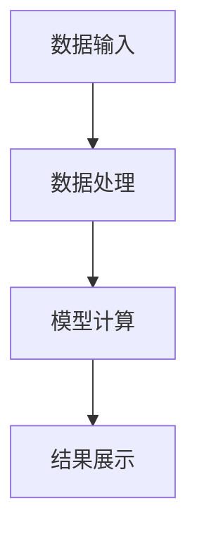

                 


# 《企业估值中的相对估值法》

---

## 关键词：  
企业估值、相对估值法、EV/EBITDA、可比公司分析、DCF模型、企业价值评估、财务指标分析  

---

## 摘要：  
企业估值是投资决策中的核心问题，而相对估值法作为一种简便有效的估值方法，被广泛应用于各类企业评估中。本文详细解析相对估值法的核心原理、常见模型及其应用场景，通过可比公司分析、行业平均法和比率法等多种方法，深入探讨企业估值的关键步骤。文章还结合实际案例，展示相对估值法的实践应用，并提供代码实现和系统架构设计方案，帮助读者掌握这一重要估值工具。

---

## 第1章：相对估值法概述  

### 1.1 相对估值法的定义与背景  
- 企业估值的基本概念：企业价值是企业所有者权益的公允价值，包括资产、负债和所有者权益的综合评估。  
- 相对估值法的定义：通过比较可比公司或行业平均的财务指标，推导目标公司价值的方法。  
- 应用背景：相对估值法基于市场数据，操作简便，适用于数据获取相对容易的场景。  

### 1.2 相对估值法的核心概念  
- 可比公司分析：选择与目标公司相似的公司作为参考，分析其财务指标。  
- 行业平均法：根据行业内的平均估值指标，推导目标公司价值。  
- 比率法：通过特定财务比率（如EV/EBITDA、P/E）比较目标公司与可比公司的估值差异。  

---

## 第2章：相对估值法的核心原理  

### 2.1 相对估值法的数学模型  
- EV/EBITDA模型：$$ EV = \frac{EBITDA \times EV/EBITDA\_ratio}{1} $$  
- 市盈率（P/E）模型：$$ P/E = \frac{股价}{每股收益} $$  
- 市净率（P/B）模型：$$ P/B = \frac{股价}{每股净资产} $$  

### 2.2 相对估值法的计算公式  
- EV/EBITDA比率计算：$$ EV/EBITDA = \frac{企业价值}{息税折旧及摊销前利润} $$  
- 市盈率计算：$$ P/E = \frac{股价}{净利润/股本} $$  
- 市净率计算：$$ P/B = \frac{股价}{净资产/股本} $$  

---

## 第3章：相对估值法的估值模型  

### 3.1 DCF模型  
- DCF模型的基本原理：通过现金流折现计算企业内在价值。  
- 计算步骤：预测未来现金流，选择合适的折现率，计算现值。  
- 优缺点：  
  - 优点：考虑了企业的未来盈利能力。  
  - 缺点：依赖于假设，预测难度较大。  

### 3.2 EV/EBITDA模型  
- EV/EBITDA模型的核心公式：$$ EV = EBITDA \times EV/EBITDA\_ratio $$  
- 应用场景：适用于资本密集型行业，如制造业和能源行业。  

---

## 第4章：可比公司分析  

### 4.1 数据收集与处理  
- 数据来源：公开财报、行业报告、金融数据库。  
- 数据清洗：处理缺失值、异常值，确保数据准确性。  

### 4.2 可比性评估  
- 评估指标：行业、规模、盈利能力、杠杆率等。  
- 调整方法：根据可比公司异质性进行调整，如EBITDA调整、杠杆调整。  

---

## 第5章：实际操作中的技巧和注意事项  

### 5.1 数据处理技巧  
- 数据标准化：统一数据格式和单位。  
- 异常值处理：剔除明显不符合条件的可比公司。  

### 5.2 模型应用中的注意事项  
- 数据偏差：避免使用过时或不准确的数据。  
- 模型假设：确保折现率合理，避免高估或低估企业价值。  

---

## 第6章：相对估值法的局限性  

### 6.1 数据偏差问题  
- 数据不足：可比公司数量有限，影响结果准确性。  
- 数据质量：公开数据可能存在滞后性，影响估值的及时性。  

### 6.2 模型假设问题  
- 可比性假设：假设可比公司具有相似性，但实际可能存在差异。  
- 折现率选择：折现率的主观性影响估值结果。  

### 6.3 结合其他估值方法  
- 绝对估值法：如DCF模型，用于验证相对估值结果。  
- 综合分析：结合相对估值和绝对估值，提高估值准确性。  

---

## 第7章：实际案例分析  

### 7.1 案例背景  
- 公司A：一家中型制造企业，目标估值。  
- 可比公司：选取3家同行业公司，分析其EV/EBITDA比率。  

### 7.2 数据分析与计算  
- 计算可比公司平均EV/EBITDA比率：$$ 2.5 $$  
- 目标公司EBITDA：$$ 1000万元 $$  
- 估计公司A的EV：$$ 2.5 \times 1000 = 2500万元 $$  

### 7.3 结果解读  
- 公司A的估值为2500万元，高于行业平均，说明其可能被低估或具有较高的增长潜力。  

---

## 第8章：相对估值法的系统架构与代码实现  

### 8.1 系统功能设计  
- 数据输入：读取可比公司数据。  
- 数据处理：清洗和标准化数据。  
- 模型计算：计算EV/EBITDA比率，估计目标公司价值。  
- 结果展示：输出估值结果和可视化图表。  

### 8.2 系统架构设计  



### 8.3 核心代码实现  

```python
import pandas as pd
import numpy as np

# 数据输入
df = pd.read_csv('comparison_companies.csv')

# 数据处理
df.dropna()  # 删除缺失值
df['EV/EBITDA'] = df['EV'] / df['EBITDA']  # 计算EV/EBITDA比率

# 模型计算
target_EBITDA = 1000  # 目标公司EBITDA
average_ratio = df['EV/EBITDA'].mean()  # 计算平均比率
estimated_EV = target_EBITDA * average_ratio  # 估计企业价值

# 结果展示
print(f"估计的企业价值为：{estimated_EV}")
```

---

## 第9章：总结与未来趋势  

### 9.1 总结  
- 相对估值法是一种简便有效的估值工具，适用于数据获取相对容易的场景。  
- 需要注意数据质量和模型假设，避免偏差。  

### 9.2 未来趋势  
- 数据驱动的估值：利用大数据和机器学习优化估值模型。  
- AI技术的应用：通过AI分析海量数据，提高估值的准确性和效率。  

---

## 作者：  
AI天才研究院/AI Genius Institute & 禅与计算机程序设计艺术 /Zen And The Art of Computer Programming  

---

通过以上结构和内容，您可以逐步撰写出一篇完整的关于相对估值法的技术博客文章。

