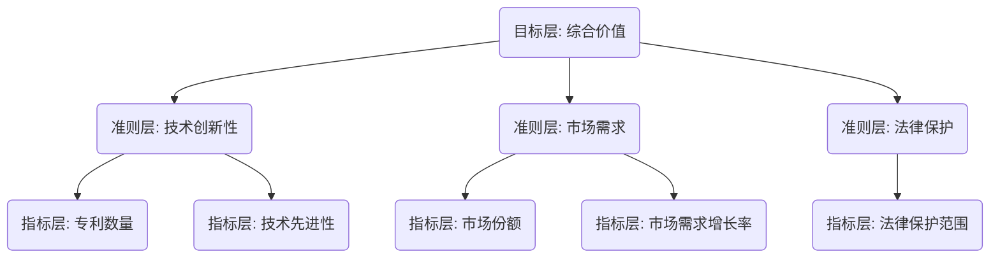
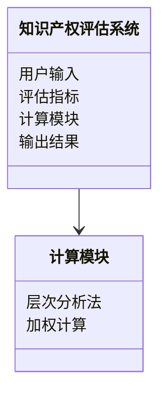
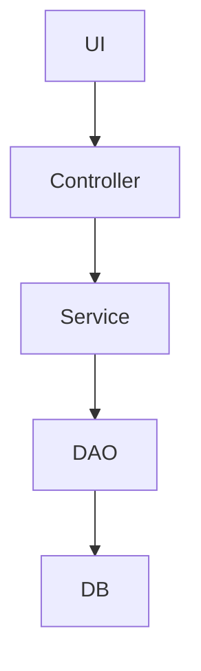
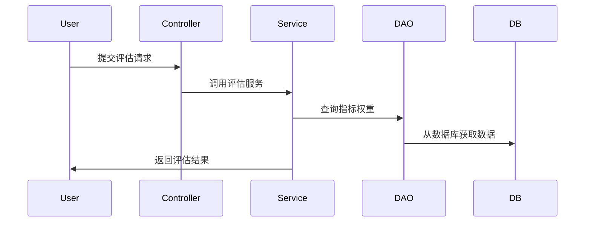

                 


# 企业估值中的知识产权价值法

> 关键词：企业估值，知识产权，价值评估，算法原理，系统架构

> 摘要：本文探讨了在企业估值过程中如何有效评估知识产权的价值，详细介绍了知识产权的基本概念、价值评估的方法、算法原理、系统架构设计以及实际案例分析。通过逐步推理和详细讲解，本文旨在为读者提供一套完整的企业知识产权价值评估体系。

---

# 第一部分: 企业估值中的知识产权价值法概述

## 第1章: 知识产权与企业估值的背景

### 1.1 知识产权的基本概念

#### 1.1.1 知识产权的定义
知识产权是指依法保护的创造性成果和标识的专有权利，主要包括专利权、商标权、著作权、商业秘密等。这些权利为企业提供了市场竞争中的独特优势。

#### 1.1.2 知识产权的主要类型
- **专利权**：保护发明的独占权。
- **商标权**：保护品牌标识的独占权。
- **著作权**：保护文学、艺术和科学作品的版权。
- **商业秘密**：保护未公开的商业信息和技术。

#### 1.1.3 知识产权在企业中的重要性
知识产权不仅是企业核心竞争力的体现，也是企业估值的重要组成部分。例如，一项具有市场潜力的专利可以显著提升企业的市场价值。

### 1.2 知识产权与企业估值的关系

#### 1.2.1 企业估值的基本概念
企业估值是对企业整体价值的评估，通常包括有形资产和无形资产。知识产权作为无形资产的重要组成部分，直接影响企业估值。

#### 1.2.2 知识产权在企业估值中的地位
知识产权的价值评估是企业整体估值的关键环节。例如，一家科技企业的核心专利组合可能占其估值的绝大部分。

#### 1.2.3 知识产权对企业发展的影响
知识产权可以为企业带来持续的经济收益，例如通过授权许可或技术转让获得收入。

### 1.3 知识产权价值法的背景与现状

#### 1.3.1 知识产权价值法的起源
知识产权价值法起源于20世纪，随着企业对无形资产的关注增加而逐渐发展。

#### 1.3.2 知识产权价值法的发展现状
目前，知识产权价值法已形成多种评估方法，如收益法、市场法和成本法。

#### 1.3.3 知识产权价值法的应用领域
知识产权价值法广泛应用于科技企业、制药企业等领域，特别是在并购和融资活动中。

### 1.4 本章小结
本章介绍了知识产权的基本概念、其在企业估值中的地位以及价值法的发展现状，为后续内容奠定了基础。

---

# 第二部分: 知识产权价值法的核心概念与方法论

## 第2章: 知识产权价值评估的核心概念

### 2.1 知识产权价值评估的理论基础

#### 2.1.1 无形资产评估的基本原理
无形资产评估通常基于其未来收益能力。知识产权作为无形资产，其价值评估也遵循这一原理。

#### 2.1.2 知识产权的经济价值来源
知识产权的经济价值来源于其市场竞争力和盈利能力。例如，一项专利的市场应用前景决定了其价值。

#### 2.1.3 知识产权价值评估的边界与外延
知识产权价值评估的边界包括其法律保护范围和市场寿命。外延则涉及其对企业发展的影响。

### 2.2 知识产权价值评估的核心要素

#### 2.2.1 知识产权的法律属性
法律属性包括权利的期限、地域性和排他性。

#### 2.2.2 知识产权的市场价值
市场价值取决于市场需求、竞争状况和技术创新能力。

#### 2.2.3 知识产权的生命周期
生命周期包括创造、保护、实施和终止阶段，不同阶段的价值评估方法有所不同。

### 2.3 知识产权价值评估的方法

#### 2.3.1 收益法
收益法基于知识产权的未来收益，通过折现率计算其现值。

#### 2.3.2 市场法
市场法通过比较类似知识产权的市场交易价格进行评估。

#### 2.3.3 成本法
成本法基于知识产权的开发成本进行评估，但忽略了其市场价值。

### 2.4 本章小结
本章详细介绍了知识产权价值评估的核心概念和主要方法，为后续的算法设计奠定了理论基础。

---

# 第三部分: 知识产权价值法的算法原理

## 第3章: 知识产权价值评估的算法设计

### 3.1 层次分析法（AHP）的应用

#### 3.1.1 层次分析法的原理
层次分析法是一种定性与定量结合的决策方法，适用于多因素评估场景。

#### 3.1.2 知识产权价值评估的指标体系
- 技术创新性
- 市场需求
- 法律保护
- 经济寿命

#### 3.1.3 层次分析法的步骤
1. 构建指标体系
2. 确定指标权重
3. 计算综合价值

### 3.2 层次分析法的流程图



### 3.3 算法实现

#### 3.3.1 Python代码实现

```python
import numpy as np

def ahp(weights, criteria_values):
    # 计算加权平均值
    weighted_sum = np.dot(weights, criteria_values)
    return weighted_sum

# 示例数据
weights = np.array([0.4, 0.3, 0.3])  # 指标权重
criteria_values = np.array([0.8, 0.6, 0.7])  # 指标值

# 计算综合价值
result = ahp(weights, criteria_values)
print("综合价值:", result)
```

#### 3.3.2 数学模型与公式
综合价值计算公式：

$$
V = \sum_{i=1}^{n} w_i \cdot v_i
$$

其中，\( w_i \) 是指标权重，\( v_i \) 是指标值。

### 3.4 本章小结
本章通过层次分析法详细讲解了知识产权价值评估的算法设计，并通过代码实现和公式推导，展示了方法的实际应用。

---

# 第四部分: 知识产权价值法的系统架构设计

## 第4章: 知识产权价值评估系统的架构设计

### 4.1 系统功能设计

#### 4.1.1 领域模型类图



### 4.2 系统架构设计

#### 4.2.1 系统架构图



### 4.3 系统接口设计

#### 4.3.1 接口设计
- 输入接口：接收知识产权指标数据
- 输出接口：返回综合价值评估结果

#### 4.4 系统交互序列图



### 4.5 本章小结
本章通过系统架构设计展示了知识产权价值评估系统的实现方式，包括功能模块、架构图和交互流程。

---

# 第五部分: 知识产权价值法的项目实战

## 第5章: 实际案例分析与代码实现

### 5.1 环境安装与配置

#### 5.1.1 安装Python环境
```bash
pip install numpy
pip install matplotlib
```

### 5.2 核心代码实现

#### 5.2.1 代码实现
```python
import numpy as np

def calculate_value(weights, values):
    return np.dot(weights, values)

weights = np.array([0.4, 0.3, 0.3])
values = np.array([0.8, 0.6, 0.7])

result = calculate_value(weights, values)
print("知识产权综合价值:", result)
```

#### 5.2.2 代码解读
- `calculate_value`函数实现加权计算。
- `weights`和`values`数组分别表示权重和指标值。

### 5.3 案例分析与结果解读

#### 5.3.1 案例分析
假设某科技公司拥有一项专利，其技术创新性、市场需求和法律保护权重分别为0.4、0.3和0.3，指标值分别为0.8、0.6和0.7。计算结果为0.4×0.8 + 0.3×0.6 + 0.3×0.7 = 0.32 + 0.18 + 0.21 = 0.71。

#### 5.3.2 结果解读
综合价值为0.71，表明该知识产权的市场价值较高，建议企业重视其保护和应用。

### 5.4 本章小结
本章通过实际案例分析和代码实现，展示了知识产权价值评估的具体应用，帮助读者更好地理解方法的实际操作。

---

# 第六部分: 总结与展望

## 第6章: 知识产权价值法的总结与展望

### 6.1 本章总结
本文系统地介绍了知识产权价值评估的方法和算法，通过实际案例展示了其应用。知识产权作为企业的重要资产，其价值评估对企业估值具有重要意义。

### 6.2 最佳实践与注意事项

- **数据准确性**：评估结果依赖于数据的准确性，建议使用可靠的数据源。
- **方法选择**：根据具体情况选择合适的评估方法，如收益法和市场法各有优劣。
- **持续更新**：知识产权的市场价值会随时间和市场变化而变化，建议定期更新评估结果。

### 6.3 未来研究方向

- **多因素模型**：探索更多影响知识产权价值的因素，建立更复杂的评估模型。
- **人工智能应用**：利用机器学习技术提高评估的准确性和效率。

### 6.4 本章小结
本章总结了全文内容，并提出了未来的研究方向和实际应用中的注意事项。

---

# 作者：AI天才研究院 & 禅与计算机程序设计艺术

