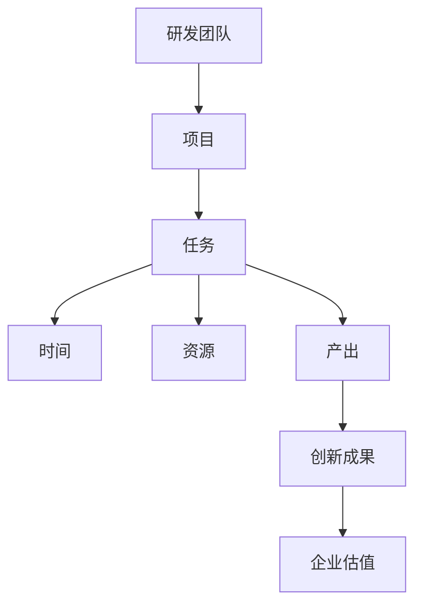
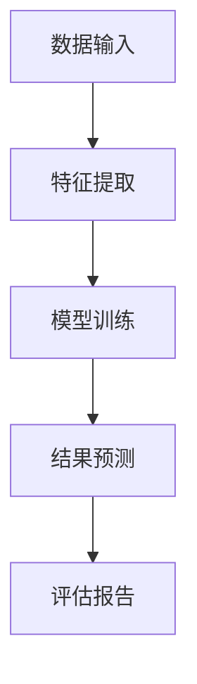
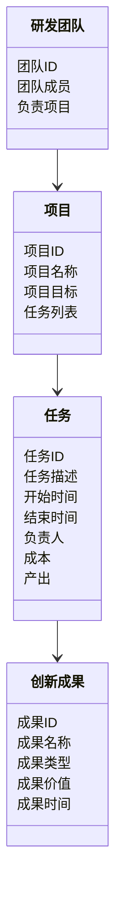
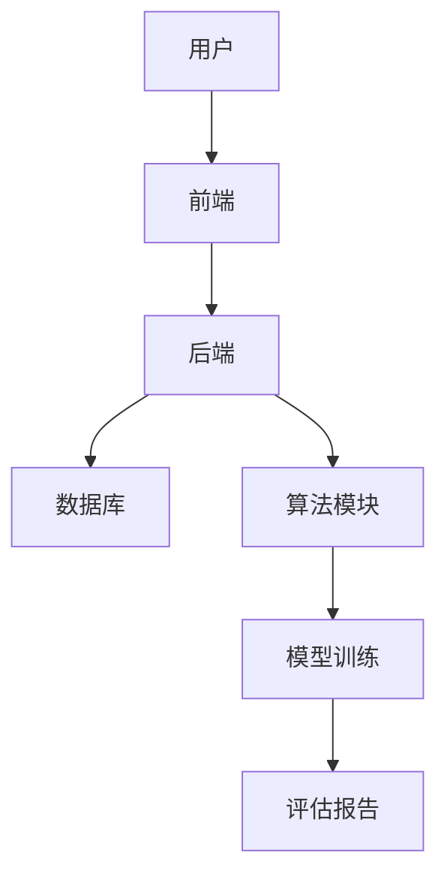

                 


# 企业估值中的研发效率评估

> 关键词：企业估值，研发效率，研发周期，资源利用率，研发产出，研发成本，效率评估

> 摘要：研发效率是企业估值中的关键因素之一，直接影响企业的创新能力和市场竞争力。本文将从研发效率的核心概念、算法原理、系统架构设计、项目实战以及最佳实践等多个维度，全面解析企业估值中的研发效率评估问题。通过深入分析研发效率的多维度评估模型、算法实现、系统架构设计等，为企业提供一套完整的研发效率评估解决方案。

---

## 正文

### 第一部分: 企业估值中的研发效率评估背景与核心概念

#### 第1章: 研发效率评估的背景与问题描述

##### 1.1 研发效率评估的背景
###### 1.1.1 企业估值中的研发效率重要性
研发效率是企业创新能力和竞争力的核心体现。在现代企业中，研发效率直接影响企业的创新周期、成本控制和市场响应能力，进而影响企业的估值。特别是在高科技行业，研发效率更是决定企业能否在竞争中占据优势地位的关键因素。

###### 1.1.2 当前企业研发效率评估的痛点
- 研发效率评估缺乏统一标准，难以量化。
- 数据分散，难以整合和分析。
- 传统评估方法注重短期产出，忽视长期创新能力的培养。
- 部门间协作不足，导致资源浪费和效率低下。

###### 1.1.3 提升研发效率对企业估值的影响
- 提高研发效率可以缩短产品上市时间，加快资金周转，提升企业盈利能力。
- 高效的研发团队能够更快响应市场需求，增强企业的市场竞争力。
- 研发效率的提升通常伴随着成本的降低，从而提高企业的净利润率，进而提升企业估值。

##### 1.2 研发效率评估的核心问题
###### 1.2.1 研发效率的定义与边界
研发效率是指在一定时间内，研发团队完成高质量创新成果的能力。它不仅关注研发速度，还注重研发成果的质量和可持续性。

###### 1.2.2 研发效率评估的关键维度
- 研发周期：从需求提出到产品交付的时间长度。
- 资源利用率：研发团队的人力、时间和资金的使用效率。
- 产出质量：研发成果的创新性和实用性。
- 成本控制：研发过程中的成本节约能力。

###### 1.2.3 研发效率与企业估值的关系
研发效率高的企业通常具有更强的市场竞争力和创新能力，能够更快地将技术转化为市场价值，从而提高企业的估值。

#### 第2章: 研发效率评估的核心概念与联系

##### 2.1 核心概念原理
###### 2.1.1 研发效率的多维度评估模型
研发效率评估模型通常包括以下几个维度：
1. **时间维度**：研发周期、任务完成速度。
2. **资源维度**：人力、资金、设备的使用效率。
3. **质量维度**：创新成果的质量、实用性。
4. **成本维度**：研发成本与预期收益的匹配度。

###### 2.1.2 研发效率与资源分配的关系
合理的资源分配能够显著提高研发效率。例如，通过优化团队结构和任务分配，可以减少资源浪费，提高整体效率。

###### 2.1.3 研发效率与创新产出的关联
高效率的研发团队通常能够更快地产生高质量的创新成果，从而为企业创造更大的市场价值。

##### 2.2 核心概念对比分析
###### 2.2.1 传统研发效率评估方法 vs 现代方法
- 传统方法：主要关注研发周期和资源利用率，忽视创新质量和可持续性。
- 现代方法：采用多维度评估模型，结合大数据分析和人工智能技术，实现更精准的评估。

###### 2.2.2 研发效率 vs 研发速度 vs 研发质量
| 比较维度 | 研发效率 | 研发速度 | 研发质量 |
|----------|----------|----------|----------|
| 定义     | 单位时间内完成高质量创新成果的能力 | 单位时间内完成任务的数量 | 创新成果的创新性和实用性 |
| 关注点   | 整体产出效率 | 任务完成速度 | 成果质量 |
| 评估方式 | 多维度模型 | 量化指标 | 客观评价 |

###### 2.2.3 研发效率与企业生命周期的匹配
企业生命周期的不同阶段对研发效率的需求也不同。例如，初创企业需要快速迭代和试错，而成熟企业则需要稳定和高效的创新。

##### 2.3 实体关系图（ER图）架构


---

### 第二部分: 研发效率评估的算法原理与数学模型

#### 第3章: 研发效率评估的核心算法

##### 3.1 数据收集与预处理
###### 3.1.1 研发数据的分类
研发数据主要包括以下几类：
- 人员数据：研发团队的规模、人员构成。
- 时间数据：任务完成时间、研发周期。
- 成本数据：研发成本、资金投入。
- 产出数据：创新成果的数量、质量和市场价值。

###### 3.1.2 数据清洗与标准化
- 数据清洗：去除重复数据、处理缺失值、纠正异常值。
- 数据标准化：将数据转换为统一的格式，便于后续分析。

###### 3.1.3 数据特征提取
提取关键特征，例如：
- 人均研发产出（研发产出 / 团队规模）。
- 单位时间研发成本（研发成本 / 研发周期）。

##### 3.2 算法原理与流程
###### 3.2.1 算法选择
我们选择线性回归模型来评估研发效率。线性回归是一种简单且有效的回归分析方法，适用于预测连续型变量。

###### 3.2.2 算法流程


##### 3.3 算法实现
###### 3.3.1 线性回归模型
```python
import numpy as np
import matplotlib.pyplot as plt

# 示例数据
X = np.array([1, 2, 3, 4, 5])
y = np.array([2, 3, 5, 4, 6])

# 训练模型
model = np.polyfit(X, y, 1)
print("模型参数：", model)

# 预测结果
y_pred = np.polyval(model, X)
print("预测结果：", y_pred)

# 可视化
plt.scatter(X, y, color='red')
plt.plot(X, y_pred, color='blue')
plt.xlabel('研发周期')
plt.ylabel('研发产出')
plt.show()
```

###### 3.3.2 数学模型
研发效率评估的线性回归模型可以表示为：
$$
y = a x + b
$$
其中，$y$ 是研发产出，$x$ 是研发周期，$a$ 和 $b$ 是模型参数。

---

### 第三部分: 系统分析与架构设计

#### 第4章: 系统分析与架构设计

##### 4.1 问题场景介绍
企业需要一个能够实时监控和评估研发效率的系统，以便快速调整研发策略，优化资源配置。

##### 4.2 系统功能设计
###### 4.2.1 领域模型


##### 4.3 系统架构设计
###### 4.3.1 系统架构图


---

### 第四部分: 项目实战

#### 第5章: 项目实战

##### 5.1 环境安装
- 安装Python和必要的库（如numpy、pandas、scikit-learn）。
- 安装Jupyter Notebook用于数据可视化和算法实现。

##### 5.2 系统核心实现
###### 5.2.1 核心代码
```python
import numpy as np
from sklearn.linear_model import LinearRegression
from sklearn.metrics import mean_squared_error

# 示例数据
X = np.array([[1], [2], [3], [4], [5]])
y = np.array([2, 3, 5, 4, 6])

# 训练模型
model = LinearRegression()
model.fit(X, y)

# 预测结果
y_pred = model.predict(X)
print("预测结果：", y_pred)

# 评估模型
mse = mean_squared_error(y, y_pred)
print("均方误差：", mse)

print("模型系数：", model.coef_)
print("模型截距：", model.intercept_)
```

---

### 第五部分: 最佳实践与总结

#### 第6章: 最佳实践与总结

##### 6.1 小结
研发效率评估是企业估值中的关键环节，需要从多维度进行分析和优化。

##### 6.2 注意事项
- 数据质量是评估的基础，必须确保数据的准确性和完整性。
- 在实际应用中，应结合企业的实际情况调整评估模型。

##### 6.3 拓展阅读
- 《企业研发管理：从战略到执行》
- 《数据驱动的创新：用大数据优化企业研发效率》

---

作者：AI天才研究院/AI Genius Institute & 禅与计算机程序设计艺术/Zen And The Art of Computer Programming

