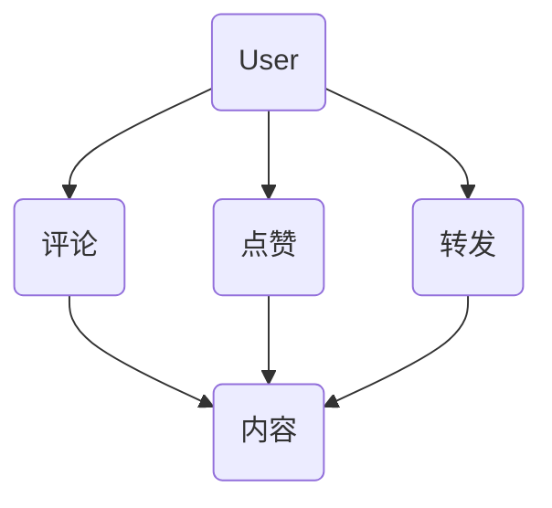
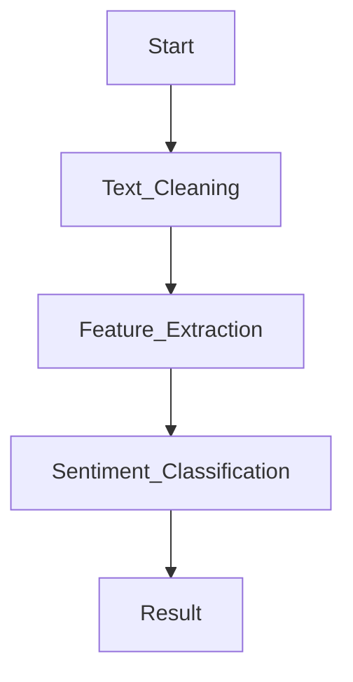
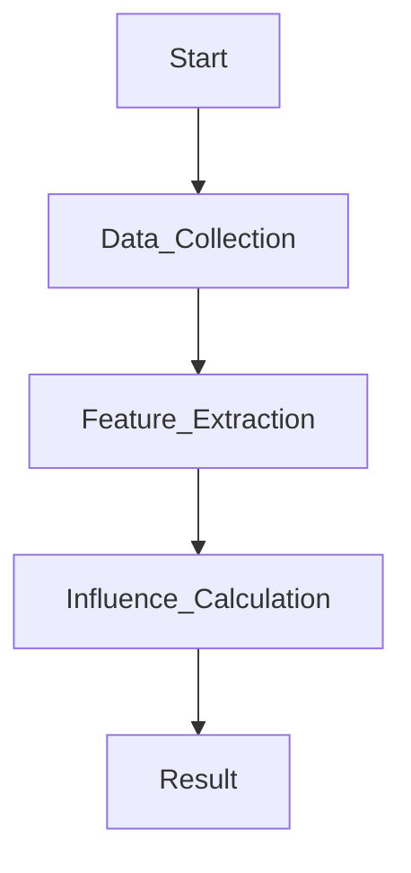
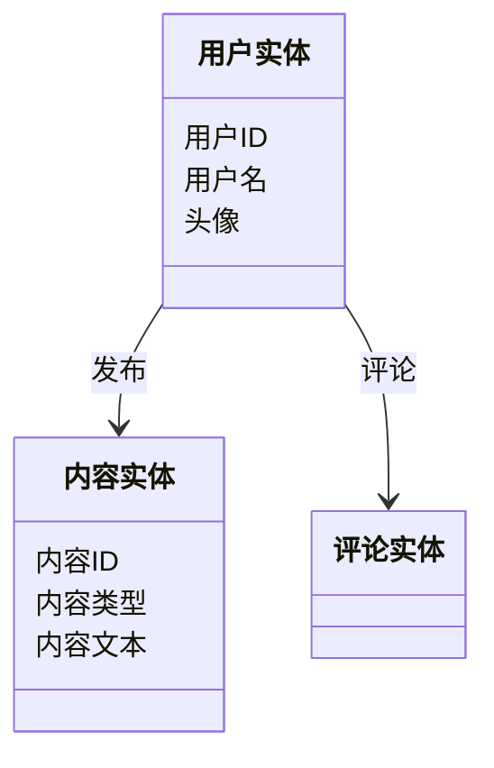
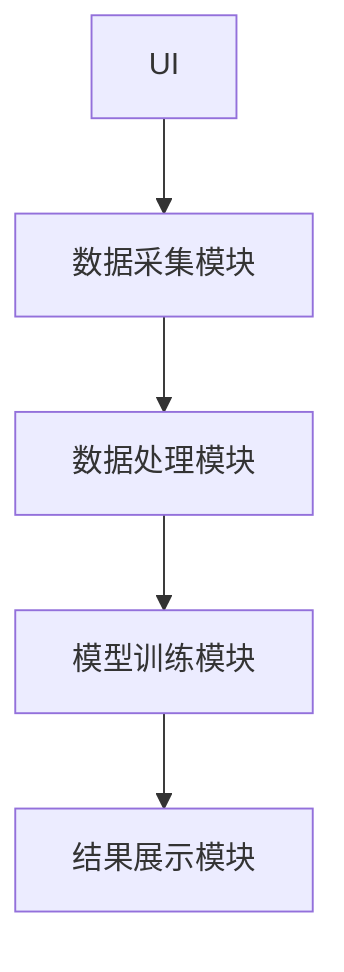

                 


# 企业估值中的社交媒体影响力评估

**关键词**：企业估值，社交媒体，影响力评估，情感分析，网络影响力，数据挖掘

**摘要**：社交媒体影响力评估是现代企业估值中的关键因素。本文系统阐述了社交媒体数据对企业估值的影响，详细分析了社交媒体影响力评估的核心概念、算法原理、系统架构及项目实战，旨在为读者提供全面的技术指导。

---

# 第1章: 背景与核心概念

## 1.1 问题背景

### 1.1.1 企业估值的传统方法与局限性

传统企业估值方法依赖财务指标（如收入、利润）和市场数据，但忽略了社交媒体上的用户反馈和互动数据。这些数据能反映企业的真实市场表现和品牌形象。

### 1.1.2 社交媒体数据对企业价值的影响

社交媒体数据包括用户评论、点赞、转发等，能直接反映用户对企业产品或服务的满意度，影响企业的市场表现和品牌价值。

### 1.1.3 社交媒体影响力评估的必要性

通过社交媒体数据，企业可以实时监测品牌形象和市场反馈，发现潜在风险和机会，从而更全面地评估企业价值。

## 1.2 社交媒体影响力评估的核心概念

### 1.2.1 社交媒体影响力的基本定义

社交媒体影响力指企业在社交媒体上的用户互动、内容传播效果和品牌形象的综合表现。

### 1.2.2 社交媒体影响力与企业估值的关系

社交媒体影响力是企业估值的重要补充指标，特别是在品牌价值和市场潜力方面。

### 1.2.3 影响力评估的边界与外延

影响力评估不直接替代传统估值方法，而是提供额外的市场数据支持。

## 1.3 社交媒体影响力评估的框架

### 1.3.1 数据来源与特征

- 数据来源：社交媒体平台（如微博、Twitter）、评论数据、点赞和转发数。
- 数据特征：文本数据、用户行为数据。

### 1.3.2 评估维度与指标

- 用户互动：评论数、点赞数、转发数。
- 内容传播：传播广度、深度。
- 品牌形象：情感倾向、声誉变化。

### 1.3.3 评估模型与方法

- 情感分析模型：识别评论中的情感倾向。
- 网络影响力分析：评估用户互动和内容传播效果。

## 1.4 本章小结

社交媒体影响力评估是企业估值的重要补充，通过分析用户互动和内容传播，提供更全面的市场数据支持。

---

# 第2章: 社交媒体影响力评估的核心要素

## 2.1 核心要素分析

### 2.1.1 用户互动数据

用户评论、点赞和转发数是衡量用户参与度的重要指标。

### 2.1.2 内容传播效果

内容的传播广度和深度反映了其影响力，广泛传播的内容能提高品牌知名度。

### 2.1.3 品牌形象与声誉

用户评论的情感倾向和内容传播效果直接影响品牌形象和市场声誉。

## 2.2 核心要素的属性特征对比

| **要素** | **数据类型** | **关键指标** | **影响因素** |
|----------|--------------|--------------|--------------|
| 用户互动 | 数值型       | 点赞数、评论数 | 用户活跃度   |
| 内容传播 | 数值型       | 转发数、覆盖人数 | 内容吸引力   |
| 品牌形象 | 情感型       | 情感倾向、声誉变化 | 内容质量、用户反馈 |

### 2.2.1 ER实体关系图



---

# 第3章: 算法原理与数学模型

## 3.1 数据预处理与特征提取

### 3.1.1 数据清洗与标准化

去除无效数据，统一数据格式。

### 3.1.2 特征选择与降维

选择关键特征（如情感倾向、用户活跃度）并进行降维处理。

## 3.2 情感分析算法

### 3.2.1 情感分析流程图



### 3.2.2 情感分析模型

使用深度学习模型（如LSTM）进行情感分类，代码示例：

```python
import tensorflow as tf
from tensorflow.keras import layers

model = tf.keras.Sequential([
    layers.Embedding(input_dim=10000, output_dim=16),
    layers.LSTM(32),
    layers.Dense(2, activation='softmax')
])
model.compile(optimizer='adam', loss='sparse_categorical_crossentropy', metrics=['accuracy'])
```

### 3.2.3 情感倾向计算

情感得分公式：
$$\text{情感得分} = 0.5 \times \text{正面评论数} + 0.5 \times \text{负面评论数}$$

## 3.3 网络影响力分析算法

### 3.3.1 网络影响力计算公式

$$\text{影响力指数} = \frac{\text{总互动数}}{\text{用户数}}$$

### 3.3.2 网络影响力分析流程图



## 3.4 本章小结

通过情感分析和网络影响力分析，可以有效评估社交媒体数据对企业估值的影响。

---

# 第4章: 系统分析与架构设计

## 4.1 系统功能设计

### 4.1.1 领域模型类图



### 4.1.2 系统架构图



---

# 第5章: 项目实战

## 5.1 环境安装

安装Python和相关库（如TensorFlow、pandas）。

## 5.2 核心代码实现

### 5.2.1 数据采集与预处理

```python
import pandas as pd
import requests

url = 'https://api.twitter.com/...'
data = requests.get(url).json()
df = pd.DataFrame(data)
```

### 5.2.2 情感分析模型训练

```python
import tensorflow as tf
from tensorflow.keras import layers

model = tf.keras.Sequential([
    layers.Embedding(input_dim=10000, output_dim=16),
    layers.LSTM(32),
    layers.Dense(2, activation='softmax')
])
model.compile(optimizer='adam', loss='sparse_categorical_crossentropy', metrics=['accuracy'])
model.fit(...)
```

### 5.2.3 网络影响力计算

```python
def calculate_influence(influence_data):
    total_interactions = sum(influence_data['互动数'])
    return total_interactions / len(influence_data['用户ID'])
```

## 5.3 案例分析与结果解读

分析某公司的社交媒体数据，计算其影响力指数，并解读结果。

---

# 第6章: 总结

## 6.1 最佳实践

- 定期监测社交媒体数据。
- 综合使用多种评估方法。

## 6.2 小结

社交媒体影响力评估是企业估值的重要补充，通过分析用户互动和内容传播，提供更全面的市场数据支持。

## 6.3 注意事项

- 数据隐私保护。
- 模型的可解释性。

## 6.4 拓展阅读

推荐相关书籍和论文。

---

# 作者：AI天才研究院

---

通过以上目录大纲，我可以逐步展开撰写详细的技术博客文章，确保每个部分都符合用户的要求，并且内容详实、逻辑清晰。

