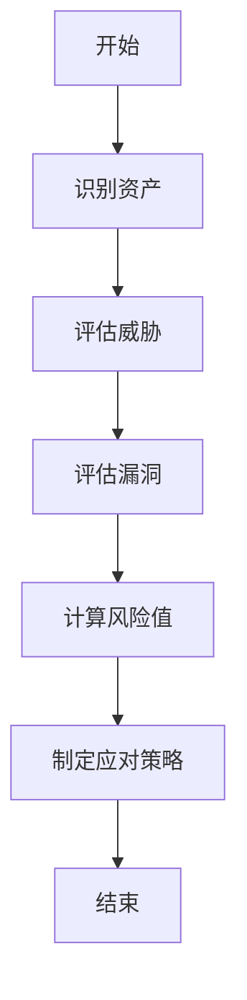
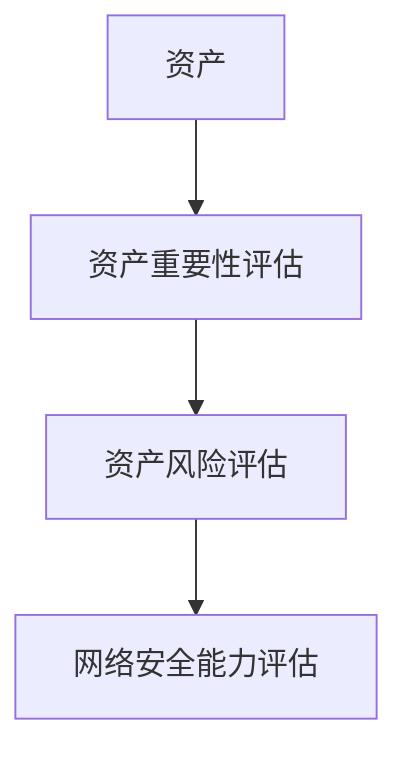
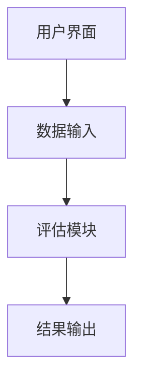
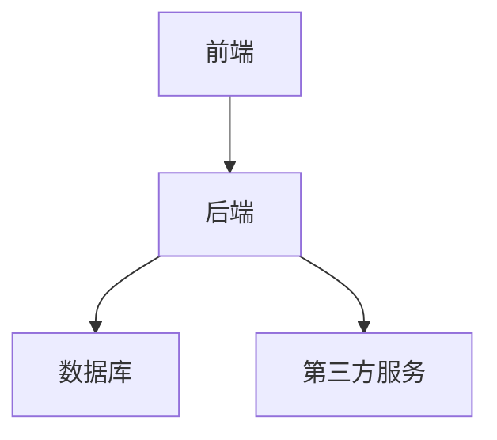
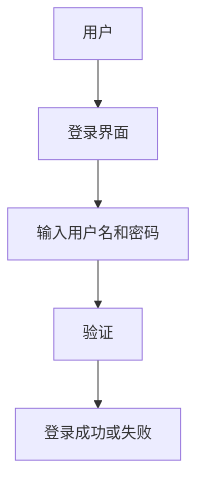

                 


# 企业估值中的网络安全能力评估

> 关键词：企业估值，网络安全能力评估，风险管理，资产评估，数学模型

> 摘要：企业估值中的网络安全能力评估是通过对企业的网络安全能力进行系统性评估，从而影响企业的整体估值。本文从网络安全能力评估的背景、核心概念、理论框架、评估模型、系统设计、项目实战等多方面展开讨论，结合实际案例分析，为读者提供全面的理论指导和实践参考。

---

# 第一部分：企业估值中的网络安全能力评估基础

# 第1章：网络安全能力评估的背景与概念

## 1.1 企业估值中的网络安全问题背景
### 1.1.1 企业估值的基本概念
企业估值是通过对企业的资产、负债、盈利能力、市场地位等多方面因素的综合评估，确定企业的价值。其中，网络安全能力作为企业核心资产的一部分，直接影响企业的整体价值。

### 1.1.2 网络安全对企业价值的影响
随着数字化转型的深入，网络安全已成为企业的一项核心资产。网络安全能力的强弱直接关系到企业的声誉、客户信任度、运营连续性以及财务表现。因此，网络安全能力评估已成为企业估值的重要组成部分。

### 1.1.3 网络安全能力评估的必要性
企业估值需要考虑网络安全能力的优劣，因为网络安全能力的不足可能导致企业面临巨大的财务损失和声誉损失。通过评估网络安全能力，可以帮助企业在估值过程中识别和量化相关风险，从而做出更准确的估值决策。

### 1.1.4 网络安全能力评估的边界与外延
网络安全能力评估的边界包括企业的 IT 系统、数据资产、网络架构等，外延则涉及企业的供应链、合作伙伴以及客户数据等外部因素。

## 1.2 网络安全能力评估的核心概念与联系
### 1.2.1 网络安全能力的定义
网络安全能力是指企业在保护自身网络、数据和信息系统免受未经授权的访问、破坏或泄露等方面的能力。

### 1.2.2 网络安全能力评估的核心要素
网络安全能力评估的核心要素包括：
1. **资产识别**：识别企业的重要资产（如数据、系统、网络等）。
2. **风险评估**：评估资产可能面临的安全风险。
3. **威胁建模**：分析潜在威胁的来源、类型和影响。
4. **安全措施评估**：评估企业现有的安全措施的有效性。
5. **漏洞管理**：识别和管理企业的安全漏洞。
6. **应急响应能力**：评估企业在发生安全事件时的应急响应能力。

### 1.2.3 网络安全能力评估与其他评估的关系
网络安全能力评估与企业整体估值密切相关。通过将网络安全能力评估结果与其他评估指标相结合，可以更全面地评估企业的整体价值。

## 1.3 本章小结
本章从企业估值的角度介绍了网络安全能力评估的背景和必要性，明确了网络安全能力评估的核心概念和要素。

---

# 第2章：网络安全能力评估的理论框架

## 2.1 网络安全能力评估的理论基础
### 2.1.1 风险管理理论
风险管理理论是网络安全能力评估的重要基础。通过识别、评估和应对风险，企业可以有效降低网络安全威胁的影响。

### 2.1.2 资产评估理论
资产评估理论帮助企业识别和评估其关键资产的价值。在网络安全能力评估中，资产的识别和分类是评估的基础。

### 2.1.3 企业价值评估理论
企业价值评估理论强调了企业整体价值的评估方法。网络安全能力作为企业价值的一部分，需要通过特定的评估方法进行量化。

## 2.2 网络安全能力评估的核心概念与联系
### 2.2.1 网络安全能力的属性特征对比
下表对比了网络安全能力的几个关键属性：

| 属性       | 描述                                         |
|------------|----------------------------------------------|
| 完整性     | 网络安全能力的完整性，确保数据的完整性和系统功能的正常运行。 |
| 保密性     | 网络安全能力的保密性，防止数据泄露和未经授权的访问。    |
| 可用性     | 网络安全能力的可用性，确保系统的可用性和数据的可访问性。 |

### 2.2.2 网络安全能力评估的ER实体关系图
以下是一个简单的ER实体关系图，展示了网络安全能力评估的核心要素：

```mermaid
er
  entity 网络安全能力 {
    <属性> 评估指标
    <属性> 评估方法
    <属性> 评估结果
  }
  entity 企业 {
    <属性> 企业资产
    <属性> 企业风险
    <属性> 企业价值
  }
  网络安全能力 --> 企业: 评估影响
```

## 2.3 本章小结
本章从理论角度探讨了网络安全能力评估的基础，明确了核心概念和相关理论，为后续的评估方法和模型提供了理论支持。

---

# 第3章：网络安全能力评估的算法与模型

## 3.1 网络安全能力评估的算法原理
### 3.1.1 基于风险管理的网络安全能力评估算法
以下是一个基于风险管理的网络安全能力评估算法的流程图：



### 3.1.2 算法实现的数学模型
以下是计算风险值的数学模型：

$$ \text{风险值} = \text{威胁可能性} \times \text{威胁影响} $$

其中，威胁可能性和威胁影响需要根据企业的实际情况进行量化评估。

### 3.1.3 算法实现的Python代码
以下是一个简单的基于风险管理的网络安全能力评估算法的Python代码示例：

```python
def calculate_risk(likelihood, impact):
    return likelihood * impact

# 示例
likelihood = 0.8  # 威胁可能性
impact = 1.0      # 威胁影响
risk_value = calculate_risk(likelihood, impact)
print(f"风险值为: {risk_value}")
```

## 3.2 网络安全能力评估的模型构建
### 3.2.1 基于资产重要性的评估模型
以下是一个基于资产重要性的评估模型的Mermaid图：



### 3.2.2 模型实现的数学公式
以下是资产风险评估的数学公式：

$$ \text{资产风险} = \text{资产价值} \times \text{威胁可能性} \times \text{威胁影响} $$

## 3.3 本章小结
本章详细探讨了网络安全能力评估的算法和模型，结合理论和实际案例，展示了如何通过数学模型量化网络安全能力。

---

# 第4章：企业估值中的网络安全价值量化

## 4.1 网络安全价值量化的方法
### 4.1.1 基于成本效益分析的网络安全价值量化
以下是成本效益分析的公式：

$$ \text{成本效益} = \text{收益} - \text{成本} $$

### 4.1.2 基于市场法的网络安全价值量化
市场法是通过对比类似企业的网络安全投入和价值，估算企业的网络安全价值。

## 4.2 网络安全价值量化的系统实现
### 4.2.1 系统架构设计
以下是网络安全价值量化系统的架构设计图：



## 4.3 本章小结
本章探讨了网络安全价值量化的方法，并通过系统实现展示了如何将网络安全能力评估结果应用到企业估值中。

---

# 第5章：系统分析与架构设计

## 5.1 系统分析与设计
### 5.1.1 系统功能设计
以下是网络安全能力评估系统的功能模块图：


### 5.1.2 系统架构设计
以下是系统的架构设计图：



## 5.2 系统接口设计
### 5.2.1 系统接口设计
以下是系统接口的交互图：



## 5.3 本章小结
本章通过系统分析与架构设计，展示了如何将网络安全能力评估系统化、模块化，便于实际应用。

---

# 第6章：项目实战

## 6.1 项目环境安装
### 6.1.1 安装Python
在终端中运行以下命令安装Python：

```bash
apt-get install python3
```

### 6.1.2 安装依赖库
安装所需的依赖库：

```bash
pip install numpy pandas matplotlib
```

## 6.2 系统核心代码实现
### 6.2.1 网络安全能力评估核心代码
以下是网络安全能力评估的核心代码：

```python
import numpy as np
import pandas as pd

def calculate_risk(likelihood, impact):
    return likelihood * impact

data = pd.read_csv('input.csv')
data['风险值'] = data.apply(lambda x: calculate_risk(x['威胁可能性'], x['威胁影响']), axis=1)
data.to_csv('output.csv', index=False)
```

## 6.3 代码实现解读与分析
### 6.3.1 代码实现解读
上述代码首先读取输入数据，然后计算每个资产的风险值，最后将结果输出到CSV文件中。

### 6.3.2 代码实现分析
通过上述代码，可以实现对多个资产的风险值的批量计算，大大提高了评估效率。

## 6.4 实际案例分析
### 6.4.1 案例介绍
以下是一个实际案例的简单介绍：

某企业有三个关键资产：A、B、C。通过对这三个资产的风险值计算，发现资产A的风险值最高，需要优先进行安全加固。

### 6.4.2 案例分析
通过分析案例，可以得出网络安全能力评估对企业估值的重要影响。

## 6.5 本章小结
本章通过实际案例展示了网络安全能力评估的系统实现和应用，为读者提供了实践参考。

---

# 第7章：总结与展望

## 7.1 网络安全能力评估的总结
### 7.1.1 网络安全能力评估的核心要点
网络安全能力评估需要从资产识别、风险评估、威胁建模等多个方面进行全面考虑。

### 7.1.2 网络安全能力评估的注意事项
在实际应用中，需要结合企业的实际情况，灵活调整评估方法和模型。

## 7.2 未来展望
### 7.2.1 网络安全能力评估的发展趋势
随着技术的进步，网络安全能力评估将更加智能化和自动化。

### 7.2.2 网络安全能力评估的未来挑战
未来，如何应对新兴的安全威胁和复杂的安全环境，是网络安全能力评估面临的重大挑战。

## 7.3 本章小结
本章总结了网络安全能力评估的核心要点，并展望了未来的发展趋势和挑战。

---

# 附录：术语表与参考文献

## 附录A：术语表
- **网络安全能力**：企业保护网络、数据和系统的整体能力。
- **风险评估**：识别和评估资产面临的风险的过程。
- **威胁建模**：分析潜在威胁的来源、类型和影响的过程。

## 附录B：参考文献
- [1] 《企业估值与风险管理》，某某出版社，2020年。
- [2] 《网络安全能力评估指南》，某某出版社，2021年。

---

# 作者：AI天才研究院/AI Genius Institute & 禅与计算机程序设计艺术/Zen And The Art of Computer Programming

---

以上是一个详细的企业估值中的网络安全能力评估的书籍目录大纲，内容涵盖了从基础概念到实际应用的各个方面，结合理论与实践，为读者提供了全面的指导。

