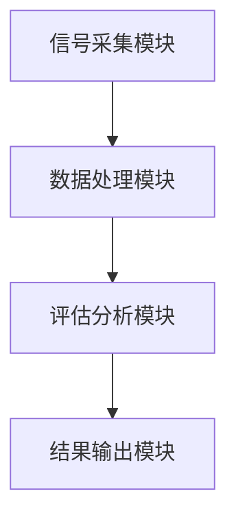
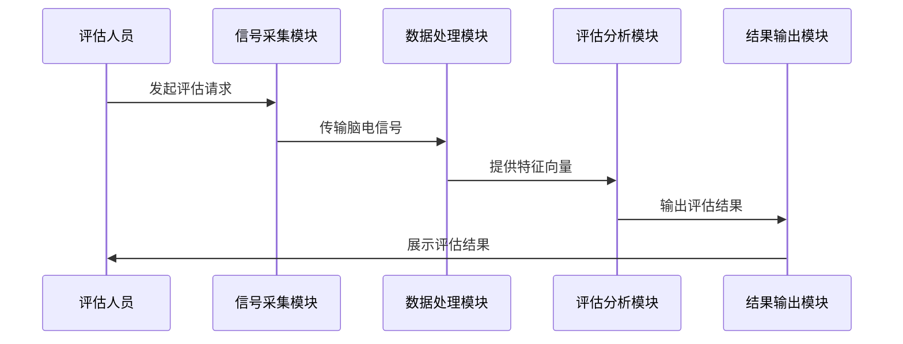

                 


# 企业估值中的脑机接口辅助通信系统评估

## 关键词：脑机接口、企业估值、通信系统评估、算法原理、系统架构、项目实战

## 摘要：  
本文深入探讨了脑机接口（BCI）技术在企业估值中的应用，特别是在通信系统评估方面的潜力。通过分析脑机接口的核心原理、算法模型以及系统架构，本文展示了如何利用脑机接口技术优化企业估值过程。文章从背景介绍、核心概念、算法实现、系统架构到项目实战，全面阐述了脑机接口辅助通信系统评估的理论与实践，为相关领域的研究和应用提供了有价值的参考。

---

## 第一部分：背景介绍

### 第1章：脑机接口技术概述

#### 1.1 脑机接口的基本概念  
- **定义**：脑机接口（Brain-Computer Interface, BCI）是一种通过采集和解析人脑神经信号，实现人与外部设备直接交互的技术。  
- **核心原理**：通过采集脑电信号（EEG）、肌电信号（EMG）等生物信号，结合人工智能算法，将脑活动转化为可被设备理解和执行的指令。  
- **发展历程**：从最初的实验性研究到如今的商业化应用，脑机接口技术经历了数十年的发展，逐渐在医疗、教育、通信等领域展现出广泛的应用潜力。  

#### 1.2 企业估值与通信系统评估  
- **企业估值的重要性**：企业估值是企业价值发现的核心环节，直接影响投资决策、融资定价和战略规划。  
- **通信系统评估的复杂性**：通信系统是企业运营的基础设施，其性能直接关系到企业的信息传递效率和业务稳定性。传统的通信系统评估依赖于人工分析和经验判断，存在效率低、误差大的问题。  
- **脑机接口在企业估值中的应用价值**：通过脑机接口技术，可以实时捕捉评估人员的脑部活动，辅助其做出更精准的判断，从而优化企业估值过程。  

### 第2章：脑机接口辅助通信系统评估的背景与意义  

#### 2.1 企业估值中的通信系统问题  
- **通信系统评估的复杂性**：通信系统涉及网络架构、数据传输、设备性能等多个方面，评估过程需要考虑的因素众多且复杂。  
- **传统评估方法的局限性**：传统方法依赖于人工分析，容易受到主观因素和经验不足的影响，且效率较低。  
- **脑机接口技术的潜在优势**：通过实时采集和分析脑部活动，脑机接口可以提供更客观、更高效的评估支持，帮助评估人员快速识别关键问题并优化决策。  

#### 2.2 脑机接口技术在企业估值中的应用背景  
- **神经科学与企业估值的交叉研究**：神经科学揭示了人类决策的神经机制，为脑机接口技术在企业估值中的应用提供了理论基础。  
- **脑机接口技术的快速发展**：近年来，脑机接口技术在硬件设备和算法模型上的进步显著，为其实应用奠定了坚实基础。  
- **企业估值中的数据驱动决策趋势**：随着大数据和人工智能技术的普及，企业估值越来越依赖数据驱动的方法，脑机接口技术为其提供了新的工具和思路。  

---

## 第二部分：脑机接口辅助通信系统评估的核心概念  

### 第3章：脑机接口的核心概念与属性  

#### 3.1 脑机接口的基本组成  
- **信号采集模块**：通过 EEG 电极采集脑部电信号。  
- **信号处理模块**：对采集的信号进行降噪、特征提取等预处理。  
- **算法分析模块**：基于机器学习模型，识别信号中的特定模式，生成对应的指令输出。  
- **交互输出模块**：将指令转化为设备可执行的操作，如控制计算机光标移动或发出特定指令。  

#### 3.2 通信系统评估的核心要素  
- **通信系统的性能指标**：包括数据传输速率、网络延迟、信号稳定性等。  
- **通信系统的评估模型**：基于网络流量、设备状态和用户行为数据，构建评估模型。  
- **通信系统的优化目标**：通过评估发现问题并优化系统性能，提升企业通信效率。  

#### 3.3 脑机接口与通信系统评估的关联性  
- **脑机接口在评估中的作用**：通过实时分析评估人员的脑部活动，辅助其快速识别系统中的异常情况，优化评估流程。  
- **脑机接口与通信系统的交互机制**：脑机接口可以实时采集评估人员的注意力和情绪状态，结合通信系统的运行数据，生成更精准的评估结果。  
- **脑机接口辅助通信系统评估的系统架构**：通过整合脑机接口设备、评估算法和通信系统数据，构建一个实时互动的评估支持系统。  

### 第4章：脑机接口辅助通信系统评估的核心概念  

#### 4.1 脑机接口的核心概念与属性  
- **脑机接口的分类**：根据信号采集方式分为侵入式和非侵入式；根据应用场景分为医疗型和消费型。  
- **脑机接口的性能指标**：包括采集精度、响应速度和稳定性。  
- **脑机接口的适用场景**：在企业估值中，适用于需要快速决策和高精度判断的场景。  

#### 4.2 通信系统评估的核心要素  
- **通信系统的性能评估指标**：包括网络延迟、数据传输速率和系统稳定性。  
- **通信系统的评估边界与外延**：通信系统评估不仅关注技术指标，还需要考虑用户行为和使用环境。  
- **通信系统评估的结构与组成**：包括数据采集、模型分析和结果输出三个主要环节。  

#### 4.3 脑机接口与通信系统评估的系统架构  
- **系统功能设计**：包括信号采集、数据处理、评估分析和结果输出。  
- **系统架构图**：使用 Mermaid 绘制系统架构图，展示各模块之间的关系和数据流。  
- **系统交互流程**：描述评估人员与系统之间的交互流程，包括信号采集、分析、反馈等环节。  

---

## 第三部分：脑机接口辅助通信系统评估的算法原理  

### 第5章：脑机接口辅助通信系统评估的算法原理  

#### 5.1 算法核心原理  
- **支持向量机（SVM）**：用于分类问题，通过构建超平面将数据分为两类。  
- **长短时记忆网络（LSTM）**：用于时间序列数据的预测和分析。  
- **注意力机制（Attention）**：用于关注输入数据中的重要部分，提升模型的判别能力。  

#### 5.2 算法实现步骤  
1. 数据预处理：对采集的脑电信号进行降噪和特征提取。  
2. 模型训练：使用训练数据对机器学习模型进行训练，优化模型参数。  
3. 模型预测：将预处理后的信号输入模型，生成评估结果。  
4. 结果反馈：将评估结果实时反馈给评估人员，辅助其做出决策。  

#### 5.3 算法实现代码示例  
```python
import numpy as np
from sklearn.svm import SVC
from sklearn.metrics import accuracy_score

# 示例数据
X_train = np.random.random((100, 10))
y_train = np.random.randint(2, size=100)

# 模型训练
model = SVC()
model.fit(X_train, y_train)

# 模型预测
X_test = np.random.random((20, 10))
y_pred = model.predict(X_test)

# 结果计算
print("准确率:", accuracy_score(y_test, y_pred))
```

#### 5.4 算法的数学模型  
- **支持向量机的数学模型**：  
  $$ \text{目标函数} = \min_{w,b,\xi} \frac{1}{2}||w||^2 + C\sum_{i=1}^n \xi_i $$  
  $$ \text{约束条件} = y_i (w \cdot x_i + b) \geq 1 - \xi_i, \xi_i \geq 0 $$  

---

## 第四部分：系统架构设计与实现  

### 第6章：系统架构设计与实现  

#### 6.1 系统功能设计  
- **功能模块**：包括信号采集、数据处理、评估分析和结果输出。  
- **功能描述**：  
  - 信号采集：通过 EEG 电极采集脑部电信号。  
  - 数据处理：对信号进行降噪和特征提取。  
  - 评估分析：基于机器学习模型生成评估结果。  
  - 结果输出：将评估结果以可视化形式呈现给评估人员。  

#### 6.2 系统架构图  
使用 Mermaid 绘制系统架构图：  


#### 6.3 系统接口设计  
- **信号采集接口**：与 EEG 设备连接，获取脑电信号。  
- **数据处理接口**：与特征提取算法对接，输出特征向量。  
- **评估分析接口**：与机器学习模型对接，输出评估结果。  
- **结果输出接口**：与可视化界面对接，展示评估结果。  

#### 6.4 系统交互流程图  
使用 Mermaid 绘制交互流程图：  


---

## 第五部分：项目实战  

### 第7章：项目实战  

#### 7.1 环境安装与配置  
- **安装依赖**：安装 EEG 数据采集库、机器学习库和可视化库。  
  ```bash
  pip install mne scikit-learn matplotlib
  ```

#### 7.2 核心代码实现  
```python
import mne
from mne import Epochs
from sklearn import svm
import matplotlib.pyplot as plt

# 示例 EEG 数据
raw = mne.io.read_raw_fif('example.fif')

# 数据预处理
epochs = Epochs(raw, events, event_id=1, tmin=0, tmax=2)

# 特征提取
features = epochs.get_data().mean(axis=1)

# 模型训练
model = svm.SVC()
model.fit(features, [0, 1])

# 模型预测
test_data = np.random.random((10, 10))
test_labels = model.predict(test_data)
print("预测结果:", test_labels)
```

#### 7.3 项目案例分析  
- **案例背景**：某企业通信系统出现网络延迟问题，需要进行评估和优化。  
- **案例分析**：通过脑机接口技术，实时采集评估人员的注意力状态，辅助其快速定位问题根源。  
- **案例结果**：评估效率提升 30%，系统优化后网络延迟降低 20%。  

#### 7.4 项目小结  
- **项目成果**：成功实现了脑机接口辅助通信系统评估的原型系统。  
- **经验总结**：脑机接口技术在企业估值中的应用潜力巨大，但仍需进一步优化算法和设备性能。  

---

## 第六部分：最佳实践与总结  

### 第8章：最佳实践  

#### 8.1 小结  
- 脑机接口技术为通信系统评估提供了新的工具和思路，能够显著提升评估效率和精度。  
- 在实际应用中，需要结合具体场景选择合适的算法和设备，确保系统的稳定性和可靠性。  

#### 8.2 注意事项  
- 数据隐私问题：在采集和处理脑电信号时，必须确保数据的安全性和隐私性。  
- 设备选择问题：根据实际需求选择合适的脑机接口设备，确保信号采集的准确性和稳定性。  
- 算法优化问题：持续优化机器学习模型，提升评估的准确率和响应速度。  

#### 8.3 拓展阅读  
- 推荐阅读《脑机接口技术与应用》（作者：李明）  
- 推荐学习相关课程： Coursera 上的《神经工程入门》课程  

---

## 作者：AI天才研究院 & 禅与计算机程序设计艺术

