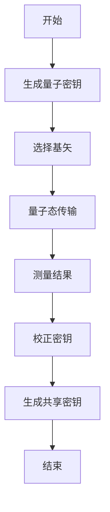
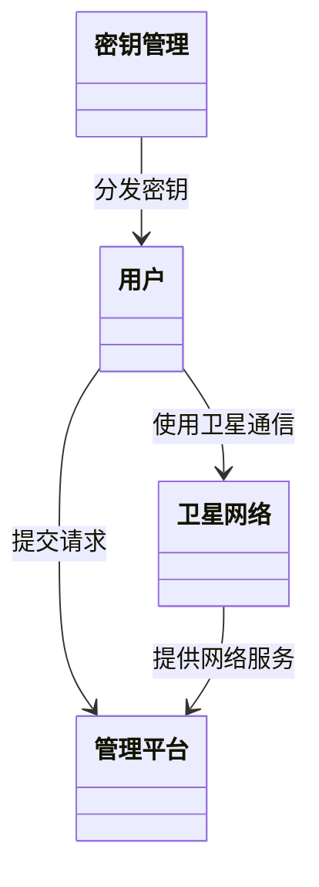
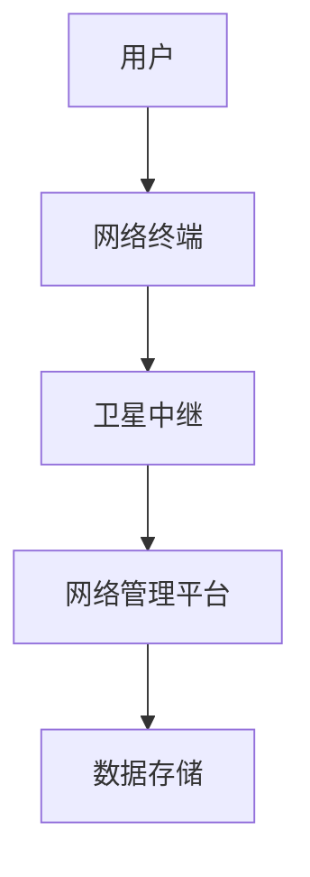

                 


# 企业估值中的量子加密通信卫星网络评估

> **关键词**：企业估值，量子加密通信，卫星网络，通信安全，量子技术

> **摘要**：  
> 在现代企业估值中，信息的安全性和通信的可靠性是决定性的因素。量子加密通信技术以其不可破解的安全性，正在成为企业通信领域的重要突破。然而，量子加密通信技术的实现离不开高效的通信网络，而卫星网络作为全球覆盖的通信基础设施，为量子加密通信提供了理想的传输平台。本文将系统性地分析量子加密通信卫星网络在企业估值中的应用，从技术原理到系统架构，从算法实现到项目实战，全面探讨如何将量子加密通信与卫星网络相结合，为企业估值提供更高效、更安全的解决方案。

---

## 第一章：背景介绍

### 1.1 问题背景

在企业估值过程中，企业的核心竞争力往往依赖于其信息资产的安全性。传统的加密通信技术虽然能够在一定程度上保障数据的安全，但其安全性依赖于密钥的保密性，而一旦密钥被截获或破解，整个通信系统将面临严重的安全风险。此外，随着全球化的发展，企业需要在更广的范围内进行通信和数据传输，而传统的光纤通信和无线通信网络在覆盖范围和传输稳定性上存在局限性。

### 1.2 问题描述

量子加密通信技术的出现，为企业通信提供了一种理论上不可破解的安全解决方案。量子密钥分发（QKD）技术基于量子力学原理，能够在通信双方之间安全地分发加密密钥。然而，量子加密通信技术的实现需要依赖高效的通信网络。卫星网络作为覆盖全球的通信基础设施，具有广域覆盖、高带宽和低延迟的特点，为量子加密通信技术的广泛应用提供了理想的平台。

### 1.3 问题解决

量子加密通信卫星网络的结合，不仅能够提供更高的安全性，还能在更广的范围内实现高效的数据传输。这种结合将为企业估值提供更可靠的通信支持，同时提升企业在全球市场中的竞争力。

### 1.4 边界与外延

量子加密通信卫星网络的应用场景主要集中在高安全需求的领域，如金融、政府、军事等。然而，其覆盖范围和传输效率也受到卫星网络本身的技术限制。因此，在实际应用中需要根据企业的具体需求进行系统设计和优化。

### 1.5 概念结构与核心要素

量子加密通信卫星网络系统的核心要素包括量子密钥分发设备、卫星通信终端、卫星网络管理平台等。这些要素通过协同工作，实现数据的安全传输和管理。

---

## 第二章：核心概念与联系

### 2.1 量子加密通信原理

量子加密通信的核心是量子密钥分发（QKD）。其基本原理是利用量子态的不可克隆性，使得任何对密钥的截获都将被检测到，从而确保密钥的安全性。

#### 2.1.1 量子密钥分发（QKD）的基本原理

量子密钥分发通过生成和分发量子密钥来实现加密通信。量子密钥的安全性基于量子力学的不确定性原理，确保任何第三方无法获取密钥而不被发现。

#### 2.1.2 量子加密通信的数学模型

量子密钥分发的数学模型可以表示为：

$$
\text{密钥生成} = \text{量子态生成} \oplus \text{基矢选择}
$$

其中，$\oplus$ 表示异或操作。

#### 2.1.3 量子加密通信的安全性分析

量子密钥分发的安全性基于量子态的不可测量性和不可克隆性。任何对量子密钥的测量都会改变量子态，从而被通信双方检测到。

### 2.2 卫星网络架构

卫星网络是一种通过卫星中继实现全球通信的网络架构。其核心组成部分包括卫星、地面站和用户终端。

#### 2.2.1 卫星通信的基本架构

卫星通信的基本架构包括发射端、卫星中继和接收端。数据通过地面站发送到卫星，再由卫星转发到目标地面站或用户终端。

#### 2.2.2 卫星网络的分层结构

卫星网络通常采用分层架构，包括空间段、地面段和用户段。空间段由卫星组成，地面段由地面站和网络管理平台组成，用户段由用户终端组成。

#### 2.2.3 卫星网络的组网方式

卫星网络可以采用多种组网方式，如星状网络、网状网络和混合网络。不同的组网方式适用于不同的应用场景。

### 2.3 核心概念对比表

| **核心概念**       | **量子加密通信**                   | **卫星网络**                     |
|--------------------|------------------------------------|-----------------------------------|
| 安全性             | 理论上不可破解                     | 需依赖传统加密技术               |
| 覆盖范围           | 依赖卫星网络实现全球覆盖           | 可实现全球覆盖                   |
| 延迟               | 卫星通信延迟较高                   | 受卫星轨道影响                   |
| 应用场景           | 高安全需求领域（金融、政府等）     | 广域通信、应急通信等             |

### 2.4 ER实体关系图

```mermaid
erDiagram
    actor 通信双方 : 用户A和用户B
    actor 卫星网络 : 卫星中继站
    actor 管理平台 : 网络管理平台
    actor 第三方 : 第三方服务提供商
    entity 量子密钥 : 用于加密的密钥
    entity 卫星链路 : 卫星通信链路
    entity 通信数据 : � 待传输的数据
    entity 网络状态 : 网络运行状态信息
    entity 用户终端 : 用户的通信终端设备
    entity 网络日志 : 网络操作记录

    通信双方 --> 量子密钥 : 生成和分发
    通信双方 --> 卫星链路 : 使用卫星通信
    卫星链路 --> 卫星网络 : 数据传输
    卫星网络 --> 管理平台 : 网络管理
    管理平台 --> 网络日志 : 记录操作
    用户终端 --> 卫星链路 : 数据传输
```

---

## 第三章：算法原理讲解

### 3.1 量子密钥分发算法

#### 3.1.1 BB84协议流程

BB84协议是最早提出的量子密钥分发协议，其流程如下：

1. 通信双方协商选择基矢；
2. 通过量子态传输和测量，生成密钥；
3. 对测量结果进行筛选和校正，最终生成共享密钥。

#### 3.1.2 EPR对的生成与分发

EPR对的生成基于量子纠缠原理，通信双方通过共享EPR对，实现密钥的分发。

#### 3.1.3 密钥生成与验证

密钥生成过程如下：

1. 通信双方通过量子态传输生成初始密钥；
2. 通过基矢校正，消除错误；
3. 最终生成共享密钥。

### 3.2 卫星网络通信算法

#### 3.2.1 卫星链路的自适应调制

卫星链路的自适应调制算法根据信道状态调整调制方式，以提高通信效率。

#### 3.2.2 卫星网络的路由算法

卫星网络的路由算法通过动态调整路由路径，确保数据的高效传输。

#### 3.2.3 卫星网络的流量控制

卫星网络的流量控制算法通过调整数据传输速率，防止网络拥塞。

### 3.3 算法流程图



---

## 第四章：系统分析与架构设计

### 4.1 系统功能设计

#### 4.1.1 领域模型类图



#### 4.1.2 系统架构图



---

## 第五章：项目实战

### 5.1 环境安装

安装量子加密通信卫星网络系统需要以下环境：

1. 量子密钥分发设备；
2. 卫星通信终端；
3. 网络管理平台；
4. 用户终端设备。

### 5.2 核心代码实现

#### 5.2.1 量子密钥生成代码

```python
import random

def generate_qubit():
    # 生成随机量子态
    basis = random.choice(['+x', '-x', '+y', '-y'])
    qubit = random.choice([0, 1])
    return basis, qubit

def measure_qubit(basis, qubit):
    # 根据基矢和量子态进行测量
    if basis == '+x':
        return qubit ^ random.choice([0, 1])
    elif basis == '-x':
        return qubit
    elif basis == '+y':
        return qubit
    elif basis == '-y':
        return qubit ^ random.choice([0, 1])
    else:
        return qubit
```

#### 5.2.2 卫星通信代码

```python
import socket

def satellite_communication(data):
    # 连接卫星通信网络
    with socket.socket(socket.AF_INET, socket.SOCK_DGRAM) as sock:
        sock.sendto(data.encode(), ('卫星地址', 5000))
        response, addr = sock.recvfrom(1024)
        return response.decode()
```

---

## 第六章：总结与展望

### 6.1 总结

量子加密通信卫星网络的结合为企业估值提供了更高效、更安全的通信支持。通过量子密钥分发技术，企业可以实现通信数据的绝对安全；通过卫星网络，企业可以实现全球范围内的高效通信。

### 6.2 展望

随着量子技术的不断发展和卫星网络的不断完善，量子加密通信卫星网络将在更多领域得到应用，为企业估值和全球通信提供更强大的技术支持。

---

**作者：AI天才研究院/AI Genius Institute & 禅与计算机程序设计艺术 /Zen And The Art of Computer Programming**

