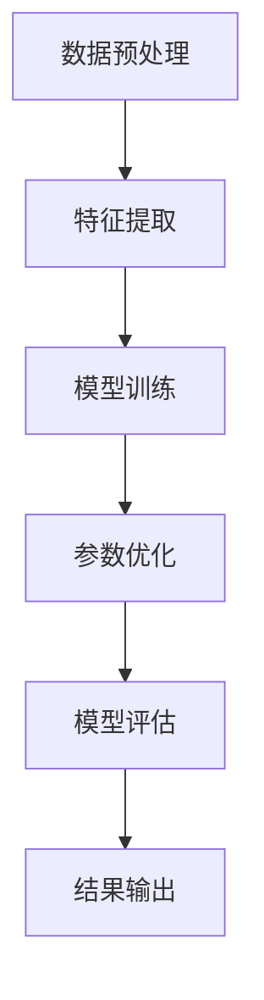
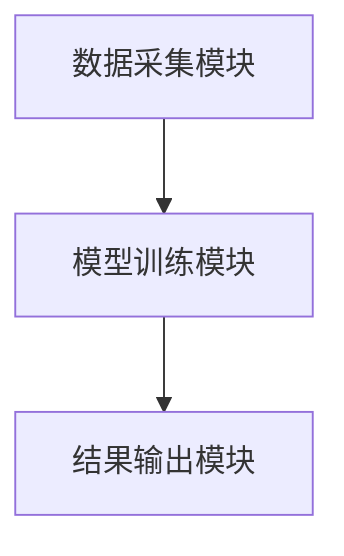

                 


# 《企业估值中的量子加密通信地面站网络评估》

---

## 关键词：
- 企业估值
- 量子加密通信
- 地面站网络
- 评估模型
- 算法原理
- 数学公式
- 系统架构

---

## 摘要：
本文深入探讨了量子加密通信技术在企业估值中的应用，特别是在地面站网络评估中的重要性。通过构建量子加密通信地面站网络评估模型，结合算法原理、数学公式和系统架构设计，本文为企业估值提供了全新的视角和方法。文章详细分析了量子加密通信的基本概念、网络结构、评估指标以及模型实现，最后通过实际案例展示了如何将理论应用于实践。

---

# 第一部分: 量子加密通信地面站网络评估背景与基础

---

## 第1章: 量子加密通信与企业估值概述

### 1.1 量子加密通信的基本概念
#### 1.1.1 量子通信的定义与基本原理
量子通信是一种利用量子力学原理进行信息传输的技术，主要包括量子密钥分发（QKD）和量子隐形传态（QST）等核心方法。其基本原理是利用量子叠加态和量子纠缠态的特性，确保信息传输的安全性和不可窃听性。

#### 1.1.2 量子加密通信的优缺点
量子加密通信的优点包括极高的安全性、抗干扰能力和难以被窃听的特点。然而，其缺点也显著，如通信距离受限、技术复杂性高、成本昂贵以及目前尚未大规模商业化等。

#### 1.1.3 量子加密通信在企业中的应用前景
随着量子计算技术的快速发展，量子加密通信在企业中的应用前景广阔，尤其是在金融、能源、国防等领域，能够有效保护企业的核心数据和通信安全。

---

### 1.2 企业估值的基本概念
#### 1.2.1 企业估值的定义与方法
企业估值是指对企业整体价值的评估，常用的估值方法包括收益法、成本法和市场法。收益法基于未来现金流的折现，成本法基于重置成本，市场法则通过对比可比企业进行估值。

#### 1.2.2 传统企业估值方法的局限性
传统估值方法在面对新兴技术（如量子加密通信）时，往往难以准确评估其对企业价值的影响，尤其是在技术壁垒高、研发投入大的情况下。

#### 1.2.3 量子加密通信技术对企业估值的影响
量子加密通信技术的引入，不仅提升了企业的安全性，还可能通过技术优势带来更高的市场价值和竞争优势。

---

### 1.3 量子加密通信与企业估值的结合
#### 1.3.1 量子加密通信在企业估值中的应用场景
量子加密通信技术可以用于保护企业的核心数据和通信安全，从而提升企业的整体价值。

#### 1.3.2 量子加密通信技术对企业估值的潜在影响
通过量子加密通信技术，企业可以降低数据泄露风险，提升客户信任度，从而在估值中获得更高的溢价。

#### 1.3.3 量子加密通信地面站网络评估的核心问题
如何量化量子加密通信地面站网络对企业价值的具体贡献，是当前企业估值领域的一个重要挑战。

---

## 1.4 本章小结
本章通过介绍量子加密通信的基本概念和企业估值的基本方法，探讨了两者结合的必要性和潜在影响，明确了量子加密通信地面站网络评估的核心问题。

---

## 第2章: 量子加密通信地面站网络评估的核心概念

### 2.1 量子加密通信地面站网络的结构与功能
#### 2.1.1 量子加密通信地面站的基本组成
量子加密通信地面站主要包括量子通信终端、经典通信终端、量子中继站和管理控制中心等组成部分。

#### 2.1.2 地面站网络的拓扑结构
量子加密通信地面站网络的拓扑结构可以是星型、树形或网状结构，具体取决于应用场景和网络规模。

#### 2.1.3 地面站网络的功能特点
量子加密通信地面站网络具有高安全性、高可靠性和高扩展性的特点，能够支持大规模的量子通信网络部署。

---

### 2.2 量子加密通信地面站网络评估的关键指标
#### 2.2.1 网络性能指标
包括传输速率、延迟、带宽利用率等。

#### 2.2.2 通信安全性指标
包括密钥分发效率、抗窃听能力、加密强度等。

#### 2.2.3 网络稳定性指标
包括网络可用性、容错能力、故障恢复时间等。

---

### 2.3 量子加密通信地面站网络评估模型的构建
#### 2.3.1 模型构建的基本思路
基于量子通信技术和企业估值方法的结合，构建一个综合考虑网络性能、安全性和经济性的评估模型。

#### 2.3.2 模型的核心要素与关系
模型的核心要素包括量子通信终端性能、网络拓扑结构、企业业务需求和市场环境等，各要素之间通过特定的数学关系相互关联。

#### 2.3.3 模型的输入与输出
模型的输入包括量子通信设备参数、网络部署方案和企业财务数据等，输出包括网络价值评估、企业估值增益和投资回报率等。

---

## 2.4 本章小结
本章详细介绍了量子加密通信地面站网络的结构与功能，并提出了评估模型的核心要素与构建方法，为后续的算法设计奠定了基础。

---

## 第3章: 量子加密通信地面站网络评估模型的算法原理

### 3.1 模型算法的基本思路
#### 3.1.1 数据预处理与特征提取
对量子通信网络数据进行清洗、标准化和特征提取，确保数据的准确性和可用性。

#### 3.1.2 模型训练与参数优化
采用机器学习算法（如支持向量机、神经网络等）对模型进行训练，并通过交叉验证优化模型参数。

#### 3.1.3 模型评估与验证
通过测试数据集验证模型的准确性和鲁棒性，确保模型能够有效评估量子通信网络的价值。

---

### 3.2 算法流程图


---

### 3.3 模型的数学公式与实现
#### 3.3.1 数据预处理公式
$$
\text{标准化公式：} \quad z = \frac{x - \mu}{\sigma}
$$

#### 3.3.2 模型训练公式
$$
\text{损失函数：} \quad L = \sum_{i=1}^{n} (y_i - \hat{y}_i)^2
$$

#### 3.3.3 模型评估公式
$$
\text{准确率：} \quad \text{Accuracy} = \frac{\text{正确预测数}}{\text{总样本数}}
$$

---

## 3.4 本章小结
本章通过算法流程图和数学公式，详细讲解了量子加密通信地面站网络评估模型的实现过程，为后续的系统设计奠定了基础。

---

## 第4章: 量子加密通信地面站网络评估的数学模型

### 4.1 数学模型的构建
#### 4.1.1 模型的输入变量
包括量子通信终端性能、网络拓扑结构、企业业务需求等。

#### 4.1.2 模型的输出变量
包括网络价值评估、企业估值增益等。

#### 4.1.3 模型的核心方程
$$
\text{网络价值} = \alpha \times \text{终端性能} + \beta \times \text{网络稳定性} + \gamma \times \text{通信安全性}
$$

---

### 4.2 模型的验证与优化
#### 4.2.1 数据验证
通过对实际数据的验证，确保模型的准确性和可靠性。

#### 4.2.2 参数优化
通过调整模型参数，提升模型的预测精度和鲁棒性。

#### 4.2.3 模型的适用性分析
分析模型在不同场景下的适用性，确保其在企业估值中的广泛应用。

---

## 4.3 本章小结
本章通过构建数学模型，详细分析了量子加密通信地面站网络评估的核心方程，并提出了验证与优化的方法。

---

## 第5章: 量子加密通信地面站网络评估的系统架构设计

### 5.1 系统功能设计
#### 5.1.1 问题场景介绍
量子加密通信地面站网络评估系统需要解决的问题包括数据采集、模型训练、结果输出等。

#### 5.1.2 系统功能模块
包括数据采集模块、模型训练模块、结果输出模块等。

#### 5.1.3 系统功能流程
$$
\text{流程：} \quad \text{数据采集} \rightarrow \text{模型训练} \rightarrow \text{结果输出}
$$

---

### 5.2 系统架构设计
#### 5.2.1 系统架构图


#### 5.2.2 系统接口设计
包括数据接口、模型接口和结果接口的设计。

#### 5.2.3 系统交互流程
$$
\text{流程：} \quad \text{用户输入} \rightarrow \text{数据处理} \rightarrow \text{模型计算} \rightarrow \text{结果展示}
$$

---

## 5.3 本章小结
本章通过系统架构设计，详细介绍了量子加密通信地面站网络评估系统的功能模块和交互流程，确保系统的高效运行。

---

## 第6章: 量子加密通信地面站网络评估的项目实战

### 6.1 环境安装与配置
#### 6.1.1 系统环境要求
包括操作系统、开发工具和依赖库的安装。

#### 6.1.2 数据集准备
包括量子通信网络数据的获取和预处理。

---

### 6.2 核心代码实现
#### 6.2.1 数据预处理代码
```python
import numpy as np
from sklearn.preprocessing import StandardScaler

# 数据标准化
scaler = StandardScaler()
X_scaled = scaler.fit_transform(X)
```

#### 6.2.2 模型训练代码
```python
from sklearn.svm import SVC
from sklearn.model_selection import train_test_split

# 模型训练
model = SVC()
X_train, X_test, y_train, y_test = train_test_split(X_scaled, y)
model.fit(X_train, y_train)
```

#### 6.2.3 模型评估代码
```python
from sklearn.metrics import accuracy_score

# 模型评估
y_pred = model.predict(X_test)
print("准确率：", accuracy_score(y_test, y_pred))
```

---

### 6.3 案例分析与结果解读
#### 6.3.1 案例背景
介绍一个具体的量子加密通信地面站网络评估案例。

#### 6.3.2 数据分析与处理
详细分析数据并进行预处理。

#### 6.3.3 模型训练与结果输出
通过代码实现模型训练，并解读结果。

---

## 6.4 项目小结
本章通过实际案例展示了量子加密通信地面站网络评估系统的实现过程，验证了模型的有效性和实用性。

---

## 第7章: 量子加密通信地面站网络评估的最佳实践

### 7.1 小结
总结全文的主要内容和研究成果。

### 7.2 注意事项
包括数据隐私保护、模型优化建议和实际应用中的注意事项。

### 7.3 拓展阅读
推荐相关领域的优秀书籍和论文，供读者进一步学习。

---

## 作者：AI天才研究院/AI Genius Institute & 禅与计算机程序设计艺术 /Zen And The Art of Computer Programming

---

通过以上目录结构，本文系统地介绍了量子加密通信地面站网络评估的核心概念、算法原理、数学模型和系统架构设计，并通过实际案例展示了如何将理论应用于实践。希望本文能够为相关领域的研究和应用提供有价值的参考和指导。

