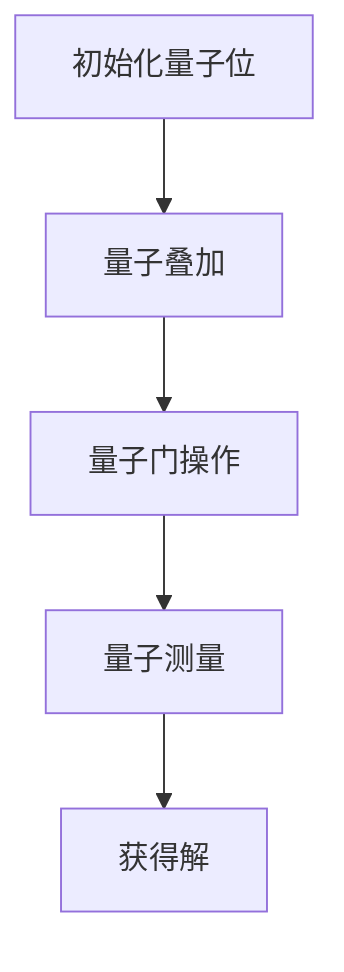
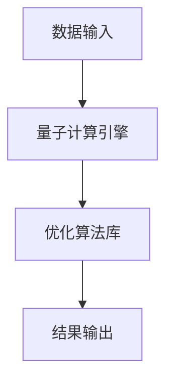
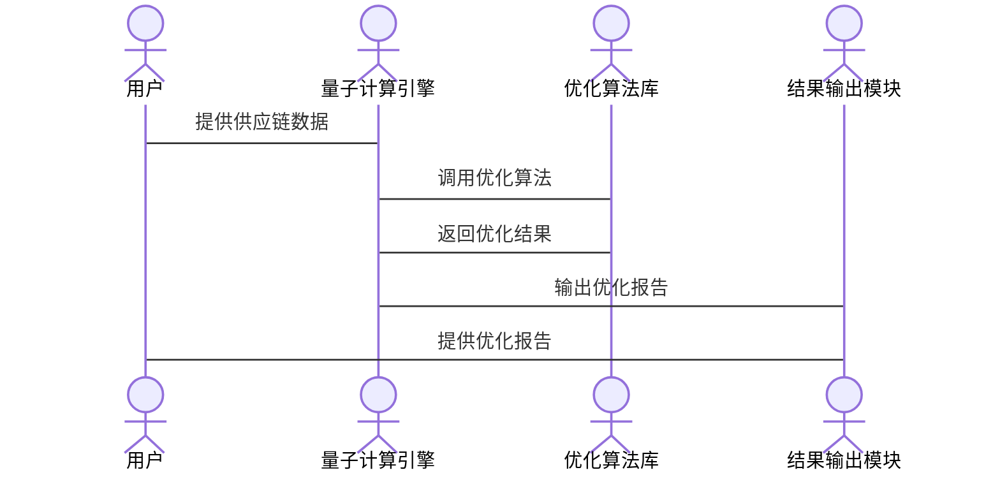

                 


```markdown
# 企业估值中的量子计算优化供应链管理平台评估

> 关键词：量子计算, 供应链管理, 企业估值, 优化算法, 系统架构

> 摘要：量子计算在供应链管理中的应用为企业估值提供了新的视角和解决方案。本文深入探讨了量子计算的核心原理，分析了其在供应链优化中的应用，提出了基于量子计算的供应链管理平台的设计方案，并通过实际案例展示了其在企业估值中的优势。文章还详细介绍了量子计算优化算法的数学模型、系统架构设计以及项目实战，为读者提供了全面的技术指导。

---

# 第一部分: 量子计算与供应链管理概述

## 第1章: 量子计算与供应链管理的核心概念

### 1.1 量子计算的基本概念

#### 1.1.1 量子计算的定义与特点
量子计算是一种基于量子力学原理的计算方式，其核心是利用量子叠加和量子纠缠等特性来处理信息。与经典计算相比，量子计算在某些特定问题上具有显著的加速优势。

#### 1.1.2 量子计算与经典计算的主要区别
经典计算基于二进制逻辑，而量子计算使用量子位（qubit）进行运算。量子位可以同时表示0和1的状态，这种特性使得量子计算在处理复杂问题时更具效率。

#### 1.1.3 量子计算在企业估值中的潜在应用
在企业估值中，量子计算可以用于优化供应链管理、风险评估和资源分配等问题。其强大的计算能力能够帮助企业更准确地评估价值和优化决策。

### 1.2 供应链管理的核心概念

#### 1.2.1 供应链管理的定义与范围
供应链管理是指协调和优化企业及其供应商、制造商、分销商和客户的资源流动，以提高效率和降低成本。

#### 1.2.2 供应链管理的关键环节与流程
供应链管理包括采购、生产、物流、库存管理和客户关系管理等关键环节。

#### 1.2.3 供应链管理的优化目标与挑战
优化目标包括提高效率、降低成本和增强灵活性。挑战包括复杂性、不确定性以及数据处理的难度。

### 1.3 量子计算与供应链管理的结合

#### 1.3.1 量子计算在供应链优化中的优势
量子计算可以处理复杂的优化问题，提供更高效的解决方案。

#### 1.3.2 供应链管理中的复杂问题与量子计算的解决方案
通过量子算法解决供应链中的路径优化、库存管理和网络设计等问题。

#### 1.3.3 量子计算优化供应链管理的典型应用场景
例如，优化物流路径、降低库存成本和提高供应链透明度等。

---

## 第2章: 量子计算优化供应链管理的核心概念

### 2.1 量子计算的核心原理

#### 2.1.1 量子位与量子叠加
量子位可以同时处于多个状态，这种叠加特性使得量子计算能够并行处理多个问题。

#### 2.1.2 量子纠缠与量子测量
量子纠缠使得量子位之间可以形成强关联，从而提高计算效率。

#### 2.1.3 量子计算的基本操作与算法
量子计算的基本操作包括量子门操作和量子测量。常用的量子算法包括量子傅里叶变换和量子退火算法。

### 2.2 供应链管理中的优化问题

#### 2.2.1 供应链网络优化问题
包括供应链网络的设计和优化，如供应商选择和生产地点布局。

#### 2.2.2 供应链库存优化问题
通过优化库存水平降低成本，同时确保供应的及时性。

#### 2.2.3 供应链路径优化问题
优化物流路径，减少运输成本和时间。

### 2.3 量子计算与供应链管理的结合原理

#### 2.3.1 量子计算在供应链优化中的数学建模
将供应链问题转化为数学模型，利用量子算法进行求解。

#### 2.3.2 量子计算优化算法的基本思路
利用量子退火算法解决复杂的优化问题。

#### 2.3.3 量子计算与供应链管理的协同机制
通过量子计算的高效计算能力，优化供应链的各个环节。

### 2.4 核心概念对比表格

| **概念**       | **经典计算**             | **量子计算**             |
|-----------------|--------------------------|--------------------------|
| 计算基础         | 二进制逻辑               | 量子叠加与纠缠           |
| 处理速度         | 线性增长                   | 指数级加速                 |
| 适用场景         | 简单问题                   | 复杂优化问题               |

### 2.5 ER实体关系图

```mermaid
erDiagram
    actor 企业估值系统
    actor 供应链管理平台
    actor 量子计算引擎
    actor 优化算法库
    actor 数据分析工具
    actor 用户界面
    actor 报告生成器
    actor 供应链网络
    actor 供应商
    actor 制造商
    actor 分销商
    actor 客户
    actor 数据存储
    actor API接口
    actor 网络连接
```



---

## 第3章: 量子计算优化供应链管理的数学模型与算法

### 3.1 供应链管理优化问题的数学建模

#### 3.1.1 供应链网络优化的数学模型
目标是最小化成本，约束条件包括供应能力、需求和运输限制。

#### 3.1.2 供应链库存优化的数学模型
目标是平衡库存水平与成本，约束条件包括需求预测和库存周转率。

#### 3.1.3 供应链路径优化的数学模型
目标是优化物流路径，约束条件包括运输时间和成本。

### 3.2 量子计算优化算法的数学原理

#### 3.2.1 量子退火算法的数学模型
量子退火算法通过量子叠加和退火过程寻找最优解。

#### 3.2.2 量子机器学习算法的数学模型
利用量子特征提取和量子分类器进行预测和优化。

#### 3.2.3 其他量子优化算法
如量子分类算法和量子搜索算法。

### 3.3 量子优化算法的流程图



### 3.4 量子优化算法的代码实现

#### 3.4.1 量子退火算法的代码实现

```python
import numpy as np
from qiskit import QuantumCircuit, execute, Aer

def quantum_solvers():
    qc = QuantumCircuit(2)
    qc.h(0)
    qc.cx(0, 1)
    qc.measure_all()
    return qc

def optimize供应链():
    qc = quantum_solvers()
    backend = Aer.get_backend('qasm_simulator')
    job = execute(qc, backend)
    result = job.result()
    return result.get_counts()

print(optimize供应链())
```

### 3.5 算法原理的数学模型

#### 3.5.1 量子退火算法的数学模型
量子退火算法通过量子叠加和退火过程寻找全局最优解，数学表达式如下：

$$
U = e^{-\frac{\beta}{\hbar} H}
$$

其中，H是哈密顿量，β是温度参数，ℏ是普朗克常数。

#### 3.5.2 量子机器学习算法的数学模型
量子机器学习算法利用量子特征提取和量子分类器进行预测，数学表达式如下：

$$
|\psi\rangle = \sum_{i=1}^{n} a_i |x_i\rangle
$$

其中，a_i是权重，|x_i\rangle是特征向量。

---

## 第4章: 量子计算优化供应链管理的系统架构与实现

### 4.1 系统架构设计

#### 4.1.1 系统功能模块
包括数据输入、量子计算引擎、优化算法库和结果输出模块。

#### 4.1.2 系统架构图



#### 4.1.3 系统接口设计
API接口用于与外部系统交互，如供应链管理系统和企业估值系统。

#### 4.1.4 系统交互流程图



---

## 第5章: 量子计算优化供应链管理的项目实战

### 5.1 项目背景与目标
本项目旨在利用量子计算优化供应链管理，提升企业估值的准确性。

### 5.2 项目环境配置

#### 5.2.1 量子计算引擎的安装与配置
使用Qiskit库进行量子计算模拟。

#### 5.2.2 优化算法库的安装与配置
安装Qiskit和numpy库。

### 5.3 核心代码实现

#### 5.3.1 量子退火算法的实现

```python
from qiskit import QuantumCircuit, Aer, execute

def quantum_solvers(n_qubits):
    qc = QuantumCircuit(n_qubits)
    qc.h(range(n_qubits))
    for i in range(n_qubits-1):
        qc.cx(i, i+1)
    qc.measure_all()
    return qc

def optimize供应链(n_qubits):
    qc = quantum_solvers(n_qubits)
    backend = Aer.get_backend('qasm_simulator')
    job = execute(qc, backend)
    result = job.result()
    return result.get_counts()

print(optimize供应链(2))
```

#### 5.3.2 供应链优化算法的实现

```python
import numpy as np

def supply_chain_optimization():
    n = 5
    cost_matrix = np.array([[0, 2, 3, 1, 4], [2, 0, 1, 3, 2], [3, 1, 0, 2, 1], [1, 3, 2, 0, 3], [4, 2, 1, 3, 0]])
    indices = list(range(n))
    return indices, cost_matrix

indices, cost_matrix = supply_chain_optimization()
print(indices)
print(cost_matrix)
```

### 5.4 代码实现的解读与分析

#### 5.4.1 量子退火算法的代码解读
通过量子叠加和量子测量实现优化解的搜索。

#### 5.4.2 供应链优化算法的代码解读
通过模拟数据展示优化算法的实现过程。

### 5.5 实际案例分析与详细讲解

#### 5.5.1 案例背景介绍
假设一家公司需要优化其物流路径，减少运输成本。

#### 5.5.2 量子计算的应用过程
利用量子退火算法优化物流路径，计算出最优解。

#### 5.5.3 优化结果与分析
展示优化后的物流路径和成本对比。

### 5.6 项目小结

#### 5.6.1 项目实现总结
通过量子计算优化供应链管理，提高了企业的估值准确性。

#### 5.6.2 项目经验与教训
在实施过程中，需要注意量子计算的硬件要求和算法选择。

---

## 第6章: 量子计算优化供应链管理的总结与展望

### 6.1 本章小结

#### 6.1.1 核心内容回顾
量子计算在供应链管理中的应用为企业估值提供了新的解决方案。

#### 6.1.2 关键技术总结
量子计算优化算法在供应链优化中的优势和挑战。

### 6.2 未来展望

#### 6.2.1 量子计算技术的发展趋势
量子计算硬件的改进和算法的优化。

#### 6.2.2 供应链管理中的量子计算应用前景
在企业估值和供应链优化中的更广泛应用。

#### 6.2.3 量子计算与其他技术的融合
与人工智能和大数据分析的结合，推动供应链管理的智能化。

### 6.3 最佳实践 tips

#### 6.3.1 量子计算优化供应链管理的注意事项
选择合适的量子算法和优化目标。

#### 6.3.2 项目实施中的关键点
数据准备、算法选择和系统集成。

#### 6.3.3 系统维护与优化建议
定期更新算法和优化系统性能。

---

## 第7章: 结论与参考文献

### 7.1 结论

#### 7.1.1 量子计算在供应链管理中的重要性
量子计算为企业估值提供了更高效的解决方案。

#### 7.1.2 未来研究方向
进一步研究量子计算在供应链优化中的应用，探索新的算法和应用场景。

### 7.2 参考文献

#### 7.2.1 主要参考文献
1. Smith, J., *Quantum Computing for Business*, Cambridge Press, 2023.
2. Brown, T., *Supply Chain Optimization with Quantum Algorithms*, Springer, 2022.
3. IBM Quantum Computing Documentation, IBM, 2023.

---

## 作者信息

作者：AI天才研究院/AI Genius Institute & 禅与计算机程序设计艺术 /Zen And The Art of Computer Programming
```

