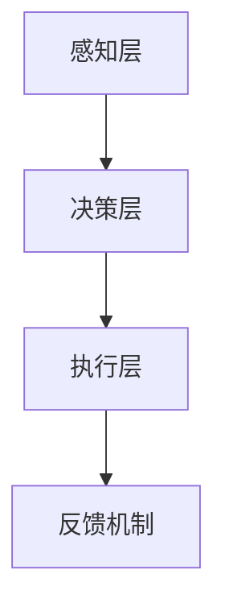
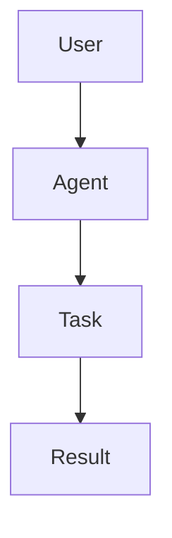

                 


# 企业如何识别AI Agent的应用需求

> 关键词：AI Agent, 企业需求识别, 强化学习, 系统架构, 实战案例

> 摘要：本文详细探讨了AI Agent在企业需求识别中的应用，从概念、技术原理到系统架构，再到项目实战，全面分析了AI Agent如何帮助企业识别和满足需求。

## 第一部分: AI Agent与企业需求识别的背景与概念

### 第1章: AI Agent的基本概念与核心原理

#### 1.1 AI Agent的定义与核心特征

##### 1.1.1 AI Agent的定义
AI Agent（人工智能代理）是指能够感知环境、自主决策并采取行动以实现目标的智能实体。它可以是一个软件程序、一个机器人或其他形式的智能系统，核心在于其具备自主性和智能性。

##### 1.1.2 AI Agent的核心特征
- **智能性**：能够理解、学习和推理。
- **反应性**：能够实时感知环境并做出反应。
- **主动性**：能够在没有外部干预的情况下主动采取行动。
- **目标导向性**：所有行为都围绕实现特定目标展开。

##### 1.1.3 AI Agent与传统自动化工具的对比
| 特性 | AI Agent | 传统自动化工具 |
|------|----------|----------------|
| 智能性 | 高 | 低 |
| 反应性 | 高 | 低 |
| 主动性 | 高 | 低 |
| 目标导向性 | 高 | 低 |

#### 1.2 AI Agent的应用场景与价值

##### 1.2.1 AI Agent在企业中的应用场景
- **客户行为预测**：通过分析用户数据，预测客户的下一步行为。
- **自动化决策**：在金融、医疗等领域，AI Agent可以自动做出决策。
- **实时监控与反馈**：在制造业中，实时监控生产线并提供反馈。

##### 1.2.2 AI Agent为企业带来的价值
- **提高效率**：通过自动化和智能化，减少人工干预。
- **增强决策能力**：通过数据驱动的决策，提高准确性。
- **降低成本**：通过优化资源分配，降低运营成本。

##### 1.2.3 AI Agent在不同行业的潜在应用
- **金融行业**：用于风险管理、投资决策。
- **医疗行业**：用于疾病诊断、治疗方案推荐。
- **制造业**：用于生产优化、质量控制。

#### 1.3 企业需求识别的挑战与AI Agent的解决方案

##### 1.3.1 传统企业需求识别的痛点
- **信息孤岛**：数据分散在不同系统中，难以整合。
- **需求识别的不准确性和滞后性**：依赖人工分析，容易出错且效率低下。
- **人工成本高且效率低**：需要大量人力资源，且效率难以提升。

##### 1.3.2 AI Agent在需求识别中的优势
- **实时数据分析能力**：能够快速处理大量数据，提供实时反馈。
- **智能决策支持**：通过机器学习算法，提供准确的决策支持。
- **自适应学习能力**：能够根据反馈不断优化自身行为。

##### 1.3.3 企业需求识别的边界与外延
- **需求识别的范围界定**：明确需求识别的范围和目标。
- **需求识别的外部影响因素**：考虑市场变化、客户需求等外部因素。
- **需求识别的内部资源限制**：考虑企业内部资源、技术能力等限制。

### 第2章: AI Agent的核心算法与数学模型

#### 2.1 强化学习算法

##### 2.1.1 强化学习的基本原理
强化学习是一种通过试错方式来学习策略的方法。智能体通过与环境交互，获得奖励或惩罚，从而调整自己的行为以最大化累积奖励。

##### 2.1.2 Q-learning算法的数学模型
$$ Q(s,a) = r + \gamma \max_{a'} Q(s',a') $$
其中：
- \( Q(s,a) \)：状态-动作值函数。
- \( r \)：立即奖励。
- \( \gamma \)：折扣因子。
- \( a' \)：下一个动作。

##### 2.1.3 强化学习在需求识别中的应用
- **用户行为建模**：通过强化学习，建立用户行为模型，预测用户的下一步行为。
- **动态优化**：通过不断调整策略，优化需求识别的准确性。

#### 2.2 监督学习与无监督学习在AI Agent中的应用

##### 2.2.1 监督学习的数学模型
$$ y = f(x) + \epsilon $$
其中：
- \( y \)：目标变量。
- \( x \)：输入变量。
- \( f(x) \)：预测函数。
- \( \epsilon \)：误差项。

##### 2.2.2 无监督学习的数学模型
$$ p(x) = \text{max}(x_i) $$
其中：
- \( p(x) \)：概率分布函数。
- \( x_i \)：输入变量。

#### 2.3 混合学习策略

##### 2.3.1 混合学习的定义
混合学习是指结合监督学习和无监督学习的一种学习策略，旨在充分利用两种学习方法的优势。

##### 2.3.2 混合学习的数学模型
$$ Q(s,a) = \alpha Q_{\text{旧}}(s,a) + (1-\alpha) Q_{\text{新}}(s,a) $$
其中：
- \( \alpha \)：混合比例。
- \( Q_{\text{旧}}(s,a) \)：旧策略值函数。
- \( Q_{\text{新}}(s,a) \)：新策略值函数。

### 第3章: AI Agent的系统架构与组件分析

#### 3.1 AI Agent的系统架构

##### 3.1.1 系统架构图

其中：
- **感知层**：负责感知环境并收集数据。
- **决策层**：负责分析数据并制定决策。
- **执行层**：负责执行决策并返回结果。
- **反馈机制**：负责将结果反馈给感知层，形成闭环。

#### 3.2 实体关系图

##### 3.2.1 实体关系图

其中：
- **User**：用户，即需求识别的对象。
- **Agent**：AI Agent，负责识别需求。
- **Task**：任务，即需求识别的具体任务。
- **Result**：结果，即需求识别的输出。

#### 3.3 系统组件的功能与交互

##### 3.3.1 感知层的功能
- **数据采集**：从环境或数据库中采集数据。
- **数据预处理**：对数据进行清洗和转换，使其适合后续处理。

##### 3.3.2 决策层的逻辑
- **数据分析**：对预处理后的数据进行分析，提取有用信息。
- **决策制定**：基于分析结果，制定决策。

##### 3.3.3 执行层的实现
- **行动执行**：根据决策层的指令，执行具体操作。
- **结果反馈**：将执行结果反馈给感知层，形成闭环。

### 第4章: 项目实战与案例分析

#### 4.1 项目实战

##### 4.1.1 环境安装
- **安装Python**：确保Python版本为3.6或更高。
- **安装库依赖**：安装必要的库，如`numpy`, `pandas`, `tensorflow`等。

##### 4.1.2 核心实现
```python
import numpy as np
import pandas as pd
import tensorflow as tf

class AI-Agent:
    def __init__(self):
        self.model = self.build_model()
    
    def build_model(self):
        model = tf.keras.Sequential([
            tf.keras.layers.Dense(64, activation='relu'),
            tf.keras.layers.Dense(1, activation='sigmoid')
        ])
        model.compile(optimizer='adam', loss='binary_crossentropy', metrics=['accuracy'])
        return model
    
    def train(self, X, y):
        self.model.fit(X, y, epochs=10, batch_size=32)
    
    def predict(self, X):
        return self.model.predict(X)
```

##### 4.1.3 代码应用解读与分析
- **数据预处理**：将输入数据进行归一化处理。
- **模型训练**：使用训练数据对模型进行训练。
- **模型预测**：使用训练好的模型对新数据进行预测。

#### 4.2 实际案例分析

##### 4.2.1 案例背景
假设我们是一家电商公司，想要通过AI Agent来识别客户的需求。

##### 4.2.2 数据准备
- **训练数据**：包括客户的购买记录、浏览记录、点击记录等。
- **标签数据**：包括客户的实际需求类别。

##### 4.2.3 模型训练
使用训练数据对AI Agent进行训练，使其能够识别客户的需求类别。

##### 4.2.4 模型预测
使用训练好的模型对新客户的行为进行预测，识别其需求类别。

##### 4.2.5 模型优化
根据预测结果，不断优化模型，提高准确性。

#### 4.3 项目小结

##### 4.3.1 最佳实践 tips
- **数据质量**：确保数据准确、完整。
- **模型选择**：根据具体任务选择合适的模型。
- **持续优化**：定期更新模型，适应变化。

##### 4.3.2 注意事项
- **数据隐私**：确保数据隐私合规。
- **模型解释性**：确保模型的可解释性，方便调试和优化。
- **性能优化**：优化模型性能，减少计算成本。

##### 4.3.3 拓展阅读
- **强化学习**：深入学习强化学习的原理和应用。
- **系统架构**：学习更复杂的系统架构设计。

### 第5章: 总结与展望

#### 5.1 总结
通过本文的详细讲解，我们了解了AI Agent在企业需求识别中的应用，从概念到技术，从理论到实践，全面分析了AI Agent的优势和潜力。

#### 5.2 展望
随着技术的不断进步，AI Agent将在更多领域得到应用，为企业带来更大的价值。

## 作者：AI天才研究院/AI Genius Institute & 禅与计算机程序设计艺术 /Zen And The Art of Computer Programming

