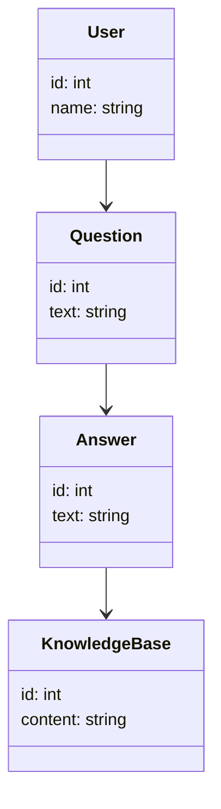

                 


# 企业知识管理：AI Agent的智能问答系统

## 关键词：企业知识管理, AI Agent, 智能问答系统, 自然语言处理, 知识图谱, 系统架构设计, 项目实战

## 摘要：本文深入探讨了企业知识管理与AI Agent在智能问答系统中的应用，分析了智能问答系统的发展历程，详细讲解了知识管理与AI Agent的核心原理，通过实际项目案例展示了如何构建基于AI Agent的智能问答系统，并提供了系统优化与扩展的建议。文章内容涵盖理论与实践，适合技术人员和企业管理者阅读。

---

## 第一部分: 企业知识管理与AI Agent概述

### 第1章: 企业知识管理的基本概念

#### 1.1 什么是企业知识管理

企业知识管理（KM）是系统化地收集、整理、存储、管理和应用企业内部知识的过程。它通过将隐性知识和显性知识转化为可共享和复用的资源，提升企业的决策能力和竞争力。知识管理的核心要素包括：

1. **知识的获取与整理**：通过文档、会议记录、专家访谈等方式收集知识，并进行分类和结构化。
2. **知识的存储与组织**：将知识存储在数据库、知识库或知识管理系统中，采用知识图谱或层次结构进行组织。
3. **知识的检索与应用**：通过检索工具快速找到所需知识，并将其应用于实际业务中。

知识管理的重要性体现在提升组织效率、促进知识共享、支持决策制定以及增强创新能力等方面。

#### 1.2 AI Agent的基本概念

AI Agent（智能代理）是一种能够感知环境、自主决策并执行任务的智能实体。它通过接收输入、分析理解、生成响应并执行操作来实现与用户或系统的交互。AI Agent的特点包括：

1. **自主性**：能够在没有外部干预的情况下自主决策。
2. **反应性**：能够实时感知环境变化并做出反应。
3. **学习性**：通过机器学习算法不断优化自身性能。

AI Agent在问答系统中的应用使其能够理解用户意图、提供个性化服务，并通过不断学习提升回答的准确性和相关性。

---

### 第2章: 智能问答系统的发展历程

#### 2.1 传统问答系统概述

传统问答系统基于规则或关键词匹配，依赖于预定义的规则和知识库。它们通常用于简单的信息检索，如搜索引擎或数据库查询。然而，传统问答系统的局限性在于难以处理复杂语义、上下文依赖和多轮对话。

#### 2.2 AI Agent在问答系统中的应用

AI Agent的引入显著提升了问答系统的智能化水平。它通过自然语言处理（NLP）技术理解用户意图，利用机器学习算法生成更准确和个性化的回答。AI Agent还能通过知识图谱进行推理，提供基于上下文的深层回答。

#### 2.3 当前智能问答系统的趋势

当前，智能问答系统正朝着以下几个方向发展：

1. **大模型的应用**：如GPT-3、GPT-4等大语言模型的引入，使得问答系统能够处理更复杂的语义和上下文。
2. **多轮对话技术**：支持连续的上下文理解和对话记忆，提升用户体验。
3. **知识图谱的整合**：通过构建结构化的知识图谱，问答系统能够进行推理和知识关联，提供更准确的答案。

---

## 第二部分: 企业知识管理的核心概念与AI Agent的关系

### 第3章: 知识管理与AI Agent的核心原理

#### 3.1 知识管理的流程与方法

知识管理的流程包括以下几个步骤：

1. **知识的获取**：通过文档、访谈等方式收集知识。
2. **知识的整理**：将收集到的知识进行分类、结构化和存储。
3. **知识的存储**：将知识存储在知识库中，采用知识图谱进行组织。
4. **知识的检索**：通过查询工具快速检索所需知识。
5. **知识的应用**：将知识应用于实际业务决策中。

#### 3.2 AI Agent的工作原理

AI Agent通过以下步骤实现智能问答：

1. **感知与理解**：接收用户的输入，通过NLP技术理解用户意图。
2. **决策与生成**：基于理解的意图，结合知识库或模型生成回答。
3. **学习与优化**：通过反馈机制不断优化回答质量和准确性。

---

### 第4章: 知识管理与AI Agent的核心要素对比

#### 4.1 知识管理的核心要素

- **知识的来源**：文档、专家经验、业务数据等。
- **知识的类型**：显性知识（文档、流程）和隐性知识（经验、技能）。
- **知识的结构**：层次结构、知识图谱等。

#### 4.2 AI Agent的核心要素

- **数据输入**：用户输入、系统日志等。
- **模型训练**：机器学习模型的训练与优化。
- **输出反馈**：生成的回答和反馈信息。

---

### 第5章: 知识管理与AI Agent的实体关系图

#### 5.1 知识管理的实体关系

用户 -> 知识库 -> 系统

#### 5.2 AI Agent的实体关系

用户 -> AI Agent -> 知识库/模型

---

## 第三部分: 知识管理与AI Agent的算法与系统架构

### 第6章: 问答系统中的算法原理

#### 6.1 基于向量空间模型的问答系统

向量空间模型通过将文本转化为向量表示，计算文本之间的相似度。其流程如下：

1. 文本预处理（分词、去停用词）。
2. 文本向量化（如TF-IDF）。
3. 计算相似度（如余弦相似度）。
4. 返回最相关的答案。

代码示例：

```python
from sklearn.feature_extraction.text import TfidfVectorizer

vectorizer = TfidfVectorizer()
text = ["This is a sample text.", "Another sample text."]
tfidf_matrix = vectorizer.fit_transform(text)
print(tfidf_matrix)
```

#### 6.2 基于深度学习的问答系统

深度学习模型（如BERT）通过预训练和微调实现问答任务。其流程如下：

1. 预训练：在大规模数据上训练语言模型。
2. 微调：在特定任务数据上进行微调。
3. 生成回答。

代码示例：

```python
import tensorflow as tf
from tensorflow.keras.layers import Input, Dense, LSTM
from tensorflow.keras.models import Model

input_layer = Input(shape=(max_length,))
lstm_layer = LSTM(128)(input_layer)
dense_layer = Dense(1, activation='sigmoid')(lstm_layer)
model = Model(inputs=input_layer, outputs=dense_layer)
model.compile(loss='binary_crossentropy', optimizer='adam', metrics=['accuracy'])
```

#### 6.3 知识图谱问答系统

知识图谱问答系统通过构建结构化的知识图谱，进行推理和回答生成。其流程如下：

1. 知识抽取：从文本中提取实体和关系。
2. 知识融合：将多个知识源整合到知识图谱中。
3. 图谱查询：通过查询图谱生成回答。

---

### 第7章: 问答系统的系统架构设计

#### 7.1 问题场景介绍

以企业内部知识库的问答系统为例，用户通过输入问题，系统通过知识图谱生成回答。

#### 7.2 系统功能设计

领域模型如下：



#### 7.3 系统架构设计

系统架构如下：

```mermaid
client --> (request) --> API Gateway --> (dispatch) --> Service Layer --> (process) --> KnowledgeBase
```

#### 7.4 系统接口设计

API接口：

- POST /api/question
- GET /api/answer/{id}

---

## 第四部分: 项目实战与优化

### 第8章: 问答系统的项目实战

#### 8.1 环境安装

安装必要的库：

```bash
pip install numpy scikit-learn tensorflow keras
```

#### 8.2 核心实现

实现一个简单的问答系统：

```python
from sklearn.feature_extraction.text import TfidfVectorizer
from sklearn.metrics.pairwise import cosine_similarity

def similar_questions(questions, new_question):
    vectorizer = TfidfVectorizer()
    vectors = vectorizer.fit_transform([new_question] + questions)
    similarity = cosine_similarity(vectors[-1], vectors[:-1])
    return similarity.argsort()[::-1]

questions = [
    "What is AI Agent?",
    "How does knowledge management work?",
    "What are the benefits of KM?"
]
new_question = "What is the role of AI in KM?"

similarities = similar_questions(questions, new_question)
print(similarities)
```

#### 8.3 代码应用解读与分析

上述代码通过TF-IDF和余弦相似度计算新问题与现有问题的相关性，返回最相似的问题索引。

#### 8.4 实际案例分析

通过企业内部知识库的问答系统案例，展示如何利用知识图谱和深度学习模型提升回答的准确性和相关性。

---

### 第9章: 系统优化与扩展

#### 9.1 系统优化策略

- 优化算法：引入大语言模型提升回答质量。
- 增加数据量：通过更多训练数据提升模型性能。
- 提升系统性能：优化接口设计和数据库查询效率。

#### 9.2 系统扩展方案

- 支持多语言：通过多语言模型扩展问答系统的语言支持。
- 支持多轮对话：通过会话记忆技术实现连续对话。
- 集成知识图谱：通过知识图谱推理提供更准确的答案。

---

## 第五部分: 总结与展望

### 第10章: 总结与展望

#### 10.1 小结

本文详细探讨了企业知识管理与AI Agent在智能问答系统中的应用，分析了问答系统的发展趋势，并通过实际案例展示了如何构建高效的智能问答系统。

#### 10.2 未来展望

未来，智能问答系统将更加智能化和个性化，知识图谱和大语言模型的结合将推动问答系统进入新的发展阶段。

---

## 结语

企业知识管理与AI Agent的结合为企业提供了更高效、更智能的知识管理方式。通过智能问答系统，企业能够更好地利用内部知识资源，提升决策效率和创新能力。希望本文能为读者提供有价值的参考和启发。

---

## 作者：AI天才研究院（AI Genius Institute） & 禅与计算机程序设计艺术（Zen And The Art of Computer Programming）

