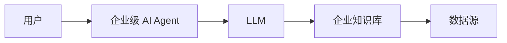
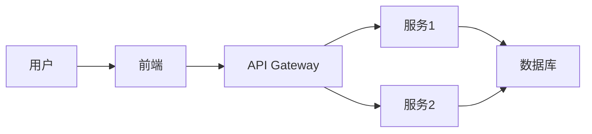
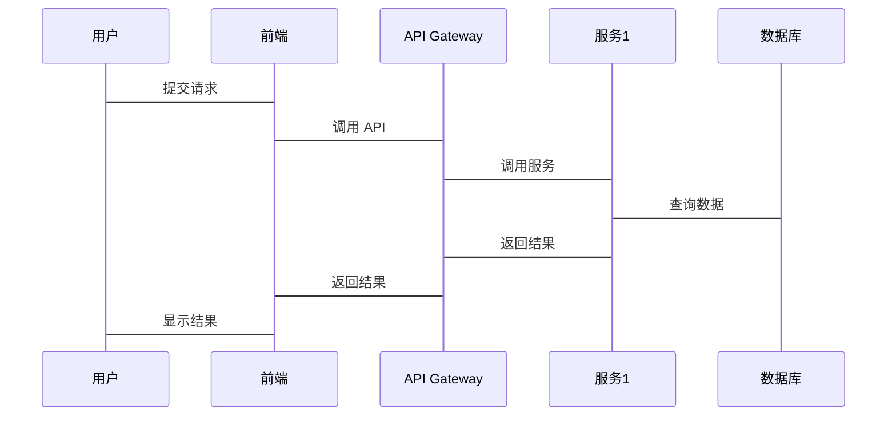

                 


# 企业级 AI Agent 开发：LLM 在商业场景中的落地

> 关键词：企业级 AI Agent、LLM、商业场景、AI 开发、系统架构

> 摘要：本文详细探讨了企业级 AI Agent 的开发与应用，结合大规模语言模型（LLM）在商业场景中的落地实践。通过分析核心概念、算法原理、系统架构，结合实际案例，为读者提供全面的技术指导。

---

## 第一部分：企业级 AI Agent 的背景与基础

### 第1章：企业级 AI Agent 的背景与概念

#### 1.1 AI Agent 的基本概念
企业级 AI Agent 是一种智能代理系统，能够理解、推理和执行复杂任务，以支持企业级业务流程。与个人级 AI Agent 相比，企业级 AI Agent 更注重任务的协同性和系统性，适用于企业内部的决策支持、流程自动化、客户服务等场景。

#### 1.2 LLM 在 AI Agent 中的角色
大规模语言模型（LLM）通过自然语言处理能力，赋予 AI Agent 理解和生成人类语言的能力。在商业场景中，LLM 可以用于客户咨询、文档生成、数据分析等任务，显著提升了 AI Agent 的实用性和智能化水平。

#### 1.3 企业级 AI Agent 的挑战与价值
开发企业级 AI Agent 的主要挑战包括数据隐私、模型性能、系统集成等。然而，其价值体现在提高企业效率、降低运营成本、增强客户体验等方面，为企业数字化转型提供了强有力的支持。

---

### 第2章：企业级 AI Agent 的核心概念与联系

#### 2.1 核心概念原理
- **AI Agent**：基于规则、基于模型、基于学习的三类 AI Agent。
- **LLM**：通过自监督学习和预训练技术，LLM 能够理解上下文并生成自然语言文本。
- **企业级 AI Agent**：整合企业资源、数据和知识，实现复杂商业任务的智能化处理。

#### 2.2 核心概念对比表
| 比较维度 | 个人级 AI Agent | 企业级 AI Agent |
|----------|-----------------|-----------------|
| 数据来源 | 个人数据         | 企业数据         |
| 计算能力 | 有限            | 强大            |
| 适用场景 | 个人事务         | 企业级业务       |

#### 2.3 实体关系图


---

## 第二部分：企业级 AI Agent 的算法原理

### 第3章：企业级 AI Agent 的算法原理

#### 3.1 LLM 的基本算法
- **Transformer 模型**：通过自注意力机制，捕捉输入序列中的全局依赖关系。
- **注意力机制**：为输入序列中的每个词分配权重，聚焦重要信息。
- **生成机制**：基于概率分布，生成最可能的输出序列。

#### 3.2 企业级 AI Agent 的算法实现
- **模型训练流程**：使用企业数据进行微调，提升模型在特定领域的表现。
- **模型推理过程**：通过解码器生成输出，实现与用户的交互。

#### 3.3 算法实现代码示例
```python
def transformer_model(input_sequence):
    # 简化版的 transformer 模型实现
    pass

def attention_mechanism(query, key, value):
    # 注意力机制实现
    pass

def model_training(data):
    # 模型训练过程
    pass
```

---

## 第三部分：企业级 AI Agent 的系统架构与设计

### 第4章：企业级 AI Agent 的系统架构

#### 4.1 系统功能设计
- **领域模型设计**：定义系统的功能模块，包括数据处理、模型调用、结果展示等。
- **系统架构设计**：采用微服务架构，支持高可用性和可扩展性。

#### 4.2 系统架构图


#### 4.3 系统接口设计
- **输入接口**：接收用户的自然语言输入。
- **输出接口**：返回生成的文本或执行的结果。

#### 4.4 系统交互图


---

## 第四部分：企业级 AI Agent 的项目实战

### 第5章：企业级 AI Agent 的项目实战

#### 5.1 环境安装
- 安装必要的依赖：Python、TensorFlow、Kubernetes 等。

#### 5.2 系统核心实现
- **代码实现**：编写 AI Agent 的核心功能模块，如模型加载、用户交互等。

#### 5.3 代码应用解读
- **代码示例**：展示关键功能模块的实现，解释代码的工作原理。

#### 5.4 实际案例分析
- **案例分析**：通过具体案例，展示企业级 AI Agent 在实际商业场景中的应用。

#### 5.5 项目小结
- 总结项目经验，提出改进建议。

---

## 第五部分：企业级 AI Agent 的最佳实践

### 第6章：企业级 AI Agent 的最佳实践

#### 6.1 小结
- 总结全文内容，强调企业级 AI Agent 的重要性。

#### 6.2 注意事项
- 提醒读者注意数据隐私、模型性能优化等关键问题。

#### 6.3 拓展阅读
- 推荐相关书籍和技术资源，鼓励读者深入学习。

---

## 作者信息

作者：AI天才研究院/AI Genius Institute & 禅与计算机程序设计艺术 /Zen And The Art of Computer Programming

---

以上是《企业级 AI Agent 开发：LLM 在商业场景中的落地》的完整大纲和内容。

