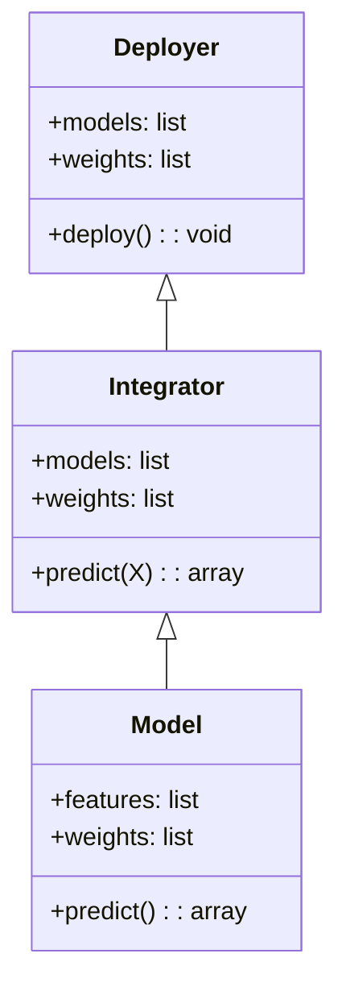
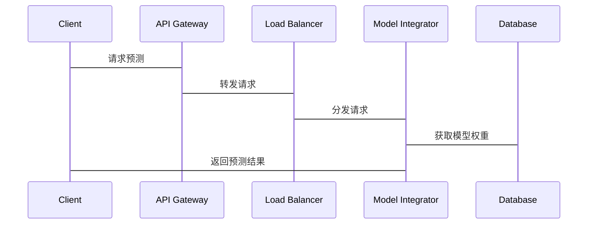

                 


# 企业级AI模型的集成与部署策略

> 关键词：企业级AI模型，模型集成，部署策略，算法原理，系统架构

> 摘要：本文详细探讨了企业级AI模型的集成与部署策略，从背景介绍、核心概念、算法原理到系统架构、项目实战，全面分析了企业级AI模型集成与部署的关键问题，提出了有效的解决方案和实践建议。

---

# 第一部分: 企业级AI模型集成与部署的背景与基础

## 第1章: 企业级AI模型集成与部署概述

### 1.1 问题背景与定义
企业级AI模型的集成与部署是当前人工智能领域的重要课题。随着AI技术的快速发展，企业需要将多个AI模型集成到一个系统中，以实现更复杂的任务和更高的性能。然而，模型集成的过程涉及许多技术挑战，如模型选择、权重分配、性能优化等。

#### 1.1.1 企业级AI模型集成的必要性
在企业环境中，AI模型的集成具有重要意义。通过集成多个模型，企业可以充分利用不同模型的优势，提高系统的准确性和鲁棒性。此外，集成模型能够处理更复杂的问题，满足企业多样化的需求。

#### 1.1.2 部署策略的核心概念
部署策略是指在实际应用中，如何将集成的模型高效、稳定地运行在生产环境中。这包括模型的版本管理、资源分配、监控与维护等方面。

#### 1.1.3 与传统AI模型的对比
与传统AI模型相比，企业级AI模型的集成与部署具有更高的复杂性和挑战性。传统模型通常独立运行，而集成模型需要协调多个模型的输出，确保系统的整体性能。

### 1.2 企业级AI模型的特点
企业级AI模型具有以下特点：
1. **高可扩展性**：能够处理大量数据和复杂任务。
2. **高可用性**：确保系统在故障情况下仍能正常运行。
3. **高性能要求**：需要在短时间内处理大量请求。

### 1.3 模型集成与部署的边界与外延
模型集成与部署的边界包括数据预处理、模型选择和优化，而外延则涉及模型的持续优化和更新。

### 1.4 核心要素与概念结构
企业级AI模型集成与部署的核心要素包括：
1. **模型选择**：选择适合任务的模型。
2. **集成方法**：如投票法、加权法等。
3. **部署环境**：如云平台、边缘计算等。

---

# 第二部分: 企业级AI模型集成的核心概念与联系

## 第2章: 模型集成的原理与方法

### 2.1 模型集成的原理
模型集成的原理在于通过组合多个模型的输出，提高整体性能。常见的集成方法包括投票法、加权法和堆叠法。

#### 2.1.1 基础原理
模型集成的基本原理是利用多个模型的预测结果进行加权融合，从而提高准确性和稳定性。

#### 2.1.2 集成算法的分类
集成算法主要分为三类：
1. **投票法**：通过投票决定最终结果。
2. **加权法**：根据模型的性能赋予不同的权重。
3. **堆叠法**：使用一个元模型对多个模型的输出进行二次优化。

#### 2.1.3 集成的优势与劣势
集成的优势在于能够提高模型的准确性和鲁棒性，劣势在于计算复杂度较高，且需要处理模型之间的依赖关系。

### 2.2 模型集成的核心概念
模型集成的核心概念包括模型的选择、权重分配和结果融合。

#### 2.2.1 基础概念
模型集成需要考虑模型的性能、数据分布和任务特点。

#### 2.2.2 关键属性对比
| 属性 | 描述 |
|------|------|
| 模型选择 | 根据任务选择合适的模型 |
| 权重分配 | 根据模型性能分配权重 |
| 结果融合 | 综合多个模型的输出 |

#### 2.2.3 实体关系图（Mermaid）


---

# 第三部分: 企业级AI模型集成的算法原理

## 第3章: 集成算法的数学模型与实现

### 3.1 基础集成算法
基础集成算法包括投票法、加权法和堆叠法。

#### 3.1.1 投票法
投票法是一种简单的集成方法，适用于分类任务。

##### 投票法公式
$$P(y|x) = \arg\max_{y} \sum_{i=1}^{n} f_i(y|x)$$

##### 投票法实现
```python
def vote_model(models, X):
    predictions = []
    for model in models:
        predictions.append(model.predict(X))
    result = np.zeros(len(models[0].predict(X)))
    for i in range(len(result)):
        result[i] = mode([p[i] for p in predictions]).mode[0]
    return result
```

#### 3.1.2 加权法
加权法通过赋予不同模型不同的权重，提高集成效果。

##### 加权法公式
$$P(y|x) = \sum_{i=1}^{n} w_i f_i(y|x)$$

##### 加权法实现
```python
def weighted_vote_model(models, weights, X):
    predictions = []
    for model, weight in zip(models, weights):
        predictions.append(weight * model.predict(X))
    result = np.mean(predictions, axis=0)
    return result
```

#### 3.1.3 堆叠法
堆叠法通过使用一个元模型对多个模型的输出进行二次优化。

##### 堆叠法公式
$$P(y|x) = g\left(\{f_i(x)\}_{i=1}^{n}\right)$$

##### 堆叠法实现
```python
def stack_model(models, X_train, y_train, X_test):
    # 训练元模型
    stack_X = np.concatenate([model.predict(X_train) for model in models], axis=1)
    stack_model = LogisticRegression()
    stack_model.fit(stack_X, y_train)
    # 预测
    stack_X_test = np.concatenate([model.predict(X_test) for model in models], axis=1)
    result = stack_model.predict(stack_X_test)
    return result
```

### 3.2 集成算法的数学模型与实现
集成算法的数学模型与实现需要结合具体任务和数据特点。

---

# 第四部分: 企业级AI模型集成的系统架构与部署策略

## 第4章: 系统分析与架构设计

### 4.1 问题场景介绍
企业级AI模型的集成与部署需要考虑系统的可扩展性、可用性和性能。

#### 4.1.1 系统功能设计
系统功能设计包括数据预处理、模型集成、部署管理等。

##### 领域模型（Mermaid 类图）


#### 4.1.2 系统架构设计
系统架构设计需要考虑模块化和可扩展性。

##### 系统架构图（Mermaid 架构图）


#### 4.1.3 系统接口设计
系统接口设计包括API接口和数据接口。

#### 4.1.4 系统交互流程图（Mermaid 序列图）


### 4.2 部署策略与优化
部署策略需要考虑资源分配、模型监控和维护。

---

# 第五部分: 企业级AI模型集成的项目实战

## 第5章: 项目实战

### 5.1 环境安装
项目实战需要安装必要的库和工具，如Python、TensorFlow、Scikit-learn等。

#### 5.1.1 安装依赖
```bash
pip install numpy scikit-learn tensorflow
```

### 5.2 系统核心实现源代码
以下是项目的核心实现代码。

#### 5.2.1 模型集成实现
```python
def ensemble_models(models, X_train, y_train, X_test):
    # 训练集成模型
    stack_X = np.concatenate([model.predict(X_train) for model in models], axis=1)
    stack_model = LogisticRegression()
    stack_model.fit(stack_X, y_train)
    # 预测
    stack_X_test = np.concatenate([model.predict(X_test) for model in models], axis=1)
    result = stack_model.predict(stack_X_test)
    return result
```

#### 5.2.2 部署实现
```python
def deploy_model(models, X):
    predictions = []
    for model in models:
        predictions.append(model.predict(X))
    result = np.mean(predictions, axis=0)
    return result
```

### 5.3 案例分析
通过具体案例分析，展示如何在实际项目中应用模型集成与部署策略。

#### 5.3.1 案例背景
假设我们有一个分类任务，需要集成多个模型来提高准确率。

#### 5.3.2 数据准备
加载数据集，进行预处理。

#### 5.3.3 模型训练
训练多个基模型，并进行集成。

#### 5.3.4 模型部署
将集成模型部署到生产环境中，进行实时预测。

### 5.4 项目小结
通过案例分析，我们展示了如何在实际项目中应用模型集成与部署策略。

---

# 第六部分: 企业级AI模型集成的最佳实践与小结

## 第6章: 最佳实践与小结

### 6.1 最佳实践
企业级AI模型的集成与部署需要遵循以下最佳实践：
1. **模型选择**：选择适合任务的模型。
2. **权重分配**：根据模型性能分配权重。
3. **结果融合**：综合多个模型的输出。
4. **监控与维护**：确保系统的稳定运行。

### 6.2 本章小结
通过本文的详细讲解，我们了解了企业级AI模型的集成与部署策略，掌握了核心概念和算法原理，能够将其应用到实际项目中。

### 6.3 注意事项
在实际应用中，需要注意模型的多样性和数据的均衡性。

### 6.4 拓展阅读
推荐相关书籍和论文，供读者深入学习。

---

作者：AI天才研究院/AI Genius Institute & 禅与计算机程序设计艺术 /Zen And The Art of Computer Programming

---

以上就是《企业级AI模型的集成与部署策略》的技术博客文章的完整目录和内容框架。文章从背景介绍到项目实战，全面覆盖了企业级AI模型的集成与部署的关键问题，提供了详细的理论分析和实践指导。

