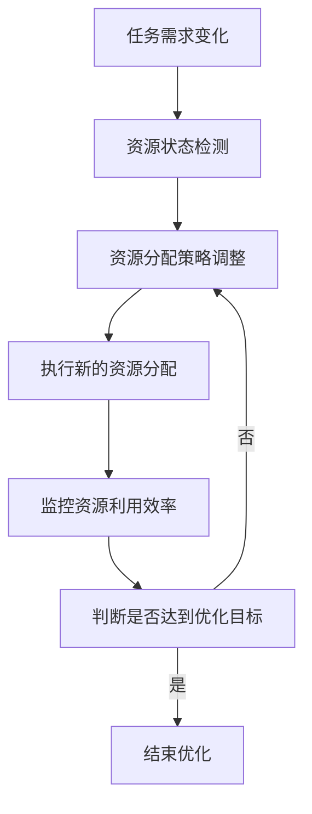
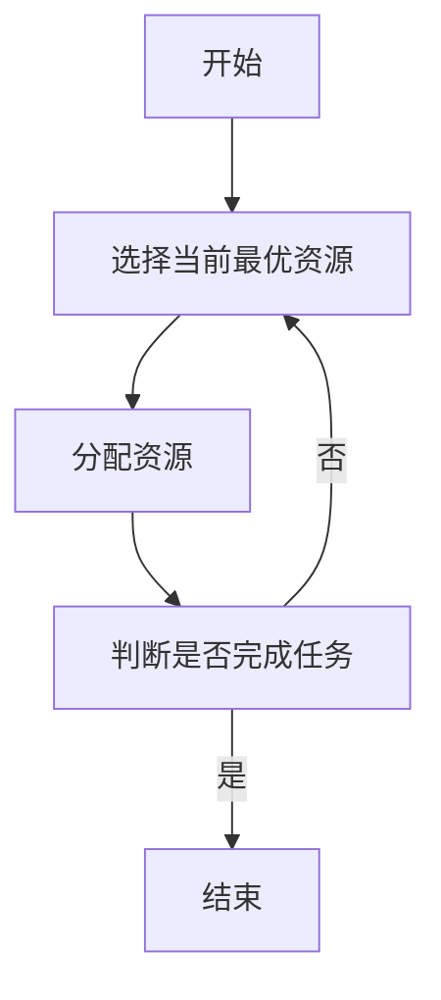
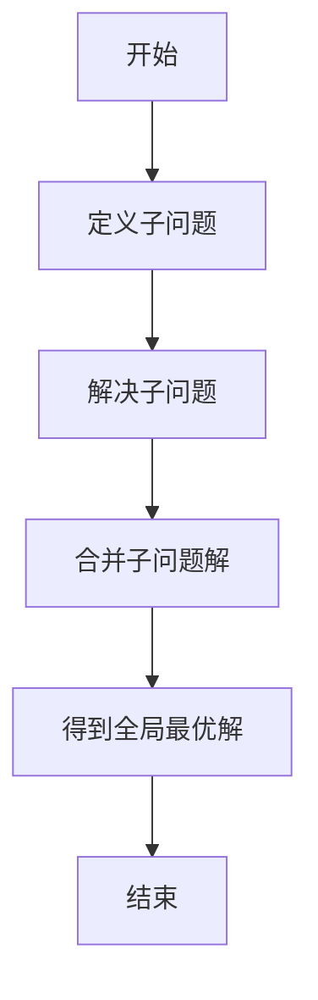
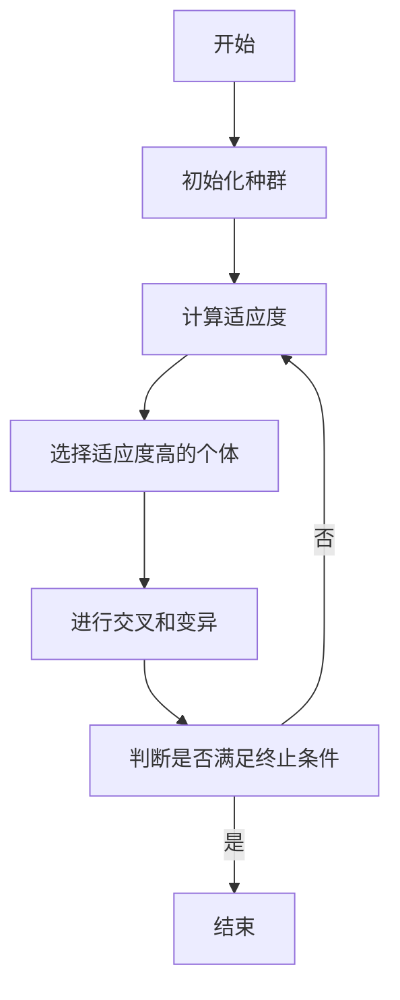
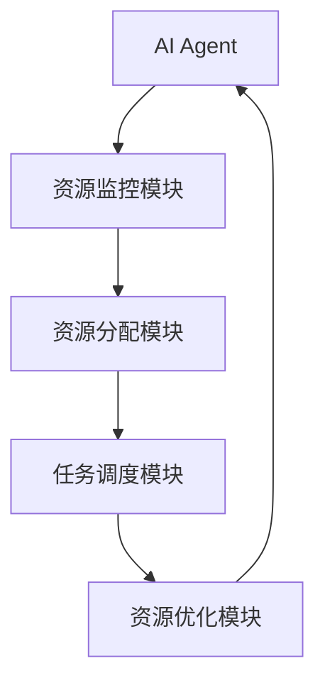
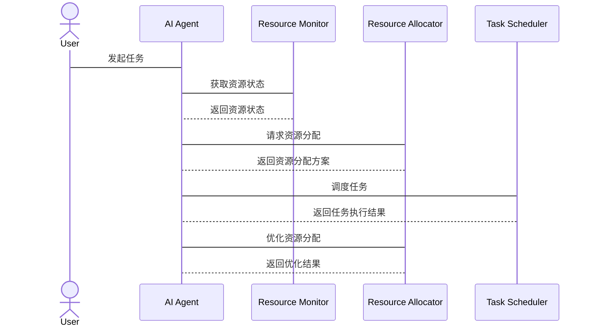

                 


# 优化AI Agent的资源利用：计算效率提升策略

## 关键词：AI Agent，资源优化，计算效率，算法原理，系统架构

## 摘要：本文深入探讨了如何优化AI Agent的资源利用，特别是在计算效率方面。通过分析资源分配策略、计算效率模型和资源动态调整机制，结合贪心算法、动态规划和遗传算法的原理，提出了提升AI Agent计算效率的具体策略。通过实际案例分析和系统架构设计，本文为AI Agent的资源优化提供了理论支持和实践指导。

---

# 第1章：AI Agent资源利用的背景与问题

## 1.1 AI Agent的基本概念

### 1.1.1 AI Agent的定义与特点
AI Agent（人工智能代理）是指能够感知环境、自主决策并执行任务的智能实体。其特点包括自主性、反应性、目标导向和社会能力。AI Agent广泛应用于自动驾驶、智能助手、机器人控制等领域。

### 1.1.2 AI Agent的资源利用需求
AI Agent的运行依赖计算资源（如CPU、GPU）、存储资源和数据资源。资源利用的效率直接影响AI Agent的性能和响应速度。

### 1.1.3 资源利用的背景与现状
随着AI技术的快速发展，AI Agent的应用场景越来越广泛，但资源利用效率低下、动态调整困难等问题日益突出，亟需优化。

## 1.2 资源利用中的问题与挑战

### 1.2.1 资源分配的不均衡问题
资源分配不均可能导致某些任务执行效率低下，而其他任务又可能占用过多资源，影响整体性能。

### 1.2.2 计算效率的瓶颈
AI Agent的计算任务复杂度高，传统计算方式难以满足实时性和高效性要求。

### 1.2.3 资源动态调整的复杂性
AI Agent运行过程中，环境动态变化，资源需求也随之变化，如何实现动态调整是关键挑战。

## 1.3 优化AI Agent资源利用的意义

### 1.3.1 提高计算效率的重要性
优化资源利用能够显著提升AI Agent的计算效率，使其在更短时间内完成更多任务。

### 1.3.2 资源优化的经济价值
通过减少资源浪费，降低运营成本，提升经济效益。

### 1.3.3 优化对AI Agent性能的提升
资源优化能够提高AI Agent的响应速度、准确性和稳定性，增强用户体验。

---

# 第2章：AI Agent资源利用的核心概念

## 2.1 资源分配策略

### 2.1.1 资源分配的基本原理
资源分配策略是AI Agent优化资源利用的基础。通过合理分配资源，确保每个任务都能高效执行。

### 2.1.2 资源分配的属性特征对比
| 资源类型 | 计算能力 | 响应时间 | 能耗 |
|----------|----------|----------|------|
| CPU      | 高       | 中       | 中   |
| GPU      | 极高     | 低       | 高   |
| FPGA     | 高       | 中       | 中   |

### 2.1.3 资源分配的ER实体关系图
```mermaid
er
actor AI Agent {
    id
    name
}
actor Resource Pool {
    id
    type
    capacity
}
```

## 2.2 计算效率模型

### 2.2.1 计算效率的定义与度量
计算效率是衡量资源利用效果的重要指标，通常以单位时间内完成的任务数量或任务完成时间来度量。

### 2.2.2 计算效率与资源分配的关系
资源分配直接影响计算效率。合理分配资源可以最大化计算效率，反之则可能导致资源浪费或效率低下。

### 2.2.3 计算效率的优化目标
优化目标是实现资源的最优分配，使得计算效率最大化，同时满足任务的实时性和响应性要求。

## 2.3 资源动态调整机制

### 2.3.1 资源动态调整的原理
根据任务需求和资源状态，动态调整资源分配策略，确保资源利用效率最大化。

### 2.3.2 资源动态调整的流程图


### 2.3.3 资源动态调整的实现方式
资源动态调整可以通过反馈机制和自适应算法实现，如动态负载均衡和自适应资源分配。

---

# 第3章：资源分配算法原理

## 3.1 贪心算法

### 3.1.1 贪心算法的定义与特点
贪心算法是一种贪心策略，每次选择当前最优解，最终得到全局最优解。

### 3.1.2 贪心算法的流程图


### 3.1.3 贪心算法的Python实现
```python
def greedy_resource_allocation(tasks, resources):
    for task in tasks:
        allocate_task(task, resources)
    return resources

def allocate_task(task, resources):
    selected_resource = select_best_resource(task, resources)
    assign_resource(task, selected_resource)
```

### 3.1.4 贪心算法的数学模型
贪心算法通过局部最优选择全局最优，数学模型如下：
$$ \text{选择} \ argmax_{r} \text{资源利用效率}(r) $$

## 3.2 动态规划算法

### 3.2.1 动态规划算法的定义与特点
动态规划算法通过将问题分解为子问题，逐个解决，最终得到全局最优解。

### 3.2.2 动态规划算法的流程图


### 3.2.3 动态规划算法的Python实现
```python
def dynamic_programming_resource_allocation(tasks, resources):
    dp = [0] * (max_resources + 1)
    dp[0] = 0
    for i in range(1, max_resources + 1):
        dp[i] = max(dp[i], dp[i - task.resources] + task.value)
    return dp[max_resources]
```

### 3.2.4 动态规划算法的数学模型
动态规划算法通过状态转移方程实现优化：
$$ \text{状态转移方程} \quad dp[i] = \max_{j} \{ dp[i - j] + \text{value}(j) \} $$

## 3.3 遗传算法

### 3.3.1 遗传算法的定义与特点
遗传算法是一种基于生物进化原理的优化算法，通过选择、交叉和变异操作生成新的解。

### 3.3.2 遗传算法的流程图


### 3.3.3 遗传算法的Python实现
```python
def genetic_resource_allocation(tasks, resources, population_size, generations):
    population = initialize_population(population_size, resources)
    for _ in range(generations):
        population = evaluate_population(population, tasks)
        population = select_parents(population)
        population = crossover_and_mutate(population)
    return best_solution(population)
```

### 3.3.4 遗传算法的数学模型
遗传算法通过适应度函数和选择操作实现优化：
$$ \text{适应度函数} \quad f(x) = \sum_{i} x_i \cdot \text{value}(i) $$

---

# 第4章：系统架构设计与实现

## 4.1 优化AI Agent资源利用的系统架构

### 4.1.1 系统功能设计
系统功能包括资源监控、资源分配、任务调度和资源优化。

### 4.1.2 系统架构设计图


### 4.1.3 系统接口设计
系统接口包括资源监控接口、任务调度接口和资源分配接口。

### 4.1.4 系统交互流程图


---

# 第5章：项目实战与案例分析

## 5.1 项目环境安装

### 5.1.1 安装Python和相关库
```bash
pip install numpy matplotlib scikit-learn
```

### 5.1.2 安装Jupyter Notebook
```bash
pip install jupyter
```

## 5.2 系统核心实现

### 5.2.1 资源分配算法实现
```python
def allocate_resources(tasks, resources):
    # 使用遗传算法优化资源分配
    pass
```

### 5.2.2 任务调度实现
```python
def schedule_tasks(tasks, resources):
    # 基于资源分配结果进行任务调度
    pass
```

## 5.3 案例分析与结果解读

### 5.3.1 案例分析
通过具体案例分析资源分配算法的优化效果，比较不同算法在资源利用率和计算效率方面的表现。

### 5.3.2 结果解读
解读优化后的资源分配结果，分析计算效率的提升和资源浪费的减少。

## 5.4 项目小结

### 5.4.1 项目总结
总结项目实施过程中的经验和教训，提出改进建议。

### 5.4.2 项目成果
展示优化后的资源分配方案和计算效率提升的具体数据。

---

# 第6章：总结与展望

## 6.1 最佳实践

### 6.1.1 资源分配的优先级
优先分配高价值任务的资源，确保关键任务的执行效率。

### 6.1.2 计算效率的监控
定期监控资源利用效率，及时发现和解决问题。

### 6.1.3 资源动态调整
根据任务需求和资源状态，动态调整资源分配策略。

## 6.2 未来展望

### 6.2.1 更高效的算法研究
研究更高效的资源分配算法，如强化学习和量子计算算法。

### 6.2.2 智能化系统架构
探索智能化的资源优化架构，实现自适应和自愈合的资源管理。

## 6.3 注意事项

### 6.3.1 资源分配的公平性
确保资源分配的公平性，避免某些任务长期占用过多资源。

### 6.3.2 系统的可扩展性
系统设计要考虑可扩展性，方便未来扩展和优化。

### 6.3.3 数据的安全性
确保资源分配和优化过程中的数据安全，防止数据泄露和篡改。

## 6.4 拓展阅读

### 6.4.1 相关书籍
推荐相关书籍，如《算法导论》、《分布式系统：概念与设计》。

### 6.4.2 技术博客
推荐技术博客和在线资源，供读者深入学习。

---

# 作者：AI天才研究院/AI Genius Institute & 禅与计算机程序设计艺术 /Zen And The Art of Computer Programming

---

通过本文的详细讲解，读者可以系统地了解优化AI Agent资源利用的策略和方法，掌握多种资源分配算法的原理和实现，从而在实际项目中提高计算效率，实现资源的最优利用。

