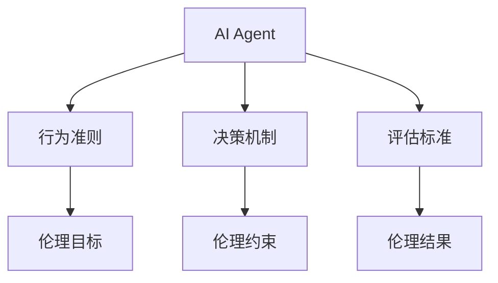
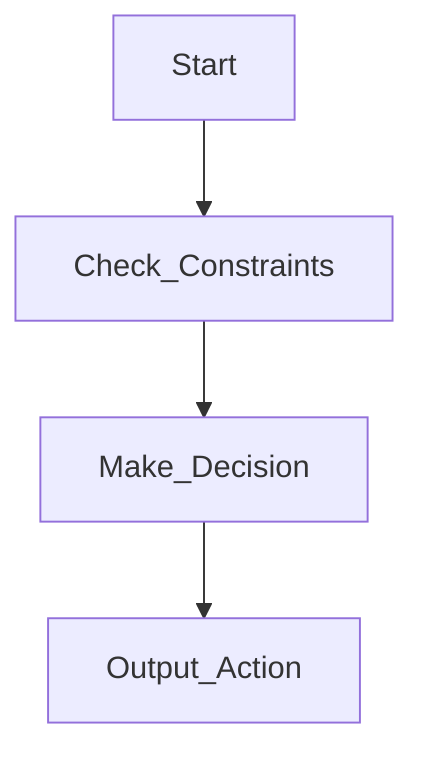
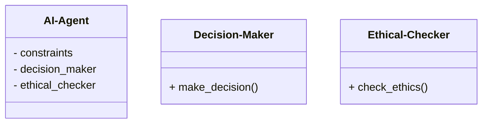
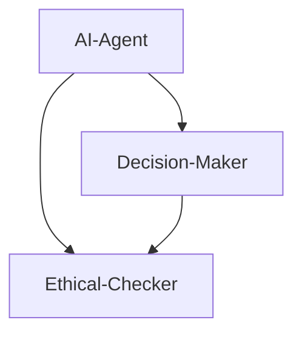

                 


# 《伦理AI：设计符合道德标准的AI Agent》目录大纲

---

# 第1章: 伦理AI的背景与核心概念

## 1.1 伦理AI的定义与背景

### 1.1.1 伦理AI的定义与内涵

### 1.1.2 AI Agent的基本概念

### 1.1.3 伦理AI的背景与重要性

## 1.2 伦理AI的核心问题

### 1.2.1 伦理AI的核心问题与挑战

### 1.2.2 AI Agent的决策伦理问题

### 1.2.3 伦理AI的边界与外延

## 1.3 伦理AI的核心要素

### 1.3.1 伦理AI的构成要素

### 1.3.2 伦理AI的系统架构

### 1.3.3 伦理AI的核心目标与原则

## 1.4 本章小结

### 1.4.1 伦理AI的定义与背景总结

### 1.4.2 核心问题与挑战

### 1.4.3 核心要素与目标

---

# 第2章: 伦理AI的核心概念与联系

## 2.1 伦理AI的核心概念

### 2.1.1 AI Agent的行为准则

### 2.1.2 伦理AI的决策机制

### 2.1.3 伦理AI的评估标准

## 2.2 核心概念的属性特征对比

### 2.2.1 AI Agent行为准则的属性特征

### 2.2.2 伦理AI决策机制的属性特征

### 2.2.3 伦理AI评估标准的属性特征

## 2.3 ER实体关系图



---

# 第3章: 伦理AI的算法原理

## 3.1 伦理AI的决策算法

### 3.1.1 基于约束的决策模型



### 3.1.2 基于约束的决策模型的Python实现

```python
def ethical_decision_agent(constraints):
    # 输入约束条件
    # 输出符合约束的决策
    pass

# 示例代码
class EthicalAgent:
    def __init__(self, constraints):
        self.constraints = constraints

    def decide(self, state):
        # 根据状态和约束做出决策
        pass
```

### 3.1.3 数学模型与公式

$$ \text{决策} = f(\text{状态}, \text{约束}) $$

---

# 第4章: 伦理AI的系统架构

## 4.1 系统架构设计

### 4.1.1 系统功能模块



### 4.1.2 系统架构图



### 4.1.3 系统接口设计

---

# 第5章: 伦理AI的项目实战

## 5.1 项目环境安装

### 5.1.1 安装依赖

```bash
pip install numpy matplotlib
```

## 5.2 核心代码实现

### 5.2.1 伦理AI的实现代码

```python
class EthicalAI:
    def __init__(self, constraints):
        self.constraints = constraints

    def make_decision(self, state):
        # 根据状态和约束做出决策
        pass

    def check_ethics(self, decision, state):
        # 检查决策是否符合伦理
        pass
```

## 5.3 案例分析与解读

### 5.3.1 案例分析

### 5.3.2 代码实现解读

## 5.4 项目小结

---

# 第6章: 伦理AI的最佳实践与未来展望

## 6.1 最佳实践

### 6.1.1 设计伦理AI的注意事项

### 6.1.2 开发中的常见问题与解决方案

## 6.2 小结

### 6.2.1 伦理AI的核心要点总结

## 6.3 未来展望

### 6.3.1 伦理AI的发展趋势

### 6.3.2 可能面临的挑战

---

# 附录: 伦理AI的相关资源与工具

## 附录A: 开发工具推荐

### 附录A.1 开发框架

### 附录A.2 数据集

## 附录B: 伦理AI的相关论文与书籍

---

# 作者信息

作者：AI天才研究院/AI Genius Institute & 禅与计算机程序设计艺术 /Zen And The Art of Computer Programming

