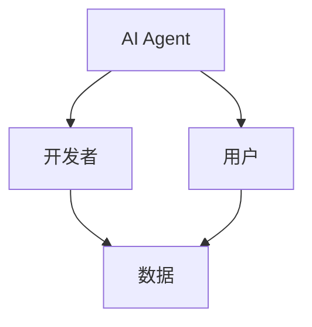
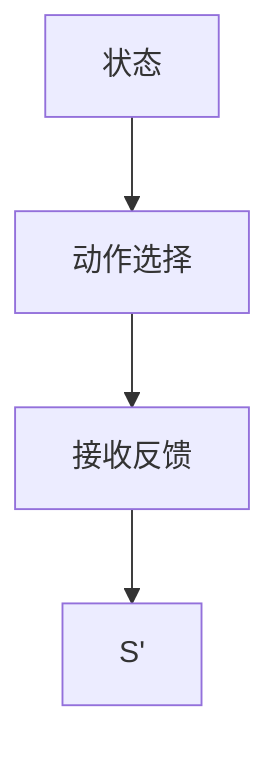
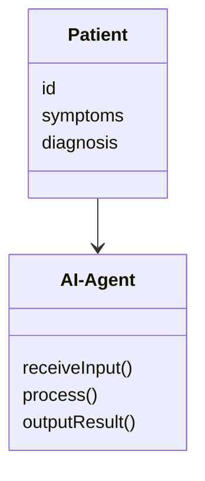

                 


# 《伦理设计：构建负责任的AI Agent》

## 关键词：伦理设计，AI Agent，责任归属，透明度，隐私保护，可解释性，社会公平性

## 摘要：本文系统阐述了构建负责任的AI Agent的核心理念，详细分析了伦理设计的关键要素，包括责任归属、透明度、隐私保护、可解释性和社会公平性。通过理论分析和实际案例，本文探讨了如何将伦理设计原则融入AI系统，并通过算法实现和系统架构设计，展示了伦理设计在AI Agent中的具体应用。文章还提供了项目实战指导，帮助读者理解和实践伦理设计。

---

## 正文

### 第1章: 伦理设计的背景与核心概念

#### 1.1 问题背景
AI技术的快速发展带来了前所未有的便利，但也引发了诸多伦理挑战。AI Agent在医疗、金融、交通等领域的广泛应用，使得其行为可能对人类产生重大影响。例如，医疗诊断中的AI错误可能导致严重后果，金融欺诈的AI可能加剧经济不平等。这些问题凸显了伦理设计的重要性。

#### 1.2 问题描述
AI Agent的决策过程可能缺乏透明度，导致用户难以理解其行为。此外，数据偏见可能导致不公平的结果，隐私泄露风险也日益增加。这些问题不仅影响用户信任，还可能引发法律和道德争议。

#### 1.3 问题解决
伦理设计通过明确责任归属、提高透明度和可解释性、保护隐私和数据安全，确保AI Agent的行为符合伦理规范。这些措施有助于建立用户信任，减少潜在风险。

#### 1.4 边界与外延
伦理设计的边界包括明确AI的职责范围，确保其在授权范围内行动。外延则涉及与其他设计原则的协同，如用户体验和性能优化，未来可能扩展至更多领域。

### 第2章: 核心概念与联系

#### 2.1 核心概念原理
- 责任归属：明确AI Agent及其开发者的责任，确保可追溯性。
- 透明度：提供清晰的决策过程和数据使用说明，增强用户信任。
- 隐私保护：确保数据安全，防止滥用。
- 可解释性：使用户理解AI的决策逻辑。
- 社会公平性：避免算法偏见，确保公平结果。

#### 2.2 概念属性对比
| 概念     | 属性                   |
|----------|------------------------|
| 责任归属 | 可追溯性、明确性        |
| 透明度   | 公开性、可理解性        |
| 隐私保护 | 数据安全、访问控制      |
| 可解释性 | 明确性、可验证性        |
| 社会公平 | 去偏见、公平性          |

#### 2.3 实体关系图


### 第3章: 算法原理讲解

#### 3.1 算法实现
AI Agent的决策过程涉及多个算法，如基于规则的系统、强化学习和生成模型。以Q-learning为例，算法通过经验优化决策策略。

#### 3.2 算法流程图


#### 3.3 代码实现
```python
import numpy as np
import gym

env = gym.make('CartPole-v0')
env.seed(42)

# 初始化参数
alpha = 0.1
gamma = 0.99
n_actions = env.action_space.n
n_states = env.observation_space.shape[0]

# 初始化Q表
Q = np.zeros((n_states, n_actions))

# 训练过程
for episode in range(1000):
    state = env.reset()
    for _ in range(1000):
        # 选择动作
        action = np.argmax(Q[state]) if Q[state].max() > 0 else 0
        # 执行动作并获取反馈
        next_state, reward, done, _ = env.step(action)
        # 更新Q值
        Q[state][action] += alpha * (reward + gamma * np.max(Q[next_state]) - Q[state][action])
        state = next_state
        if done:
            break
```

### 第4章: 系统分析与架构设计

#### 4.1 问题场景
医疗诊断中的AI Agent需要准确诊断疾病，同时保护患者隐私，确保决策透明。

#### 4.2 功能设计
AI Agent需具备数据收集、诊断推理、结果解释等功能。

#### 4.3 领域模型


#### 4.4 系统架构


### 第5章: 项目实战

#### 5.1 环境安装
安装必要的库，如TensorFlow、Keras和OpenAI Gym。

#### 5.2 核心功能实现
实现AI Agent的决策模块，确保可解释性和透明度。

#### 5.3 案例分析
分析医疗诊断案例，确保AI Agent的诊断过程透明且无偏见。

### 第6章: 最佳实践

#### 6.1 注意事项
确保数据隐私，定期更新算法，监控系统行为。

#### 6.2 小结
伦理设计是构建负责任AI Agent的关键，需在设计和实现中融入相关原则。

---

## 附录

### 附录A: 参考文献
1. Russell, S. (2019). *Human Compatible: AI Systems That Are Safe and Useful*. Harvard University Press.
2. Goodreads. (2020). *Ethics of AI*.

### 附录B: 工具与资源
- TensorFlow: [https://tensorflow.org](https://tensorflow.org)
- PyTorch: [https://pytorch.org](https://pytorch.org)
- OpenAI Gym: [https://gym.openai.com](https://gym.openai.com)

## 作者：AI天才研究院 & 禅与计算机程序设计艺术

