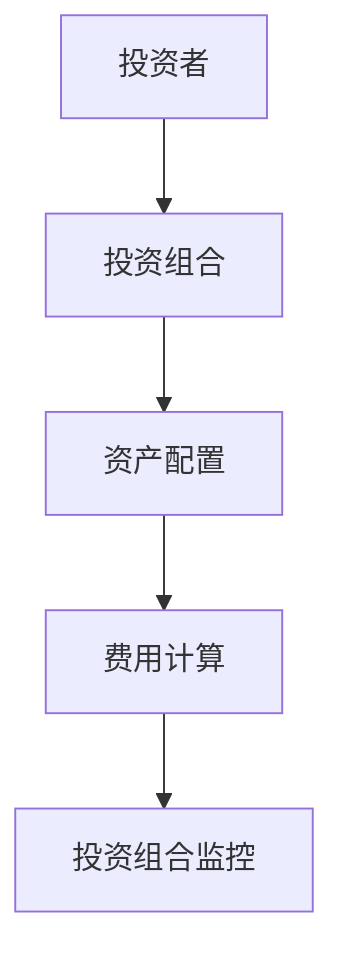
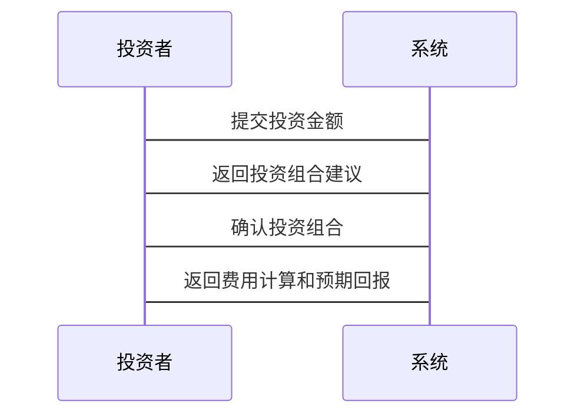

                 


# 伯格的低成本投资策略：为什么费用很重要

## 关键词：
- 低成本投资策略
- 投资费用
- 伯格投资理念
- 费用影响
- 长期投资

## 摘要：
本文深入探讨了伯格的低成本投资策略，分析了费用对投资回报的重要性。通过数学模型、系统架构和实际案例，详细讲解了低成本投资的优势和实现方法。文章分为背景介绍、核心概念、算法原理、系统架构、项目实战和最佳实践等部分，帮助读者全面理解低成本投资策略。

---

## 正文

### 第一部分：背景介绍

#### 1.1 低成本投资策略的核心概念

##### 1.1.1 投资的基本原理
投资的本质是通过合理配置资产，在风险可控的前提下，实现财富的保值与增值。投资者需要在不同资产之间分散投资，降低风险。

##### 1.1.2 低成本投资的定义
低成本投资策略是指通过选择管理费用低、交易费用少的投资工具，降低整体投资成本，从而提高净收益。低成本策略的核心是减少费用对投资回报的侵蚀。

##### 1.1.3 费用对投资回报的影响
费用会直接影响投资收益。高费用的投资产品会显著降低长期回报，尤其是在复利效应下，费用的影响会呈指数级放大。

#### 1.2 投资费用的分类

##### 1.2.1 管理费用
管理费用是指基金管理人收取的费用，通常按年收取，费用率通常在0.5%到2%之间。低成本基金的管理费用较低，通常在0.1%到0.5%之间。

##### 1.2.2 交易费用
交易费用包括买卖证券时产生的佣金和其他交易成本。频繁交易会增加交易费用，降低净收益。

##### 1.2.3 其他隐性费用
其他费用包括申购费、赎回费等，这些费用通常在购买或赎回时一次性收取，增加了投资成本。

#### 1.3 伯格的投资理念

##### 1.3.1 价值投资的核心
伯格强调长期投资，注重价值投资，避免短期波动。他认为市场是不可预测的，长期投资是实现财富增长的最佳方式。

##### 1.3.2 长期投资的重要性
长期投资可以减少交易费用和市场波动的影响，同时利用复利效应，实现资产的稳定增长。

##### 1.3.3 低成本策略的优势
伯格认为，低成本策略可以显著提高投资回报，尤其是长期投资中，低成本基金的表现优于高费用基金。

#### 1.4 费用对投资回报的影响

##### 1.4.1 高费用对投资回报的侵蚀
高费用会降低投资回报。例如，假设两个基金，A基金费用率为1%，B基金费用率为2%，投资期限为20年，年回报率为8%。经过计算，费用率低的基金回报更高。

##### 1.4.2 低成本对长期收益的促进
低成本策略可以显著提高长期收益。通过减少费用侵蚀，投资者可以更多地享受到复利效应带来的收益。

##### 1.4.3 费用与风险的平衡
费用率低的基金通常风险较低，因为它们减少了因为频繁交易或高管理费用带来的额外风险。

---

### 第二部分：核心概念与联系

#### 2.1 费用对投资回报的数学分析

##### 2.1.1 费用对复利的影响
复利公式：$$F = P \times (1 + r)^n$$
考虑费用后的复利公式：$$F = P \times (1 + r - f)^n$$
其中，f是费用率，r是年回报率，n是投资期限。

##### 2.1.2 费用对投资组合的影响
投资组合的期望回报：$$E(R) = \mu - f \times T$$
其中，μ是资产的平均回报率，f是费用率，T是时间。

##### 2.1.3 费用对风险的影响
费用会增加投资组合的风险，因为高费用会降低回报，导致投资组合的波动性增加。

---

### 第三部分：算法原理讲解

#### 3.1 低成本投资策略的算法实现

##### 3.1.1 算法概述
低成本投资策略的核心是选择费用率低的指数基金，构建分散化的投资组合。

##### 3.1.2 算法步骤
1. 确定投资目标和风险承受能力。
2. 选择费用率低的指数基金。
3. 构建分散化的投资组合。
4. 定期调整投资组合。

##### 3.1.3 算法实现
以下是一个简单的Python代码示例，用于计算低成本投资策略的回报：

```python
import numpy as np

def calculate_return(principal, rate, fee, years):
    return principal * (1 + rate - fee) ** years

principal = 10000
rate = 0.08
fee = 0.01
years = 20

return_calculate = calculate_return(principal, rate, fee, years)
print(f"投资回报：{return_calculate:.2f}")
```

##### 3.1.4 算法优化
通过定期再平衡投资组合，降低费用对回报的影响。

---

### 第四部分：系统分析与架构设计方案

#### 4.1 系统架构设计

##### 4.1.1 问题场景介绍
投资者需要选择低成本投资工具，构建投资组合，并监控投资表现。

##### 4.1.2 系统功能设计
- 资产配置
- 费用计算
- 投资组合监控

##### 4.1.3 系统架构图


##### 4.1.4 系统接口设计
- 输入：投资金额、投资期限、目标回报率
- 输出：投资组合建议、费用计算、预期回报

##### 4.1.5 系统交互序列图


---

### 第五部分：项目实战

#### 5.1 环境安装

##### 5.1.1 Python环境安装
安装Python和必要的库：
```bash
pip install numpy pandas matplotlib
```

##### 5.1.2 投资组合管理工具安装
安装投资组合管理工具，如Zipline或backtrader。

#### 5.2 核心实现

##### 5.2.1 选择低成本基金
使用Python代码筛选费用率低的指数基金。

##### 5.2.2 构建投资组合
根据资产配置模型，构建分散化的投资组合。

##### 5.2.3 监控投资表现
定期监控投资组合的表现，调整投资策略。

#### 5.3 案例分析

##### 5.3.1 案例背景
投资者有10万元，投资期限为10年，目标回报率为8%。

##### 5.3.2 选择低成本基金
选择费用率为0.1%的指数基金。

##### 5.3.3 投资组合监控
定期调整投资组合，确保费用率最低。

---

### 第六部分：最佳实践

#### 6.1 小结
低成本投资策略的核心是减少费用，提高长期回报。通过选择低成本基金和长期投资，投资者可以实现财富的稳定增长。

#### 6.2 注意事项
- 定期调整投资组合，降低费用对回报的影响。
- 避免频繁交易，减少交易费用。
- 选择透明度高的低成本基金。

#### 6.3 拓展阅读
- 《投资学原理》
- 《伯格的投资哲学》
- 《低成本投资策略》

---

作者：AI天才研究院/AI Genius Institute & 禅与计算机程序设计艺术 /Zen And The Art of Computer Programming

