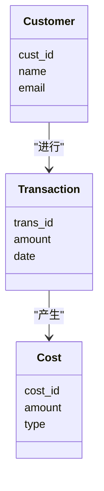
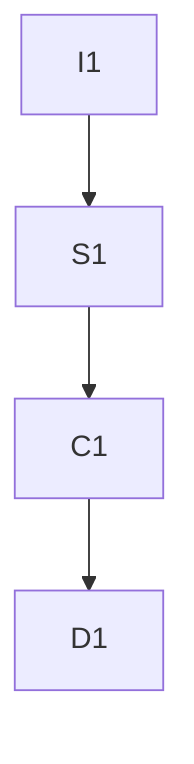

                 


# 伯格的成本控制理念：在零佣金时代的新思考

> **关键词**：零佣金、成本控制、投资策略、伯格理念、金融创新  
> **摘要**：本文深入探讨了伯格的成本控制理念在零佣金时代的最新发展，分析了其核心思想、实施步骤和实际应用，结合了算法原理、数学模型和系统架构设计，为读者提供了全面的视角和实践指导。

---

## 第一部分：伯格的成本控制理念背景介绍

### 第1章：伯格成本控制理念的背景与演变

#### 1.1 成本控制理念的演变历程
- **1.1.1 传统成本控制方法的局限性**  
  传统的成本控制方法主要关注内部成本的削减，但随着市场环境的变化，这种方法在零佣金时代显得力不从心。例如，依赖佣金收入的传统券商在零佣金模式下，必须重新审视其成本结构。

- **1.1.2 伯格理念的起源与核心思想**  
  伯格的成本控制理念起源于对市场变化的敏锐洞察，其核心思想是通过优化资源配置和降低非必要成本，实现投资收益的最大化。伯格强调成本控制不是单纯的削减开支，而是通过结构性优化提升效率。

- **1.1.3 零佣金时代的挑战与机遇**  
  零佣金时代的到来，使得成本控制的重心从传统的佣金收入转移到了其他业务领域。伯格理念在这一背景下提出了新的思考，认为成本控制不仅是内部效率的提升，更是对外部市场变化的快速响应。

#### 1.2 零佣金时代的挑战与机遇
- 零佣金模式的兴起打破了传统券商的盈利模式，迫使行业重新思考成本结构。
- 投资者的行为发生变化，对交易成本的敏感性降低，转而更关注服务质量和投资收益。
- 伯格理念在零佣金时代强调成本控制的灵活性和适应性，通过技术创新和流程优化降低成本。

---

### 第2章：伯格理念的核心思想与框架

#### 2.1 成本控制的核心原则
- **最小化非必要成本**：通过精简流程和消除浪费，降低不必要的开支。
- **优化资源配置**：合理分配资源，避免资源闲置或过度使用。
- **平衡短期与长期成本**：在追求短期成本节约的同时，注重长期成本效益的平衡。

#### 2.2 实施步骤
- **确定成本控制目标**：明确成本控制的具体目标和范围。
- **分析成本构成**：识别关键成本驱动因素，分析其对整体成本的影响。
- **制定优化策略**：根据分析结果，制定可行的成本优化方案，并实施。

#### 2.3 框架模型
- **三维模型**：从成本、收益和风险三个维度综合评估成本控制的效果。
- **可视化工具**：通过图表和数据可视化工具，直观展示成本结构和优化结果。

---

## 第二部分：伯格成本控制理念的核心概念与联系

### 第3章：成本控制的核心概念与属性对比

#### 3.1 核心概念
- **成本**：指企业在运营过程中发生的各项支出，包括固定成本和可变成本。
- **收益**：指企业通过销售产品或服务所获得的收入，与成本密切相关。
- **风险**：指在成本控制过程中可能面临的不确定性，影响成本控制的效果。

#### 3.2 属性对比
- **固定成本与可变成本**：固定成本是企业在一定时期内必须支付的支出，如租金和工资；可变成本则随产量或销量的变化而变化，如原材料和佣金。
- **短期成本与长期成本**：短期成本是指在短期内无法改变的支出，长期成本则涉及资本支出和长期战略决策。
- **直接成本与间接成本**：直接成本可以直接追溯到特定产品或服务，间接成本则无法直接追溯。

---

### 第4章：成本控制的ER实体关系图

```mermaid
erDiagram
    customer[CUSTOMER] {
        cust_id : integer
        name : string
        email : string
    }
    transaction[TRANSACTION] {
        trans_id : integer
        amount : decimal
        date : date
    }
    cost[COST] {
        cost_id : integer
        amount : decimal
        type : string
    }
    customer -- transaction : "进行"
    transaction -- cost : "产生"
```

---

## 第三部分：伯格成本控制理念的算法与数学模型

### 第5章：算法原理与实现

#### 5.1 成本分析与优化算法
- **步骤**：
  1. 数据收集：收集企业的成本数据，包括固定成本和可变成本。
  2. 成本分类：根据成本类型进行分类，识别关键成本驱动因素。
  3. 模型建立：建立成本分析模型，计算边际成本和总成本。
  4. 优化策略：制定成本优化策略，实施并监控效果。

#### 5.2 Python代码实现
```python
def cost_analysis(income, variable_cost, fixed_cost):
    total_cost = fixed_cost + variable_cost
    profit = income - total_cost
    return profit

income = 1000000  # 假设收入为100万元
variable_cost = 500000  # 可变成本
fixed_cost = 200000  # 固定成本
result = cost_analysis(income, variable_cost, fixed_cost)
print(f"利润为：{result}元")
```

#### 5.3 数学模型
- **总成本公式**：
  $$ \text{总成本} = \text{固定成本} + \text{可变成本} $$
- **边际成本分析**：
  $$ \text{边际成本} = \frac{\Delta \text{总成本}}{\Delta \text{产量}} $$

---

### 第6章：系统架构与设计

#### 6.1 系统功能设计
- **领域模型**：使用Mermaid类图展示系统中的实体及其关系。


- **系统架构**：使用Mermaid架构图展示系统的整体结构。


---

## 第四部分：项目实战与总结

### 第7章：项目实战

#### 7.1 环境安装
- 安装Python和必要的库，如Pandas和Matplotlib。

#### 7.2 核心代码实现
```python
import pandas as pd
import matplotlib.pyplot as plt

data = {
    '成本类型': ['固定成本', '可变成本', '总成本'],
    '金额': [200000, 500000, 700000]
}
df = pd.DataFrame(data)
df.plot(kind='bar', x='成本类型', y='金额')
plt.show()
```

#### 7.3 案例分析
- 通过实际案例分析，展示伯格理念在零佣金时代的应用效果，如某零佣金券商通过优化成本结构，实现了成本降低和收益提升。

---

## 第五部分：总结与展望

### 第8章：总结与展望

- **总结**：伯格的成本控制理念在零佣金时代焕发出新的活力，通过优化资源配置和技术创新，实现成本的有效控制。
- **展望**：未来，随着技术的进步和市场的变化，伯格理念将继续演进，为成本控制提供更多的可能性。

---

**作者：AI天才研究院/AI Genius Institute & 禅与计算机程序设计艺术 /Zen And The Art of Computer Programming**

