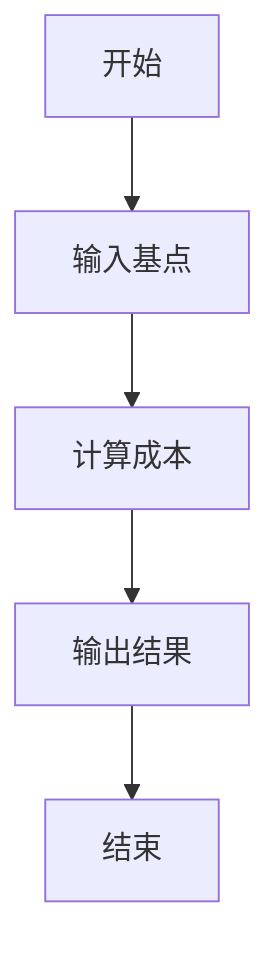
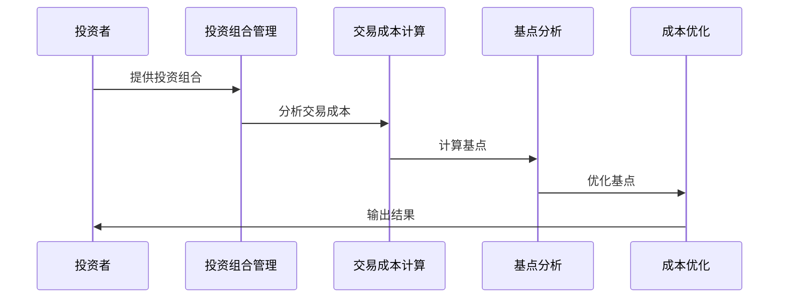

                 


# 伯格的投资成本控制：为什么每个基点都重要

> 关键词：投资成本控制、基点、伯格、金融投资、风险管理、成本优化、投资策略

> 摘要：本文深入探讨了伯格在投资成本控制中的关键策略，特别是基点（basis point）的重要性。通过分析基点对整体投资收益的影响，本文揭示了如何通过优化每个基点来提升投资效率和降低风险。结合数学模型、算法原理和实际案例，本文为投资者提供了全面的视角和实用的优化方法。

---

## 第一部分：投资成本控制的背景与基础

### 第1章：投资成本控制的背景与重要性

#### 1.1 投资成本控制的基本概念

##### 1.1.1 投资成本的定义与范围

投资成本是指在投资过程中产生的所有费用，包括但不限于交易费用、管理费用、托管费用、税费等。这些成本会直接影响投资的最终收益，因此优化投资成本是提升投资回报率的重要手段。

##### 1.1.2 投资成本控制的必要性

在金融市场中，投资成本的高低直接决定了投资的最终收益。特别是在低波动率的市场环境下，成本的差异可能会对最终收益产生显著影响。因此，投资者必须关注每一个基点的成本变化，以确保投资组合的最优表现。

##### 1.1.3 基点（Basis Point）的定义与作用

基点是金融领域中常用的单位，表示0.01%的百分比变化。在投资成本控制中，基点的重要性体现在其对整体收益的累积效应。例如，降低1个基点的成本优化可能会对长期投资产生显著的积极影响。

#### 1.2 基点的重要性

##### 1.2.1 基点在金融投资中的应用

基点广泛应用于债券收益率、贷款利率、基金费用等多个领域。特别是在投资成本控制中，基点用于衡量每单位成本的变化对整体投资收益的影响。

##### 1.2.2 基点对投资成本的影响

基点的累积效应意味着，即使单个基点的变化看似微小，其在长期投资中的影响也可能不可忽视。例如，年化成本的基点变化可能会显著影响投资的终值。

##### 1.2.3 每个基点对整体投资的影响

通过优化每一个基点，投资者可以在不显著增加风险的情况下，逐步提升投资组合的效率和收益。这体现了投资成本控制的精细化管理理念。

### 第2章：投资成本控制的背景与问题描述

#### 2.1 投资成本控制的背景

##### 2.1.1 金融市场的竞争加剧

随着金融市场的竞争日益激烈，投资者对成本的关注度不断提高。降低投资成本成为提升竞争力的重要手段。

##### 2.1.2 投资者对成本的关注

现代投资者越来越关注投资成本对收益的影响。尤其是在机构投资者中，成本优化已成为核心策略之一。

##### 2.1.3 机构投资者的成本控制需求

机构投资者通常管理着巨额资金，对投资成本的敏感性更高。优化每个基点的成本成为提升投资效率的关键。

#### 2.2 投资成本控制的问题描述

##### 2.2.1 成本控制的复杂性

投资成本涉及多个方面，包括交易费用、管理费用等，优化每个基点需要综合考虑多因素。

##### 2.2.2 基点对整体收益的影响

基点的累积效应意味着，即使单个基点的变化看似微小，其对整体收益的影响也可能显著。

##### 2.2.3 成本控制的边界与外延

投资成本控制并非无边界，需要在风险可控的前提下进行优化。因此，成本控制的边界和外延需要清晰界定。

### 第3章：投资成本控制的核心概念与联系

#### 3.1 核心概念的原理

##### 3.1.1 投资成本控制的原理

投资成本控制的原理包括识别、衡量和优化每个基点的成本，以提升投资效率和收益。

##### 3.1.2 基点与投资成本的关系

基点是衡量投资成本变化的单位，其变化直接影响整体投资收益。

##### 3.1.3 投资成本控制的数学模型

投资成本控制可以通过数学模型量化，例如：

$$ \text{总成本} = \sum_{i=1}^{n} c_i \times b_i $$

其中，$c_i$ 是第$i$项投资的成本，$b_i$ 是基点。

#### 3.2 核心概念的对比分析

##### 3.2.1 基点与其他成本单位的对比

基点与其他成本单位（如百分比、千分比）的对比可以帮助投资者更好地理解其在成本控制中的作用。

##### 3.2.2 投资成本与收益的关系

投资成本与收益呈反向关系，优化成本可以提升收益。

##### 3.2.3 成本控制与风险管理的联系

成本控制与风险管理密切相关，优化成本的同时需要确保风险可控。

#### 3.3 实体关系图


---

## 第二部分：投资成本控制的算法与数学模型

### 第4章：投资成本控制的算法原理

#### 4.1 算法原理概述

##### 4.1.1 成本计算的基本流程

投资成本计算的基本流程包括数据采集、成本识别、基点分析和结果优化。

##### 4.1.2 基点在算法中的应用

基点用于量化投资成本的变化，算法通过基点优化来提升投资效率。

##### 4.1.3 算法的优化与调整

算法优化包括基点调整、成本分摊和风险控制。

#### 4.2 算法流程图



#### 4.3 Python代码实现

```python
def calculate_cost(basis_points, value):
    return basis_points * value / 10000

# 示例
basis_points = 50
value = 1000000
cost = calculate_cost(basis_points, value)
print(f"投资成本为：{cost}")
```

#### 4.4 算法的数学模型与公式

投资成本计算的数学模型：

$$ \text{总成本} = \sum_{i=1}^{n} \frac{b_i \times v_i}{10000} $$

其中，$b_i$ 是第$i$项的基点，$v_i$ 是对应的价值。

---

## 第三部分：投资成本控制的系统分析与架构设计

### 第5章：系统分析与架构设计方案

#### 5.1 问题场景介绍

投资成本控制的系统需要解决数据采集、基点分析和成本优化等问题。

#### 5.2 系统功能设计

##### 5.2.1 领域模型设计


##### 5.2.2 系统架构设计


#### 5.3 系统接口设计

系统接口包括投资者输入、投资组合数据输入和成本计算输出。

#### 5.4 系统交互流程图



---

## 第四部分：投资成本控制的项目实战

### 第6章：项目实战与案例分析

#### 6.1 项目环境安装

项目需要安装Python和相关库（如numpy、pandas）。

#### 6.2 核心代码实现

```python
import numpy as np
import pandas as pd

def optimize_basis_points(basis_points, value):
    return basis_points * value / 10000

# 示例数据
data = pd.DataFrame({
    '资产': ['股票', '债券', '基金'],
    '基点': [40, 30, 50],
    '价值': [1000000, 500000, 800000]
})

# 计算总成本
data['投资成本'] = data.apply(lambda x: optimize_basis_points(x['基点'], x['价值']), axis=1)
print(data)
```

#### 6.3 案例分析与解读

通过实际案例分析，展示如何优化基点以降低投资成本。

#### 6.4 项目小结

总结项目实施的经验和优化建议。

---

## 第五部分：投资成本控制的最佳实践与小结

### 第7章：最佳实践与小结

#### 7.1 小结

投资成本控制的关键在于优化每个基点，这需要系统的分析和优化策略。

#### 7.2 注意事项

在优化基点时，需注意风险控制和成本优化的平衡。

#### 7.3 拓展阅读

推荐相关书籍和资源，进一步深入学习投资成本控制。

---

## 第六部分：参考文献

### 6.1 参考文献

1. 伯格的《投资成本控制》
2. 现代投资组合理论的相关文献
3. 金融数学中的基点应用

---

# 作者：AI天才研究院/AI Genius Institute & 禅与计算机程序设计艺术 /Zen And The Art of Computer Programming

---

通过以上目录大纲和内容，您可以根据实际需求进一步扩展和撰写具体章节内容。

