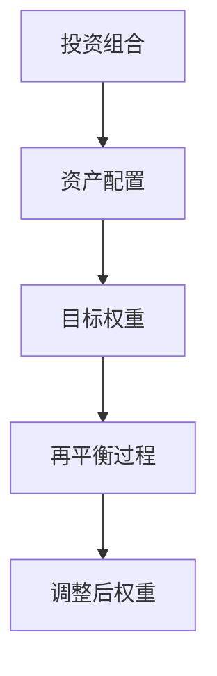
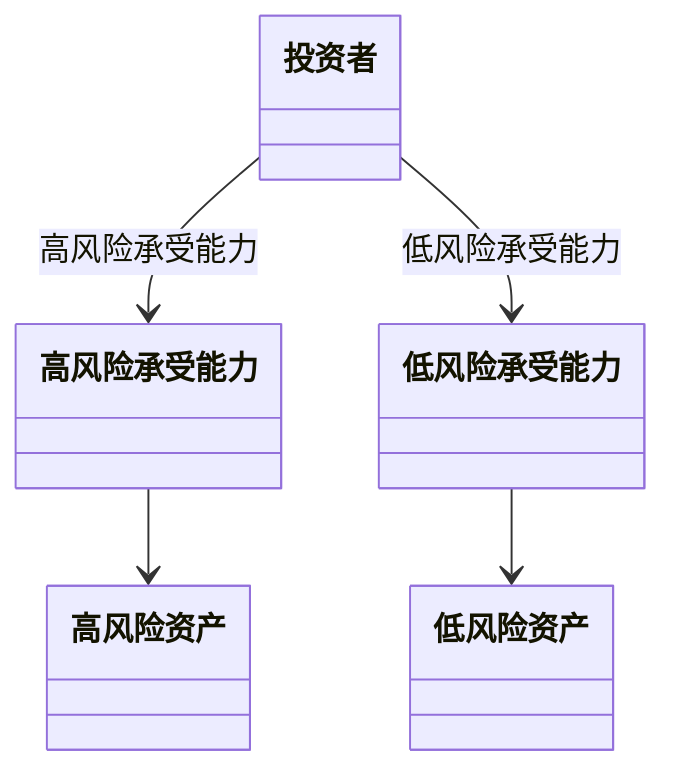
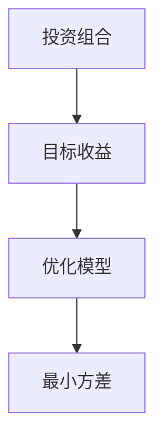
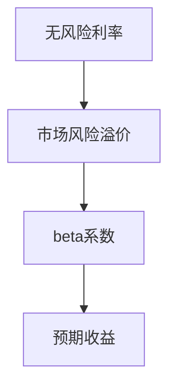

                 


# 伯格的投资组合再平衡：保持风险水平

> 关键词：投资组合再平衡，风险管理，资产配置，投资策略，伯格模型，风险调整收益

> 摘要：本文深入探讨了投资组合再平衡的核心概念、数学模型、系统设计与实现，以及实际案例分析。通过伯格模型的视角，结合现代投资组合理论，系统性地分析了如何通过再平衡策略保持风险水平，实现长期稳健的投资回报。

---

## 第一部分: 投资组合再平衡的背景与概念

### 第1章: 投资组合再平衡的定义与重要性

#### 1.1 投资组合再平衡的定义

投资组合再平衡是指定期或不定期调整投资组合的资产配置，以维持预设的目标风险水平和预期收益的过程。通过再平衡，投资者可以应对市场波动、个人风险承受能力的变化或投资目标的调整，确保投资组合的表现符合预期。

**核心概念：**
- **投资组合**：一系列金融资产的组合，旨在在风险和收益之间寻求最佳平衡。
- **再平衡**：调整资产权重以保持目标配置的过程。

**图表：投资组合再平衡的概念图**



#### 1.2 投资组合再平衡的历史与发展

现代投资组合理论（MPT）由哈里·马科维茨于1952年提出，奠定了再平衡策略的理论基础。伯格模型进一步发展了这一理论，强调定期调整投资组合以应对市场变化和风险偏好。

**图表：投资组合再平衡的历史演变**

```mermaid
timeline
    title 投资组合再平衡的历史
    :1952: [现代投资组合理论（MPT）提出]
    :1970s: [伯格模型的发展]
    :2000s: [动态再平衡策略的普及]
    :现在: [自动化再平衡技术的应用]
```

#### 1.3 再平衡的应用场景

- **资产配置的动态调整**：根据市场变化和个人风险偏好，调整资产权重。
- **风险管理的需求**：通过再平衡降低单一资产的风险敞口。
- **市场环境的变化**：应对经济周期波动，优化投资组合表现。

---

### 第2章: 投资组合再平衡的核心要素

#### 2.1 资产配置与权重调整

**资产配置**是投资组合管理的核心，涉及将资金分配到不同资产类别（如股票、债券、现金等）。再平衡过程中，权重调整是关键步骤，确保各资产的比例符合目标配置。

**图表：资产配置的权重调整**


#### 2.2 风险承受能力与投资目标

投资者的风险承受能力和投资目标直接影响再平衡策略。风险承受能力强的投资者可能倾向于更高风险资产（如股票），而保守投资者则选择债券等低风险资产。

**图表：风险承受能力与资产配置的关系**



#### 2.3 市场波动与再平衡时机

市场波动性影响投资组合的绩效，再平衡时机的选择至关重要。定期再平衡（如每季度一次）和事件驱动再平衡（如市场大幅波动后）是常见的策略。

**图表：再平衡时机选择**

```mermaid
sequence
    投资者 --> 检测市场波动
    if 市场波动超过阈值 then
        投资者 --> 触发再平衡
    else
        投资者 --> 继续监测
    end
    投资者 --> 调整资产权重
```

---

## 第二部分: 投资组合再平衡的数学模型与算法

### 第4章: 现代投资组合理论与数学模型

#### 4.1 均值-方差优化模型

均值-方差优化模型由马科维茨提出，旨在在给定风险下最大化收益，或在给定收益下最小化风险。

**数学公式：**

$$ \text{Minimize } \sigma^2 \text{ subject to } \mu \geq \text{目标收益} $$

**图表：均值-方差优化的优化过程**



#### 4.2 资本资产定价模型（CAPM）

CAPM用于评估资产的预期收益，是再平衡策略的重要工具。

**数学公式：**

$$ E(r_i) = r_f + \beta_i (E(r_m) - r_f) $$

**图表：CAPM在再平衡中的应用**



---

## 第三部分: 投资组合再平衡的系统设计与实现

### 第5章: 投资组合再平衡的系统架构

#### 5.1 系统功能设计

投资组合再平衡系统包括以下几个核心模块：

**图表：系统功能模块图**


#### 5.2 系统架构设计

系统的架构采用分层设计，包括数据层、业务逻辑层和用户界面层。

**图表：系统架构图**


---

## 第四部分: 投资组合再平衡的项目实战

### 第6章: 项目实战与案例分析

#### 6.1 项目背景与目标

选择一个包含股票、债券和现金的投资组合，目标是通过再平衡策略保持风险水平。

**代码实现：**

```python
import numpy as np
import pandas as pd

# 示例数据：资产的预期收益和协方差矩阵
mu = np.array([0.1, 0.05, 0.02])
sigma = np.array([[0.16, 0.05, 0.02],
                  [0.05, 0.06, 0.01],
                  [0.02, 0.01, 0.03]])

# 使用均值-方差优化求解最优权重
def mean_variance_optimization(mu, sigma):
    n = len(mu)
    # 构建优化问题
    # ... 优化过程略 ...
    return weights

weights = mean_variance_optimization(mu, sigma)
print(weights)
```

---

## 第五部分: 投资组合再平衡的最佳实践与小结

### 第7章: 最佳实践与小结

#### 7.1 再平衡策略的注意事项

- 定期审查和调整投资组合。
- 考虑交易成本和税务影响。
- 保持风险水平与投资目标一致。

#### 7.2 未来的投资组合再平衡趋势

随着技术进步，自动化再平衡和AI驱动的投资策略将越来越重要。

---

## 作者：AI天才研究院/AI Genius Institute & 禅与计算机程序设计艺术 /Zen And The Art of Computer Programming

