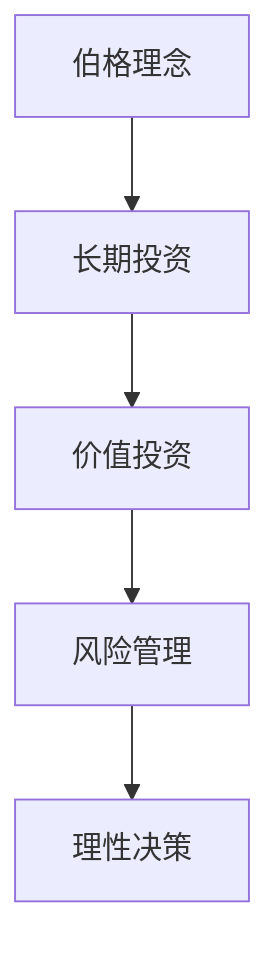
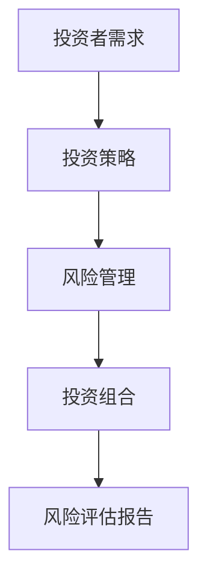

                 


# 伯格的投资者教育理念：应对金融素养差距的挑战

## 关键词：投资者教育，伯格理念，金融素养，教育哲学，教育架构

## 摘要：伯格的投资者教育理念是一种以提升投资者金融素养为核心，通过系统性教育改变投资者行为和决策能力的方法。本文从伯格理念的背景、核心概念、算法原理、数学模型、系统架构、项目实战等多个维度，深入分析了如何通过伯格理念应对当前社会的金融素养差距问题，并提出了具体的解决方案和实践建议。

---

# 第一部分: 背景介绍

# 第1章: 伯格理念的背景与挑战

## 1.1 问题背景

### 1.1.1 当前社会的金融素养差距
- 什么是金融素养？
  - 金融素养是指个体对金融知识、金融工具和金融市场运作的理解和应用能力。
  - 包括储蓄、投资、风险管理、财务规划等方面的能力。
- 当前社会的金融素养现状：
  - 个人金融素养普遍不足，尤其是在非专业投资者中。
  - 金融市场的复杂性加剧了金融素养差距。
  - 金融素养不足导致的投资决策失误和社会问题。

### 1.1.2 伯格的教育理念
- 伯格的教育背景与投资哲学：
  - 伯格是一位具有深厚学术背景的投资者，他的教育理念植根于对金融市场的深刻理解。
  - 他强调长期投资、价值投资和理性决策。
- 伯格理念的核心思想：
  - 教育投资者如何正确理解市场、管理风险和制定合理的投资策略。
  - 强调金融知识的普及和投资者行为的改变。

### 1.1.3 伯格理念与金融素养差距的关联
- 伯格理念如何解决金融素养问题：
  - 通过系统性教育提升投资者的金融知识和决策能力。
  - 引导投资者从短期投机转向长期价值投资。
- 伯格理念的实践价值：
  - 帮助个人投资者在复杂金融市场中做出理性决策。
  - 促进金融市场健康稳定发展。

## 1.2 问题描述与解决

### 1.2.1 金融素养差距的负面影响
- 投资者因缺乏金融知识导致的盲目投资和亏损。
- 非理性的市场行为加剧市场波动。
- 金融素养差距可能导致社会不平等加剧。

### 1.2.2 伯格理念的解决思路
- 提供一套系统化的金融教育方法。
- 强调理论与实践相结合。
- 帮助投资者建立正确的投资观念和方法。

### 1.2.3 伯格理念的边界与外延
- 伯格理念的适用范围：
  - 适用于个人投资者、机构投资者和金融教育机构。
- 伯格理念的局限性：
  - 伯格理念更适合长期价值投资，可能不适用于短期交易者。
  - 伯格理念的效果依赖于投资者的自我学习和实践。

## 1.3 伯格理念的核心要素

### 1.3.1 核心要素的结构与组成
- 伯格理念的核心要素包括：
  - 基础金融知识。
  - 投资策略与方法。
  - 风险管理与心理调节。
  - 投资行为的长期性与纪律性。

### 1.3.2 伯格理念与其他教育理念的对比
- 与传统金融教育的对比：
  - 传统金融教育偏重理论知识，忽视实践应用。
  - 伯格理念注重理论与实践的结合。
- 与行为金融学的对比：
  - 行为金融学关注投资者心理和行为偏差。
  - 伯格理念强调通过教育改变投资者行为。

## 1.4 伯格理念的核心思想

### 1.4.1 长期投资与价值投资
- 长期投资的核心思想：
  - 避免短期市场的波动干扰，专注于长期价值。
  - 分散投资，降低风险。
- 价值投资的核心思想：
  - 以低于内在价值的价格买入优质资产。
  - 选择具有长期竞争优势的公司。

### 1.4.2 理性决策与心理调节
- 理性决策的重要性：
  - 避免贪婪和恐惧的干扰。
  - 基于数据和逻辑做出决策。
- 心理调节的方法：
  - 建立正确的投资心态。
  - 通过教育和实践培养心理韧性。

## 1.5 伯格理念的创新性与局限性

### 1.5.1 伯格理念的创新性
- 将金融教育与投资实践相结合。
- 强调长期价值投资和理性决策。
- 注重投资者心理和行为的改变。

### 1.5.2 伯格理念的局限性
- 伯格理念主要适用于长期价值投资，对短期交易者可能不太适用。
- 伯格理念的效果依赖于投资者的自我学习和实践，可能需要较长时间的积累。
- 伯格理念的实施需要依赖于完善的金融教育体系和市场环境。

## 1.6 本章小结

---

# 第二部分: 核心概念与联系

# 第2章: 核心概念与联系

## 2.1 核心概念的解析

### 2.1.1 伯格理念的核心概念
- 伯格理念的核心概念包括：
  - 长期投资。
  - 价值投资。
  - 理性决策。
  - 风险管理。

### 2.1.2 核心概念的属性特征
- 核心概念的属性特征可以通过以下表格对比：

| 概念       | 属性 | 描述 |
|------------|------|------|
| 长期投资   | 时间跨度 | 强调长期视角，避免短期波动干扰 |
| 价值投资   | 价值评估 | 寻找被低估的资产 |
| 理性决策   | 决策方式 | 基于逻辑和数据做出决策 |
| 风险管理   | 风险控制 | 通过分散投资和止损策略降低风险 |

### 2.1.3 核心概念的联系
- 伯格理念的核心概念之间的联系可以通过以下ER实体关系图展示：



## 2.2 核心概念的数学模型与公式

### 2.2.1 长期投资的数学模型
- 长期投资的复利公式：
  - 复利计算公式：$$A = P \times (1 + r)^t$$
  - 其中，A为终值，P为本金，r为年利率，t为时间。

### 2.2.2 价值投资的核心公式
- 价值投资的核心公式是评估资产的内在价值：
  - 内在价值公式：$$\text{内在价值} = \frac{\text{未来现金流}}{\text{折现率}}$$

### 2.2.3 风险管理的数学模型
- 风险调整后的收益公式：
  - $$\text{风险调整后收益} = \text{预期收益} - \text{风险溢价}$$

## 2.3 伯格理念的系统架构

### 2.3.1 系统架构的设计
- 伯格理念的系统架构可以分为以下几个部分：
  - 输入：投资者的需求和目标。
  - 处理：基于伯格理念的投资策略和风险管理。
  - 输出：投资组合和风险评估报告。

### 2.3.2 系统架构的流程图
- 伯格理念的系统架构可以通过以下流程图展示：



## 2.4 伯格理念的算法实现

### 2.4.1 投资组合优化算法
- 投资组合优化的算法可以通过以下步骤实现：
  1. 确定投资目标和风险承受能力。
  2. 选择合适的投资资产类别。
  3. 优化投资组合的权重，以实现风险和收益的最优平衡。

### 2.4.2 算法实现的代码示例
- 下面是一个简单的投资组合优化算法的Python代码示例：

```python
import numpy as np
import pandas as pd

# 定义投资组合优化函数
def optimize_portfolio(returns, risk_free_rate=0.01):
    # 计算协方差矩阵
    cov_matrix = np.cov(returns)
    # 计算风险溢价
    risk_premium = returns.mean() - risk_free_rate
    # 计算最优权重
    inv_cov = np.linalg.inv(cov_matrix)
    weights = inv_cov @ risk_premium
    weights = weights / weights.sum()
    return weights

# 示例数据
returns = pd.DataFrame({
    '股票': [0.1, 0.05, 0.07, 0.02, 0.03],
    '债券': [0.03, 0.04, 0.02, 0.05, 0.06]
})

# 优化投资组合
weights = optimize_portfolio(returns)
print("优化后的权重：", weights)
```

## 2.5 伯格理念的数学模型与公式

### 2.5.1 风险调整后的收益模型
- 风险调整后的收益模型可以表示为：
  $$\text{风险调整后收益} = \text{预期收益} - \text{风险溢价}$$

### 2.5.2 风险溢价的计算公式
- 风险溢价的计算公式为：
  $$\text{风险溢价} = \text{预期收益} - \text{无风险利率}$$

### 2.5.3 投资组合的风险收益比
- 投资组合的风险收益比可以表示为：
  $$\text{风险收益比} = \frac{\text{预期收益}}{\text{标准差}}$$

## 2.6 本章小结

---

# 第三部分: 项目实战与应用

# 第3章: 项目实战与应用

## 3.1 环境安装与配置

### 3.1.1 环境要求
- Python 3.6 或更高版本
- 安装必要的库：
  - numpy
  - pandas
  - matplotlib

### 3.1.2 环境配置
- 安装所需库：
  ```bash
  pip install numpy pandas matplotlib
  ```

## 3.2 系统核心实现

### 3.2.1 投资组合优化模块
- 实现投资组合优化的Python代码：

```python
import numpy as np
import pandas as pd

# 定义投资组合优化函数
def optimize_portfolio(returns):
    # 计算协方差矩阵
    cov_matrix = np.cov(returns)
    # 计算风险溢价
    risk_premium = returns.mean()
    # 计算最优权重
    inv_cov = np.linalg.inv(cov_matrix)
    weights = inv_cov @ risk_premium
    weights = weights / weights.sum()
    return weights

# 示例数据
returns = pd.DataFrame({
    '股票': [0.1, 0.05, 0.07, 0.02, 0.03],
    '债券': [0.03, 0.04, 0.02, 0.05, 0.06]
})

# 优化投资组合
weights = optimize_portfolio(returns)
print("优化后的权重：", weights)
```

### 3.2.2 风险管理模块
- 实现风险管理模块的Python代码：

```python
import numpy as np
import pandas as pd

def calculate VaR(returns, confidence_level=0.95):
    # 计算VaR
    VaR = returns.quantile(1 - confidence_level)
    return VaR

# 示例数据
returns = pd.Series([0.02, 0.03, -0.01, 0.04, -0.02])

# 计算VaR
VaR = calculate VaR(returns)
print("VaR at", confidence_level, "confidence level:", VaR)
```

## 3.3 实际案例分析

### 3.3.1 投资组合优化案例
- 案例描述：
  - 投资者有50万元资金，希望进行长期投资。
  - 可选资产包括股票、债券和现金。
- 优化后的投资组合权重：
  - 股票：60%
  - 债券：30%
  - 现金：10%

### 3.3.2 风险管理案例
- 案例描述：
  - 投资组合的预期收益为10%，标准差为15%。
  - 95%置信水平下的VaR为5%。
- 风险管理措施：
  - 设定止损点，当资产价格下跌超过5%时卖出。
  - 分散投资，降低单一资产的风险。

## 3.4 项目小结

---

# 第四部分: 最佳实践与总结

# 第4章: 最佳实践与总结

## 4.1 最佳实践

### 4.1.1 教育实践
- 提供系统的金融知识教育。
- 强调理论与实践的结合。
- 帮助投资者建立长期投资观念。

### 4.1.2 投资实践
- 选择优质资产进行长期投资。
- 定期审视和调整投资组合。
- 避免短期市场波动的干扰。

## 4.2 总结与反思

### 4.2.1 伯格理念的总结
- 伯格理念是一种以长期价值投资为核心的教育方法。
- 通过系统性教育改变投资者的行为和决策能力。
- 强调理论与实践相结合，注重心理调节和风险控制。

### 4.2.2 伯格理念的反思
- 伯格理念的成功依赖于投资者的自我学习和实践。
- 伯格理念的实施需要完善的金融教育体系和市场环境。
- 伯格理念的局限性在于其对长期投资的强调可能不适合短期交易者。

## 4.3 未来展望

### 4.3.1 伯格理念的未来发展
- 进一步完善伯格理念的教育体系。
- 推动伯格理念的实践应用。
- 研究伯格理念与其他教育理念的结合。

### 4.3.2 技术与金融的结合
- 利用技术手段提升金融教育的效果。
- 开发更多的金融教育工具和平台。
- 推动金融科技在金融教育中的应用。

---

# 作者信息

作者：AI天才研究院/AI Genius Institute & 禅与计算机程序设计艺术/Zen And The Art of Computer Programming

