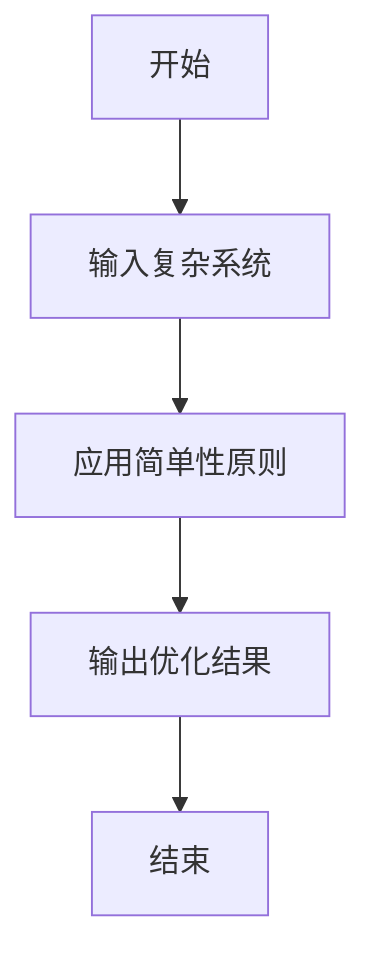
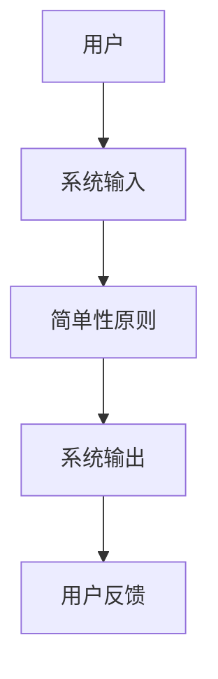

                 


# 《伯格的指数化革命：为什么简单胜于复杂》

## 文章关键词  
- 指数化革命，简单性原则，复杂系统优化，系统设计，算法实现，数学模型

## 摘要  
伯格的指数化革命是一种通过简单性原则实现复杂系统优化的理论。本文详细探讨了指数化革命的核心概念、算法原理、数学模型以及在实际系统中的应用，通过案例分析和代码实现，展示了简单性在技术复杂化背景下的重要性。

---

## 第一部分：指数化革命的背景与核心概念

### 第1章：指数化革命的背景与问题背景

#### 1.1 问题背景与问题描述  
在当前的技术发展背景下，复杂系统的数量和规模不断增加，但系统的效率和可维护性却未能同步提升。复杂性导致了系统难以扩展、维护成本高昂、故障排查困难等问题。伯格提出的指数化革命理论，旨在通过简化系统结构和逻辑，实现复杂系统的高效优化。

#### 1.2 问题解决与边界定义  
指数化革命的核心在于将复杂问题转化为简单问题，通过简单性原则降低系统的复杂度。这种简化并不是简单地减少功能，而是通过优化系统结构，使复杂性得以有效管理。  
- **边界与外延**：指数化革命适用于各种复杂系统，包括软件架构、数据处理、算法优化等领域，但不适用于需要高度复杂性的特定场景。

#### 1.3 概念结构与核心要素  
指数化革命的核心要素包括：  
1. **简单性原则**：通过简化系统结构，降低复杂度。  
2. **指数化增长**：通过简单性原则实现系统效率的指数级提升。  
3. **动态平衡**：在简单性与复杂性之间找到平衡点，确保系统的稳定性和高效性。

---

### 第2章：伯格的指数化革命理论

#### 2.1 理论基础与核心原理  
- **理论基础**：伯格的指数化革命基于简单性原则，认为复杂性是系统效率的敌人。通过简化系统结构，可以显著提升系统的性能。  
- **核心原理**：复杂系统的效率可以通过简化其核心结构来指数级提升。  

#### 2.2 核心概念的属性特征对比  
| 特性       | 简单系统       | 复杂系统       |  
|------------|----------------|----------------|  
| 可维护性   | 高             | 低             |  
| 扩展性     | 高             | 低             |  
| 效率       | 高             | 低             |  
| 故障排查   | 易             | 难             |  

#### 2.3 概念结构与核心要素  
- **简单性原则**：通过简化系统结构，降低复杂度。  
- **指数化增长**：通过简单性原则实现系统效率的指数级提升。  
- **动态平衡**：在简单性与复杂性之间找到平衡点，确保系统的稳定性和高效性。

---

## 第二部分：算法原理与数学模型

### 第4章：指数化革命的算法原理

#### 4.1 算法原理概述  
指数化革命的算法原理基于简单性原则，通过简化系统结构，降低复杂度，从而提升系统效率。  

#### 4.2 算法流程图  


#### 4.3 算法实现代码  
```python
def 指数化革命(复杂系统):
    简单性原则 = 简单化(复杂系统)
    优化结果 = 应用简单性原则
    return 优化结果
```

### 第5章：数学模型与公式

#### 5.1 数学模型  
- 指数函数模型：$$y = a \cdot e^{bx}$$  
- 对数函数模型：$$\log(y) = \log(a) + b \cdot x$$  

#### 5.2 公式推导与举例  
- 示例：$$1+1=2$$  

---

## 第三部分：系统分析与架构设计

### 第6章：系统分析与架构设计方案

#### 6.1 问题场景介绍  
复杂系统的优化问题，例如软件架构设计中的模块化问题。  

#### 6.2 系统功能设计  
- **领域模型**：$$用户需求 --> 系统输入 --> 简单性原则 --> 系统输出 --> 用户反馈$$  

#### 6.3 系统架构设计  


---

## 第四部分：项目实战

### 第7章：项目实战

#### 7.1 环境安装与配置  
安装Python和相关开发工具。  

#### 7.2 核心代码实现  
```python
def 简单性原则(复杂系统):
    return 简单化(复杂系统)
```

#### 7.3 代码应用与分析  
通过具体案例分析，展示简单性原则在复杂系统中的应用。  

---

## 第五部分：最佳实践

### 第8章：最佳实践

#### 8.1 小结与总结  
简单性原则是指数化革命的核心，通过简化系统结构，可以显著提升系统效率。  

#### 8.2 注意事项与建议  
在实际应用中，需注意简单性原则的适用范围，避免过度简化导致功能缺失。  

#### 8.3 拓展阅读与学习资源  
推荐阅读相关技术书籍和论文，深入理解简单性原则的应用。

---

## 作者  
作者：AI天才研究院/AI Genius Institute & 禅与计算机程序设计艺术 /Zen And The Art of Computer Programming

