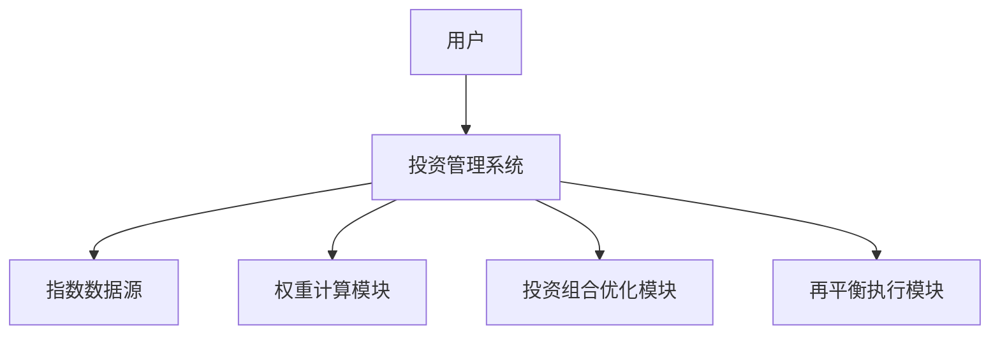

                 


# 伯格的被动投资理念：为什么主动管理难以胜出

## 关键词：被动投资，主动管理，指数基金，ETF，伯格研究，有效市场假说

## 摘要：  
被动投资是一种以指数基金或交易所交易基金（ETF）为核心的投资策略，强调长期持有和低成本运作，避免频繁交易和市场预测。本文通过分析被动投资的核心理念、工具与策略，探讨为什么主动管理在长期中难以战胜被动投资。结合伯格的经典研究和实证数据，本文揭示了被动投资在费用、风险和收益上的优势，并通过数学模型和系统架构设计，展示了被动投资的科学性和可操作性。最后，通过项目实战和最佳实践，为投资者提供切实可行的投资策略。

---

## 第1章: 被动投资的起源与发展

### 1.1 被动投资的定义与核心理念  
被动投资是一种投资策略，强调通过持有和跟踪市场指数（如标普500指数）来获得长期收益，而非通过主动选股或市场预测来追求超额收益。其核心理念包括：  
1. **市场有效性**：市场通常是有效的，个股的超额收益难以持续。  
2. **低成本运作**：通过降低管理费用和交易成本，提高净收益。  
3. **长期持有**：避免频繁交易，减少税务负担和交易摩擦。  

### 1.2 被动投资的起源与发展  
被动投资的起源可以追溯到20世纪70年代，伯格（John C. Bogle）是这一理念的倡导者。他创立了 Vanguard 集团，并推出全球第一只指数基金。随着技术进步和市场发展，被动投资逐渐从学术理论走向广泛应用。  

### 1.3 被动投资的理论基础  
被动投资的理论基础主要包括：  
1. **有效市场假说**：信息是免费且充分流动的，市场价 格反映了所有可获得的信息，因此很难通过分析找到被低估的股票。  
2. **资本资产定价模型（CAPM）**：通过CAPM模型可以发现，大多数主动管理基金难以持续跑赢市场指数。  

---

## 第2章: 被动投资的核心工具与策略

### 2.1 指数基金与ETF  
指数基金和ETF是被动投资的核心工具。  
- **指数基金**：通过复制指数成分股的权重，实现与指数同步增长。  
- **ETF**：类似于指数基金，但可以在二级市场上实时交易，具有更高的流动性和灵活性。  

### 2.2 被动投资的主要策略  
1. **完全被动复制指数**：严格复制指数成分股，确保与指数同步波动。  
2. **优化被动投资组合**：通过优化算法调整成分股权重，降低跟踪误差。  
3. **定期再平衡**：定期调整投资组合，确保与指数保持一致。  

### 2.3 被动投资的风险管理  
1. **市场风险**：指数基金与市场同步波动，无法避免系统性风险。  
2. **流动性风险**：在某些市场条件下， ETF的流动性可能下降。  
3. **再平衡风险**：频繁再平衡可能导致额外的交易成本。  

---

## 第3章: 被动投资与主动管理的对比分析

### 3.1 主动管理的定义与特点  
主动管理是指通过精选个股、择时交易等方法，追求超额收益。其特点包括：  
1. **高费用**：主动管理基金通常收取更高的管理费。  
2. **高风险**：主动管理依赖于选股能力和市场预测，存在较大的不确定性。  
3. **高波动**：频繁交易可能导致更高的波动性和税务负担。  

### 3.2 被动投资与主动管理的优劣势对比  
| 对比维度 | 被动投资 | 主动管理 |  
|---------|---------|---------|  
| 长期收益 | 稳定，接近市场指数 | 不稳定，难以跑赢市场 |  
| 费用 | 低，通常低于1% | 高，通常高于1% |  
| 风险 | 低，与市场同步波动 | 高，依赖于选股能力 |  

### 3.3 为什么主动管理难以长期胜出  
1. **费用劣势**：主动管理的高费用显著侵蚀了长期收益。  
2. **市场有效性**：市场信息的有效性使得超额收益难以持续。  
3. **投资者心理**：贪婪和恐惧导致投资者难以长期坚持被动策略。  

---

## 第4章: 被动投资的数学模型与算法原理

### 4.1 被动投资的数学基础  
1. **指数收益模型**：$$ R_{index} = \sum_{i=1}^{n} w_i R_i $$  
   其中，$w_i$ 是第$i$只股票的权重，$R_i$ 是第$i$只股票的收益。  
2. **被动投资组合优化**：通过最小化跟踪误差来优化投资组合。  

### 4.2 被动投资的算法原理  
被动投资的核心算法是指数复制，主要包括：  
1. **计算指数权重**：根据指数成分股的市值比例确定权重。  
2. **复制指数成分股**：按照权重购买成分股，确保与指数同步波动。  
3. **定期再平衡**：定期调整投资组合，确保与指数权重一致。  

---

## 第5章: 被动投资的系统架构设计

### 5.1 系统功能设计  
1. **数据获取**：获取指数成分股的实时数据。  
2. **权重计算**：计算各成分股的权重。  
3. **投资组合优化**：优化投资组合，最小化跟踪误差。  
4. **再平衡执行**：根据市场变化调整投资组合。  

### 5.2 系统架构图  


---

## 第6章: 项目实战

### 6.1 环境安装  
- Python 3.9+  
- pandas、numpy、matplotlib库  

### 6.2 核心实现代码  
```python
import pandas as pd
import numpy as np

# 示例：计算指数权重
def calculate_weights(prices, volumes):
    market_cap = prices * volumes
    total_cap = market_cap.sum()
    weights = market_cap / total_cap
    return weights

# 示例：被动投资组合优化
def optimize_portfolio(weights, target_return):
    # 这里可以使用优化算法（如均值-方差优化）来最小化跟踪误差
    pass
```

---

## 第7章: 总结与展望

### 7.1 总结  
被动投资凭借其低成本、低风险和长期稳定的收益，逐渐成为投资领域的主流策略。伯格的研究和实证数据证明，主动管理在长期中难以战胜被动投资。  

### 7.2 展望  
随着技术进步和市场发展，被动投资将更加智能化和个性化。投资者可以通过大数据分析和人工智能算法进一步优化投资组合，实现更高效的被动管理。

---

## 作者：AI天才研究院/AI Genius Institute & 禅与计算机程序设计艺术 /Zen And The Art of Computer Programming

