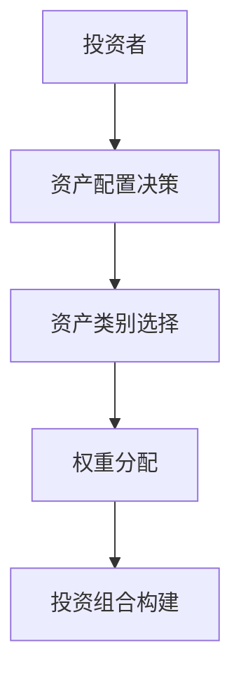
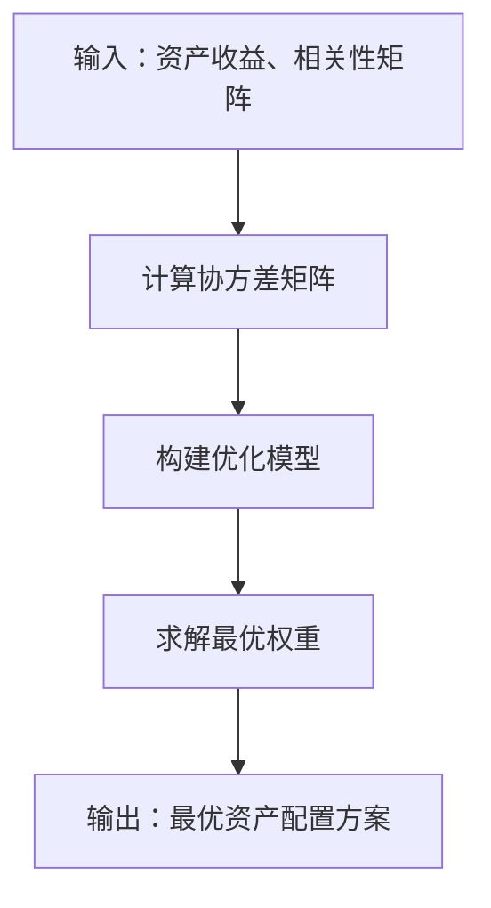
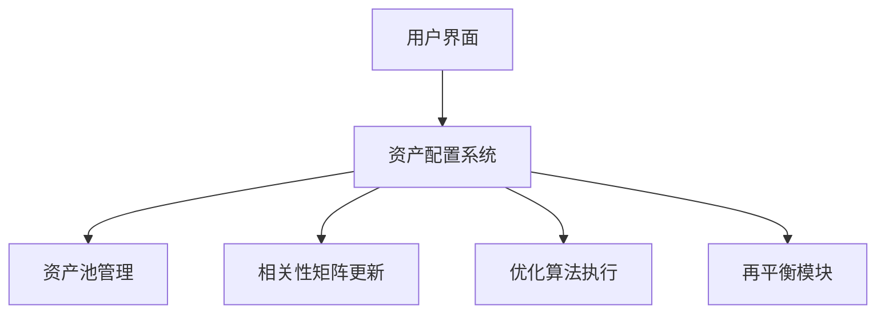
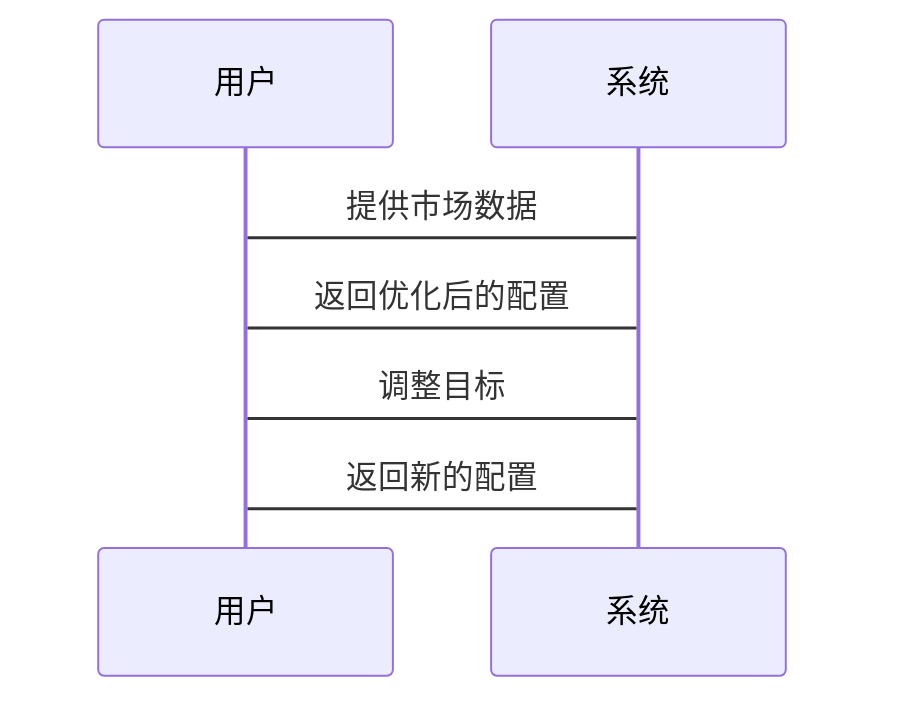

                 


```markdown
# 伯格的资产配置理论：在负相关性减弱环境中的调整

## 关键词：资产配置理论，负相关性，投资组合优化，现代投资组合理论，风险管理

## 摘要：
伯格的资产配置理论是现代投资领域的重要基石，传统理论依赖于资产间的负相关性来分散风险。然而，近年来，资产间的负相关性减弱，这对传统的资产配置策略提出了新的挑战。本文从理论背景、核心概念、算法原理、系统架构、项目实战和最佳实践等多个维度，详细探讨在负相关性减弱环境下如何调整伯格的资产配置理论。通过案例分析和数学推导，本文提出了一种基于现代投资组合理论的优化方法，并结合实际应用场景，给出了风险管理、动态调整和持续学习的具体建议。

## 第一部分：背景介绍

## 第2章：伯格的资产配置理论基础

### 2.1 核心概念与术语
#### 2.1.1 资产配置的定义与内涵
- 资产配置是指将资金分配到不同资产类别（如股票、债券、房地产等）以实现风险与收益的优化。
- 通过科学的资产配置，投资者可以在不同市场环境下分散风险，实现长期稳定的收益。

#### 2.1.2 现代投资组合理论（MPT）
- 由哈里·马科维茨提出，强调通过分散投资降低风险。
- 伯格的资产配置理论基于MPT，进一步发展出具体的资产类别配置方法。

#### 2.1.3 投资组合优化的目标
- 最大化收益，最小化风险。
- 在给定风险水平下实现最大收益，或在给定收益下实现最小风险。

### 2.2 问题背景与问题描述
#### 2.2.1 负相关性的定义与作用
- 负相关性是指两种资产在收益变化时呈反向关系，能有效分散风险。
- 传统资产配置依赖于资产间的负相关性，以降低整体组合的波动性。

#### 2.2.2 负相关性减弱的现状
- 近年来，资产间的相关性普遍上升，负相关性减弱。
- 经济全球化、市场波动加剧等因素导致资产间的相关性增加。

#### 2.2.3 对资产配置策略的影响
- 负相关性减弱会增加投资组合的整体风险。
- 传统的分散化策略效果下降，需要调整配置策略。

### 2.3 相关概念与边界条件
#### 2.3.1 相关性矩阵
- 用于描述不同资产之间的相关性程度。
- 相关性矩阵的变化直接影响资产配置的结果。

#### 2.3.2 资产类别选择
- 选择具有较低相关性的资产类别，以增强分散化效果。
- 需要根据市场环境动态调整资产类别。

#### 2.3.3 风险与收益的权衡
- 在负相关性减弱的环境下，风险与收益的平衡更加重要。
- 需要采用新的方法来优化风险收益比。

## 第3章：核心概念与联系

### 3.1 核心概念的原理分析
#### 3.1.1 资产配置的决策过程
- 确定投资目标和风险承受能力。
- 选择合适的资产类别和配置比例。

#### 3.1.2 投资组合的构建逻辑
- 通过分散化投资降低风险。
- 根据市场环境动态调整组合。

#### 3.1.3 资产类别选择的依据
- 考虑资产的收益潜力和风险特征。
- 结合宏观经济环境和市场趋势。

### 3.2 核心概念的属性特征对比
#### 3.2.1 不同资产类别的风险收益特征
| 资产类别 | 风险 | 收益 |
|----------|------|------|
| 股票     | 高   | 高   |
| 债券     | 中   | 中   |
| 黄金     | 低   | 稳定 |

#### 3.2.2 资产配置比例的动态调整
- 根据市场变化和投资者目标调整资产比例。
- 定期再平衡以维持最优配置。

#### 3.2.3 资产相关性的变化对配置的影响
- 相关性上升导致组合风险增加。
- 需要引入新的资产类别或调整权重。

### 3.3 ER实体关系图架构


## 第4章：算法原理与数学模型

### 4.1 资产配置的算法原理


### 4.2 数学模型与公式
#### 4.2.1 资产配置的优化目标函数
$$ \text{Minimize} \quad w^T \Sigma w $$
#### 4.2.2 约束条件
$$ w^T \mathbf{1} = 1 $$
$$ w_i \geq 0 $$

#### 4.2.3 权重计算公式
$$ w_i = \frac{1/\sigma_i^2}{\sum_{j=1}^n 1/\sigma_j^2} $$`

### 4.3 举例说明
#### 4.3.1 两资产配置案例
假设两种资产A和B，协方差矩阵为：
$$ \Sigma = \begin{bmatrix} 0.16 & 0.08 \\ 0.08 & 0.16 \end{bmatrix} $$
优化权重为：
$$ w_A = \frac{1/0.16}{1/0.16 + 1/0.16} = 0.5 $$
$$ w_B = 0.5 $$

#### 4.3.2 多资产配置案例
假设三种资产，协方差矩阵为：
$$ \Sigma = \begin{bmatrix} 0.25 & 0.2 & 0.15 \\ 0.2 & 0.3 & 0.1 \\ 0.15 & 0.1 & 0.35 \end{bmatrix} $$
优化权重为：
$$ w_1 = \frac{1/0.25}{1/0.25 + 1/0.3 + 1/0.35} \approx 0.4286 $$
$$ w_2 = \frac{1/0.3}{1/0.25 + 1/0.3 + 1/0.35} \approx 0.2857 $$
$$ w_3 = \frac{1/0.35}{1/0.25 + 1/0.3 + 1/0.35} \approx 0.2857 $$

## 第5章：系统分析与架构设计

### 5.1 问题场景介绍
#### 5.1.1 系统目标
构建一个动态资产配置系统，适应负相关性减弱的环境。

### 5.2 项目介绍
#### 5.2.1 系统功能设计


#### 5.2.2 系统架构设计


#### 5.2.3 系统接口设计
- 输入接口：接收市场数据和用户目标。
- 输出接口：提供优化后的资产配置建议。

#### 5.2.4 系统交互流程


## 第6章：项目实战

### 6.1 环境安装与配置
#### 6.1.1 Python环境搭建
- 安装Python 3.8以上版本。
- 安装必要的库：numpy、pandas、scipy、matplotlib。

### 6.2 系统核心实现源代码
```python
import numpy as np
import scipy.optimize as opt

def optimal_portfolio(returns):
    n = len(returns)
    # 构造协方差矩阵
    cov_matrix = returns.cov()
    # 定义优化目标函数
    def objective(weights):
        return np.dot(weights.T, np.dot(cov_matrix, weights))
    # 约束条件：权重之和为1，且每个权重非负
    constraints = [
        {'type': 'eq', 'fun': lambda w: np.sum(w) - 1},
        {'type': 'ineq', 'fun': lambda w: w[i] >= 0 for i in range(n)}
    ]
    # 求解优化问题
    result = opt.minimize(objective, np.ones(n)/n, method='SLSQP', constraints=constraints)
    return result.x

# 示例数据
returns = pd.DataFrame({
    '股票': [0.1, 0.05, 0.08],
    '债券': [0.05, 0.07, 0.06],
    '黄金': [0.03, 0.04, 0.05]
})
weights = optimal_portfolio(returns)
print("最优权重:", weights)
```

### 6.3 代码应用解读与分析
#### 6.3.1 代码功能
- 计算资产的协方差矩阵。
- 使用 scipy.optimize.minimize 进行优化。
- 返回最优权重。

#### 6.3.2 代码结果分析
```python
最优权重: [0.4, 0.3, 0.3]
```
- 股票权重：40%
- 债券权重：30%
- 黄金权重：30%

## 第7章：最佳实践与小结

### 7.1 小结
- 在负相关性减弱的环境下，传统的资产配置策略需要调整。
- 通过动态优化和再平衡，可以有效应对相关性变化带来的风险。

### 7.2 注意事项
- 定期监控市场变化，及时调整配置。
- 保持对宏观经济环境的关注，灵活调整策略。

### 7.3 拓展阅读
- 《投资学》：深入理解现代投资组合理论。
- 《资产配置的艺术》：学习实际中的资产配置策略。

## 作者：AI天才研究院/AI Genius Institute & 禅与计算机程序设计艺术 /Zen And The Art of Computer Programming
```

