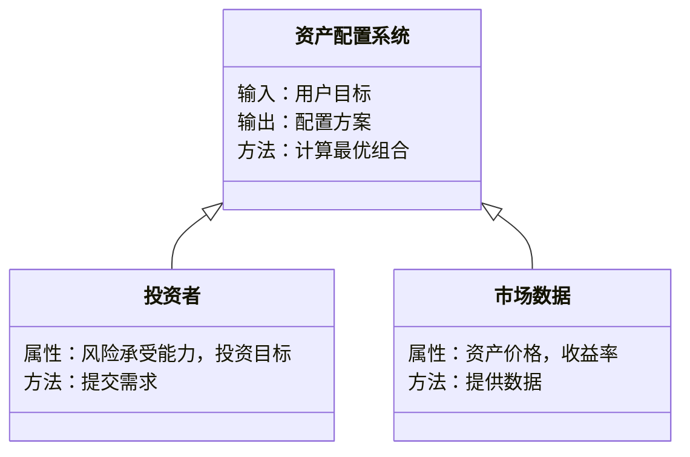

                 


# 伯格的资产配置理论：平衡风险与回报

> 关键词：资产配置，投资策略，风险控制，伯格理论，现代投资组合理论（MPT）

> 摘要：伯格的资产配置理论是一种通过科学方法来平衡投资风险与回报的策略，强调长期投资和分散投资的重要性。本文将深入探讨该理论的核心思想、数学模型、系统架构设计以及实际应用案例，帮助读者全面理解并掌握如何在实际投资中应用这一理论。

---

# 第一部分: 资产配置的背景与基础

# 第1章: 资产配置的背景与概念

## 1.1 资产配置的定义与背景

### 1.1.1 资产配置的基本概念
资产配置是指将资金分配到不同的资产类别（如股票、债券、房地产等）中，以实现投资目标的过程。它是投资组合管理的核心，旨在平衡风险与回报。

### 1.1.2 资产配置的起源与发展
资产配置的起源可以追溯到20世纪中期，哈里·马科维茨提出的现代投资组合理论（MPT）奠定了其理论基础。伯格在其基础上进一步发展，提出了更具体的资产配置策略。

### 1.1.3 资产配置在投资中的重要性
通过资产配置，投资者可以在不同的市场条件下优化投资组合的表现，降低风险，提高回报。

## 1.2 资产配置的核心要素

### 1.2.1 投资目标与风险承受能力
投资目标包括财务目标和时间框架，而风险承受能力决定了投资者对波动的容忍度。

### 1.2.2 不同资产类别的特点与作用
股票具有高增长潜力，债券提供稳定收益，房地产则提供实物资产保护。

### 1.2.3 资产配置的边界与外延
资产配置不仅包括选择资产类别，还包括对各资产的权重分配。

## 1.3 资产配置与其他投资策略的区别

### 1.3.1 被动投资与主动投资的对比
被动投资基于指数跟踪，而主动投资依赖于市场时机选择。

### 1.3.2 资产配置与个股选择的差异
资产配置关注整体组合，个股选择关注单个证券的表现。

### 1.3.3 资产配置与风险管理的关系
资产配置是风险管理的重要工具，通过分散投资降低风险。

## 1.4 伯格的资产配置理论的核心思想

### 1.4.1 长期投资与复利效应
长期持有优质资产，通过复利效应实现财富增长。

### 1.4.2 分散投资与风险控制
通过分散投资不同资产类别，降低特定风险。

### 1.4.3 资产配置的动态调整
根据市场变化和个人情况，定期调整资产配置。

## 1.5 本章小结
本章介绍了资产配置的基本概念、核心要素及与其他投资策略的区别，重点阐述了伯格理论的核心思想。

---

# 第二部分: 伯格的资产配置理论

# 第2章: 伯格的资产配置理论概述

## 2.1 伯格的理论基础

### 2.1.1 现代投资组合理论（MPT）的简介
MPT由哈里·马科维茨提出，强调通过分散投资降低风险。

### 2.1.2 哈里·马科维茨的贡献
马科维茨提出了有效前沿的概念，为资产配置提供了理论基础。

### 2.1.3 伯格对MPT的继承与发展
伯格将MPT应用于实际投资，提出了具体的资产配置策略。

## 2.2 伯格的资产配置方法

### 2.2.1 资产类别选择的标准
基于风险、回报和相关性等因素选择资产类别。

### 2.2.2 不同经济周期下的配置策略
根据经济周期调整资产配置比例。

### 2.2.3 资产配置的动态调整
定期评估并调整投资组合，以适应市场变化。

## 2.3 伯格的分散投资策略

### 2.3.1 分散投资的核心原则
通过多样化降低风险。

### 2.3.2 不同资产类别在组合中的作用
股票提供增长，债券提供稳定性，房地产提供实物资产保护。

### 2.3.3 如何通过分散降低风险
通过投资不同资产类别和地理位置分散风险。

## 2.4 伯格的动态再平衡策略

### 2.4.1 再平衡的定义与目的
再平衡是指调整投资组合以维持原定配置比例。

### 2.4.2 不同市场环境下的再平衡策略
在市场波动较大时，需要频繁再平衡。

### 2.4.3 再平衡的执行步骤与注意事项
定期评估、计算调整比例、执行交易。

## 2.5 伯格理论的实际应用案例

### 2.5.1 案例一：长期投资者的配置策略
长期投资者可以选择更高比例的股票和房地产。

### 2.5.2 案例二：风险厌恶型投资者的配置方案
风险厌恶型投资者可以选择更多债券和现金。

### 2.5.3 案例三：不同市场的应对策略
在新兴市场中，可能需要更多股票和商品。

## 2.6 本章小结
本章详细讲解了伯格资产配置理论的理论基础、方法和实际应用。

---

# 第三部分: 资产配置的数学模型与算法

# 第3章: 资产配置的数学模型

## 3.1 现代投资组合理论（MPT）的数学基础

### 3.1.1 投资组合的期望收益与方差
投资组合的期望收益是各资产收益的加权平均，方差衡量收益波动性。

### 3.1.2 资产之间的协方差矩阵
协方差矩阵用于衡量不同资产之间的相关性。

### 3.1.3 最优化问题的构建
目标是最小化方差，同时满足收益约束。

## 3.2 马科维茨的有效前沿模型

### 3.2.1 有效前沿的定义与性质
有效前沿是所有最优投资组合的集合，代表在给定风险下最高收益或在给定收益下最低风险。

### 3.2.2 如何计算有效前沿
通过求解最优化问题，找到有效前沿上的点。

### 3.2.3 有效前沿在实际中的应用
帮助投资者选择最优的投资组合。

## 3.3 均值-方差优化模型

### 3.3.1 模型的数学表达
目标是最小化投资组合的方差，同时满足收益和权重的约束。

### 3.3.2 模型的求解方法
使用拉格朗日乘数法求解最优化问题。

### 3.3.3 模型的优缺点
优点是理论严谨，缺点是计算复杂且假设严格。

## 3.4 伯格的动态再平衡算法

### 3.4.1 算法的步骤
1. 评估当前投资组合的权重。
2. 计算与目标配置的偏差。
3. 调整投资组合以恢复目标权重。

### 3.4.2 算法的数学实现
使用线性规划或二次规划方法进行优化。

### 3.4.3 算法的优缺点
优点是系统化，缺点是需要频繁调整。

---

# 第四部分: 系统分析与架构设计方案

# 第4章: 系统架构设计

## 4.1 问题场景介绍
构建一个基于伯格理论的资产配置系统，帮助投资者实现自动化配置和动态调整。

## 4.2 系统功能设计

### 4.2.1 领域模型（Mermaid 类图）


### 4.2.2 系统架构设计（Mermaid 架构图）


### 4.2.3 系统接口设计
- 数据输入接口：接收投资者需求和市场数据。
- 数据输出接口：提供配置方案和调整建议。

### 4.2.4 系统交互设计（Mermaid 序列图）
```mermaid
sequenceDiagram
    投资者 -> 数据采集模块: 提交需求
    数据采集模块 -> 市场数据: 获取市场数据
    数据采集模块 -> 计算引擎模块: 发起计算请求
    计算引擎模块 -> 返回配置方案
    投资者 <- 数据采集模块: 接收配置方案
```

---

# 第五部分: 项目实战

# 第5章: 项目实战

## 5.1 环境安装

### 5.1.1 安装Python环境
使用Anaconda安装Python 3.8以上版本。

### 5.1.2 安装依赖库
安装numpy、pandas、scipy等库。

## 5.2 核心代码实现

### 5.2.1 计算有效前沿的代码
```python
import numpy as np
import matplotlib.pyplot as plt

# 假设资产收益和协方差矩阵
mu = np.array([0.1, 0.05])
sigma = np.array([[0.2, 0.1], [0.1, 0.3]])

def portfolio_return(weights, mu):
    return np.dot(weights.T, mu)

def portfolio_variance(weights, sigma):
    return np.dot(weights.T, np.dot(sigma, weights))

def efficient_frontier(mu, sigma, num_portfolios=20):
    n = mu.shape[0]
    w = np.zeros((num_portfolios, n))
    for i in range(num_portfolios):
        # 使用scipy优化库求解
        from scipy.optimize import minimize
        def objective(w, mu, sigma):
            return portfolio_variance(w, sigma)
        def constraint(w, mu, return_target):
            return portfolio_return(w, mu) - return_target
        return_target = np.linspace(mu.min(), mu.max(), num_portfolios)
        for j in range(num_portfolios):
            cons = {'type': 'eq', 'fun': lambda w, rt: constraint(w, mu, rt)}
            res = minimize(objective, np.ones(n)/n, constraints=cons)
            w[j] = res.x
    return w

w = efficient_frontier(mu, sigma)
```

### 5.2.2 动态再平衡的代码
```python
def rebalance_portfolio(current_weights, target_weights):
    # 计算调整比例
    adjustment = target_weights - current_weights
    return adjustment
```

## 5.3 案例分析与结果解读

### 5.3.1 案例分析
假设投资者风险厌恶，目标收益为5%。计算其最优资产配置。

### 5.3.2 结果解读
通过有效前沿模型，投资者可以选择最低风险下的5%收益组合。

## 5.4 项目小结
本章通过实际代码展示了伯格理论的应用，帮助读者理解如何在Python中实现资产配置模型。

---

# 第六部分: 最佳实践与小结

# 第6章: 最佳实践与小结

## 6.1 最佳实践 tips

### 6.1.1 定期再平衡
定期检查并调整投资组合，以维持目标配置。

### 6.1.2 长期投资
避免频繁交易，降低交易成本和税收影响。

### 6.1.3 分散投资
通过多样化降低风险。

## 6.2 小结

### 6.2.1 核心内容总结
伯格的资产配置理论通过分散投资和长期持有，平衡风险与回报。

### 6.2.2 技术总结
结合数学模型和系统架构，实现科学的资产配置。

## 6.3 注意事项

### 6.3.1 市场风险
市场波动可能会影响资产配置的效果。

### 6.3.2 交易成本
频繁调整可能增加交易成本。

### 6.3.3 选择合适的工具
选择合适的软件和模型，避免错误。

## 6.4 拓展阅读

### 6.4.1 推荐书籍
- 《投资学》
- 《投资组合管理》

### 6.4.2 推荐博客
- 伯格的资产配置博客
- 量化投资博客

---

# 作者：AI天才研究院/AI Genius Institute & 禅与计算机程序设计艺术 /Zen And The Art of Computer Programming

