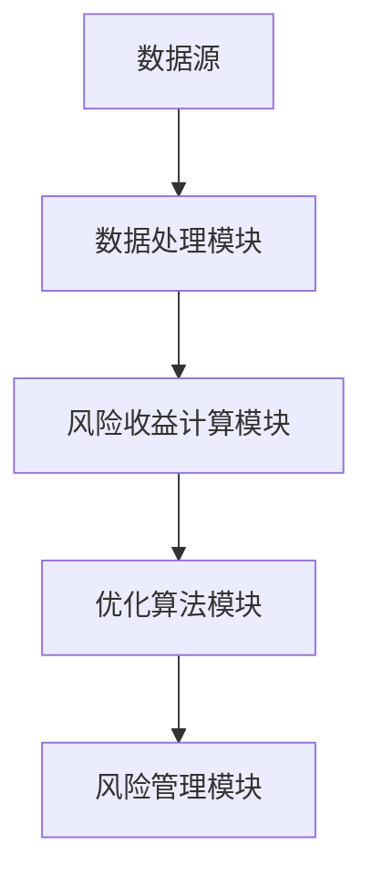

                 


# 伯格的资产配置理论：应对极端市场波动的策略

---

## 关键词：资产配置，伯格理论，投资策略，风险管理，市场波动

---

## 摘要：  
伯格的资产配置理论是投资领域的重要理论之一，其核心在于通过科学的资产分配策略，降低投资组合的波动性，实现长期稳定的收益。本文将深入分析伯格的资产配置理论，探讨其在应对极端市场波动中的策略，结合数学模型、系统架构和实际案例，为投资者提供实用的指导。

---

# 第一章：引言

## 1.1 资产配置的核心概念  
资产配置是指将资金分配到不同的资产类别（如股票、债券、现金等）中，以实现投资目标的过程。伯格认为，资产配置是投资组合收益的主要驱动因素，也是风险管理的关键手段。

## 1.2 伯格的背景与贡献  
约翰·伯格（John Bogle）是指数基金之父，他提出的资产配置理论强调长期投资和分散化。伯格认为，市场的短期波动不可预测，但通过合理的资产配置，投资者可以降低风险，实现长期收益。

## 1.3 本文的结构安排  
本文将从理论基础、数学模型、系统架构、项目实战等多角度，全面解析伯格的资产配置理论，并结合实际案例，探讨应对极端市场波动的策略。

---

# 第二章：资产配置的理论基础

## 2.1 资产配置的数学模型  
资产配置的核心是优化问题，目标是最大化收益，同时最小化风险。数学模型如下：  
$$\text{目标：} \quad \max \mu^T w - \lambda \cdot w^T \Sigma w$$  
其中，$w$ 是权重向量，$\mu$ 是收益向量，$\Sigma$ 是协方差矩阵，$\lambda$ 是风险厌恶系数。

## 2.2 资产配置的核心要素  
- **收益**：不同资产的预期收益。  
- **风险**：资产之间的波动性和相关性。  
- **权重**：各资产在组合中的分配比例。  

## 2.3 伯格的分散化策略  
伯格强调分散化的重要性。通过将资金分配到多个资产类别中，可以降低非系统性风险。

---

# 第三章：伯格资产配置的数学模型

## 3.1 最优化问题  
在资产配置中，我们需要求解以下最优化问题：  
$$\text{目标：} \quad \max \sum_{i=1}^n w_i r_i - \lambda \sum_{i=1}^n \sum_{j=1}^n w_i w_j \sigma_{ij}$$  
其中，$r_i$ 是资产 $i$ 的预期收益，$\sigma_{ij}$ 是资产 $i$ 和 $j$ 的协方差，$\lambda$ 是风险厌恶系数。

## 3.2 均值-方差优化  
均值-方差优化是资产配置的核心方法。通过计算各资产的期望收益和协方差矩阵，找到最优权重。

## 3.3 实证分析  
通过历史数据验证伯格理论的有效性，分析长期表现和危机中的表现。

---

# 第四章：资产配置的系统架构

## 4.1 系统功能设计  
- 数据获取与处理：收集各资产的历史数据。  
- 风险收益分析：计算各资产的期望收益和协方差矩阵。  
- 优化算法：求解最优化问题，得到最优权重。  
- 风险管理：监控组合风险，动态调整权重。  

## 4.2 系统架构图  


## 4.3 优化算法实现  
使用Python编写优化算法，利用SciPy库求解最优化问题。

---

# 第五章：项目实战

## 5.1 环境安装  
安装必要的Python库：`numpy`, `pandas`, `scipy`, `matplotlib`。

## 5.2 核心代码实现  
```python
import numpy as np
from scipy.optimize import minimize

# 定义目标函数
def objective(weights, mu, Sigma):
    return -weights.T.dot(mu) + 0.5 * weights.T.dot(Sigma).dot(weights)

# 约束条件
def constraint(weights):
    return np.sum(weights) - 1

# 求解优化问题
mu = np.array([0.1, 0.05])
Sigma = np.array([[0.2, 0.1], [0.1, 0.3]])
cons = {'type': 'eq', 'fun': constraint}
bounds = [(0, 1), (0, 1)]

result = minimize(objective, [0.5, 0.5], method='SLSQP', constraints=cons, bounds=bounds)
print(result.x)
```

## 5.3 实证分析  
通过历史数据验证伯格理论的有效性，分析组合在极端市场波动中的表现。

---

# 第六章：风险管理与应对策略

## 6.1 风险管理框架  
- 定期监控组合风险。  
- 动态调整权重，应对市场变化。  

## 6.2 应对极端波动的策略  
- 增加现金比例，降低股票权重。  
- 调整债券比例，平衡风险和收益。  

---

# 第七章：结论与展望

## 7.1 结论  
伯格的资产配置理论提供了科学的投资方法，帮助投资者应对市场波动。通过合理配置资产，可以实现长期稳定的收益。

## 7.2 未来展望  
未来，随着市场的变化，资产配置理论将不断优化。投资者应持续学习，适应新的市场环境。

---

# 参考文献  
1. 伯格，约翰. *《投资的智慧》*.  
2. Markowitz, H. *Portfolio Selection*.  
3. 李笑来. *《投资之道》*.

---

# 作者：AI天才研究院 & 禅与计算机程序设计艺术

